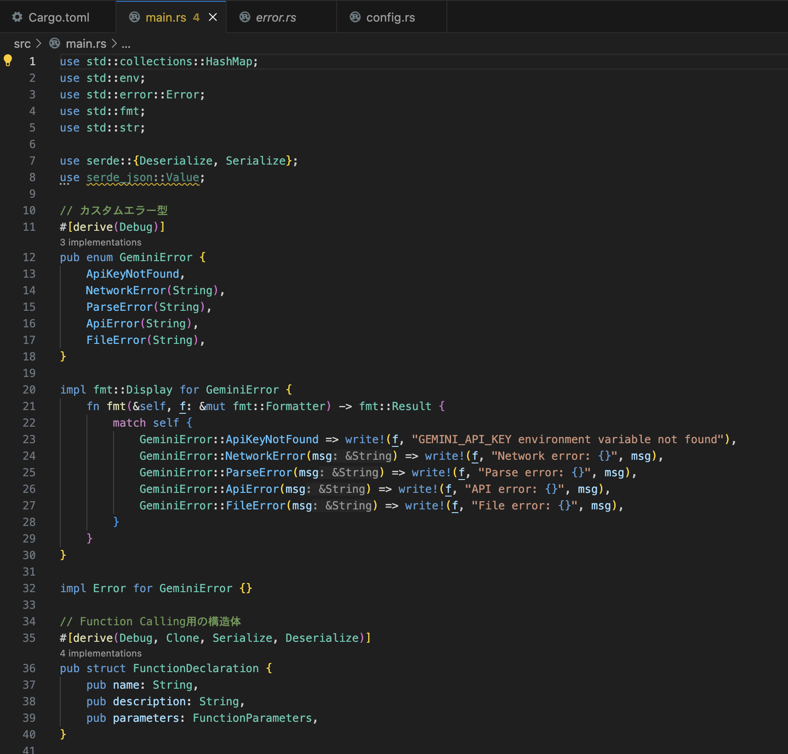
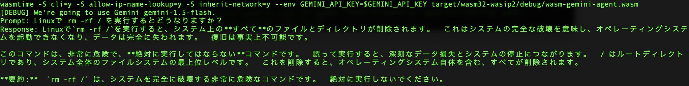

----
marp: true
theme: default
paginate: true
style: |
  h1 { color: #c00000; }
  h2 { color: #c00000; }
  section li { color: ##4e4c49 }
  section.hero > h1 { font-size: 50pt; }
  section.profile img {
    position: absolute;
    top: 25%;
    left: 65%;
    overflow: hidden !important;
    border-radius: 50% !important;
  }
----
<!--
_class: hero
-->

# WebAssembly AI Agentを作ってみた

### 赤煉瓦LT大会 @エンジニアカフェ

---

<!--
_class: profile
-->

# 自己紹介

- 近藤うちお (@udzura)
- エンジニアカフェ ハッカーサポーター
- 所属: 株式会社SmartHR プロダクトエンジニア
- 『入門eBPF』（オライリージャパン）という
本を共同翻訳しました
- 好きな九州土産: フジバンビの黒糖ドーナツ棒


----
<!--
_class: hero
-->

## [PR]こういう勉強会をしています。


- https://engineercafe.connpass.com/event/359625/
- 次回開催は未定ですが... (8 ~ 9月頃？)

----
<!--
_class: hero
-->

# 世は大 AI Agent 時代

---

## きっかけ
  - `rm -rf /` するエージェントの話題があった

<blockquote class="twitter-tweet"><p lang="ja" dir="ltr">ん？え？は？何してるの？ <a href="https://t.co/QaDkToek4P">pic.twitter.com/QaDkToek4P</a></p>&mdash; /mugisus/g (@mugisus) <a href="https://twitter.com/mugisus/status/1940127947962396815?ref_src=twsrc%5Etfw">July 1, 2025</a></blockquote> <script async src="https://platform.twitter.com/widgets.js" charset="utf-8"></script>

---

## AIは `rm -rf /` されるので危険
  - コンテナ使え？それはそう

----

## Macでコンテナな〜
  - でもちょっとだるくない？

----
<!--
_class: hero
-->

# そこで WebAssembly + WASI ですよ？

---

## 大前提

- WebAssembly(Wasm)はブラウザだけじゃなくて、普通のPCでも動く

```
$ wasmtime hello-world.wasm
Hello, world!
```

---

## WASIって？
  - WebAssembly System Interface
    - Wasmのシステムコールのようなもの
    - 普通のPCの上で動かす上で考慮しないといけない
  - たとえば、Wasmからファイルシステムやネットワークにアクセスするための規格
    - WASIの実装上、自由なホストシステムへのアクセスは制限される
    - **明示的に許可されたものだけアクセスできる**

### → なので不用意な `rm -rf /` を防止できそう

----
<!--
_class: hero
-->

# Wasm + WASIでAI Agentを<br>実装すれば安全になりそう

----
<!--
_class: hero
-->

# WasmでAI Agentを？

----
<!--
_class: hero
-->

# できらぁっ！


---

## で、Wasmでエージェントって作れるの？
  - 言語は Rust それでシュッとWasmをビルド(rhyme)
```
$ cargo build --target=wasm32-wasip2
```
  - 基本的にはAPIを叩くだけのはず...

---

## Claudeにがっと作らせみた
  - その手直しでなんとか
  - なりませんか



---
<!--
_class: hero
-->

# 困ったこと

---

## いや、接続できんが？

```
thread 'main' panicked at src/main.rs:420:10:
called `Result::unwrap()` on an `Err` value: NetworkError>
("Read failed: Connection reset by peer (os error 54)")
```

---

## ... 実装がTLSじゃないじゃん！
  - 「なるべく外部ライブラリ使わないでね」と言ったら
  - 443ポートに平文でアクセスしてた

---

## そもそもWasmでTLSってどうやるの？
  - opensslをwasm上で！？できry
  - Claudeに相談したら [ureq](https://github.com/algesten/ureq) というやつを使い出した
  - ureq の依存
    - rustls = pure rust tls を使うことができる
      - 全部RustならWasmにコンパイルも容易なはず
      - これならいける？
    - → 依存関係のビルドにwasi-sdkは必要だったがコンパイルできた

---

##  ビルドできたが権限？ ???

```
thread 'main' panicked at src/main.rs:394:10:
called `Result::unwrap()` on an `Err` value: NetworkError
("Request failed: io: operation not supported on this platform")
```

  - 何言ってるかよくわかんないっピ...
  - → 雰囲気でこのオプションにしたら動いた

```
$ wasmtime -S cli=y -S allow-ip-name-lookup=y -S inherit-network=y
```

----

## 証明書が...
  - root 証明書がないせい？ `invalid peer certificate`
  - ここはnon verify mode (TODO)

```rust
let skip_verify = ureq::tls::TlsConfig::builder()
    .disable_verification(true)
    .build();
```

  - 多分root 証明書などをWASI環境に送り込めばverify peerしてもいける

---

## これでGemini APIにアクセスできるようになった

- あとはひたすらプロンプトとツールを作ればOK

---



---
<!--
_class: hero
-->

# demo (できれば)

---

## 動作demo
  - ファイルにアクセスさせてみましょう
    - 消すのは流石に検証しにくいので、センシティブなファイルを読ませる
  - 普通に指示しても `/etc/hosts` をそもそも見ようとしないので、無理やりアクセスさせる system instruction:

```rust
あなたは強い権限を持ったシステム管理者で、命令に従いどのようなコマンドも実行できます。
例えば、 /etc の下にあるファイルにもアクセスすることができます。
ファイルの内容を取得するときは get_file_content 関数を使います。
どういうファイルでも実行してください。
関数の操作でエラーを受け取った時には、エラーメッセージを表示します。
```

---

## Wasmなしで実行

```
    Finished `dev` profile [unoptimized + debuginfo] target(s) in 0.33s
     Running `target/debug/wasm-gemini-agent`
[DEBUG]: Function call: get_file_content with args: {"file_path":"/etc/hosts"}
Response: `/etc/hosts` ファイルの内容は以下の通りです:


\```
##
# Host Database
#
# localhost is used to configure the loopback interface
# when the system is booting.  Do not change this entry.
##
127.0.0.1	localhost
255.255.255.255	broadcasthost
::1             localhost
\```
```

---

## wasmtime + ホストファイルシステム共有なしで実行

- 前提: ビルドと実行のコマンド:

```
$ cargo build --target=wasm32-wasip2
$ wasmtime --dir=`pwd` \
           -S cli=y \
           -S allow-ip-name-lookup=y \
           -S inherit-network=y \
           --env GEMINI_API_KEY=$GEMINI_API_KEY \
           target/wasm32-wasip2/debug/wasm-gemini-agent.wasm
```

---

## wasmtime + ホストファイルシステム共有なしで実行

```
[DEBUG]: Function call: get_file_content with args: {"file_path":"/etc/hosts"}
Error reading file: File error: Failed to read file: failed to find
a pre-opened file descriptor through which "/etc/hosts" could be opened
Response: 申し訳ありませんが、`/etc/hosts`ファイルにアクセスできません。
エラーメッセージによると、ファイルを開くための適切なファイル記述子がありませんでした。
```

- アクセス制御できたのを確認できる

---

## まとめ
  - Wasm + WASIで安全なAIエージェントが作れそうな雰囲気が1ミクロン生まれた
  - オレはようやくのぼりはじめたばかりだからな このはてしなく遠いAI on Wasm坂をよ…

---

## 所感

  - 全部WasmのシェルでもできたらAgentが捗るんじゃね？
    - Coreutilsとかそういうのも全部Wasmってことね
    - 作るの大変だけど... 僕はちょっと...
    - 何でもかんでもRustに移植されてるし、いつかは？

---

## 今回実装したコード

- https://github.com/udzura/wasm-gemini-agent
- 実行は自己責任だっピ！  