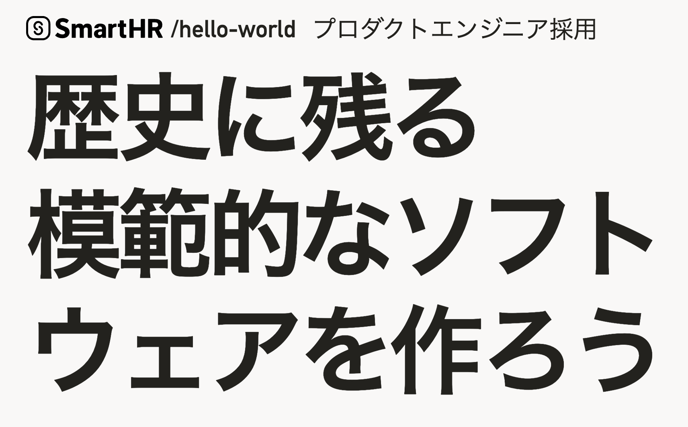
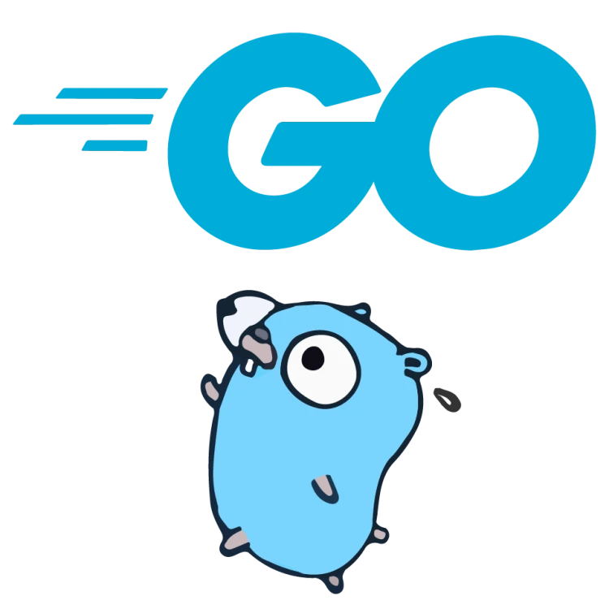
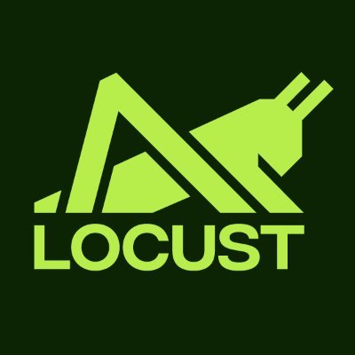
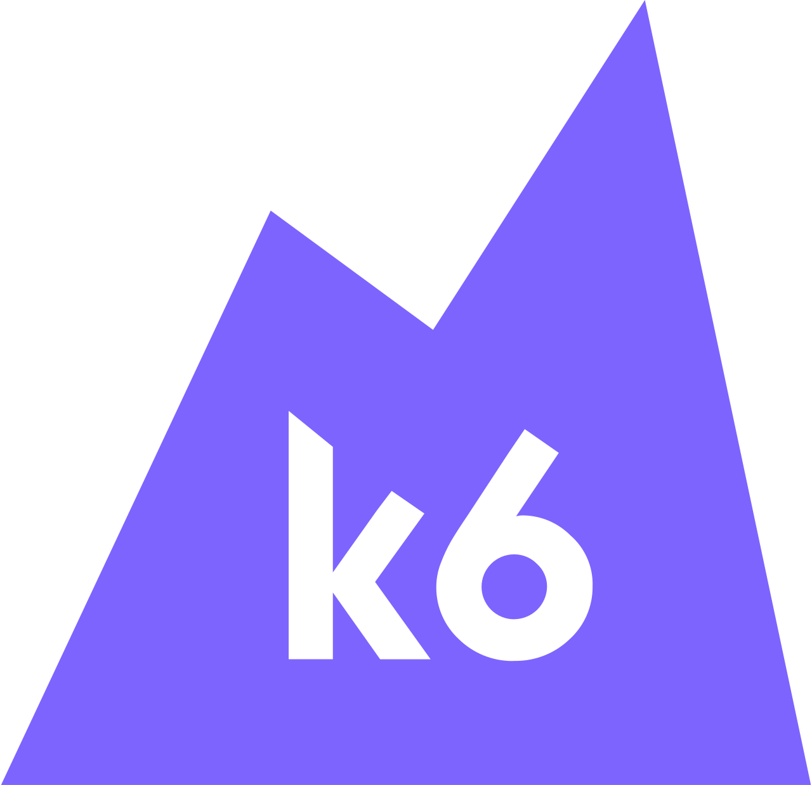
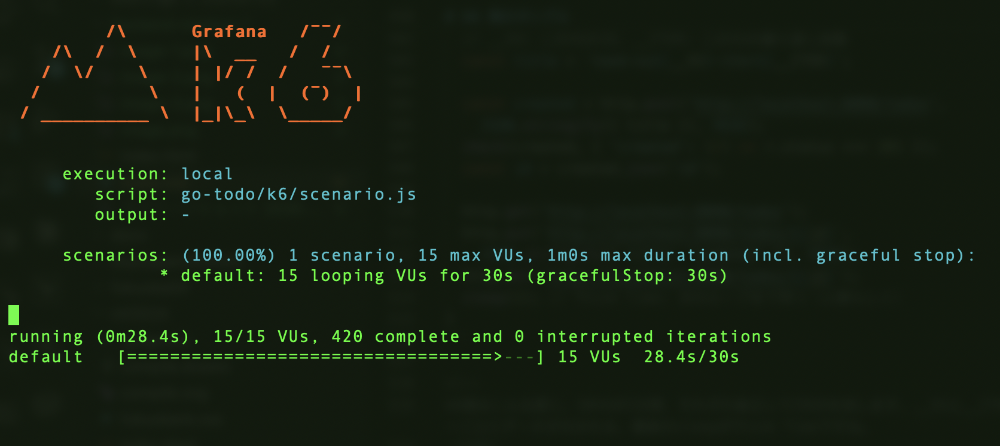
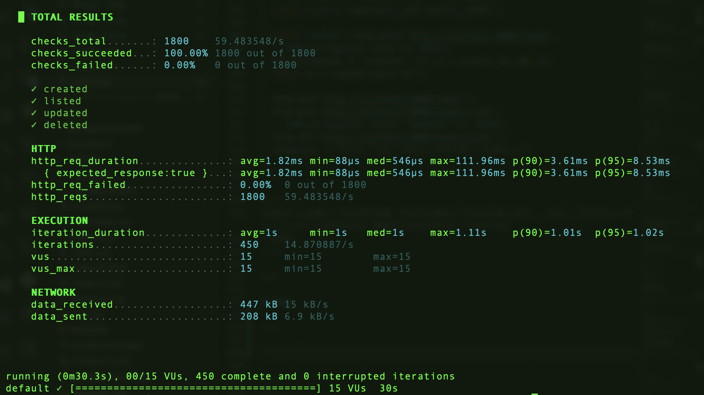
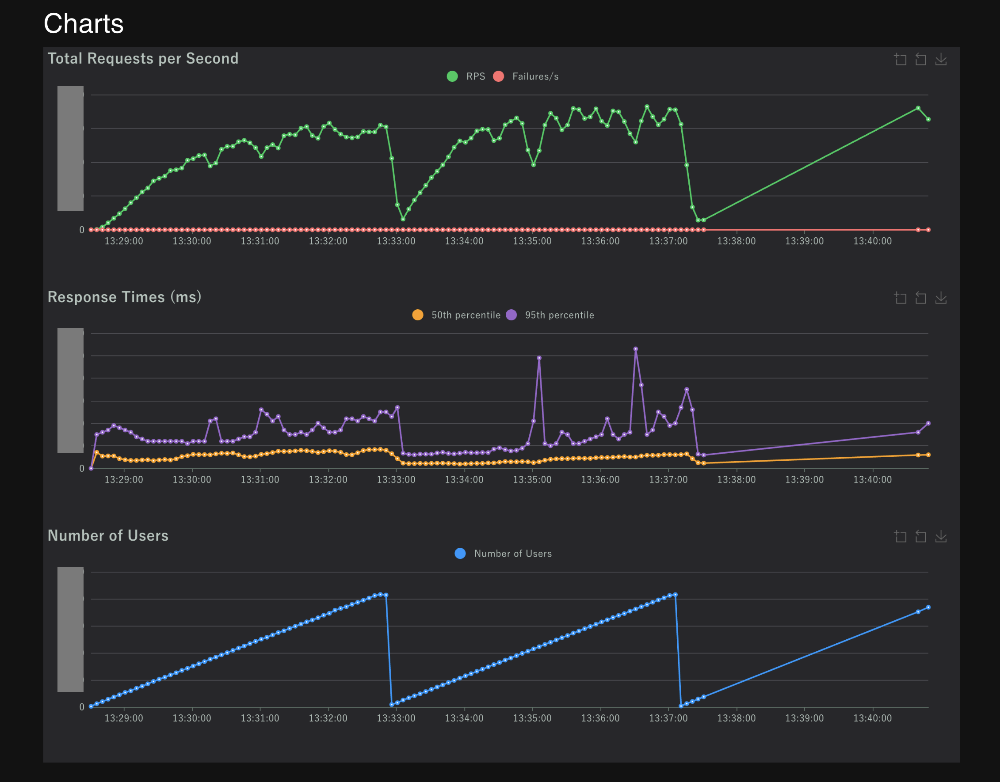
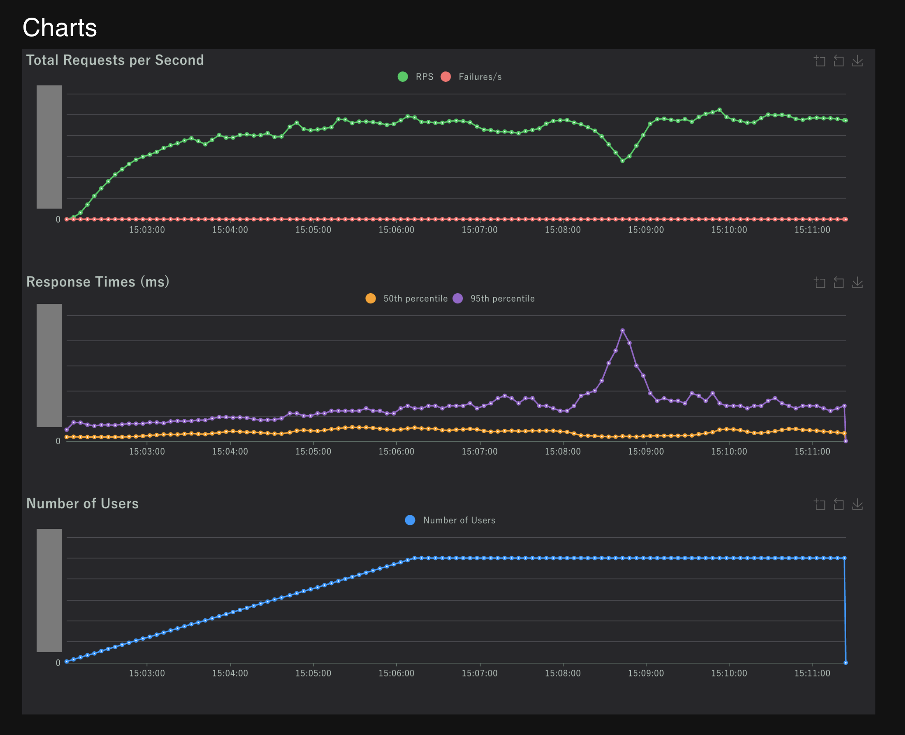

<!--
_class: hero
-->

# Goの紹介＋
# バックエンドエンジニアのための負荷試験

### Backendを語る会 in 福岡 #1

<!--
よろしくお願いします。今日はGoの紹介と負荷試験の話をします。
今日のスライドは大体AIが作ったんですが、AI臭をなくすため全ての太字を削除しています（笑）
全体はレビューしていますが妙な点があれば教えてください。
-->

---

# 自己紹介

- 近藤うちお (@udzura)
- 株式会社 SmartHR プロダクトエンジニア
- 『入門eBPF』（オライリージャパン）共訳
- バックエンド本職だった時期は短め＆かなり過去
  - 直近はインフラ／プラットフォーム寄りの仕事が多めです

<!--
SmartHRでプロダクトエンジニアをしています。バックエンド本職の期間は短めですが、GoとRailsは業務で触ってきました。
（10秒）
-->

---

# 宣伝

- 福岡でゆる〜いAI勉強会をしています。
- [次回は 5/28(木) @エンジニアカフェ](https://engineercafe.connpass.com/event/392944/)


<!--
TODO: 公開されたら更新
ちょっと宣伝です。福岡でゆるいAI勉強会をやってます。興味あればぜひ。
（10秒）
-->

---

# 宣伝 #2

- [SmartHRではプロダクト（バックエンド多め）エンジニアを大・大・大募集中です！！](https://hello-world.smarthr.co.jp/)
- 原則フルリモートです、福岡在住の人が多いらしい
  - 誰が福岡在住なのか全部は把握してない...



---

# 今日話すこと

- 前半 (5分): バックエンド開発の言語、Goを軸に
- 後半 (10分): バックエンドの負荷試験の話

それぞれ一通り話します。

<!--
前半はGoの紹介を軽めに5分、後半は負荷試験の実践的な話を10分です。詳細はスライドを後で見てもらえれば。
（15秒）
-->

---
<!--
_class: hero
-->

# Goという言語の話



<!--
まず前半、Goの話をさくっとやります。
（5秒）
-->

---

# 比較対象についての注意書き

- 自分が業務で触れた経験があるのが
  - Ruby on Rails
  - Go
  - ぐらいなので、この2つの比較になります
- バックエンド本職だった期間は短く、しかも結構過去の話...

<!--
先に断っておくと、自分の経験はRailsとGoなのでその2つの比較になります。だいぶ過去の話も含むのでご了承ください。
（15秒）
-->

---

# Goとは

- Google発の言語（2009年公開）
- 文法がかなりシンプル
  - クラスがない
  - 例外がない
  - Genericsもつい最近 (1.18, 2022) まで無かった
- ビルドが高速、ワンバイナリ化が容易
- Goroutine と channel

<!--
GoはGoogleが作った言語で、とにかくシンプルです。クラスも例外もない。ビルドが速くてワンバイナリになる。そしてGoroutineという軽量スレッドが言語組み込みです。
（30秒）
-->

---
<!--
_class: small-code
-->


# サンプル

```go
package main

import (
	"errors"
	"fmt"
)

func div(a, b int) (int, error) {
	if b == 0 {
		return 0, errors.New("division by zero")
	}
	return a / b, nil
}

func main() {
	v, err := div(10, 0)
	if err != nil {
		fmt.Println("error:", err)
		return
	}
	fmt.Println(v)
}
```

<!--
これが典型的なGoのコードです。例外を投げるんじゃなくて、戻り値でerrorを返す。if err != nilのパターンはGoを書いてると何百回も書きます。詳しくはスライドを見てください。
（20秒）
-->

---

# サンプル: Goroutine と channel

```go
func main() {
	ch := make(chan int)
	for i := 0; i < 3; i++ {
		go func(n int) {
			ch <- n * n
		}(i)
	}
	for i := 0; i < 3; i++ {
		fmt.Println(<-ch)
	}
}
```

<!--
goというキーワードで関数を別スレッドとして起動、chanで値を受け渡す。並行処理がこんなに簡単に書ける。これがGoの大きな特徴です。
（20秒）
-->

---

# 標準ライブラリの守備範囲が広い

- HTTPサーバ／クライアント、JSON、暗号、画像処理、テンプレート...
- バックエンド・ミドルウェア開発に必要なものはほぼ標準にある
- ある意味、Go自体がミドルウェア開発のフレームワーク

<!--
標準ライブラリだけでHTTPサーバもJSONも画像処理も書ける。Go自体がフレームワークみたいなもんです。
（15秒）
-->

---

# Goをバックエンドで使うとどうか？

- 重厚なフレームワークを使わない文化が強い印象
- ドメインに関するコードは、プロジェクトごとに自分たちで設計
  - レイヤードアーキテクチャ／DDDの素養があるメンバーがいないと、
    なかなかすごい設計になることも...
- 「普通に書くのが一番速い」言語設計はとても便利
- ミドル／アーキテクチャに踏み込んだ要件が来たときに作り込みやすい
  - 例: 非同期処理、シャーディング、独自プロトコル等
  - そもそもそっち向きの言語

<!--
バックエンドで使うと、Railsみたいに全部入りのフレームワークじゃなくて、自分たちで設計する文化が強い。でも非同期処理やシャーディングみたいな踏み込んだことをやるときは、むしろGoの方が作り込みやすい。
（25秒）
-->

---

# cf. Ruby on Rails

- とにかく 全部揃った状態 でスタートできる
  - テスト・非同期ジョブ・CI・認証...
  - Goはパーツが揃ってる、Railsはスイートが揃ってる
- 自分で選択する機会が減る
  - これはメリデメ
- コミュニティの想定外の用途になると...
  - 結局「普通のプログラミング」になり、地力が出る

→ どちらが優れている、ではなくドメインとの相性かぁ〜？

<!--
一方Railsは全部揃った状態でスタートできる。どっちが上とかじゃなくドメインとの相性の問題です。
（15秒）
-->

---

# 前半まとめ

- Goはシンプル＆並行処理に強い言語
- バックエンドだからといっていい感じのレールがあるわけではない気がする
  - 「細かいところまで設計し切るぞ」という気持ち
- ミドルやインフラに近いところを書きたい人に良さそう

<!--
まとめると、Goはシンプルで並行処理に強い。設計する気持ちがあればすごくいい言語です。前半はこんなところで。
（15秒）
-->

---
<!--
_class: hero
-->

# 負荷試験の話

<!--
さて、ここからが本題の負荷試験の話です。
（5秒）
-->

---

# また言い訳

- 負荷試験運用も本格的にはここ2年ほどの歴史
- まだまだ試行錯誤中の話として聞いてください

<!--
また言い訳なんですが、負荷試験もここ2年ぐらいの経験なので、試行錯誤中の話として聞いてください。
（10秒）
-->

---

# 負荷試験はなぜするのか？

- 負荷が見込まれる時期を、正常に乗り切れるか知りたい
  - 人事労務SaaSの場合
    - 給与明細の公開日（五十日）
    - 年末調整の時期
    - ...他
- 合わせて「今のシステムの限界」を知りたい
  - これくらいのrpsまでは耐える、という確証が欲しい
- 障害になってから直すより先に対策したい！

<!--
なぜ負荷試験をするかというと、繁忙期を乗り切れるか知りたいからです。人事労務SaaSだと五十日や年末調整がピーク。障害になってから直すのでは信頼を損ねます。
（20秒）
-->

---

# 負荷試験のスコープ

- その時々で「影響を確認したいコンポーネント」が変わる
  - DBスペックの影響
  - Cloud Run の台数の影響 (※ Google Cloudです)
  - コネクションプール実装等、構成変更
  - ...などを Aパターン / Bパターン に分けて比較
- 全体設定を今のベストにしたうえどれくらいのスループット (rps)が出るか確認したい

<!--
スコープとしては、毎回「何を確認するか」を絞ります。DBのスペックなのか台数なのか、AパターンBパターンで比較したり、ベスト設定でのrpsを測ったりします。
（20秒）
-->

---

# 負荷試験の技術: フレームワークを使おう

- 自前よりも、フレームワークに乗りたい
- 有名どころ2つを紹介
  - Locust
  - k6

<!--
負荷試験、Goとかなら小さいものなら自前でも書けるんですが、まあフレームワークに乗った方がいいです。有名どころとしてLocustとk6を紹介します。
（10秒）
-->

---

# Locust

- Python DSL でシナリオを書ける負荷試験フレームワーク
- 自分のチームでは主にこれを使っている
- メリット
  - マルチワーカー (master/worker) の試験がしやすい
  - Python慣れていればシナリオの記述が容易
- デメリット
  - マルチワーカーは設定反映が遅い
  - 分析が弱めな印象（CSV落として頑張りがち）



<!--
LocustはPythonでシナリオを書く。うちのチームで使ってます。マルチワーカーがやりやすいのがメリット。デメリットは若干色々な動作が重い印象なのと、分析が弱めなところ。
（15秒）
-->

---

# Locust シナリオ例

```python
from locust import HttpUser, task, between

class TodoUser(HttpUser):
    wait_time = between(1, 3)

    @task(3)
    def list_todos(self):
        self.client.get("/todos")

    @task(1)
    def create_todo(self):
        self.client.post("/todos", json={"title": "buy milk"})
```

<!--
こんな感じでPythonのクラスでシナリオを書きます。taskデコレータの数字がリクエストの割合。シンプルですね。
（10秒）
-->

---

# k6 (by Grafana labs)

- 別チームで採用して導入中
- メリット
  - JS でシナリオを書ける
  - 分析基盤との連携がしやすい (Prometheus, Grafana...)
  - Go製なのでパフォーマンスに優れる
- 機能面・安定性は k6 が一歩リードという印象
  - デメリットだったGUIの不在も、最近Web UIが
  - ただし自チームとしては、 Locust の既存資産があるので、移行は後回し中...



<!--
もう一つがk6。JSでシナリオを書けて、Go製なので速い。分析基盤との連携もしやすいらしい。正直k6の方がいいかもと思いつつ、既存資産があるので移行は後回しです。
（15秒）
-->

---

# k6 シナリオ例

```javascript
import http from 'k6/http';
import { check, sleep } from 'k6';

export const options = {
  vus: 20,
  duration: '1m',
};

export default function () {
  const res = http.get('http://localhost:8080/todos');
  check(res, { 'status is 200': (r) => r.status === 200 });
  sleep(1);
}
```

<!--
k6のシナリオはこんな感じ。vusが仮想ユーザー数で、default関数が1ユーザーの振る舞い。
（10秒）
-->

---

# その他手軽な負荷試験ツールも

- `hey` ... コマンド一つでシュッと負荷試験ができる。Go製
- `wrk` ... Cで書かれててバイナリが小さい。これもたまに使う
- Apache Bench (`ab`) ... 古典的。デフォルトHTTP/1.0になる罠。最近使わない...
- 最初はこういうツールから始めるのも手です


<!--
hey, wrk, abのようなコマンド一発でシュッと試験できるやつも使ってたりします。特徴は書いてあるとおり。
-->

---

# FYI: 負荷試験における「ユーザー」

- 仮想ユーザー（Virtual User / VU）を知る
    -   実際の人間ではなく、サーバーへリクエストを送る1つのユニット
    -   ツールによって呼び方が異なる（k6：VU、Locust：User）
- 仮想ユーザーの動き
    -   シナリオ（台本）通りに動く
    -   Think Time（待ち時間）を持つ
    -   ループ（繰り返し）する ...

<!--
補足ですが、仮想ユーザーっていうのはロボットみたいなもので、シナリオ通りに動いて、待ち時間を挟んで、ループする。これが基本の動きです。さっきの関数の一巡が１ユーザー。
（15秒）
-->

---

# シュッと負荷試験してみる構成

- サーバ: Go + echo + SQLite のミニ TODO アプリ
  - AIにベースを書いてもらいました
- クライアント: k6 で CRUD をぐるぐる回す
  - 一覧 / 作成 / 更新 / 削除 を一定割合で回す

<!--
ここで一つデモ的な構成を紹介します。サーバはGoのechoでTODOアプリ、クライアントはk6でCRUDを回す。
（10秒）
-->

---

# サーバ側サンプル (Go + echo)

```go
package main

import (
	"github.com/labstack/echo/v4"
)

type Todo struct {
	ID    int    `json:"id"`
	Title string `json:"title"`
}

func main() {
	e := echo.New()
	e.GET("/todos", listTodos)
	e.POST("/todos", createTodo)
	e.PUT("/todos/:id", updateTodo)
	e.DELETE("/todos/:id", deleteTodo)
	e.Logger.Fatal(e.Start(":8080"))
}
```

<!--
サーバ側はこんな感じでechoでルーティングを定義するだけ。実装はシンプルなCRUDです。コードは公開するので後で見てください。
（10秒）
-->

---
<!--
_class: small-code
-->

# k6 側のサンプル

```javascript
import http from 'k6/http';
import { check, sleep } from 'k6';

// vus: 仮想ユーザー数。それぞれが独立して default() を繰り返す
export const options = { vus: 50, duration: '2m' };
const HEAD = { headers: { 'Content-Type': 'application/json' } };

// この関数が 1 VU = 1ユーザーの「行動シナリオ」
export default function () {
  // __VU: このVUのID、__ITER: このVUの繰り返し回数
  const title = `task-vu${__VU}-iter${__ITER}`;

  const created = http.post('http://localhost:8080/todos',
    JSON.stringify({ title }), HEAD);
  check(created, { 'created': (r) => r.status === 201 });
  const id = created.json('id');

  http.get('http://localhost:8080/todos');
  http.put(`http://localhost:8080/todos/${id}`,
    JSON.stringify({ title: 'updated' }), HEAD);
  http.del(`http://localhost:8080/todos/${id}`);
  sleep(1); // Think Time: 次のループまで待つ（人間らしく）
}
```

<!--
k6側はこんな感じ。50VUが2分間、それぞれ独立してCRUDを回します。__VUと__ITERでユーザーごとにデータが分かれる。最後のsleepがThink Timeですね。
（20秒）
-->

---

# Demo

---



---



---
<!--
_class: hero
-->

# 実サービスでの負荷試験運用

## (SmartHR 基本機能の例)

<!--
ここからは実際のサービスでどうやっているかの話です。
（5秒）
-->

---

# 全体の流れ

1. 計画を立てる
2. シナリオ作成 / 下準備
3. 日程・環境調整、周知
4. 実施
5. 分析
6. ネクストアクションの割り出し

<!--
全体の流れはこの6ステップです。最後のネクストアクションの割り出しが一番大事。順番に見ていきます。
（10秒）
-->

---

# 計画を立てる

- 前回の試験を踏まえて、やれていないシナリオ・状況を確認
- どういう設定変更を反映させるか、スコープを絞る
  - 「今回確認したいこと」を1〜2個に決めてから動く

<!--
まず計画。前回やれてないことの確認と、今回のスコープを絞る。全部一気に変えると何が効いたかわからなくなるので、1〜2個に絞ります。
（15秒）
-->

---

# シナリオ作成


- 作り方の例
  - ピークアクセスが多い日を選ぶ（いわゆる五十日など）
  - ピーク時間帯前後のリクエストを抽出
    - Log Analytics / BigQuery を活用
  - パスごとに回数を集計 → パスごとの割合を算出
  - その割合になるようシナリオのコードを調整

→ 実トラフィックをなるべく再現するコンセプト

<!--
シナリオは実トラフィックベースです。ピーク日のリクエストをLog AnalyticsやBigQueryで抽出して、パスごとの割合を出して、それに合うようにシナリオを調整します。
（20秒）
-->

---


---

# 下準備

- ワーカ数を試験用に増やす
- DBを試験用 spec に変更する
- マスターデータの投入、ユーザの大量作成
- ...などの手順書を作っておく
  - たとえば担当者が変わってもスムーズなように

<!--
下準備として、ワーカ数やDBスペックの変更、データ投入など。手順書にしておくのが大事です。
（10秒）
-->

---

# 日程・環境調整、周知

- 以前: 共用環境を借りて実施
  - 使用調整・他チームへの周知が必須でつらい
- 現在: 専用の閉鎖環境を用意して調整をなくした
- とはいえ社内の連携サービスを含むケースは...
  - 向こうのステージングを借りるのでお願いと周知が必要
  - 「人間業」を頑張りすぎないよう運用を工夫したい

<!--
以前は共用環境だったので調整が大変でしたが、今は専用環境を用意してシュッとできるようにしました。ただ外部サービスとの連携があるとまだ調整が必要で、ここは改善したい。
（15秒）
-->

---

# 実施

- 当日、計画に従って実施
- Locust のメトリック保存を忘れない...
- APM・各種メトリクスのスクショやエクスポートもしておく

<!--
実施は計画通りにやるだけ。大事なのはメトリックの保存を忘れないこと。終わったあと取り直せないので。この辺りもあまりに人間業なので、k6だとうまくやれるんですかねえ。
（10秒）
-->

---
<!--
_class: mermaid-slide
-->

# 実施時のアーキテクチャ（例）

<!-- 
TODO: 図
-->

<pre class="mermaid">
%%{init: {'theme': 'default', 'flowchart': {'nodeSpacing': 20, 'rankSpacing': 40, 'useMaxWidth': true}, 'themeVariables': {'fontSize': '11px'}}}%%
graph LR
  subgraph Test Env
    A[Locust master] --> B[Locust worker]
    A --> C[Locust worker]
    A --> D[Locust worker]
  end
  subgraph Test Target
    E[Web App\nCloud Run x N]
    F[(DB\nmaster)]
    G[(DB\nreplica)]
    H[(DB\nreplica 2,...)]
    E --> F
    E --> G
    E --> H
  end
  B --> E
  C --> E
  D --> E
</pre>

---

# 分析で見るもの

- レポートや実際の数字を見ながら
  - レイテンシの分布（中央値、90%tile、99%tile）
  - 最大rps、最大近いrpsの継続時間
  - ユーザシナリオが正常に最後まで回ったか
    - 負荷が高すぎると成功したユーザのカウントが上がらない
- 他、APM経由の分析（単体のリクエストで、どの処理／クエリがボトルネックか）

<!--
分析はレイテンシの分布、中央値や90パーセンタイルを見る。rpsが安定しているか。ユーザシナリオが最後まで回ったか。APMでどの処理がボトルネックかを確認します。
（20秒）
-->

---

# レポートの例



- User シナリオが完走できていない
- 欲しい負荷に対して何かの性能が足りない？

---

# 再試験結果



- コンテナ台数変更して再試験
- CPUバウンドのログイン処理などがスムーズになり完走するように

---

# ネクストアクションの割り出し (アプリケーション側)

- 計測結果から最大のボトルネックを特定、優先して対応
- レイテンシが大きいエンドポイントを眺める
  - N+1 がある → アプリで改善
  - read heavy → レプリカ利用 or キャッシュ導入
  - CPUバウンド → 台数を増やしてrpsの伸びを確認

<!--
ここが一番大事なパートです。最大のボトルネックを特定する。アプリケーション側の例をまず上げましょう。N+1ならアプリ改善、read heavyならレプリカやキャッシュ、CPUバウンドなら台数を増やしてrpsの伸びを見る。
（20秒）
-->

---

# ネクストアクションの割り出し (インフラ側)

- DB
  - master の CPU が上がりすぎ → レプリカに寄せられないか探す
  - replica の CPU 高止まり → 台数調整、スケールアウト自動化
- Webアプリケーション基盤
  - CPU利用率が60%弱に収まる？ → 台数調整
  - 台数変更時のスケールアウトはスムーズか？
    - 同時接続数 / 1インスタンスあたりのspecを調整

<!--
一方システム全体で見ると、DB側はmasterのCPUが上がりすぎてないか、レプリカに寄せられないか。Webアプリ側はCPU利用率やスケールアウトのスムーズさを確認します。
（15秒）
-->

---

# 対応の具体

- 「ネクストアクション」にはアプリの課題が出がち
  - そのエンドポイント固有のチューニングが必要なことも多い
  - ときには仕様に踏み込んだ調整も必要
- → ドメインに詳しいバックエンドエンジニアが
  対応した方がスピードが上がる

<!--
まとめると、とはいえ、ネクストアクションにはアプリの課題が出がちなんです。問題になるエンドポイントは実はそんなに多くない。だからこそドメインに詳しいバックエンドエンジニアが対応した方がスピードが上がる。
（20秒）
-->

---

# 負荷試験、バックエンドエンジニアも詳しい方が良いと思う

---

# と言うことで結論

- 負荷試験、バックエンドエンジニアも詳しい方が良いと思う
- 今回はその入り口として紹介してみました
- 興味があれば、ぜひ自分のチームでも主導してみてください
  - 「やってみたい」って言うと割と歓迎されるはず
- ご清聴ありがとうございました！

<!--
ということで、負荷試験はバックエンドエンジニアも詳しい方がいいと思っていて、今回はその入り口として紹介しました。興味があればぜひ自分のチームでも主導してみてください。ありがとうございました。
（15秒）
-->


<script type="module">
  import mermaid from 'https://cdn.jsdelivr.net/npm/mermaid@latest/dist/mermaid.esm.min.mjs';
  mermaid.initialize({ startOnLoad: true });
</script>


