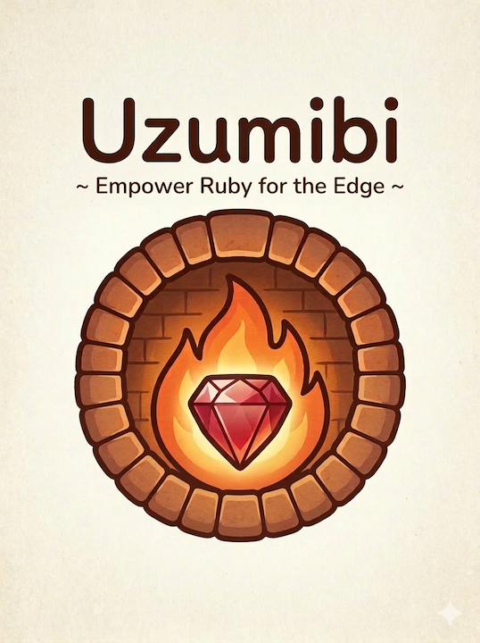
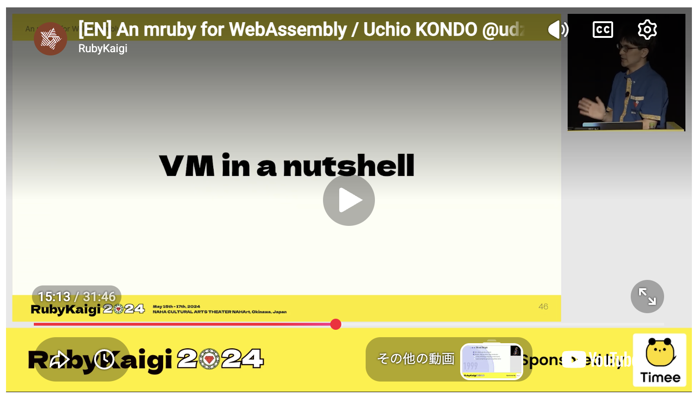

# 自己紹介

<div class="profile-layout">
  
  <div>
    <p class="profile-name">Uchio Kondo</p>
    <p class="profile-handle">@udzura</p>
    <ul class="profile-details">
      <li>株式会社SmartHR プロダクトエンジニア</li>
      <li>Fukuoka.rb オーガナイザー</li>
      <li>エンジニアカフェ ハッカーサポーター</li>
      <li>Ruby / mruby / Rust / Wasm</li>
      <li>『入門eBPF』（オライリージャパン）翻訳</li>
    </ul>
  </div>
</div>

---

# 宣伝その1

<div class="promo-card">
  <p class="promo-kicker">Fukuoka.wasm をやります！！！！！！！！１</p>
  <ul>
    <li>7月に<a href="https://engineercafe.connpass.com/event/396418/">Fukuoka.edge</a> と言う勉強会をやってみたんだが、<br>実はWasmの話をしたい人が多いかも？（感想）</li>
    <li>なので11月ぐらいになりますが、<strong>何かします！！！！！！！！！</strong></li>
    <li>何かしたい方、ぜひお声がけください</li>
  </ul>
</div>

---

# 宣伝その2

<div class="promo-grid">
  <div class="promo-visual">
    
  </div>
  <div class="promo-copy">
    <p class="promo-kicker">9/17 にもくもく会をします。</p>
    <div class="promo-qr-row">
      
      <ul>
        <li>ちょうど来週</li>
        <li>AIよろずもくもく会です。きてね</li>
        <li><a href="https://engineercafe.connpass.com/event/404554/">https://engineercafe.connpass.com/event/404554/</a></li>
      </ul>
    </div>
  </div>
</div>

---

# 今日のトピック

<div class="toc">
  <div class="toc-block intro">
    <p class="toc-label">はじめに</p>
    <p class="toc-title">Cloudflare WorkersでRubyを動かすモチベって？</p>
  </div>
  <div class="toc-block front">
    <p class="toc-label">前半</p>
    <p class="toc-title">Uzumibiの紹介</p>
    <p class="toc-note">すぐ試せます</p>
  </div>
  <div class="toc-block later">
    <p class="toc-label">後半</p>
    <p class="toc-title">今開発しているもの<br>「Uzumibi2(仮)」</p>
  </div>
</div>

---

# 今日のトピック

<div class="toc chapter-toc">
  <div class="toc-block intro active">
    <p class="toc-label">はじめに</p>
    <p class="toc-title">Cloudflare WorkersでRubyを動かすモチベって？</p>
  </div>
  <div class="toc-block front">
    <p class="toc-label">前半</p>
    <p class="toc-title">Uzumibiの紹介</p>
    <p class="toc-note">すぐ試せます</p>
  </div>
  <div class="toc-block later">
    <p class="toc-label">後半</p>
    <p class="toc-title">今開発しているもの<br>「Uzumibi2(仮)」</p>
  </div>
</div>

---

# Cloudflare WorkersでRubyを動かしたい！

- 「何言ってんの？」と思われそうなのでまずその話をしますね...

---

# Cloudflareは激アツプラットフォーム

- Cloudflare Workersが大流行
- 速い、軽い、簡単。無料枠も充実


---

# Rubyコミュニティからあまり注目されていない

- 勿体無い！！！！
- しかし、なるべくRuby書きたいので、まあ今度...ってなりがち

---

# ところで令和の時代、Rubyアプリケーションを<br>デプロイする先の選定は大変

- Railsに限らずそんな感じ
- 結局ECSとかCloud Runとか大手クラウドを利用
- Kamal... いや〜

---

# 無料でサクッと始められるCloudflare Workersは...

- 「強い」です by AI

<div class="gh-note">
  <div class="gh-note-title">💭&nbsp; 心の声</div>
  <div class="gh-note-body">往時のHer ⭕️ &nbsp;ku ブームを思い出す。だがもっとすごいと個人的には思う</div>
</div>

---

# Cloudflare Workersでも`ruby.wasm`はOK

- RubyをWasmで動かす取り組み自体は結構前からある

---

# しかし、10MB近くの容量に...

- 例えば: [Cloudflare Workers で Ruby Assembly (ruby.wasm) を Hono から呼び出してみたメモ](https://zenn.dev/hiroe_orz17/articles/2ab00c03a66078#5.-%E3%82%B5%E3%82%A4%E3%82%BA%E5%88%B6%E9%99%90%E3%81%A8%E3%83%97%E3%83%A9%E3%83%B3%E3%81%AE%E8%A9%B1)

> ruby+stdlib.wasm はおよそ 9 MB (gzip) 程度あるため、無料プラン (Free) の 3 MiB バンドル上限を超えてしまいます。

---

# もっとサクッとRubyのコードを動かしたい

---

<!-- _class: uzumibi-intro -->

# そこで... [Uzumibi](https://github.com/mrubyedge/uzumibi)



---

# 今日のトピック

<div class="toc chapter-toc">
  <div class="toc-block intro">
    <p class="toc-label">はじめに</p>
    <p class="toc-title">Cloudflare WorkersでRubyを動かすモチベって？</p>
  </div>
  <div class="toc-block front active">
    <p class="toc-label">前半</p>
    <p class="toc-title">Uzumibiの紹介</p>
    <p class="toc-note">すぐ試せます</p>
  </div>
  <div class="toc-block later">
    <p class="toc-label">後半</p>
    <p class="toc-title">今開発しているもの<br>「Uzumibi2(仮)」</p>
  </div>
</div>

---

# Uzumibiの紹介

- Uzumibi is 何
- できること
- 仕組み
- すぐに試せるよ！ (demo)

---

# Uzumibi is 何

- Cloudflare WorkersでRubyのコードを動かしたい！を叶えるフレームワーク
- コードジェネレータ付きですぐできる

---

# Uzumibi: Rubyをいろいろな場所へデプロイ

<div class="diagram">
  <div class="node">Ruby code</div>
  <div class="arrow">→</div>
  <div class="node core">Uzumibi</div>
  <div class="arrow">→</div>
  <div class="node">Cloudflare Workers<br>Fastly Compute<br>Google Cloud Run...</div>
</div>

<p class="caption">プラットフォームごとに adapter / template を用意</p>

---

# できること（Cloudflareでの対応状況）

- Cloudflare WorkersでRubyアプリケーションを実行する
- KV, Queue, Accessなどなども使える・連携できる

---

# ライブデモでデプロイしちゃう

- うまくいくんかな... 😅

---

# 仕組み

- 独自のmruby VM
- Rust
- Wasm
- Cloudflare Workers

---

# 独自（自作）のmruby VM（Rust）

- `mruby/edge` と言う名前
  - https://mrubyedge.github.io/
- mrubyは、軽量なRuby実装。CRubyとは違うバイトコードマシンを使う。
  - ＝そのバイトコードを解釈するVMを実装**すれば**動かせる
- 今回「Rustでmruby VM作りてぇな〜」と思って自作したやつを利用した

---

<!-- _class: rubykaigi-video-slide -->

# 詳細はワイのRubyKaigiの発表を見て！

<div class="rubykaigi-video-layout">
  <a class="rubykaigi-video-frame" href="https://rubykaigi.org/2024/presentations/udzura.html">
    
  </a>
  <ul class="rubykaigi-links">
    <li><span class="rubykaigi-year">2024</span><a href="https://rubykaigi.org/2024/presentations/udzura.html">An mruby for WebAssembly</a></li>
    <li><span class="rubykaigi-year">2026</span><a href="https://rubykaigi.org/2026/presentations/udzura.html">Uzumibi: Reinventing mruby for the Edges</a></li>
  </ul>
</div>

---

# RustなのでWasmにできる

- RustからWebAssemblyを生成するのはかなり「楽」で「刺さる」用途です。 by AI

---

# WasmならCloudflare WorkersのV8で動く

```js
import wasmModule from "./app.wasm";

const instance = await WebAssembly.instantiate(
  wasmModule,
  { env: { /* Ruby向けのhost functions */ } },
);
const wasm = instance.exports;
```


---

# リクエストをWasmに渡して、Rubyを実行する

- ざっくり:
  - HTTPリクエストをエンコードしてWasmに渡す
  - Ruby(mruby)バイトコードを実行する
  - Rubyでリクエストを解釈する
  - レスポンスのRubyオブジェクトを再エンコード、Workersへ返却する

---

# HTTP request → Ruby → HTTP response

<div class="diagram">
  <div class="node">HTTP<br>request</div>
  <div class="arrow">→</div>
  <div class="node">Worker<br>JavaScript</div>
  <div class="arrow">→</div>
  <div class="node wasm">encoded<br>request</div>
  <div class="arrow">→</div>
  <div class="node core">Wasm<br>Ruby bytecode</div>
  <div class="arrow">→</div>
  <div class="node">Ruby<br>router</div>
</div>

<div class="diagram">
  <div class="node">HTTP response</div>
  <div class="arrow">←</div>
  <div class="node">Worker JavaScript</div>
  <div class="arrow">←</div>
  <div class="node wasm">Wasm response</div>
  <div class="arrow">←</div>
  <div class="node core">Ruby response</div>
</div>

---

# すぐに試せますし、無料枠で動きます

- [Uzumibi入門](https://zenn.dev/udzura/books/532f38f73fe4e9)でUzumibiを試せるようにしました！（一部内容編集中）

---

# Uzumibi、よろしくお願いします！

---

# One more thing...

---

# 今日のトピック

<div class="toc chapter-toc">
  <div class="toc-block intro">
    <p class="toc-label">はじめに</p>
    <p class="toc-title">Cloudflare WorkersでRubyを動かすモチベって？</p>
  </div>
  <div class="toc-block front">
    <p class="toc-label">前半</p>
    <p class="toc-title">Uzumibiの紹介</p>
    <p class="toc-note">すぐ試せます</p>
  </div>
  <div class="toc-block later active">
    <p class="toc-label">後半</p>
    <p class="toc-title">今開発しているもの<br>「Uzumibi2(仮)」</p>
  </div>
</div>

---

# Uzumibi2（？？？）

---

# Uzumibi で問題だな〜と思ってること

- mrubyのVMが独自実装であること
  - 「いつものRubyかと思ったらそうじゃない」場面が引っ掛かるかも
  - AIがあるとはいえ、ライブラリをひたすら再発明はなんか...

<div class="gh-note">
  <div class="gh-note-title">💭&nbsp; 心の声</div>
  <div class="gh-note-body">AI時代、車輪の再発明はすぐできるけど、「本当にユーザに欲しがられて使われるもの」を作るのは難しい。</div>
</div>

---

# エコシステムが強いPicoRubyを動かしたい

- CRubyは複雑だし、今回の用途に合わせるのはそもそも困難そう

<div class="gh-note">
  <div class="gh-note-title">💭&nbsp; 心の声</div>
  <div class="gh-note-body">「組み込み向け」と言うのは本質的にWasm向けだな〜って思う。</div>
</div>

---

# PicoRubyをCloudflare Workersで動かしたい

- PicoRubyには強いエコシステム・ユーザ・ファンがある
- Cloudflare Workersでも動かせると面白がってもらえそう

---

# やっていること

- PicoRubyをCloudflare Workersで動くWasmにビルドした
- 一緒に...
  - Rack互換レイヤを実装した！

<div class="gh-note">
  <div class="gh-note-title">💭&nbsp; 心の声</div>
  <div class="gh-note-body">せっかくなのでベターなエコシステムにしたい</div>
</div>

---

# PicoRubyをWorkersで動かす概要図

<div class="stack compact-stack">
  <div class="layer">Cloudflare Workers<br><span class="caption">request / response</span></div>
  <div class="down">↓ ↑</div>
  <div class="layer wasm">Wasm host</div>
  <div class="down">↓ ↑</div>
  <div class="layer core">Rack互換レイヤ</div>
  <div class="down">↓ ↑</div>
  <div class="layer">PicoRuby + <code>app.rb</code><br><span class="caption">開発時は自動リロード</span></div>
</div>

---

# Rack互換レイヤを実装した

- Rack互換なので、こういうアプリが動く:

```ruby
app = Proc.new do |env|
  [
    200,
    { "content-type" => "text/plain" },
    ["Hello, world!\n"]
  ]
end
Picoruby.run app
```

---

# Rackとは何か？

- RubyのWebサーバとWebアプリケーションをつなぐ共通インターフェース
- 他の言語で言うと
  - PerlのPSGI
  - PythonのWSGI

---

# Rack: サーバとフレームワークの間の規約

<div class="diagram">
  <div class="node list">Server<br><br>Puma<br>Unicorn<br>WEBrick<br>CGI<br>...</div>
  <div class="arrow">↔</div>
  <div class="node core logo-node">Rack</div>
  <div class="arrow">↔</div>
  <div class="node list">Framework<br><br>Rails<br>Sinatra<br>Hanami<br>Roda<br>...</div>
</div>

<p class="caption">アプリケーションとサーバの間の規約。PSGI / WSGI と同じ考え方。</p>

---

<!-- _class: cf-rack-image -->

# 「Cloudflare Workers」対応のイメージ

<div class="diagram">
  <div class="node list server-node"><div class="node-content">Server<br><br>Puma<br>Unicorn<br>WEBrick<br>CGI<br>...<br><span class="cf-worker-emphasis">Cloudflare Workers</span></div></div>
  <div class="arrow">↔</div>
  <div class="node core logo-node">Rack</div>
  <div class="arrow">↔</div>
  <div class="node list framework-emphasis"><div class="node-content"><span class="framework-heading">Framework</span ><br><br>Rails<br>Sinatra<br>Hanami<br>Roda<br>...</div></div>
</div>

---

# Rackをサポートしたからには、な...

- Rubyの「有名な」フレームワークを動かしたい
- Railsは流石に無理なので、少しずつな...

---

# 現状

---

# ワイの手元ではSinatraが動いている

- **1行も**本体コードにはパッチを当てていない
- 本物のSinatraを動かしている
  - version `4.2.1`
- Mustermann（ルータライブラリ）もそのまま動かせている


---

# 容量も余裕がある

- デプロイもできていて、動いているのを確認
- 非圧縮で700KiB台、圧縮後は300KiB以下

```console
$ npm run check
Total Upload: 734.10 KiB / gzip: 292.33 KiB
--dry-run: exiting now.
```

---

# ただし、まだ若干非互換が

- mruby 4.0 相当を使っているが、このバージョンでは以下のCRuby非互換がある:
  - 正規表現の非互換（バグ）
  - バイトコードコンパイラの非互換（バグ）
  - `bare raise` の非互換

---

# 正規表現の非互換（バグ）

- mruby-regexp のバックトラッキングエンジンが `\Z` を処理していなかった
  - lazy quantifier、後方参照などと組み合わせると、CRubyと異なる結果に
  - Sinatraでは `*` を使ったルーティングが影響を受ける

```ruby
match = /\A(?<path>.*?)\Z/.match("a/b")
match["path"] # CRubyでは "a/b", mruby では nil
```

- [mruby/mruby #7257 — mruby-regexp: match \Z under the backtracking engine](https://github.com/mruby/mruby/pull/7257) で対応(2026年8月18日)

---

# バイトコードコンパイラの非互換（バグ）

- ensure 内にローカル変数の `||=` `&&=` があると、不要なVMレジスタが確保され、returnすべきレジスタがズレた

```ruby
def example
  result = :result
  begin
    result
  ensure
    value ||= []
  end
end
example # CRubyでは :result、修正前mrubyでは nil
```

- [mruby/mruby #7390 — mruby-compiler: avoid pushing discarded local assignment values](https://github.com/mruby/mruby/pull/7390) で**ワイが**対応(2026年8月27日)

---

# upstreamではいずれも修正済み

- ここまでは、upstreamではいずれも修正済み/picoruby取り込み済み
- Hasumikinさんは神

---

# `bare raise` の非互換

```ruby
class FooError < StandardError; end
begin
  raise FooError, "bar"
rescue
  raise
end
```

- CRubyでは、rescue 内の引数なし `raise` は現在処理している例外を再送出
  - Sinatraのエラーハンドリングがこの仕様に依存する😥
- mrubyではメッセージのない新しい `RuntimeError`

---

# これは「意図した非互換」っぽくて悩む

- mrubyの仕様を決めてるのもMatzなので...
  - 私見、Matzが `bare raise` の挙動を嫌って無くしたんじゃないかって思ってるんすよね...（まつもとさん、見てたら教えてください）
- Sinatra upstreamにあるべき状態のPRを送ってみてるが、どうなるか
  - [sinatra/sinatra #2190 — Avoid bare raise for maintainability and compatibility](https://github.com/sinatra/sinatra/pull/2190)

```ruby
begin
  raise FooError, "bar"
rescue => e
  raise e # これだけで対応できる
end
```

---

# 逆に言えば、今やこれだけの非互換しかない感じ

- 見つかってる範囲では。
- mrubyすごくね？

---

<!-- _class: code-pair-slide -->

# 今後のアクション

- Sinatra のアプリユースケースのコードを書き、その挙動をCRuby / PicoRuby で比較するCI基盤実装を作ってるところ
- シナリオが増えれば増えるほど非互換がなくなる
- 何ができるかも見ればわかる

<div class="code-label app-label">Appコード</div>
<div class="code-label scenario-label">シナリオコード</div>

```ruby
class SinatraCoversApp < Sinatra::Base
  get "/" do
    "Sinatra #{Sinatra::VERSION}"
  end
end
```

```ruby
scenario "GET route" do
  get "/"
  assert_status 200
  assert_body "Sinatra 4.2.1"
end
```

---

# Conclusion

---

# まとめ

- Wasm最高！
- Cloudflare Workers最高！
- 本物のSinatraがCloudflare Workersで動くかもしれない
- 今でもRubyでそれっぽいDSLベースのアプリを作れます

---

# お試しください

- Uzumibi
  - すぐにでも触りたい人は、もう触れます
- PicoRuby on Cloudflare Workers w/ Sinatra!!
  - 期待して待ってて！
