# 入門CarrierWave

## 〜禅とファイルアップロード移行技術〜

----

# 俺

- @udzura
- 趣味: satisfying動画の鑑賞

---

# 私はエルフだから SaaS のことがよく分からなくて、<br>“Web開発を知る”ために旅をしているんだ。

---

# その途中で“CarrierWave”を知ったんだよ。

---

# CarrierWaveとは

- Ruby製のファイルアップロードライブラリ
- ActiveRecordに頑張って乗っかって、ファイルを透過的に扱おうとしている
- なんかすげー多機能で、画像のリサイズなんかもできる

---

# CarrierWaveの使い方

- 留意点:
  - バージョン `1.3.2` の仕様やで
  - やで...

---

```ruby
class AvatarUploader < CarrierWave::Uploader::Base
  def store_dir
    "uploads/#{model.class.to_s.underscore}/#{mounted_as}/#{model.id}"
  end
end

class User < ApplicationRecord
  mount_uploader :avatar, AvatarUploader
end
```

---

# `mount` すると？

## モデルにメソッドが生える
- いろいろ生える。一旦重要なのは以下
  - `avatar` (`() -> AvatarUploader`)
  - `avatar=` (`(file) -> void`)
  - `avatar_cache=` (`(String) -> void`)

## DB側は以下を使う
- `avatar` というカラムに、avatarをrepresentする文字列(identifier)が入る

---

```ruby
        def #{column}
          _mounter(:#{column}).uploaders[0] ||= _mounter(:#{column}).blank_uploader
        end

        def #{column}=(new_file)
          _mounter(:#{column}).cache([new_file])
        end

        def #{column}_url(*args)
          #{column}.url(*args)
        end

        def #{column}_cache
          _mounter(:#{column}).cache_names[0]
        end

        def #{column}_cache=(cache_name)
          _mounter(:#{column}).cache_names = [cache_name]
        end

        def write_#{column}_identifier
          return if frozen?
          mounter = _mounter(:#{column})

          if mounter.remove?
            write_uploader(mounter.serialization_column, nil)
          elsif mounter.identifiers.first
            write_uploader(mounter.serialization_column, mounter.identifiers.first)
          end
        end

        def #{column}_identifier
          _mounter(:#{column}).read_identifiers[0]
        end
        # ...
```

---

# なお、このavatarとそのavatarは別名にできたりする

```ruby
class User < ApplicationRecord
  mount_uploader :avatar, AvatarUploader, mount_on: :avatar_full_path
end
```

- 本当はこの方が運用しやすかったのでは？まあまあ...

---

# アップロードの仕方

```ruby
user = User.new
user.avatar = params[:file] # Rack::Multipart::UploadedFile 等
unless user.valid?
  raise "Hoge"
end
user.save!
```

---

# Things happening

---

# 全体像



---

# 用語（オレオレ含む）

- `cache_id` = キャッシュが作られるたび作られる一意な推測不可能ID
- キャッシュパス = キャッシュファイルの保存先(FSのパス、GCSのオブジェクトキー)
- `cache_name` = キャッシュパスを一意に特定するための文字列
- 永続化パス = アップロードファイルが最終的に格納される先(FS/GCS)
- `identifier` = 永続化パスを一意に特定するための文字列
- Retrieve = `cache_name`あるいは`identifier`からファイルを復元すること

---

# 詳細

---

# ファイルオブジェクトがアサインされてからの流れ

- `user.avatar = params[:file]` アサインが走る
  - `CarrierWave::Uploader::Base#cache!` が呼ばれる
  - **副作用で** 一時ディレクトリにファイルが保存される
    - 一時ディレクトリは `cache_path` に保存される
    - `cache_path` は `cache_dir` + `filename` で決まる

---

# ここで

- モデルのバリデーションが失敗したら...？

---

# cache idの概念

- `cache!` されると...
  - `cache_id` という一意な、推測不可能なIDが生成される
  - `cache_id` はDBに保存されない
    - そのユーザのセッションだけで使う想定
- `cache_id` を含むキャッシュのidentifierが生成される
  - `cache_name` と呼んだりしている
  - 戻ってきたフォームでそれを参照して再送するようにできる

---

```ruby
module CarrierWave
  def self.generate_cache_id
    [Time.now.utc.to_i,
      Process.pid,
      '%04d' % (CarrierWave::CacheCounter.increment % 1000),
      '%04d' % rand(9999)
    ].map(&:to_s).join('-')
  end
end
```

---

# cache_nameで本来のキャッシュを復元できる（ようになっている）

- 一度バリデーションに失敗してフォームに戻ってしまった場合など
- 別のリクエストで一からファイルを構築する

---

# `mount_uploader` で生えてくる `avatar_cache` / `avatar_cache=`

- `mount_uploader :avatar, AvatarUploader` で以下のメソッドも生えてくる
  - `avatar_cache`
  - `avatar_cache=`

---

# `avatar_cache=` でcache idをセットする

```ruby
user = User.new
user.avatar_cache = params[:avatar_cache]
user.cached? # => true
# ...
```

---

# `avatar_cache=` で起こること（Retrieve）

- `CarrierWave::Uploader::Base#retrieve_from_cache!` が呼ばれる
  - `cache_id` から必要な情報が復元される
    - 必要に応じてフックも呼ばれる
  - `cache_path` が復元される
  - GCSなどにはすでにアップロードされているので、Pathがわかれば参照できる

---

# 応用: 非同期アップロードの仕組みについて

- TBA

---

# ここまでのまとめ

- ファイルがアップロードされると、まずfileのアサインで副作用が起き、キャッシュファイルがアップロードされる
- 一度アップされたら、`cache_name` を使ってキャッシュファイルを復元できる

---

# バリデーションが通ったら？

```ruby
user = User.new
user.avatar = params[:file]
unless user.valid?
  raise "Hoge"
end
## !!! 実はここまでの話しかしていない !!!
user.save!
```

---

# `save!` で何が起こる？

- before_save コールバックで `write_avatar_identifier` が呼ばれる
  - DBの `avatar` カラムに `avatar` のidentifierが保存される
    - つまり、アップロードより前に永続化パスを同定するための文字列が決定する

---

# `save!` で何が起こる？ (2)

- `after_save` コールバックで `CarrierWave::Mount::Mounter#store!` が呼ばれる
  - `CarrierWave::Uploader::Base#store!` が呼ばれる
    - `store_path` （＝永続化パス）にファイルが保存される
      - `store_path` も似たように `store_dir` + `filename` で決まる
    - この時、すでに実体はキャッシュパス側にあるので、再アップは必要ない
      - GCSなら copy_object を走らせて済ませている

---

# 無事保存できました

- めでたしめでたし...

---

# ちなみにアップしたファイルを参照するには？

- アップロード後は、findしたら勝手にavatarが参照できるようになってる

```ruby
user = User.find(params[:id])
render json: {avatar: user.avatar.url}
```

---

# 実はこの時:

- `avatar` メソッドを最初に呼んだ時にもRetrieveが走っている
  - DB上に保存されている方のavatarのidentifierをもとに
  - `CarrierWave::Uploader::Base#retrieve_from_store!` が呼ばれる
    - `store_path` が決定される
    - 本物のGCSの永続化パスと無事一致すれば、アップしたファイルに再びアクセスできる

---

# CarrierWaveの設計思想

- saveする前に一度キャッシュとしてアップロードを済ませる点
  - そのキャッシュは、cache nameが分かれば復元できること
- saveしたら、キャッシュから永続化パスに移動する点
  - その永続化パスは、DBに保存されているidentifierから一意に復元できること

---

# CarrierWaveの利用においてはパスの設計がとても大事

- 短いidentifierから、実際のパスへの関数従属性が欲しい

---

# じゃあcache_path/store_pathはどう決まる？

- 現場のコード

---

TODO: ナガノさんがポケカをしてる時の画像を引用する

---

# どういうことが起こる？

- モデルの状態によりキャッシュのパスが違う
  - ファイルに途中からアクセスできなくなる
  - ファイルが壊れる...

---

# case 1 (申請)

---

# case 2 (招待)

---

# じゃあどうすれば...

---

# ここからは実装中の話も含みます

- 検証結果で設計方針は覆りうるということで

---

# 元の設計思想...

- saveする前に一度キャッシュとして永続化する
  - そのキャッシュは、cache nameが分かれば復元できること
- saveしたら、キャッシュから永続化パスに移動する
  - その永続化パスは、DBに保存されているidentifierから一意に復元できること

---

# それに合わせればいいじゃない

- キャッシュが作られた段階で `cache_name -> cache_path` が一意に決まるようにすればいい
- 永続化パスも `identifier -> store_path` が一意に決まるようにすればいい

---

# キャッシュの場合

- RedisにそのMappingを保持する、でいいのでは
  - セッションだけ有効なので、DBじゃなくていいのでは
- キャッシュが作成されたタイミングでMappingを保持
- retrieveの最初のタイミングでMappingを参照してパスを復元
  - これでいけそう？

---

# 実際それで対応してみた例

- 事例のチャンネルを貼る

---

# 永続化パスの場合

- カラムを新しく追加するしかないと思われる
  - 利用箇所たくさんあるけど...
  - なのでまあUploaderごとにスコープ切ってやってこうとなる
- そのカラムにフルパス（もしくは限りなく近い相当）を保持させる
  - そのカラム保持してなかったら元の計算をすればOK
- version たくさんありますね問題はあるが...

---

# もしくは？

- 元々の identifier を再利用することもできなくはない
  - v1: `xxxx.jpeg`
  - v2: `!v2!uploads/..../xxxx.jpeg`
- 新たなる負債っぽい空気と、そもそもidentifierの思想としては間違ってないのはこっちでは？ という気配の両方が漂う

---

# 元々はなんでファイル名が入ってるの？

- そもそもAbstractクラスの定義がこう

```ruby
def identifier
  uploader.filename
end
```

- Uploader定義で上書きできるようにはなっている。
  - 条件によってv2定義を保存する。
  - 結構大胆かな〜...。
  - 思ったけど、たとえばカラムを両方用意してどっかで貼り替えるとかもできるかね？

---

# 今日言ってない話

- 画像の削除
- versions 問題
- なんか画像が勝手に回転するやつ
- 履歴に関わるエトセトラ...

---

# 将来の絵を描こう。画像アップロードだけに

---

# 将来の絵

- CarrierWaveから別の新プロなアップローダーに置き換えたい
  - CarrierWave自体の設計思想が複雑で、今のアプリ規模では厳しい
  - どうせバージョンアップでマイグレーションが必要ならね、と

---

# 以降プラン(案)

- CarrierWaveにアップしたら別のストレージにもdouble writeするとかでやっていく
  - 皮肉なことに、CarrierWave自体のフックで実現可能...
- どこかでアップロード/参照をスイッチする

---

TODO: 前作った切り替えの図

---

TODO: 坂の画像

---

# まとめ

- レガシーマイグレーションとディープダイブは楽しいですね