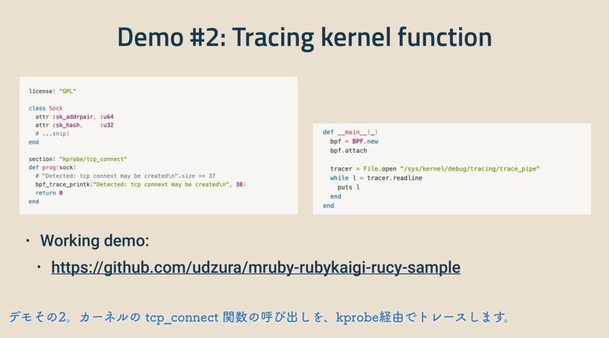
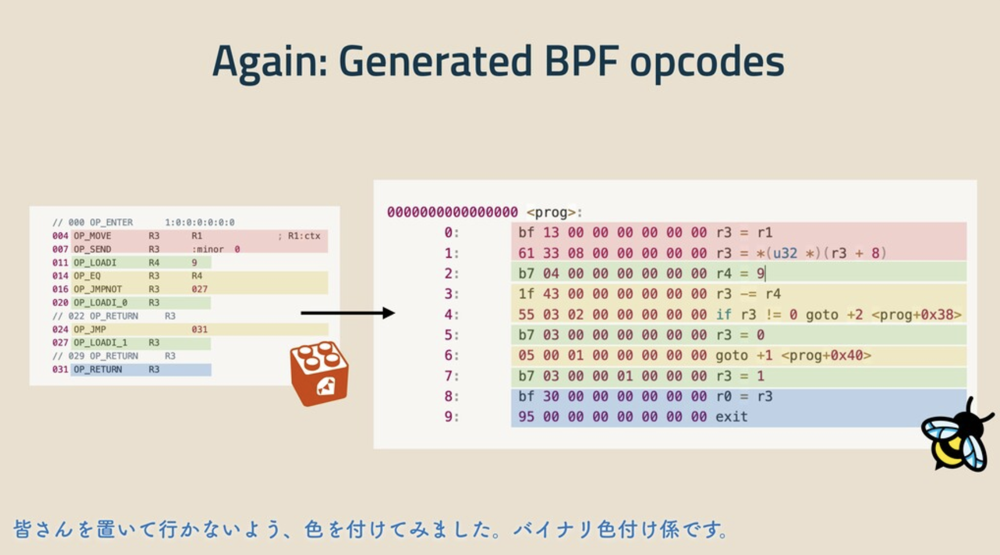

----
marp: true
title: eBPFと ともだち になる方法
description: 於eBPF Japan Meetup #1
header: eBPFと ともだち になる方法
footer: "presentation by Uchio Kondo"
image: https://udzura.jp/slides/2024/ebpfjapan-1/ogp.png#FIXME
theme: ebpfjapan
paginate: true
----

<!--
_class: hero
-->

# eBPFと ともだち になる方法

----
<!--
class: profile
style: section.profile ul { width: 110% }
-->

# 近藤うちお / @udzura

- 所属: 株式会社ミラティブ
- 福岡市エンジニアカフェ
ハッカーサポーター
- フィヨルドブートキャンプ
アドバイザー
- 普段はGoでミドルウェア開発


----

<!--
_class: normal
-->

# オライリージャパン『入門eBPF』<br>共同翻訳者

- 去年12月刊行
（原書の刊行年に間に合った！）


----

<!--
_class: hero
-->

# eBPF Japan Meetup #1

----

<!--
_class: hero
-->

# 開催めでたい 🥳

----

<!--
_class: normal
-->

# 今日する話

- 作ったものを振り返ってみます
  - RbBCC
  - Rucy
- 何故それをしているか？
- フリーでオープンなものをハックして楽しむ自由

----

<!--
_class: normal
-->

# @udzura の作ったもの

- eBPF関係では
  * RbBCC
  * Rucy

----

<!--
_class: hero
-->

# RbBCC

----

<!--
_class: normal
-->

# RbBCC

- BCC(libbcc)のRuby binding
- Rubyアソシエーション開発助成の対象（メンターはRubyコミッタ笹田さん）
- 正直eBPFの勉強のつもりで作った

----

<!--
_class: normal
-->

# RbBCC のコード

```ruby
require 'rbbcc'
prog = "#include <linux/sched.h>
struct data_t { char comm[TASK_COMM_LEN]; };
BPF_RINGBUF_OUTPUT(buffer, 1 << 4);
int hello(struct pt_regs *ctx) {
    struct data_t data = {};
    bpf_get_current_comm(&data.comm, sizeof(data.comm));
    buffer.ringbuf_output(&data, sizeof(data), 0);
    return 0;
}"
b = RbBCC::BCC.new(text: prog).tap{|b|
  b.attach_kprobe(event: "__arm64_sys_clone", fn_name: "hello")}
b["buffer"].open_ring_buffer do |_, data, _|
  puts "Hello world! comm = %s" % b["buffer"].event(data).comm
end
loop { b.ring_buffer_poll; sleep 0.1 }
```

----

<!--
_class: normal
-->

# BCC のコードと比べてみよう

```python
import time
from bcc import BPF
prog = r"""
#include <linux/sched.h>
struct data_t {
    char comm[TASK_COMM_LEN];
};
BPF_RINGBUF_OUTPUT(buffer, 1 << 4);
int hello(struct pt_regs *ctx) {
    // ....
}
"""
b = BPF(text=src)
def callback(ctx, data, size):
    print("Hello world! comm = %s" % (b["buffer"].event(data).comm))

b['buffer'].open_ring_buffer(callback)
while 1:
    b.ring_buffer_poll()
    time.sleep(0.5)
```

----

<!--
_class: sample
-->

# RbBCC のdemo


----

<!--
_class: hero
-->

# Rucy

----

<!--
_class: sample
-->

# Rucy

- RubyのスクリプトをBPFにコンパイルするコンパイラ
- RubyKaigi 2021-takeout で発表
- 実装には mruby のバイトコード仕様とコンパイラを使っている
- 本当に簡単なプログラムしか動かせない

----

<!--
_class: sample
-->

# Rucy のコンパイルパス


----

<!--
_class: sample
-->

# Rucy の"Ruby" code sample

```ruby
license! "GPL"
section! "dev/cgroup"

class Ctx
  attr :access_type, :u32
  attr :major, :u32
  attr :minor, :u32
end

def prog(ctx)
  if ctx.minor == 9
    return 0
  else
    return 1
  end
end
```

----

<!--
_class: sample
-->

# この C とほぼ同等

```c
#include <linux/bpf.h>
#include <bpf/bpf_helpers.h>

SEC("cgroup/dev")
int bpf_prog1(struct bpf_cgroup_dev_ctx *ctx)
{
    if (ctx->minor == 9) {
        return 0;
    } else {
        return 1;
    }
}

char _license[] SEC("license") = "GPL";
```

----

<!--
_class: sample
-->

# このeBPFプログラムの詳細

- 今後の説明の理解に必要なので説明
- eBPFのcgroup deviceプログラムタイプ
  - `BPF_PROG_TYPE_CGROUP_DEVICE`
- コンテナ（cgroup v2利用）からアクセスできるデバイスをフィルタする
  - e.g. deviceが `/dev/urandom` ならdeny、その他はpass

----

<!--
_class: sample
-->

# `CGROUP_DEVICE` の基本的なロードの仕方

- libbpfを使った例

```c
// 抜粋
#include <bpf/libbpf.h>
struct bpf_object *obj;
int prog_fd, cgroup_fd;
bpf_prog_load("./obj.o", BPF_PROG_TYPE_CGROUP_DEVICE, &obj, &prog_fd);

cgroup_fd = open("/sys/fs/cgroup/test-device",  O_RDONLY);
bpf_prog_attach(prog_fd, cgroup_fd, BPF_CGROUP_DEVICE, 0);
```

----

<!--
_class: sample
-->

# 基本的なロードの仕方(2)

- ロードの成功を確認

```
$ sudo mkdir /sys/fs/cgroup/test-device
$ sudo ./loader
$ sudo bpftool prog
...
128: cgroup_device  name bpf_prog1  tag 02de78d75c0e331c  gpl
        loaded_at 2024-08-15T22:17:11+0900  uid 0
        xlated 40B  jited 84B  memlock 4096B
        btf_id 64
```

----

<!--
_class: sample
-->

# 動作確認

- docker containerを `--pid=host` で立ち上げてPIDを取得

```
$ sudo docker run -ti --pid=host debian:11-slim bash
root@987bbaa4c62c:/# echo $$
51959
```

- cgroupに書き込む

```
$ echo 51787 | sudo tee /sys/fs/cgroup/test-device/cgroup.procs
51787
```

----

<!--
_class: sample
-->

# 動作確認(2)

- 当該cgroupに所属することを確認

```
root@987bbaa4c62c:/# cat /proc/self/cgroup
0::/../../test-device
```

- `/dev/urandom` だけアクセスできないことを確認

```
root@987bbaa4c62c:/# head -c 4 /dev/random | od
0000000 106533 052260
0000004
root@987bbaa4c62c:/# head -c 4 /dev/urandom | od
head: cannot open '/dev/urandom' for reading: Operation not permitted
0000000
```

----

<!--
_class: sample
-->

# c.f. kprobeをトレースすることも



- https://github.com/udzura/mruby-rubykaigi-rucy-sample


----

<!--
_class: sample
-->

# Rucy 開発に必要だった知識

- Rucy
  - mruby バイトコードのこと
  - ELF のレイアウトのこと
  - Rust
  - BPF バイナリの作り方 ...

----

<!--
_class: sample
-->

# BPF バイナリの作り方

- BPF バイナリはどうやって作られているのだろうか？
- 最小のサンプルで追いかけてみる

----

<!--
_class: sample
-->

# Cのコード (again)

```c
#include <linux/bpf.h>
#include <bpf/bpf_helpers.h>

SEC("cgroup/dev")
int bpf_prog1(struct bpf_cgroup_dev_ctx *ctx)
{
    if (ctx->minor == 9) {
        return 0;
    } else {
        return 1;
    }
}

char _license[] SEC("license") = "GPL";
```

----

<!--
_class: sample
-->

# LLVM-IRに変換する

```
$ clang -g -O1 -c -S -emit-llvm \
    -target bpf \
    -o cgroup1.ll
```

```llvm
; 抜粋/debug情報なし
define dso_local i32 @bpf_prog1(...) #0 section "cgroup/dev" {
  %2 = getelementptr inbounds %struct.bpf_cgroup_dev_ctx,
    %struct.bpf_cgroup_dev_ctx* %0, i64 0, i32 2
  %3 = load i32, i32* %2, align 4, !tbaa !3
  %4 = icmp ne i32 %3, 9
  %5 = zext i1 %4 to i32
  ret i32 %5
}
```

----

<!--
_class: sample
-->

# BPFバイナリに変換する

```
$ clang -g -O1 -c -target bpf cgroup1.ll -o cgroup1.o
$ llvm-objdump -x cgroup1.o
cgroup1.o:      file format elf64-bpf
architecture: bpfel
start address: 0x0000000000000000
...
Sections:
Idx Name          Size     VMA              Type
  0               00000000 0000000000000000 
  1 .strtab       00000054 0000000000000000 
  2 .text         00000000 0000000000000000 TEXT
  3 cgroup/dev    00000028 0000000000000000 TEXT
  4 license       00000004 0000000000000000 DATA ...

SYMBOL TABLE:
0000000000000000 l    df *ABS*  0000000000000000 cgroup1.c
0000000000000020 l       cgroup/dev     0000000000000000 LBB0_2
0000000000000000 g     F cgroup/dev     0000000000000028 bpf_prog1
0000000000000000 g     O license        0000000000000004 _license
```

----

<!--
_class: sample
-->

# 生成されたバイトコードを見る

```
$ llvm-objdump -Sd cgroup1.o
...
Disassembly of section cgroup/dev:

0000000000000000 <bpf_prog1>:
       0:       61 11 08 00 00 00 00 00 r1 = *(u32 *)(r1 + 8)
       1:       b7 00 00 00 01 00 00 00 r0 = 1
       2:       55 01 01 00 09 00 00 00 if r1 != 9 goto +1 <LBB0_2>
       3:       b7 00 00 00 00 00 00 00 r0 = 0

0000000000000020 <LBB0_2>:
       4:       95 00 00 00 00 00 00 00 exit
```

----

<!--
_class: sample
-->

# 生成されたバイトコードを読む

```
0000000000000000 <bpf_prog1>:
                                    # ctx->minor のオフセットを辿っている
    0:       61 11 08 00 00 00 00 00 r1 = *(u32 *)(r1 + 8)
                                    # デフォルトの戻り値をセット
    1:       b7 00 00 00 01 00 00 00 r0 = 1
                                    # ctx->minor != 9 ならそのままexit
    2:       55 01 01 00 09 00 00 00 if r1 != 9 goto +1 <LBB0_2>
                                    # そうでないので、戻り値を0にする
    3:       b7 00 00 00 00 00 00 00 r0 = 0

0000000000000020 <LBB0_2>:
                                    # プログラムを抜ける
    4:       95 00 00 00 00 00 00 00 exit
```

----

<!--
_class: sample
-->

# FYI: 命令フォーマット

- See: https://datatracker.ietf.org/doc/draft-ietf-bpf-isa/

```
   A basic instruction is encoded as follows:

   +-+-+-+-+-+-+-+-+-+-+-+-+-+-+-+-+-+-+-+-+-+-+-+-+-+-+-+-+-+-+-+-+
   |    opcode     |     regs      |            offset             |
   +-+-+-+-+-+-+-+-+-+-+-+-+-+-+-+-+-+-+-+-+-+-+-+-+-+-+-+-+-+-+-+-+
   |                              imm                              |
   +-+-+-+-+-+-+-+-+-+-+-+-+-+-+-+-+-+-+-+-+-+-+-+-+-+-+-+-+-+-+-+-+
```

- e.g. `55 01 01 00 09 00 00 00`
  - opcode = `55` reg = `01` offset = `01 00` immidiate = `09 00 00 00`
  - little endian

----

<!--
_class: sample
-->

# これをロードする

- 再掲

```c
bpf_prog_load("./obj.o", BPF_PROG_TYPE_CGROUP_DEVICE, &obj, &prog_fd);
bpf_prog_attach(prog_fd, cgroup_fd, BPF_CGROUP_DEVICE, 0);
```

----

<!--
_class: hero
-->

# ロードした先は？


----

<!--
_class: sample
-->

# cgroup deviceの実装箇所を眺める

- カーネルコードリーディングは基本避けているのですが、少し頑張りますね
- Ubuntu 22.04 の 5.15.0-118-generic をターゲットにします

----

<!--
_class: sample
-->

# この分野は素人ですが... 

- [[link]](https://elixir.bootlin.com/linux/v5.15/source/kernel/bpf/cgroup.c#L1159)

```c
int __cgroup_bpf_check_dev_permission(short dev_type, u32 major, u32 minor,
				      short access, enum cgroup_bpf_attach_type atype)
{
	struct cgroup *cgrp;
	struct bpf_cgroup_dev_ctx ctx = {
		.access_type = (access << 16) | dev_type,
		.major = major, .minor = minor,
	};
	int allow;
	rcu_read_lock();
	cgrp = task_dfl_cgroup(current);
	allow = BPF_PROG_RUN_ARRAY_CG(cgrp->bpf.effective[atype], &ctx,
				      bpf_prog_run);
	rcu_read_unlock();
	return !allow;
}
```

----

<!--
_class: sample
-->

```c
static __always_inline u32
BPF_PROG_RUN_ARRAY_CG(const struct bpf_prog_array __rcu *array_rcu,
		      const void *ctx, bpf_prog_run_fn run_prog)
{
	const struct bpf_prog_array_item *item;
	const struct bpf_prog *prog;
	const struct bpf_prog_array *array;
	struct bpf_run_ctx *old_run_ctx;
	struct bpf_cg_run_ctx run_ctx;
	u32 ret = 1;

	migrate_disable();
	rcu_read_lock();
	array = rcu_dereference(array_rcu);
	item = &array->items[0];
	old_run_ctx = bpf_set_run_ctx(&run_ctx.run_ctx);
	while ((prog = READ_ONCE(item->prog))) {
		run_ctx.prog_item = item;
		ret &= run_prog(prog, ctx);
		item++;
	}
	bpf_reset_run_ctx(old_run_ctx);
	rcu_read_unlock();
	migrate_enable();
	return ret;
}
```

----

<!--
_class: sample
-->

```c
typedef unsigned int (*bpf_dispatcher_fn)(const void *ctx,
					  const struct bpf_insn *insnsi,
					  unsigned int (*bpf_func)(const void *,
								   const struct bpf_insn *));
//...
static __always_inline u32 __bpf_prog_run(const struct bpf_prog *prog,
					  const void *ctx,
					  bpf_dispatcher_fn dfunc)
{
	u32 ret;

	cant_migrate();
	if (static_branch_unlikely(&bpf_stats_enabled_key)) {
		struct bpf_prog_stats *stats;
		u64 start = sched_clock();

		ret = dfunc(ctx, prog->insnsi, prog->bpf_func);
		stats = this_cpu_ptr(prog->stats);
		u64_stats_update_begin(&stats->syncp);
		stats->cnt++;
		stats->nsecs += sched_clock() - start;
		u64_stats_update_end(&stats->syncp);
	} else {
		ret = dfunc(ctx, prog->insnsi, prog->bpf_func);
	}
	return ret;
}

static __always_inline u32 bpf_prog_run(const struct bpf_prog *prog, const void *ctx)
{
	return __bpf_prog_run(prog, ctx, bpf_dispatcher_nop_func);
}
```

----

<!--
_class: sample
-->

# ちなみに: Rucyで結局どうしたか

- mruby bytecode -> BPF bytecode を対応させた



----

<!--
_class: sample
-->

# ここまでのまとめ

- RbBCCを作った
  - BCCの移植をした
  - 使う側としてAPIがなんとなくわかった
- Rucyを作った
  - BPFプログラムがどう動くかの解像度が上がった
  - 真面目にパスを実装すれば小さいものは動く
  - バイナリと友達になれた（？）

----

<!--
_class: sample
-->

# なお、こういう話は

- 入門eBPFに大体全部
- より詳しく載ってます
（ほんと？）


----

<!--
_class: hero
-->

# なぜ作ったか？

----

<!--
_class: sample
-->

# 正直な話をすると

- RubyKaigi で喋りたかったので...ゴホゴホ
- RbBCC の時は: 勉強したかった
  - じゃあ移植するか（？）
  - 軽く調べたらlibbccのFFIでしかないと気づいたので、それは普通に移植できるよなと思った
    - Pythonほんとに苦手なんだけどctypesだけ詳しくなった...
  - ちまちま移植するのは **楽しい**

----

<!--
_class: sample
-->

# 正直な話をすると(2)

- Rucyの時は...
  - そもそもボイラーテンプレートなCをあまり書きたくなかったのはあるが...
  - 急にアイデアが降ってきて、作ってみたら意外と行けたので
    - PoCまで完成させた
  - できたら **面白くね？** って思ったので実装した

----

<!--
_class: hero
-->

# Just For Fun.

----

<!--
_class: hero
-->

# cf. 「趣味」

> 「いつか私の開発したプログラムが世界中で使われるようになる」なんて、ぜんぜん思っていなくて、ただ趣味として作っていたんですね。

- cite: https://logmi.jp/tech/articles/322453

----

<!--
_class: hero
-->

# でもそういう気持ちが大事かも


----

<!--
_class: hero
-->

# オープンなものを<br>ハックする自由

----

<!--
_class: hero
-->

# 手を動かせば<br>「友達」になれる

----

<!--
_class: hero
-->

# Conclusion

----

<!--
_class: hero
-->

# オープンなものから<br>面白いものを作ろう

----

<!--
_class: hero
-->

# eBPFなら面白いものを作れる
