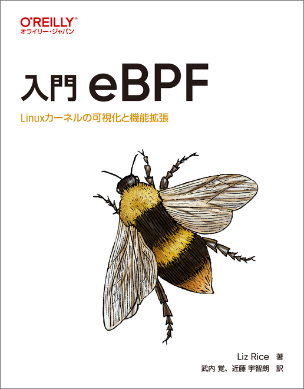
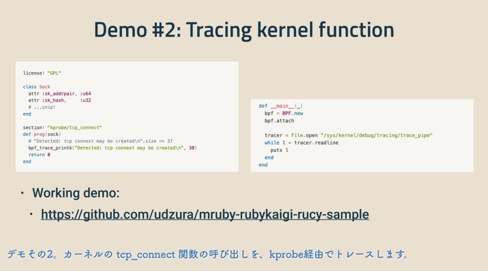
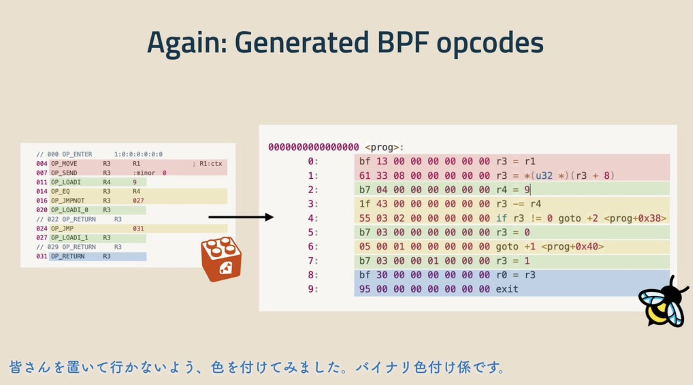
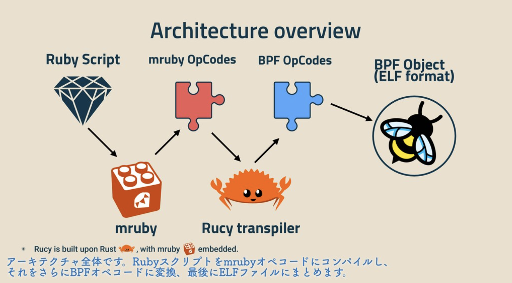

----
marp: true
title: Become Friends with eBPF
description: At eBPF Japan Meetup #1
header: Become Friends with eBPF
footer: "presentation by Uchio Kondo"
image: https://udzura.jp/slides/2024/ebpfjapan/ogp.png
theme: ebpfjapan
paginate: true
----

<!--
_class: hero
-->

# Become Friends with eBPF

----
<!--
class: profile
style: section.profile ul { width: 110% }
-->

# Uchio Kondo / @udzura

- Affiliation: Mirrativ Inc.
- Fukuoka City Engineer Cafe hacker supporter
- Fjord Bootcamp advisor
- Primarily engaged in developing middlewares with Go


----

<!--
_class: normal
-->

# Co-translated ["Learning eBPF"](https://www.oreilly.co.jp/books/9784814400560/)

- Published by O'Reilly Japan in December last year.
  - (We made it in time for the original publication!)




----

<!--
_class: hero
-->

# eBPF Japan Meetup #1

----

<!--
_class: hero
-->

# 🥳 Congrats on holding today!

----

<!--
_class: normal
-->

# What we'll cover today

- Looking back at what I've created:
  - RbBCC
  - Rucy
- Why am I doing this?
- The freedom to hack and have fun with free and open things

----

<!--
_class: normal
-->

# What @udzura has created

- In the domain of eBPF:
  * RbBCC
  * Rucy

----

<!--
_class: hero
-->

# RbBCC

----

<!--
_class: normal
-->

# RbBCC

- Ruby binding for BCC(libbcc)
- [Development support by Ruby Association's Grant](https://www.ruby.or.jp/ja/news/20200508) (Mentor: Koichi Sasada, Ruby committer)
- To speak honestly, originally created to learn eBPF for myself

----

<!--
_class: normal
-->

# RbBCC code

```ruby
require 'rbbcc'
prog = "#include <linux/sched.h>
struct data_t { char comm[TASK_COMM_LEN]; };
BPF_RINGBUF_OUTPUT(buffer, 1 << 4);
int hello(struct pt_regs *ctx) {
    struct data_t data = {};
    bpf_get_current_comm(&data.comm, sizeof(data.comm));
    buffer.ringbuf_output(&data, sizeof(data), 0);
    return 0;
}"

b = RbBCC::BCC.new(text: prog)
b.attach_kprobe(event: "__arm64_sys_clone", fn_name: "hello")

b["buffer"].open_ring_buffer do |_, data, _|
  puts "Hello world! comm = %s" % b["buffer"].event(data).comm
end

loop { b.ring_buffer_poll; sleep 0.1 }
```

----

<!--
_class: normal
-->

# Compare with BCC(Python) code

```python
import time
from bcc import BPF
prog = r"""
#include <linux/sched.h>
struct data_t {
    char comm[TASK_COMM_LEN];
};
BPF_RINGBUF_OUTPUT(buffer, 1 << 4);
int hello(struct pt_regs *ctx) {
    // ....
}
"""
b = BPF(text=src)
def callback(ctx, data, size):
    print("Hello world! comm = %s" % (b["buffer"].event(data).comm))

b['buffer'].open_ring_buffer(callback)
while 1:
    b.ring_buffer_poll()
    time.sleep(0.5)
```

----

<!--
_class: sample
-->

# RbBCC demo


----

<!--
_class: hero
-->

# Rucy

----

<!--
_class: sample
-->

# Rucy

- A compiler, which compiles Ruby scripts into BPF bytecode
- Presented at RubyKaigi 2021-takeout
- Uses mruby's bytecode specification and its compiler internally
- Can only run very simple programs

----

<!--
_class: sample
-->

# "Ruby" code sample for Rucy

```ruby
license! "GPL"
section! "dev/cgroup"

class Ctx
  attr :access_type, :u32
  attr :major, :u32
  attr :minor, :u32
end

def prog(ctx)
  if ctx.minor == 9
    return 0
  else
    return 1
  end
end
```

----

<!--
_class: sample
-->

# This is (virtually) equivalent to this C code

```c
#include <linux/bpf.h>
#include <bpf/bpf_helpers.h>

SEC("cgroup/dev")
int bpf_prog1(struct bpf_cgroup_dev_ctx *ctx)
{
    if (ctx->minor == 9) {
        return 0;
    } else {
        return 1;
    }
}

char _license[] SEC("license") = "GPL";
```

----

<!--
_class: sample
-->

# Details of eBPF program displayed above

- To help understand the following slides
- Uses eBPF cgroup device program type
  - `BPF_PROG_TYPE_CGROUP_DEVICE`
- Filters devices accessible from containers (using cgroup v2)
  - e.g. deny if device is `/dev/urandom`, pass otherwise

----

<!--
_class: sample
-->

# Compile Ruby code into eBPF binary object

```
$ rucy object ./sample.rb --dest obj.o
```

<blockquote class="twitter-tweet" data-media-max-width="560"><p lang="ja" dir="ltr">Rucy、Rubyのスクリプト辺を渡すとその情報からBPFオブジェクトファイルを「コンパイル」するようになりました。<br>このオブジェクトをそのまま使って他言語でツールを書くなりできますが、せっかくなのでmrubyのlibbpfバインディングも作る。 <a href="https://t.co/8JSwJySnNJ">pic.twitter.com/8JSwJySnNJ</a></p>&mdash; Uchio Kondo (@udzura) <a href="https://twitter.com/udzura/status/1430046852699680769?ref_src=twsrc%5Etfw">August 24, 2021</a></blockquote> <script async src="https://platform.twitter.com/widgets.js" charset="utf-8"></script>

----

<!--
_class: sample
-->

# Basic loading code example of `CGROUP_DEVICE`

- Example using libbpf

```c
// 抜粋
#include <bpf/libbpf.h>
struct bpf_object *obj;
int prog_fd, cgroup_fd;
bpf_prog_load("./obj.o", BPF_PROG_TYPE_CGROUP_DEVICE, &obj, &prog_fd);

cgroup_fd = open("/sys/fs/cgroup/test-device",  O_RDONLY);
bpf_prog_attach(prog_fd, cgroup_fd, BPF_CGROUP_DEVICE, 0);
```

----

<!--
_class: sample
-->

# Basic loading example (2)

- Confirming successfully loaded

```
$ sudo mkdir /sys/fs/cgroup/test-device
$ sudo ./loader
$ sudo bpftool prog
...
128: cgroup_device  name bpf_prog1  tag 02de78d75c0e331c  gpl
        loaded_at 2024-08-15T22:17:11+0900  uid 0
        xlated 40B  jited 84B  memlock 4096B
        btf_id 64
```

----

<!--
_class: sample
-->

# Verification

- Start a docker container with `--pid=host` and get the shell PID

```
$ sudo docker run -ti --pid=host debian:11-slim bash
root@987bbaa4c62c:/# echo $$
51959
```

- Write PID to the cgroup

```
$ echo 51787 | sudo tee /sys/fs/cgroup/test-device/cgroup.procs
51787
```

----

<!--
_class: sample
-->

# Verification (2)

- Confirm that it belongs to the specified cgroup

```
root@987bbaa4c62c:/# cat /proc/self/cgroup
0::/../../test-device
```

- Confirm that only /dev/urandom cannot be accessed

```
root@987bbaa4c62c:/# head -c 4 /dev/random | od
0000000 106533 052260
0000004
root@987bbaa4c62c:/# head -c 4 /dev/urandom | od
head: cannot open '/dev/urandom' for reading: Operation not permitted
0000000
```

----

<!--
_class: sample
-->

# c.f. kprobe example also available



- https://github.com/udzura/mruby-rubykaigi-rucy-sample


----

<!--
_class: sample
-->

# Technologies Required for Rucy Development

- mruby bytecode spec
- ELF binary & layout
- Rust
- How to create BPF binaries ...


----

<!--
_class: sample
-->

# How to create BPF binaries

- How are BPF binaries created?
- Let's follow the smallest sample

----

<!--
_class: sample
-->

# C code (again)

```c
#include <linux/bpf.h>
#include <bpf/bpf_helpers.h>

SEC("cgroup/dev")
int bpf_prog1(struct bpf_cgroup_dev_ctx *ctx)
{
    if (ctx->minor == 9) {
        return 0;
    } else {
        return 1;
    }
}

char _license[] SEC("license") = "GPL";
```

----

<!--
_class: sample
-->

# Convert to LLVM-IR

```
$ clang -g -O1 -c -S -emit-llvm \
    -target bpf \
    -o cgroup1.ll
```

```llvm
; Excerpts/omitted debug information
define dso_local i32 @bpf_prog1(...) #0 section "cgroup/dev" {
  %2 = getelementptr inbounds %struct.bpf_cgroup_dev_ctx,
    %struct.bpf_cgroup_dev_ctx* %0, i64 0, i32 2
  %3 = load i32, i32* %2, align 4, !tbaa !3
  %4 = icmp ne i32 %3, 9
  %5 = zext i1 %4 to i32
  ret i32 %5
}
```

----

<!--
_class: sample
-->

# Convert to BPF binary

```
$ clang -g -O1 -c -target bpf cgroup1.ll -o cgroup1.o
$ llvm-objdump -x cgroup1.o
cgroup1.o:      file format elf64-bpf
architecture: bpfel
start address: 0x0000000000000000
...
Sections:
Idx Name          Size     VMA              Type
  0               00000000 0000000000000000 
  1 .strtab       00000054 0000000000000000 
  2 .text         00000000 0000000000000000 TEXT
  3 cgroup/dev    00000028 0000000000000000 TEXT
  4 license       00000004 0000000000000000 DATA ...

SYMBOL TABLE:
0000000000000000 l    df *ABS*  0000000000000000 cgroup1.c
0000000000000020 l       cgroup/dev     0000000000000000 LBB0_2
0000000000000000 g     F cgroup/dev     0000000000000028 bpf_prog1
0000000000000000 g     O license        0000000000000004 _license
```

----

<!--
_class: sample
-->

# Check out the generated bytecode

```
$ llvm-objdump -Sd cgroup1.o
...
Disassembly of section cgroup/dev:

0000000000000000 <bpf_prog1>:
       0:       61 11 08 00 00 00 00 00 r1 = *(u32 *)(r1 + 8)
       1:       b7 00 00 00 01 00 00 00 r0 = 1
       2:       55 01 01 00 09 00 00 00 if r1 != 9 goto +1 <LBB0_2>
       3:       b7 00 00 00 00 00 00 00 r0 = 0

0000000000000020 <LBB0_2>:
       4:       95 00 00 00 00 00 00 00 exit
```

----

<!--
_class: sample
-->

# Interpret the generated bytecode

```
0000000000000000 <bpf_prog1>:
                                     # Following the offset of ctx->minor
    0:       61 11 08 00 00 00 00 00 r1 = *(u32 *)(r1 + 8)
                                     # Setting the default return value
    1:       b7 00 00 00 01 00 00 00 r0 = 1
                                     # If ctx->minor != 9, then goto exit
    2:       55 01 01 00 09 00 00 00 if r1 != 9 goto +1 <LBB0_2>
                                     # Otherwise, set the return value to 0
    3:       b7 00 00 00 00 00 00 00 r0 = 0

0000000000000020 <LBB0_2>:
                                     # Exit the program
    4:       95 00 00 00 00 00 00 00 exit
```

----

<!--
_class: sample
-->

# FYI: Instruction format

- See: https://datatracker.ietf.org/doc/draft-ietf-bpf-isa/

```
   A basic instruction is encoded as follows:

   +-+-+-+-+-+-+-+-+-+-+-+-+-+-+-+-+-+-+-+-+-+-+-+-+-+-+-+-+-+-+-+-+
   |    opcode     |     regs      |            offset             |
   +-+-+-+-+-+-+-+-+-+-+-+-+-+-+-+-+-+-+-+-+-+-+-+-+-+-+-+-+-+-+-+-+
   |                              imm                              |
   +-+-+-+-+-+-+-+-+-+-+-+-+-+-+-+-+-+-+-+-+-+-+-+-+-+-+-+-+-+-+-+-+
```

- e.g. `55 01 01 00 09 00 00 00`
  - opcode = `55` reg = `01` offset = `01 00` immidiate = `09 00 00 00`
  - little endian

----

<!--
_class: sample
-->

# Loading the binary

- Reposted codes

```c
bpf_prog_load("./obj.o", BPF_PROG_TYPE_CGROUP_DEVICE, &obj, &prog_fd);
bpf_prog_attach(prog_fd, cgroup_fd, BPF_CGROUP_DEVICE, 0);
```

----

<!--
_class: hero
-->

# Where is it loaded?

----

<!--
_class: sample
-->

# Looking at the implementation of cgroup-v2 device

- I generally avoid delving into kernel code, but I'll give it a try...
- Targeting Ubuntu 22.04 5.15.0-118-generic

----

<!--
_class: sample
-->

# I'm not familiar with Linux, but...

- [[code link]](https://elixir.bootlin.com/linux/v5.15/source/kernel/bpf/cgroup.c#L1159)

```c
int __cgroup_bpf_check_dev_permission(short dev_type, u32 major, u32 minor,
				      short access, enum cgroup_bpf_attach_type atype)
{
	struct cgroup *cgrp;
	struct bpf_cgroup_dev_ctx ctx = {
		.access_type = (access << 16) | dev_type,
		.major = major, .minor = minor,
	};
	int allow;
	rcu_read_lock();
	cgrp = task_dfl_cgroup(current);
	allow = BPF_PROG_RUN_ARRAY_CG(cgrp->bpf.effective[atype], &ctx,
				      bpf_prog_run);
	rcu_read_unlock();
	return !allow;
}
```

----

<!--
_class: sample
-->

```c
static __always_inline u32
BPF_PROG_RUN_ARRAY_CG(const struct bpf_prog_array __rcu *array_rcu,
		      const void *ctx, bpf_prog_run_fn run_prog)
{
	const struct bpf_prog_array_item *item;
	const struct bpf_prog *prog;
	const struct bpf_prog_array *array;
	struct bpf_run_ctx *old_run_ctx;
	struct bpf_cg_run_ctx run_ctx;
	u32 ret = 1;

	migrate_disable();
	rcu_read_lock();
	array = rcu_dereference(array_rcu);
	item = &array->items[0];
	old_run_ctx = bpf_set_run_ctx(&run_ctx.run_ctx);
	while ((prog = READ_ONCE(item->prog))) {
		run_ctx.prog_item = item;
		ret &= run_prog(prog, ctx);
		item++;
	}
	bpf_reset_run_ctx(old_run_ctx);
	rcu_read_unlock();
	migrate_enable();
	return ret;
}
```

----

<!--
_class: sample
-->

```c
typedef unsigned int (*bpf_dispatcher_fn)(const void *ctx,
					  const struct bpf_insn *insnsi,
					  unsigned int (*bpf_func)(const void *,
								   const struct bpf_insn *));
//...
static __always_inline u32 __bpf_prog_run(const struct bpf_prog *prog,
					  const void *ctx,
					  bpf_dispatcher_fn dfunc)
{
	u32 ret;

	cant_migrate();
	if (static_branch_unlikely(&bpf_stats_enabled_key)) {
		struct bpf_prog_stats *stats;
		u64 start = sched_clock();

		ret = dfunc(ctx, prog->insnsi, prog->bpf_func);
		stats = this_cpu_ptr(prog->stats);
		u64_stats_update_begin(&stats->syncp);
		stats->cnt++;
		stats->nsecs += sched_clock() - start;
		u64_stats_update_end(&stats->syncp);
	} else {
		ret = dfunc(ctx, prog->insnsi, prog->bpf_func);
	}
	return ret;
}

static __always_inline u32 bpf_prog_run(const struct bpf_prog *prog, const void *ctx)
{
	return __bpf_prog_run(prog, ctx, bpf_dispatcher_nop_func);
}
```

----

<!--
_class: sample
-->

# BTW: What did I implement with Rucy?

- Created pass from mruby bytecode -> to BPF bytecode. [Slide](https://speakerdeck.com/udzura/story-of-rucy-on-rubykaigi-takeout-2021?slide=35)



----

<!--
_class: sample
-->

# Rucy's overall compilation pass



- [RubyKaigi 2021 slide](https://speakerdeck.com/udzura/story-of-rucy-on-rubykaigi-takeout-2021?slide=18)

----


<!--
_class: sample
-->

# Recap so far

- I've created RbBCC:
  - Ported BCC to Ruby
  - Got a rough idea of the API as a eBPF user
- I've created Rucy:
  - Enhanced understanding of how BPF programs work
  - Small programs can run if we implement the pass carefully
    - Became friends with binaries (?)

----

<!--
_class: sample
-->

# Incidentally, these stories...

- Are mostly in "Learning eBPF"
- More details are included in the book!
(really? including about binary format too?)


----

<!--
_class: hero
-->

# Why did I create it?

----

<!--
_class: sample
-->

# To be honest


- Because I wanted to talk at RubyKaigi... lol
- For RbBCC: I wanted to learn more
  - So, why not port it?
  - After a quick search, I realized that libbcc was just one of FFI use cases, so I thought I could port it with less effort than I've expected
    - I was almost new to Python, but finally I became really good at ctypes...
  - It was **fun** to port it line by line

----

<!--
_class: sample
-->

# To be honest (2)

- For Rucy...
  - In the first place, I wanted to avoid to C boilerplate...
  - But I suddenly had an idea, and when I implemented it, it worked surprisingly and interestingly well
    - So I created the PoC
  - I thought it'd be **interesting** if I could do it, so I completed

----

<!--
_class: hero
-->

# Just For Fun.

----

<!--
_class: hero
-->

# cf. "as a hobby."

> <span style="color: #222222;">"I never thought that the program I developed would be used all over the world someday. I was just making it(Ruby) as a hobby."</span>
> <span style="color: #aaaaaa;font-size: smaller;">「いつか私の開発したプログラムが世界中で使われるようになる」なんて、ぜんぜん思っていなくて、ただ趣味として作っていたんですね。</span>

- Yukihiro Matsumoto -- cite: https://logmi.jp/tech/articles/322453

----

<!--
_class: hero
-->

# But that kind of feeling is important - I believe

----

<!--
_class: hero
-->

# The freedom to hack open things

----

<!--
_class: hero
-->

# You can only be "friends" by doing it yourself

----

<!--
_class: hero
-->

# Conclusion

----

<!--
_class: hero
-->

# Let's create interesting things from open source

----

<!--
_class: hero
-->

# You can create interesting things with eBPF
