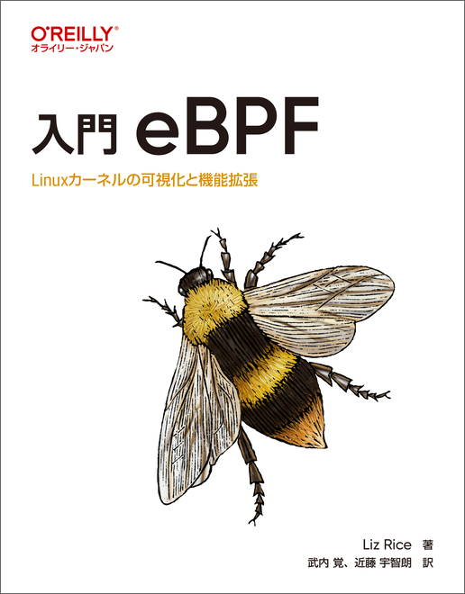

----
marp: true
header: "Rubyをこじらせて"
footer: "presentation by Uchio Kondo"
theme: fukuokarb
paginate: true
----

<!--
_class: hero
-->

# Rubyをこじらせて

## &nbsp;Ruby is like a teenage angst to me

<!--
"こじらせる" means: to develop a kind of obsession or a heavy addiction with something; e.g. hobby, hard job, complex, etc.
-->

----
<!--
_class: profile
-->

# Uchio Kondo (@udzura)

- 所属: 株式会社ミラティブ
- 福岡市エンジニアカフェ ハッカーサポーター
- フィヨルドブートキャンプ アドバイザー
- 『入門 eBPF』（オライリージャパン）共同翻訳
- [RubyKaigi Speaker](https://rubykaigi-speakers.vercel.app/speakers/Uchio+KONDO) (2016 ~)
- RubyKaigi 2019 Local Organizer


---
<!--
_class: hero
-->

# 生活発表

---
<!--
_class: hero
-->

# 目論見書

---
<!--
_class: hero
-->

# 生活の振り返り

---
<!--
_class: hero
-->

# 解題

---
<!--
_class: hero
-->

# 2016


---
<!--
_class: hero
-->

# Haconiwa

---
<!--
_class: hero
-->

# Linux Container

---
<!--
_class: normal
-->

# Linux Container

- コンテナの要素技術の解説
  - Linux Namespace
  - cgroup
  - Capability etc

---
<!--
_class: hero
-->

# (2017..2018)

---
<!--
_class: hero
-->

# 2019

---
<!--
_class: hero
-->

# Local Organizer @ Fukuoka

---
<!--
_class: hero
-->

# CRIU

---
<!--
_class: normal
-->

# CRIU

- プロセス（=コンテナも対象）のCheckpoint&Restore
  - プロセスの状態をファイルに保存し、再生する
  - 2019 ではRailsの起動高速化への応用
  - ライブマイグレーションほかにも使える

---
<!--
_class: hero
-->

# 2021

---
<!--
_class: hero
-->

# eBPF

---
<!--
_class: normal
-->

# eBPF

- Linuxカーネル内部でプログラムを実行する技術
  - 普通のシステムコールより奥深い情報を使える
  - カーネルモジュールより**は**安全
  - ネットワーク、Observability、セキュリティ...

---
<!--
_class: normal
-->

# Rucy

- eBPFはカーネル内部に専用のVMを持つ＋
- 専用のバイトコード命令系をもつ
  - YARVみたいなもんですね〜（そう？）
- RucyはRubyのスクリプトをそのバイトコードに**コンパイル**する
  - Rucy = Ruby Compiler = RuC

---
<!--
_class: hero
-->

# 2022

---
<!--
_class: hero
-->

# eBPF (BCC)

---
<!--
_class: normal
-->

# RucyとRbBCCはどう違うのか

- RucyはRubyのスクリプトをそのバイトコードに**コンパイル**する
  - Rucy = Ruby Compiler = RuC
- RbBCCは、そもそもBCC(libbcc)のFFI
- libbccは、C言語風のコードをその場でeBPFバイナリにコンパイルします
  - Rubyから送られてきたデータを使えるという話

---
<!--
_class: normal
-->

# RucyとRbBCCはどう違うのか

- 基本的にeBPFは**コンパイル型**のエコシステムに移行中
  - BPF CO-RE などで検索
  - なので未来があるのはRucyの方
- 一方、RbBCCはeBPFの基本的な機能を大体使える
  - 多くの機能をちゃんと移植済み
  - 学習用、ちょっとしたツールには十分なつもり

---
<!--
_class: hero
-->

# [PR]

- これを読むと解像度が上がる
- 鳥井さんのお力で文章も読みやすい！



---
<!--
_class: hero
-->

# <s>2023</s>

---
<!--
_class: hero
-->

# 2024

---
<!--
_class: hero
-->

# WebAssembly

---
<!--
_class: normal
-->

# WebAssembly

- ご存知、ブラウザでコードを動かす技術
- でも僕は**そうは思ってない**
- アプリ組み込み環境のファイナルアンサーだと思っている
  - ブラウザは「組み込める環境の一つ」にすぎない
  - ポータブルなVM仕様でいろんなアプリに組み込める
  - envoy, fluent-bit, Containers...
  - [いつかは本物の組み込みにも](https://arxiv.org/html/2405.09213v1)

---
<!--
_class: normal
-->

# WebAssemblyのWebの部分

- eBPFがもはや全く "Berkeley **Packer Filter**" でないように
- **Web**AssemblyもWebだけではなくなるのだろう

---
<!--
_class: normal
-->

# Why Ruby de WebAssembly (again)

- 「組み込み環境としてのWebAssembly」のためのRubyが欲しい
  - （少なくとも僕はめっちゃ欲しいので...）
- mruby でゴニョっとすればいけるんじゃね？ というのが最初の発想

---
<!--
_class: hero
-->

# この話は、後でもう一度します

---
<!--
_class: hero
-->

# 生活の傾向

---
<!--
_class: normal
-->

# 傾向

- 所謂低レイヤ？
- Linux ネタが多め（たまたま）
- ${謎技術} をRubyから使ってみた！

---
<!--
_class: hero
-->

# 低めのレイヤーにRubyでいっちょ噛み

- 自分の芸風

---
<!--
_class: normal
-->

# 低めのレイヤーにRubyでいっちょ噛み

- 普通のWebアプリケーションエンジニアが触れない世界でもある...

---
<!--
_class: hero
-->

# Why 低レイヤ？

---
<!--
_class: normal
-->

# 低レイヤ(あるいは SOTA)の世界にRubyがいない

- Rubyのバインディングがない
- Rubyのサンプルコードがない
  - Go、Python、C++、そしてRust他みたいな
  - e.g. eBPF(BCC) の対応言語はPython、Lua、C++
    - GoとRustは有志がeBPF向けSDKを作っていた

---
<!--
_class: normal
-->

# RubyからSOTAに触りたい

- コンピューターの世界は日々進歩しているらしい
- Rubyが成果を享受できることもあるが...（それこそ、漸進的型とか）
- 便利なものや進んだものに触れる時もRubyからがいい

---
<!--
_class: normal
-->

# あるいはRubyという「ハンマー」

- コンピューターの世界、たくさん釘があって便利

---
<!--
_class: normal
-->

# OSSに「貢献」したい？

- 実はあまり興味が...
  - もちろん使っているものは直す、オープンなら還元しますが
- 大きなOSSに何かしたいという気持ちが薄い
  - もちろん「自分ごと」になればやります
- 基本的には、自分が納得するものを作りたい
  - 納得できそうなものがたまたま低いレイヤに多い

---
<!--
_class: hero
-->

# 良いもの・面白いものを作る

---
<!--
_class: hero
-->

# mruby/edge の話

---
<!--
_class: hero
-->

# そもそもWebAssemblyの話

---
<!--
_class: hero
-->

# Core WebAssembly

- 重要な仕様
  - import/export
  - 線形メモリ

> 今日は後者の話は省略します...

---
<!--
_class: normal
-->

# 最も小さなWebAssemblyバイナリ

- C言語で書いたもの

```c
// sample.c
#include <emscripten.h>

void log_value(int size);

int EMSCRIPTEN_KEEPALIVE calc_plus(int n, int m) {
  log_value(n + m);
  return 0;
}
```

---
<!--
_class: normal
-->

# コンパイルする

```
$ emcc -o sample.wasm --js-library ./lib.js --no-entry ./sample.c
cache:INFO:  - ok
```

- ※ lib.js is here

```js
mergeInto(LibraryManager.library, {
    log_value: function(value) { /* TODO */ }
});
```

---
<!--
_class: normal
-->

# Exportセクション

```
$ wasm-objdump -x -j Export sample.wasm 

sample.wasm:    file format wasm 0x1

Section Details:

Export[10]:
 - memory[0] -> "memory"
 - func[2] <calc_plus> -> "calc_plus"
 - table[0] -> "__indirect_function_table"
 - func[3] <_initialize> -> "_initialize" ...
```

- `calc_plus()` を外部から呼び出す

---
<!--
_class: normal
-->

# Importセクション

```
$ wasm-objdump -x -j Import sample.wasm

sample.wasm:    file format wasm 0x1

Section Details:

Import[1]:
 - func[0] sig=2 <env.log_value> <- env.log_value
```

- インスタンス化するときに外部関数 `log_value()` を注入する

---
<!--
_class: normal
-->

# 使い方

```javascript
const obj = {
  env: {
    // ここでブラウザ側の関数を指定
    log_value: function(value) {
      let log = "sample wasm! 12 + 34 = " + value.toString();
      document.getElementById("placeholder").innerText = log;
    }
  },
};

WebAssembly.instantiateStreaming(fetch("./sample.wasm"), obj).then(
  (obj) => {
    // ここでwasmの中の関数を呼び出し
    obj.instance.exports.calc_plus(12 + 34);
  },
);
```

---
<!--
_class: hero
-->

# Live demo

<script async type="text/javascript">
const importObject = {
  env: {
    log_value: function(value) {
      let log = "sample wasm! 12 + 34 = " + value.toString();
      document.getElementById("placeholder").innerText = log;
      console.log("OK");
    }
  },
};

window.fire = function() {
  WebAssembly.instantiateStreaming(fetch("./sample.wasm"), importObject).then(
    function (obj) {
      obj.instance.exports.calc_plus(12 + 34);
    },
  );
};
</script>

<div>
  Output: <strong style="color: blue; font-size: larger;" id="placeholder" onclick="fire();">{{here}}</strong>
</div>

---
<!--
_class: hero
-->

# WebAssemblyの一丁目一番地


- 個人の意見です！


---
<!--
_class: hero
-->

# シンプル

---
<!--
_class: normal
-->

# import/exportを押さえればWASIもシンプル

- WASI = 「これをimportして使えばシステム操作がええ感じにできるで」という関数のセット
- プログラム側では仕様の通りに使えばいい
- WASI対応ランタイムでは、それらのimport用関数を準備すればいい
  - まさにシステムコールを実装するような感じ

---
<!--
_class: normal
-->

# e.g. ブラウザでWASIをエミュレートする

- https://github.com/bjorn3/browser_wasi_shim
- random_get という「システムコール」をブラウザJSで実装

```typescript
random_get(buf: number, buf_len: number) {
    const buffer8 = new Uint8Array(...);
    // 色々省略
    for (let i = 0; i < buf_len; i += 65536) {
        crypto.getRandomValues(buffer8.subarray(i, i + 65536));
    }
}
```

---
<!--
_class: normal
-->

# mruby/edgeでやりたいこともシンプル

- Rubyのメソッド定義をそのままexportしたい
- importもRubyレベルで使えるようにしたい

---
<!--
_class: normal
-->

# コードのイメージ（将来）

- この通りに実装するとは限らないのですが...

```ruby
# @export!
# @rbs (Integer) -> Integeer
def fib(n)
  # ...
end

# @import!
# @rbs (String) -> void
def console_log(str) = __imported__!

def _start
  console_log("Hello World " + fib(10).to_s)
end
```

---
<!--
_class: hero
-->

# One More Thing

---
<!--
_class: hero
-->

# WebAssemblyの未来

---
<!--
_class: hero
-->

# WebAssembly Component Model

---
<!--
_class: normal
-->

# WebAssembly Component Model

- Core WASMのインタフェース
  - CのDLLのようにふわっとしたところがある
- 「繋がり部分」をきちっとしたら便利で安全になる
  - 型（それもある程度柔軟な）
  - バイナリ仕様
  - ツールチェイン

---
<!--
_class: normal
-->

# WebAssembly Component Model　の道具たち

- いい感じの型
  - WIT形式
  - 一種のRPCとも言える
- バイナリ仕様
  - Canonical ABI
- ツールチェイン
  - 上記が揃ったらどんどん作れるはず

---
<!--
_class: normal
-->

# FYI: WIT 形式

```terraform
world rubyist-kaigi {
    export fib: func(n: i32) -> i32;

    import console_log: func(log: string);
}
```

---
<!--
_class: normal
-->

# FYI: Component 手を動かして理解

- "手書きで理解するWebAssembly Component Model"
  - https://nulab.com/ja/blog/nulab/webassembly-component-model/
  - https://nulab.com/ja/blog/nulab/webassembly-component-model-hello-world/

---
<!--
_class: normal
-->

# 例えば wasmCloud


- https://wasmcloud.com/
- A CNCF Sandbox Project

---
<!--
_class: normal
-->

# wasmCloudでRubyを動かす

- mruby/edge を(雑に)動かした例

```rust
use mrubyedge::{mrb_helper, vm::RObject};
// ...
impl Guest for HttpServer {
    fn handle(_request: IncomingRequest, response_out: ResponseOutparam) {
        let write_response = |body: &str| { ... };
        let bin = include_bytes!("./fib.mrb");
        let rite = mrubyedge::rite::load(bin).unwrap();
        let mut vm = mrubyedge::vm::VM::open(rite);
        vm.prelude().unwrap(); //...
        match mrb_helper::mrb_funcall(&mut vm, &top_self, "fib".to_string(), &args) {
            Ok(val) => { write_response(&val) }
            Err(ex) => { dbg!(ex); }
        } //...
    }
}
```

---
<!--
_class: normal
-->

# mruby入りのWASMバイナリを作る

```console
$ wash build
   Compiling http-hello-world v0.1.0 (/home/ubuntu/mrubyhttp)
    Finished `release` profile [optimized] target(s) in 0.29s

Component built and signed and can be found at "/../build/http_hello_world_s.wasm"

$ # mruby バイナリが組み込まれている
$ strings build/http_hello_world_s.wasm | grep MATZ
MATZ0000IREP

$ wasm-tools component wit build/http_hello_world_s.wasm | head -n 20
package root:component;

world root {
  import wasi:clocks/monotonic-clock@0.2.0;
  // ....

  // entry point
  export wasi:http/incoming-handler@0.2.0;
}
```

---
<!--
_class: normal
-->

# このWASMをwasmCloudで動かす

```console
$ wash app deploy wadm.yaml
$ wash app status rust-hello-world

rust-hello-world@ - Deployed                   
  Name                                         Kind           Status    
  http_component                               SpreadScaler   Deployed  
  httpserver -(wasi:http)-> http_component     LinkScaler     Deployed  
  httpserver                                   SpreadScaler   Deployed

$ curl localhost:8080
fib(15) = 610
```

---
<!--
_class: normal
-->


---
<!--
_class: hero
-->

# Ruby「も」繋がりたい

---
<!--
_class: hero
-->

<blockquote class="twitter-tweet"><p lang="ja" dir="ltr">.<a href="https://twitter.com/yu_suke1994?ref_src=twsrc%5Etfw">@yu_suke1994</a> と tskaigi で話した Ruby がこの先生きのこるにはという話、早いとこ wasm 対応の軽量ランタイム出して <a href="https://t.co/FRzMN9jsBj">https://t.co/FRzMN9jsBj</a> かなんかで component model エコシステムと統合されるしかねえ、という話になったので、 <a href="https://twitter.com/udzura?ref_src=twsrc%5Etfw">@udzura</a> さん頑張ってほしい</p>&mdash; mizchi (@mizchi) <a href="https://twitter.com/mizchi/status/1791299723355435147?ref_src=twsrc%5Etfw">May 17, 2024</a></blockquote> <script async src="https://platform.twitter.com/widgets.js" charset="utf-8"></script>

---
<!--
_class: hero
-->

# Wrapping up

----

<!--
_class: hero
-->

# See you in Matsuyama!
