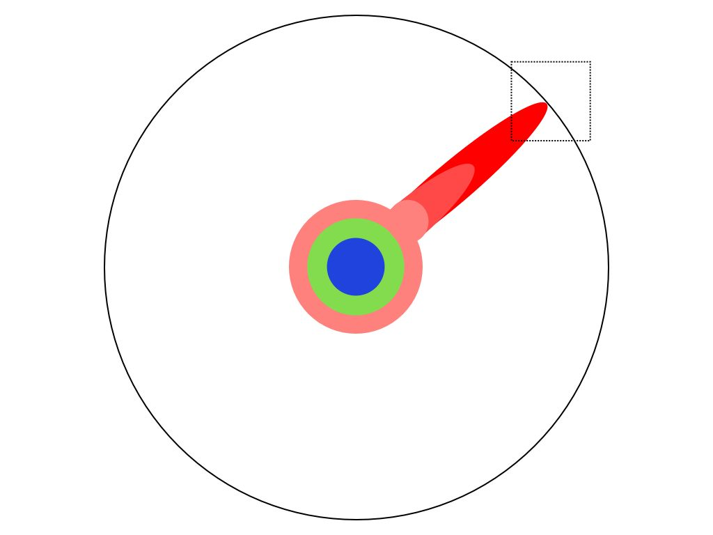

----
marp: true
title: "Rubyをこじらせて"
description: "At Fukuoka Rubyist Kaigi 2024.09.02; Presentation by Uchio Kondo"
header: "Rubyをこじらせて"
footer: "@ Fukuoka Rubyist Kaigi 2024.09"
theme: fukuokarb
image: https://udzura.jp/slides/2024/rubyistkaigi/ogp.png
paginate: true
----

<!--
_class: hero
-->

# Rubyをこじらせて

## &nbsp;Ruby is like a teenage angst to me

<!--
For audiences who's not so good at Japanese; Hola, I'm so happy to meet you here in Fukuoka.

"こじらせる" means: to develop a kind of obsession or a heavy addiction with something; for example, "趣味をこじらせる" means they has some addiction in their hobby.

I've written this slides in English, but I'll present this talk in Japanese.
So please feel free if you want to ask details about slide contents or codes at any time later.
-->

----
<!--
_class: profile
-->

# Uchio Kondo (@udzura)

- Affiliation: Mirrativ Inc.
- Hacker Supporter @Fukuoka City Engineer Cafe
- Advisor @Fjord Bootcamp
- Co-translator of "Leraning eBPF" (O'Reilly Japan)
- [RubyKaigi Speaker (2016 ~)](https://rubykaigi-speakers.vercel.app/speakers/Uchio+KONDO)
- RubyKaigi 2019 Local Organizer @ Fukuoka


<!--
- 所属: 株式会社ミラティブ
- 福岡市エンジニアカフェ ハッカーサポーター
- フィヨルドブートキャンプ アドバイザー
- 『入門 eBPF』（オライリージャパン）共同翻訳
- [RubyKaigi Speaker](https://rubykaigi-speakers.vercel.app/speakers/Uchio+KONDO) (2016 ~)
- RubyKaigi 2019 Local Organizer
-->

---
<!--
_class: hero
-->

# Recital of daily discipline

<!-- 生活発表 -->

---
<!--
_class: hero
-->

# Prospectus

> 「目論見書」

---
<!--
_class: hero
-->

# Reflection of daily life

---
<!--
_class: hero
-->

# Bibliographic commentary

> 「解題」

---
<!--
_class: hero
-->

# 2016

---
<!--
_class: hero
-->

# Haconiwa

---
<!--
_class: hero
-->

# Linux Container

---
<!--
_class: normal
-->

# Haconiwa is a Linux container

- Combine Linux container components from scratch
  - cgroup
  - namespace
  - pivot_root
  - capability, seccomp, ...

> Linuxの要素技術を自分で繋ぎ直したのがHaconiwa


---
<!--
_class: hero
-->

# (2017..2018)

---
<!--
_class: hero
-->

# 2019

---
<!--
_class: hero
-->

# Local Organizer @ Fukuoka

---
<!--
_class: hero
-->

# CRIU

---
<!--
_class: normal
-->

# CRIU

- Checkpoint and restore of processes (or containers)
  - Dump Rails' process status into files
  - Boot from it -> it's fast!

> CRIUはプロセスをファイルにダンプして、そこから再生できるツール


<!--
- プロセス（=コンテナも対象）のCheckpoint&Restore
  - プロセスの状態をファイルに保存し、再生する
  - 2019 ではRailsの起動高速化への応用
  - ライブマイグレーションほかにも使える
-->

---
<!--
_class: hero
-->

# 2021

---
<!--
_class: hero
-->

# eBPF

---
<!--
_class: hero
-->

# Rucy

---
<!--
_class:
  - normal
  - wider-note
-->

# eBPF

- Running programs with special format inside the Linux kernel
  - For Networking, Observability, Security...
  - Safer than kernel module
  - Deeper than system calls

> eBPFは、カーネルの機能を使うための仕組みの一つ
> カーネルモジュールより安全、システムコールより奥深い


<!--
- Linuxカーネル内部で特別なバイナリ形式のプログラムを実行する技術
  - ネットワーク、Observability、セキュリティ...
  - カーネルモジュールより**は**安全
  - 普通のシステムコールより奥深い情報を使える
-->

<!-- logo: https://ebpf.foundation/brand-guidelines/ -->

---
<!--
_class: normal
-->

# What is Rucy

- Rucy **compiles Ruby scripts** into special bytecodes
  - The eBPF bytecodes!
  - Rucy = Ruby Compiler = RuC

> RucyはRubyスクリプトをeBPFの形式に「コンパイル」する

<!-- 
- RucyはRubyのスクリプトをそのバイトコードに**コンパイル**する
  - Rucy = Ruby Compiler = RuC
- eBPFはカーネル内部に専用のVMを持つ＋
- 専用のバイトコード命令系をもつ
  - YARVみたいなもんですね〜（そう？）
-->

---
<!--
_class: hero
-->

# 2022

---
<!--
_class: hero
-->

# eBPF (RbBCC)

---
<!--
_class: normal
-->

# How is Rucy different from RbBCC?

| Name      | Strategy | Detail               |
| ---       | -----    | ----                 |
| **RbBCC** | JIT      | Is an FFI to libbcc / Rusy Assoc. Grant |
| **Rucy**  | AOT      | Compiles Ruby scripts into eBPF via mruby bytecodes |

<!--
# RucyとRbBCCはどう違うのか

- RucyはRubyのスクリプトをそのバイトコードに**コンパイル**する
  - Rucy = Ruby Compiler = RuC
- RbBCCは、そもそもBCC(libbcc)のFFI
- libbccは、C言語風のコードをその場でeBPFバイナリにコンパイルします
  - Rubyから送られてきたデータを使えるという話
-->

---
<!--
_class: normal
-->

# How are they different? (details)

- Basically, eBPF is moving towards a **AOT-compiled** ecosystem (BPF CO-RE)
  - So the future is Rucy's side
- RbBCC has **a larger coverage** of eBPF functions
  - Sufficient enough for learning and small tools

> 今の潮流はAOTだが、サクッと使う分にはRbBCCの方が機能が多い

<!--
# BCCはどう違うのか

- 今の潮流はAOTコンパイルeBPFではあるので、Rucyを作りました
- RbBCCの方が使える機能は多いです

- 基本的にeBPFは**コンパイル型**のエコシステムに移行中
  - BPF CO-RE などで検索
  - なので未来があるのはRucyの方
- 一方、RbBCCはeBPFの基本的な機能を大体使える
  - 多くの機能をちゃんと移植済み
  - 学習用、ちょっとしたツールには十分なつもり
-->

---
<!--
_class: hero
-->

# [PR]

<!--
- これを読むと解像度が上がる
- 鳥井さんのお力で文章も読みやすい！
-->

- This book will help your understanding
- Thanks to Tori-san, it is pleasant to read!

> 鳥井さん、ありがとうございました


---
<!--
_class: hero
-->

# <s>2023</s>

> 敗北を知りたい

---
<!--
_class: hero
-->

# 2024

---
<!--
_class: hero
-->

# WebAssembly

---
<!--
_class: normal
-->

# WebAssembly

- As you know, a technology for running code in browsers
  - Only browsers?

> 「なんかブラウザで動くやつ」


<!--
- ご存知、ブラウザでコードを動かす技術
-->

---
<!--
_class: normal
-->

# WebAssembly is not only for browsers

- Browsers are just "one of the runnable environments"
- Can run everywhere with portable VM
  - envoy, fluent-bit, Containers like youki...
  - [even for real embedded systems...](https://arxiv.org/html/2405.09213v1)

> ブラウザ外の「アプリケーション組み込み」が個人的に熱い。
> envoy、youki、使ったことありますか？

<!--
- でも僕は**そうは思ってない**
- アプリ組み込み環境のファイナルアンサーだと思っている
  - ブラウザは「組み込める環境の一つ」にすぎない
  - ポータブルなVM仕様でいろんなアプリに組み込める
  - envoy, fluent-bit, Containers...
  - [いつかは本物の組み込みにも](https://arxiv.org/html/2405.09213v1)
-->

---
<!--
_class: normal
-->

# The "Web" part of WebAssembly

- **Web**Assembly will probably not be just for the web
- ... Just like eBPF is no longer "Berkeley **Packer Filter**"

<!--
- eBPFがもはや全く "Berkeley **Packer Filter**" でないように
- **Web**AssemblyもWebだけではなくなるのだろう
-->

---
<!--
_class: normal
-->

# Why Ruby for WebAssembly (again)

- Ruby for WebAssembly, with more "embeddability"
  - Also with the mruby.

> 違うアプローチをしたい理由があります

<!--
- 「組み込み環境としてのWebAssembly」のためのRubyが欲しい
  - （少なくとも僕はめっちゃ欲しいので...）
- mruby でゴニョっとすればいけるんじゃね？ というのが最初の発想
-->

---
<!--
_class: hero
-->

# Talk about this again later

---
<!--
_class: hero
-->

# Trends of thoughts

---
<!--
_class: normal
-->

# Trends

- So-called low-level technologies?
- Linux mania? (it's coincidentally)
- "I tried utilizing `${mysterious_tech}` from Ruby!"

> 「 `${謎技術}` をRubyから使ってみた！」

<!--
- 所謂低レイヤ？
- Linux ネタが多め（たまたま）
- ${謎技術} をRubyから使ってみた！
-->

---
<!--
_class: sample
-->

# My fighting style

> 「芸風」

---
<!--
_class: hero
-->

# Give a jab to the lower layers from Ruby World

> 低めのレイヤーにRubyでいっちょ噛み

---
<!--
_class: normal
-->

# Are you interested in low layers?

- It's even "unknown unknown" from ordinary web application engineers...

> 普通にWebアプリを作ってる分には隠蔽されていることばかり...


---
<!--
_class: hero
-->

# Why low-level?

---
<!--
_class: normal
-->

# A typical low-layer project...

- Has **NO** Ruby bindings
- Has **NO** Ruby sample code
- Just has samples for like Go, Python, C++, and Rust

> 最近の低レイヤツール、クラウドネイティブミドルウェア、マジでRubyの<br>サポートがない（個人の感想です）

<!--
- Rubyのバインディングがない
- Rubyのサンプルコードがない
  - Go、Python、C++、そしてRust他みたいな
  - e.g. eBPF(BCC) の対応言語はPython、Lua、C++
    - GoとRustは有志がeBPF向けSDKを作っていた
-->

---
<!--
_class:
  - normal
  - wider-note
-->

# low-layer is SOTA (state-of-the-art)

- Desire to touch SOTA
- **I want to use Ruby** even when touching advanced things
  - (image: [Link](https://life-science-project.com/908/))

> Rubyから触れない＝ `${最新の超技術X}` がアウトオブ眼中になる、はなんか勿体無い



<!--
- コンピューターの世界は日々進歩しているらしい
- SOTAから進化が始まる
- Rubyが成果を享受できることもあるが...（それこそ、漸進的型とか）
- 便利なものや進んだものに触れる時もRubyからがいい
-->

---
<!--
_class: normal
-->

# How am I satisfied with "Getting Started"?

- Understand the essence through Ruby
  - Adapting SOTAs to Ruby == **Hack**

> Rubyサポートを入れるには「本質」が分かってないといけないので勉強になる

<!--
- 自分ごとにしたい
- 「わかったつもりになる」のは嫌だ
  - Getting Started をやって満足？
- Ruby を通して、本質的な部分を理解する
  - Ruby から使うことをあまり想定していないことが多い = Hack必須
  - Hack することで深まる
-->

---
<!--
_class: hero
-->

# Hack the SOTA technologies

---
<!--
_class: hero
-->

# Create something<br>useful || interesting

---
<!--
_class: hero
-->

# Back to my newest idea

---
<!--
_class: hero
-->

# mruby/edge in Depth

---
<!--
_class: hero
-->

# WebAssembly in Depth

---
<!--
_class: normal
-->

# Core WebAssembly

- Key specifications:
  - import/export Functions
  - Linear memory
- I'll omit the latter for today...
    

> Linear memoryは線形メモリとも / その話は今日は時間なし...

---
<!--
_class: normal
-->

# Making a smallest WebAssembly binary

- Written in C

```c
// sample.c
#include <emscripten.h>

void log_something(int size);

int EMSCRIPTEN_KEEPALIVE calc_plus(int n, int m) {
  log_something(n + m);
  return 0;
}
```

---
<!--
_class: normal
-->

# Compile it with emscripten

```
$ emcc -o sample.wasm --js-library ./lib.js --no-entry ./sample.c
cache:INFO:  - ok
```

- ※ lib.js is here

```js
mergeInto(LibraryManager.library, {
    log_something: function(value) { /* TODO */ }
});
```

---
<!--
_class: normal
-->

# Export section

```
$ wasm-objdump -x -j Export sample.wasm 

sample.wasm:    file format wasm 0x1

Section Details:

Export[10]:
 - memory[0] -> "memory"
 - func[2] <calc_plus> -> "calc_plus"
 - table[0] -> "__indirect_function_table"
 - func[3] <_initialize> -> "_initialize" ...
```

- Invoke `calc_plus()` from "browser"

---
<!--
_class: normal
-->

# Import section

```
$ wasm-objdump -x -j Import sample.wasm

sample.wasm:    file format wasm 0x1

Section Details:

Import[1]:
 - func[0] sig=2 <env.log_something> <- env.log_something
```

- Inject `log_something()` "browser" function into wasm instance

---
<!--
_class: normal
-->

# How to use in browser

```javascript
const obj = {
  env: {
    // Specify the browser-side function here
    log_something: function(value) {
      let log = "sample wasm! 12 + 34 = " + value.toString();
      document.getElementById("placeholder").innerText = log;
    }
  },
};

WebAssembly.instantiateStreaming(fetch("./sample.wasm"), obj).then(
  (obj) => {
    // Call the function defined in wasm here
    obj.instance.exports.calc_plus(12 + 34);
  },
);
```

---
<!--
_class: hero
-->

# Live demo

<script async type="text/javascript">
const importObject = {
  env: {
    log_value: function(value) {
      let log = "sample wasm! 12 + 34 = " + value.toString();
      document.getElementById("placeholder").innerText = log;
      console.log("OK");
    }
  },
};

window.fire = function() {
  WebAssembly.instantiateStreaming(fetch("./sample.wasm"), importObject).then(
    function (obj) {
      obj.instance.exports.calc_plus(12 + 34);
    },
  );
};
</script>

<div>
  Output: <strong style="color: blue; font-size: larger;" id="placeholder" onclick="fire();">{{here}}</strong>
</div>

---
<!--
_class: hero
-->

# The primary concept of WebAssembly

> 昭和の表現で言えば「一丁目一番地」の仕様やで（個人の意見です）

---
<!--
_class: hero
-->

# Simple

---
<!--
_class: normal
-->

# WASI is simple if you understand import/export

- WASI = A set of usable functions to `import`
  - For cooperation with the system in a nice way

>  WASI = 「これをimportして使えばシステム操作がええ感じにできるで」<br>という関数のセット

<!--
- WASI = 「これをimportして使えばシステム操作がええ感じにできるで」という関数のセット
- プログラム側では仕様の通りに使えばいい
- WASI対応ランタイムでは、それらのimport用関数を準備すればいい
  - まさにシステムコールを実装するような感じ
-->

---
<!--
_class: normal
-->


---
<!--
_class: normal
-->

# e.g. Emulating WASI in a browser

- https://github.com/bjorn3/browser_wasi_shim
- Implement the "system call" of `random_get` in browser JS

```typescript
random_get(buf: number, buf_len: number) {
    const buffer8 = new Uint8Array(...);
    // omit stuffs...
    for (let i = 0; i < buf_len; i += 65536) {
        crypto.getRandomValues(buffer8.subarray(i, i + 65536));
    }
}
```

> `random_get` をJSで書いてimportさせればWASMでrandomが使えるということ

---
<!--
_class: normal
-->

# What I expect with mruby/edge

- To export Ruby method definitions as they are
- To use imported functions as Ruby-level methods

---
<!--
_class: hero
-->

# Write it straightforward

> 素直にメソッドを書いたらexport/importされて欲しい

---
<!--
_class: normal
-->

# Code image (to be implemented)

- This doesn't mean it will be implemented exactly this way...

```ruby
# @export!
# @rbs (Integer) -> Integeer
def fib(n)
  # ...
end

# @import!
# @rbs (String) -> void
def console_log(str) = __imported__!

def _start
  console_log("Hello World " + fib(10).to_s)
end
```

---
<!--
_class: hero
-->

# One More Thing

---
<!--
_class: hero
-->

# Future of WebAssembly

---
<!--
_class: hero
-->

# Component Model

---
<!--
_class: normal
-->

# WebAssembly Component Model

- Refer to interface of Core WASM
  - It's a bit fuzzy - like a C dynamic object
- Be more convenient to "connect" programs and world

> Core WASM の仕様は色々余地があるので、型をしっかりし、自動検知や<br>自動生成にフレンドリーにした感じという理解でOK、だと思う

<!--
- Core WASMのインタフェース
  - CのDLLのようにふわっとしたところがある
- 「繋がり部分」をきちっとしたら便利で安全になる
  - 型（それもある程度柔軟な）
  - バイナリ仕様
  - ツールチェイン
-->

---
<!--
_class: normal
-->

# Tools for the WebAssembly Component Model

- User-friendly typing system
  - WIT format
- Binary specification
  - Canonical ABI
- Toolchains
  - Once the above is generally available

<!--
- いい感じの型
  - WIT形式
  - 一種のRPCとも言える
- バイナリ仕様
  - Canonical ABI
- ツールチェイン
  - 上記が揃ったらどんどん作れるはず
-->

---
<!--
_class: normal
-->

# WIT format

```lua
world rubyist-kaigi {
    export fib: func(n: i32) -> i32;

    import console_log: func(log: string);
}
```

- OK, some kinda DSL may be desired

> Rubyist的には...

---
<!--
_class: normal
-->

# FYI: Understanding by Hands-on

- "手書きで理解するWebAssembly Component Model"
  - (Understanding the WebAssembly Component Model by Hand Assemble)
  - https://nulab.com/ja/blog/nulab/webassembly-component-model/
  - https://nulab.com/ja/blog/nulab/webassembly-component-model-hello-world/

---
<!--
_class: normal
-->

# wasmCloud,<br>Future for example


- https://wasmcloud.com/
- A CNCF Sandbox Project

---
<!--
_class: quote
-->

# Running Ruby on wasmCloud

> If you prefer working in a language that isn't listed here, let us know!

- https://wasmcloud.com/docs/tour/hello-world?lang=unlisted

---
<!--
_class: normal
-->

# Example of running mruby/edge (roughly)

```rust
use mrubyedge::{mrb_helper, vm::RObject};
// ...
impl Guest for HttpServer {
    fn handle(_request: IncomingRequest, response_out: ResponseOutparam) {
        let write_response = |body: &str| { ... };
        let bin = include_bytes!("./fib.mrb");
        let rite = mrubyedge::rite::load(bin).unwrap();
        let mut vm = mrubyedge::vm::VM::open(rite);
        vm.prelude().unwrap(); //...
        match mrb_helper::mrb_funcall(&mut vm, &top_self, "fib".to_string(), &args) {
            Ok(val) => { write_response(&val) }
            Err(ex) => { dbg!(ex); }
        } //...
    }
}
```

---
<!--
_class: normal
-->

# Creating a WASM binary that contains mruby

```console
$ wash build
   Compiling http-hello-world v0.1.0 (/home/ubuntu/mrubyhttp)
    Finished `release` profile [optimized] target(s) in 0.29s

Component built and signed and can be found at "/../build/http_hello_world_s.wasm"

$ # The mruby binary is embedded
$ strings build/http_hello_world_s.wasm | grep MATZ
MATZ0000IREP

$ wasm-tools component wit build/http_hello_world_s.wasm | head -n 20
package root:component;

world root {
  import wasi:clocks/monotonic-clock@0.2.0;
  // ....

  // entry point
  export wasi:http/incoming-handler@0.2.0;
}
```

---
<!--
_class: normal
-->

# Running this WASM on wasmCloud

```console
$ wash app deploy wadm.yaml
$ wash app status rust-hello-world

rust-hello-world@ - Deployed                   
  Name                                         Kind           Status    
  http_component                               SpreadScaler   Deployed  
  httpserver -(wasi:http)-> http_component     LinkScaler     Deployed  
  httpserver                                   SpreadScaler   Deployed

$ curl localhost:8080
fib(15) = 610
```

---
<!--
_class: normal
-->

# wasmCloud concepts


---
<!--
_class:
  - hero
  - wider-note
-->

# Ruby wants to connect the world, too

> Rubyでコアビジネスロジックを書く、特殊なアルゴリズムとかLLMなところとかクラウドネイティブな機能は
他の言語のものと組み合わせる、という世界観。例えば

---
<!--
_class: quote
-->

<div style="position: absolute; left: 62%; width: 35%; font-size: smaller;">

> I talked with @yu_suke1994 at tskaigi about the future of Ruby, and we agreed that the only way for Ruby to survive is to release a lightweight runtime that supports wasm soon and integrate it with the component model ecosystem. So, @udzura, please do your best!

</div>

<blockquote class="twitter-tweet"><p lang="ja" dir="ltr">.<a href="https://twitter.com/yu_suke1994?ref_src=twsrc%5Etfw">@yu_suke1994</a> と tskaigi で話した Ruby がこの先生きのこるにはという話、早いとこ wasm 対応の軽量ランタイム出して <a href="https://t.co/FRzMN9jsBj">https://t.co/FRzMN9jsBj</a> かなんかで component model エコシステムと統合されるしかねえ、という話になったので、 <a href="https://twitter.com/udzura?ref_src=twsrc%5Etfw">@udzura</a> さん頑張ってほしい</p>&mdash; mizchi (@mizchi) <a href="https://twitter.com/mizchi/status/1791299723355435147?ref_src=twsrc%5Etfw">May 17, 2024</a></blockquote> <script async src="https://platform.twitter.com/widgets.js" charset="utf-8"></script>

---
<!--
_class: hero
-->

# Wrapping up

<!--
- Rubyで低レイヤにいっちょ噛みしてることについて、多くの人にとってはあまり馴染みのない話題が多かったでしょうので、解題をしました。
- 最近のWASM周りの仕事もレイヤは低いですが、皆さんに使ってもらえる可能性のある面白いものができるといいなと思っていたりします。
- またrubykaigiで話しかけてくださいね。
-->

----

<!--
_class: hero
-->

# See you in Matsuyama!
