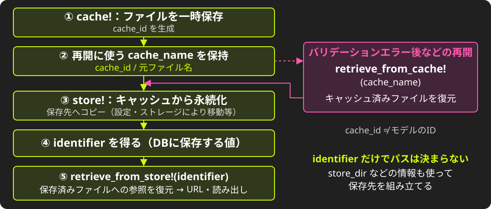
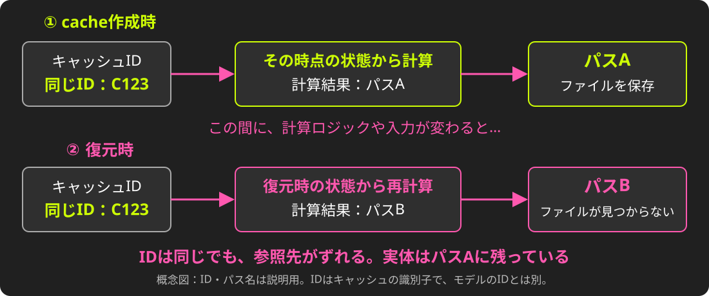
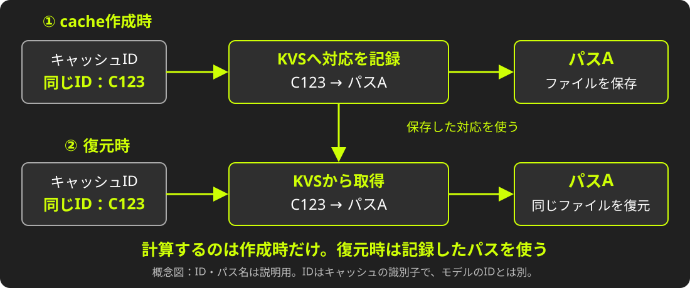

<!-- _class: cover -->
<!-- _paginate: false -->

<!--
叩き台（outline.md ベース）。index.md（英語版）はまだ旧構成のまま。
📊 = 公開前に数字を検証 / ❓ = 未決
-->

---

<!-- _class: title -->
<!-- _paginate: false -->

# Zen and the Art of<br><strong style='color: var(--kor-magenta);'>File Upload</strong> Maintenance

## An Inquiry into Legacies

<i>Presentation by Uchio Kondo</i>

---

# 自己紹介

- 近藤うちお / @udzura
- 株式会社SmartHR
  - 技術基盤部所属
  - 好きなRustの型は `Cell<T>`
- Fukuoka.rb / Fukuoka.wasm

---

<!-- _class: section -->

# 0. 始まり<br>（あなたのWeb開発の）

---

<!-- _class: body -->

- 200X年、あなたは初めてのブログアプリをRailsで開発した。
- タイトルと本文が画面に出た。

---

<!-- _class: body -->

- 次にやりたいことは...？

---

<!-- _class: body -->

- そう、**ファイルアップロード**の実装。

---

<!-- _class: section-plain -->

# 今日はファイルアップロードについて語ろう

---

<!-- _class: section -->

# 1. Railsと<br>ファイルアップロード

---

# ファイルアップロード、知ってる？

- Webサービスの最も基本的な要件の一つ
- 今のRailsには **ActiveStorage** がある
    - Rails 5.2（2018年）で登場

---

# B.A. (Before ActiveStorage)

- それ以前、ファイルに関する「Rail」は敷設されていなかった
- 群雄割拠のgemたち
    - attachment_fu
    - Paperclip（2018年に非推奨化）
    - **CarrierWave** / Dragonfly / Refile
    - Shrine

<!-- 当時CarrierWaveを選ぶのは妥当な判断だった、という前振り。誰かを責める話ではない。 -->

---

<!-- _class: section -->

# 2. SmartHRの事情

---

# それが作られた時代

- SmartHRのアプリケーションは2015年2月にファーストコミット
- ActiveStorage以前の世界

---

# 余談: 一度移行している

- 最初は **Paperclip** を使っていた
- 2017年5月にCarrierWaveへ移行
    - Paperclipのファイルも参照できるようにしつつ
- 2017年11月にPaperclipを削除

<!-- 「ライブラリの移行は初めてではない。でも当時は、モデルもファイルもずっと少なかった」 -->

---

# それから9年

- 📊 Uploaderクラス: 32
- 📊 `mount_uploader`: 87箇所
- 📊 1モデルに最大8個の画像
- そして、CarrierWaveのバージョンは低いまま

---

# バイテンポラルデータモデル

<div style="position: absolute; top: 160px; left: 90px; width: 1100px;">

</div>

<!-- 日付は説明用。期間は開始を含み終了を含まない [from, to)。
行Aのtransaction_toを更新時刻で閉じ、行B・Cを追加する。旧行を削除して2行にするわけではない。
参考: https://github.com/kufu/activerecord-bitemporal -->

---

# バイテンポラルとファイルの困り事 (1)

- データが消えないなら、ファイルも消えてはいけない
    - CarrierWaveの「削除時にファイルを消す」挙動を抑える必要がある

---

# バイテンポラルとファイルの困り事 (2)

- 履歴分割のたびに、同じファイルを持つ行が複製される
    - 実装的には「前の履歴」の値コピーだが、副作用で...
    - 不幸な組み合わせで、アップロードが再度走ることも

---

# レガシーの匂い

- 自分たちのやりたいことと、gemの前提が少しずつずれてきた
- 症状を並べてみると...

---

# 症状

- パスの計算ロジックが複雑化し、何度も壊れた
- サイズ違い画像（`version`）を同期的に生成している
- アップロード時にEXIFを同期処理している
- 履歴分割と組み合わさって、1回のupdateで大量のアップロードが走る
- 仕様の複雑さのあまり、影響が読めず更新できない

---

<!-- _class: section-plain -->

# それらが複雑に絡み合って、<br>「CarrierWaveがつらい」という塊になった

---

<!-- _class: section -->

# 3. 課題を分割する

---

# 塊のままでは動けない

- 「CarrierWaveをやめよう」は大きすぎて、誰も着手できない
- そこで、課題を **性質で** 分けることにした

---

# 3つの課題

| | 課題 | 備考 |
|---|---|---|
| ① | 障害が起きやすい（パスが不安定） | 信頼に関わる。<strong>まずはこれをなんとかしたい</strong> |
| ② | バージョンアップができていない | 何があるか分からず、将来の足かせ |
| ③ | パフォーマンス・生産性の問題 | ユーザとしては不満点。中長期でなんとかしたい |

<!-- ①②③は課題の番号。計画・設計で全体像を示し、実践・結果は①に絞る。 -->

---

# 一番大事なのは、障害をなくすこと

- 人事労務のファイルは「消えてはいけないもの」
    - 本人確認書類、各種証明書...
- 見えない・壊れるは、そのまま信頼を失うこと
- そして、パスが不安定なままでは **更新も移行もできない**

---

# 順番

1. ① 障害をなくす → **止血であり、土台** 最初に行う
2. ② バージョンアップの障壁をなくす準備
3. ③ 重い処理を切り離し、性能・生産性の改善につなげる

---

<!-- _class: section -->

# 4. 計画・設計<br>① パスを固定する

---

# まず前提: CarrierWaveのライフサイクル

<div style="position: absolute; top: 155px; left: 90px; width: 1100px;">

</div>

<!-- 概念図。cache_name = cache_id / original_filename。モデルのIDとは別。
identifierは保存先の識別子で、ランダムなIDを新規発行する意味ではない。
retrieve_from_store!は参照を復元する処理で、常に画像の全バイトを取得するわけではない。
参考: https://github.com/carrierwaveuploader/carrierwave/tree/master/lib/carrierwave/uploader -->

---

# カラムに入っているのは何か

- DBのカラムに保存されるのは **ファイル名（identifier）だけ**
- パスは、**読むたびに** その時点のモデルの状態から計算される

```ruby
def store_dir
  "uploads/#{model.tenant_id}/#{model.class.table_name}/#{mounted_as}/#{model.id}"
end
```

<!-- コードは抽象化したもの -->

---

# なぜ壊れるのか

- パスの計算が、テナント・テーブル・idなどモデルの状態に依存する
- ファイル名にも、更新日時を混ぜたハッシュが入る
- Uploaderのサブクラスごとにパス計算を上書きしている
- バイテンポラルでは、基準になるidそのものが揺れる

---

# どうしてこうなった

- おそらく、パスに以下の2つの性質を持たせたかったのだろう...
    - 難推測性: 本人のファイルを、他人が容易に推測できないこと
    - 衝突安全性: 他のファイルとパスが衝突しないこと

---

# 時刻によるif文

```ruby
def store_dir
  if after_hotfix?   # 更新日時がある日付以降か
    new_store_dir
  else
    legacy_store_dir # 過去のファイルのために残す
  end
end
```

- ロジックを直したくても、過去のファイルは過去のロジックで計算されたパスを持つ

---

# 何が起きたか

- ロジックを少し変えただけで、過去のファイルが参照できなくなる
    - 実装が複雑で、影響が読みきれない
- インシデントにも繋がっていた

<!-- 🔒 ❓ インシデント概要をぼかして1〜2例入れるかも -->

---

<!-- _class: section-plain -->

# パス計算のコードは、<br>過去のファイルを人質に取られていた

---

# 固定する、という発想

- パスを「毎回計算するもの」から「保存時に決めて記録するもの」へ
- 固定するタイミングは2つ
    1. cache_path の固定
    2. store_path の固定

---

# パス固定のメリットは？

- モデルの状態が変わっても、**同じファイルを参照できる**
- 過去のファイルの場所を変えずに、**パス計算のロジックを直せる**
- パスがアプリの持つデータになり、**ライブラリの更新・移行の土台になる**

---

<!-- _class: section -->

# 5. 計画・設計<br>② 依存を減らす

---

# 依存の2つの形

- **内部挙動への依存**: アプリが「Uploaderがある」前提で書かれている
- **暗黙の仕様**: Uploaderが「ついでに」やっている処理
    - サイズ違い画像の生成
    - EXIFの回転・除去
    - 削除の抑止

---

# 内部挙動への依存

- 📊 アプリ本体に、CarrierWave依存の呼び出しが **300箇所近く**

```ruby
user.avatar.present?          # 実は Uploader#blank? の意味
user.avatar.expiring_url(:large)  # version があることが前提
record.remove_document!       # mount が生やすメソッド
```

---

# c.f. パス固定による依存軽減

- パスを「CarrierWaveが毎回計算するもの」から「アプリが持つデータ」へ
    - パス固定の結果、複雑性が減り、依存を減らす土台に
- 止血対応を、そのまま未来の準備につなげる

---

# 互換レイヤ `CarrierWaveCompatLayer`

- CarrierWaveへの呼び出しを、一つのモジュールに集めたい
- まずは **挙動を一切変えずに** 切り出す

```ruby
user.avatar.present?            # before
CarrierWaveCompatLayer.attached?(user, :avatar)  # after（❓ API案）
```

---

# 依存を切り出せるか？

- 依存箇所はAIと静的検査で洗い出せないか
    - grep などが初手になるかもしれないが...
- 将来は Cop などで呼び出しを禁止できる

---

<!-- _class: section -->

# 6. 計画・設計<br>③ 暗黙の仕様を外部サービス化

---

# 画像の「前処理」が非常に多い

- 表示用途に合わせたサイズ違い画像（`version`）の生成
- EXIFの向き情報に基づく回転
- EXIF情報（住所など）の除去
    - これらがアップロード時に**同期で**走り、保存完了までの待ち時間になる

---

# 同期処理を切り出したい

- サイズ違い画像は、別サービスでオンデマンドに生成するとどうか？
- → 同期処理から、version生成とEXIF処理を外すことができる
- 別サービスの内容はCDNに載せキャッシュすれば、負荷の懸念も小さい

---

# 同時に検討すべきこと

- **原則、originalは直接参照しない**
    - 回転、EXIFの除去を行なった後のものを生成して返せる
    - 念のため、originalのEXIFを少しずつ消すジョブも必要かも

---

# 副産物: 性能の改善

- 同期で走っていた処理がなくなれば速くなるのも嬉しい
- TBA: 簡単な計測結果

---

# 複雑性を低減したい話

- ここまでの、互換レイヤ、外部サービス化の導入により
    - CarrierWaveへの直接依存を減らす
    - 画像に関する実装をシンプルに、影響を限定的にする
- （パス固定も副次的に複雑性低減に寄与）


---

# 複雑性の削減のために目指す姿

<div style="position: absolute; top: 160px; left: 90px; width: 1100px;">

</div>

<!-- 計画段階の責務・依存関係の図。矢印は画像データの転送経路ではない。
Uploaderの仕事を「決まったパスにバイト列を置く」ことへ絞り、画像処理を分離する。 -->

---

<!-- _class: section-plain -->

# シンプルにする → 更新も移行もしやすくなる

---

# 計画のまとめ

| | 方針 | 現在地 |
|---|---|---|
| ① | パスを固定して障害を減らす | 実践と結果をこのあと紹介 |
| ② | 依存を減らして移行に備える | 計画・設計・検証 |
| ③ | 重い処理を切り離す | 計画・設計・検証 |

---

# ここからは『実践　パス固定』の話

---

<!-- _class: section -->

# 7. パス固定移行の実践と結果

---

# cache_path の固定

- cacheしてからstoreするまでの間に、cache pathの計算結果が変わる
- 📊 これだけで **年に5〜6件** の障害
- 対策: cache時のパスを保存し、取り出すときは再計算しない

---

# 変更以前

<div style="position: absolute; top: 160px; left: 90px; width: 1100px;">

</div>

<!--
- ID発行されるのに、retrieveで複雑な計算があった
- ID発行の前後でそのロジックが変わると...
- ID → cache_path は一意に引けないとダメでは？
-->

---

# 変更以後

<div style="position: absolute; top: 160px; left: 90px; width: 1100px;">

</div>

<!--
- cache作成のタイミングで、ID → cache_pathをKVSに保持
    - 取り出すときは再計算せず、KVSから取得
- シンプルに！
-->

---

# cache_path 固定の結果

- 📊 改善第一弾として2025年末に完了
- cache_path起因の障害は **ゼロ** になった
- 残っているのは、store_path起因のものだけ

---

# store_path の固定

- 保存時のパスを保存する専用のカラムを導入
    - 読むときはそのカラムを優先、なければ従来どおり計算
    - 既存データはバックフィル
- 1つのUploaderから始めて、順次広げる

---

# TODO: 実装の簡易コード

---

<!-- _class: section-plain -->

# 気をつけたこと 1:<br>戻せる設計

---

<!-- _class: scrim -->

# write / read の2フェーズフラグ

| ステップ | write | read | 備考 |
|---|---|---|---|
| 1 | 一部ON | OFF | 一部テナントでdouble write。参照は従来どおり |
| 2 | 全体ON | OFF | 全体でdouble write。参照は従来どおり |
| 3 | 全体ON | 一部ON | 一部テナントでdouble writeした固定パスによる参照を開始 |
| 4 | 全体ON | 全体ON | 全体で固定パスによる参照へ切り替え |

---

# Flipper の活用

- Flipperでwrite/readフラグを制御し、段階的に移行を進める
    - 対象テナントを絞り込んでの公開
    - オンラインでの切り戻し

---

# 戻せる設計の重要性

- 戻すときは逆順に
    - どの段階でも必ず一つ前に戻せる設計を保つ
- 戻せるように、既存ロジックと関係ないカラムを新設した
    - db migration追加の手間より安全を優先
- QAの中でも、**「いざという時戻しても問題ないか」**を確認する

---

# 影響をコントロールする

- 影響の大きい変更の全てを読み切るのは難しい
- 最後は、少しずつ展開して様子を観察するしかない
    - そして何かあった時に安全に切り戻す
    - **安全に失敗する** 重要性

---

<!-- _class: section-plain -->

# 気をつけたこと 2:<br>QAの徹底とAI駆動

---

# 問い

- 内部的に、パスの決め方を変えた
- **ユーザーから見て何も変わっていない** ことを、どう確かめる？
- 経路は画面・API・申請・下書き... フラグの状態 × 経路で、組み合わせは膨大

---

# Step 1: ユーザーストーリーを書く

- 重要な利用経路（CUJ）を「〇〇として、△△できる」の形で抜き出す
- 人が書くのは、前提と「操作 / 期待値」の表だけ

| 操作 | 期待値 |
|---|---|
| 編集画面でプロフィール画像を登録する | 登録に成功する |
| 詳細画面を表示する | 画像が表示され、230×230px である |

<!-- 前提: ログインユーザー、対象データ、フラグの状態（write ON / read OFF など） -->

---

# Step 2: AIがシナリオにして、実行する

```
ストーリー（人間向け）
  ↓ AI が構造化     scenario.yml   曖昧なら推測せず止まる
  ↓ 別のAIが実行    ブラウザ操作・DOM・通信ログ・スクショ
  ↓                observation.yml   事実だけ。判定はしない
```

- 実行役のAIは、アプリのリポジトリで `claude -p` として起動
- やり取りはファイルとスキーマだけ

---

# Step 3: AIがレポートする

- 判定役のAIが、観測結果と期待値を照合
    - PASS / FAIL / ERROR / NEEDS_REVIEW
    - すべてのステップに **判定の根拠** を書く
- レポートと証跡をDraft PRにまとめる
- 人はPRで証跡をレビューし、記録として残す

---

# レポートの例

| STEP | 操作 | 判定 | 根拠 |
|---|---|---|---|
| 01 | 画像を登録する | PASS | POSTが302、リダイレクト先が200 |
| 02 | 詳細画面を開く | PASS | 登録した画像が230×230で表示 |

- 判定に影響しない気づきは「警告」欄に残る

<!-- ❓ 実物のスクショ（ぼかし）に差し替える -->
<!-- ❓ 「レポート自体をAIに精査させる」構想を、開発にフィードバックして検討中。進めば一言触れる -->

---

# 工夫ポイント

- 手順の微調整も記録に残す
    - スキルの中で質問の記録もさせるようにし、QAプロセスの正当性を確認できるようにした
- 「人の最終確認」をPRに押し込める
    - いつものレビュー風に最終確認
- 結果の一覧性を高める
    - Github PagesにQA結果を一覧化して公開

---

<!-- _class: section-plain -->

# 影響が大きいからこそ、AIに頼る

---

<!-- _class: section -->

# 8. 次につなげる

---

# 依存減らしの今後

- 互換レイヤの導入計画
    - モジュラモノリスの分析に使ったツールなどを、活用できないか検討中
- 画像のリサイズやEXIF処理を、外部サービスに切り出す計画
    - 現在、**PoCを開発中**
    - まずは実現性を確かめる

---

# その先は、リプレースか、更新か

- CarrierWaveをリプレースするか、使い続けて更新するかは、まだ迷っている
- 短期的には、**最新バージョンへのキャッチアップ**が現実的かもしれない
- どちらを選ぶにしても、依存を減らしておくことは次につながる

---

# CarrierWaveをやめた先は？（あくまでも案）

- **ActiveStorage**: 1モデルに最大8個の添付。JOINが必要で、履歴とも相性が悪い
- **Shrine**: プラグインで疎結合なのは強い。ただしGCS対応はコミュニティgemで、結局たくさん内製することになる
- **内製**: 履歴との絡みとAIの普及を考えると、捨てきれない

---

# その先でやりたいこと

- リプレースした上で、[HotCell](https://github.com/basecamp/hotcell) のような機構も導入したい
    - 信頼できないファイルの処理を、権限を絞った別コンテナに隔離する仕組み
- 処理の置き場所も選べるように、今から **疎結合化** を進めたい

<!-- HotCellそのものの採用を決めたわけではなく、処理を隔離する機構への個人的な展望。 -->

---

<!-- _class: section -->

# 9. まとめ

---

# 苦労しているすべてのRails開発者へ

1. 課題は **性質で** 分割する
2. **障害をなくす** ことを最優先に。それが次の一手の土台になる
3. **戻せる設計** と、厚い検証。AIは検証側にも使う
4. 挙動を変えずに **境界を切る** と、「置き換え」という選択肢が生まれる

---

<!-- _class: quote -->

# “The real cycle you’re working on is a cycle called yourself.”

## Robert M. Pirsig, <i>Zen and the Art of Motorcycle Maintenance</i>

<!-- 試訳: あなたが本当に整備しているのは、「あなた自身」という名のオートバイだ。
ライブラリの整備は、チームの設計判断やQAの文化を整えることでもあった、と回収する。 -->


---

<!-- _class: title -->
<!-- _paginate: false -->

# Thank you!

## TBA: 連絡先・資料URL
