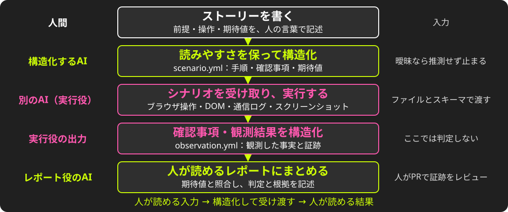
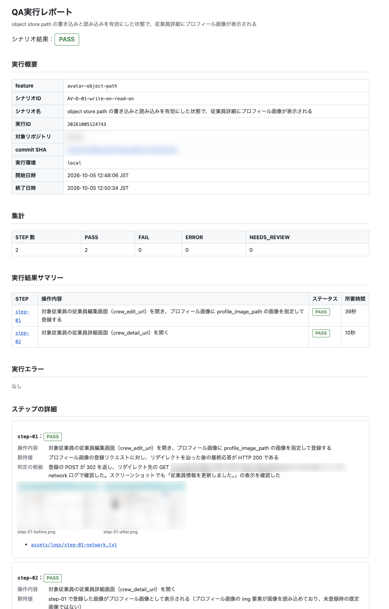
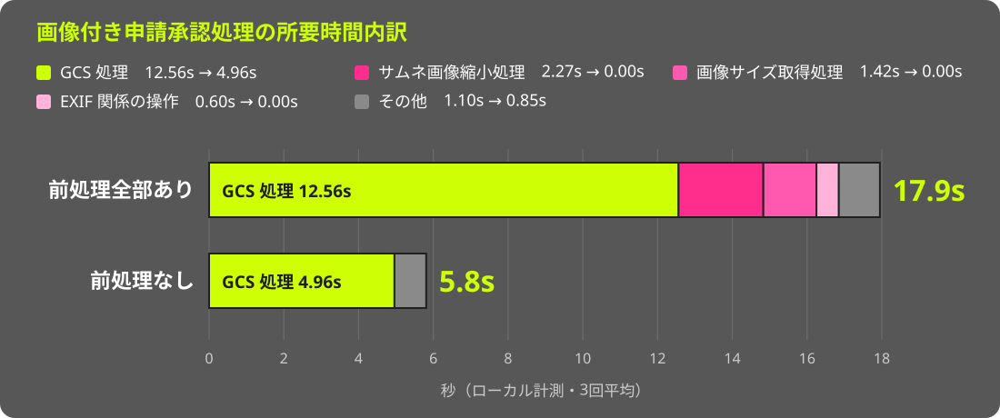

<!-- _class: cover -->
<!-- _paginate: false -->

<!--
構成: 課題を分割 → 信頼性の改善に絞る → パスの決まり方 → cache_path固定の実績 → store_path固定の実践 → 今後の展望 → まとめ
❓ = 未決
-->

---

<!-- _class: title -->
<!-- _paginate: false -->

# Zen and the Art of<br>File Upload Maintenance

## An Inquiry into Legacies

<i>Presentation by Uchio Kondo</i>

---

<!-- _class: section -->

# 0. 始まり<br>（あなたのWeb開発の）

---

<!-- _class: body -->

- 200X年を思い出して。
- 初めてのブログアプリを、Railsのscaffoldで作った。
- タイトルと本文が画面に出た。

---

<!-- _class: body -->

- 次にやりたいことは...？

---

<!-- _class: body -->

- そう、**ファイルアップロード**の実装。

---

<!-- _class: section-plain -->

# 今日は _ファイルアップロード_ について語ろう

---

<style scoped>
section { padding-right: 510px; }
.profile-photo {
  position: absolute;
  top: 230px;
  right: 140px;
  width: 300px;
  height: 300px;
  border-radius: 50%;
  object-fit: cover;
  border: 3px solid var(--kor-lime);
}
</style>

# 自己紹介

- 近藤うちお / @udzura
- 株式会社SmartHR
  - 技術基盤部所属
  - 好きなSmartHRの機能は発令管理
  - 好きなRustの型は `Cell<T>`
- Fukuoka.rb / Fukuoka.wasm


---

<!-- _class: section -->

# 1. Railsと<br>ファイルアップロード

---

# ファイルアップロード、知ってる？

- Webサービスの最も基本的な要件の一つ
- 今のRailsには **ActiveStorage** がある
    - Rails 5.2（2018年）で登場

---

# B.A. (Before ActiveStorage)

- それ以前、ファイルに関する「Rail」は敷設されていなかった
- 群雄割拠のgemたち
    - attachment_fu
    - Paperclip（2018年に非推奨化）
    - **CarrierWave** / Dragonfly / Refile
    - Shrine

<!-- 当時CarrierWaveを選ぶのは妥当な判断だった、という前振り。誰かを責める話ではない。 -->

---

<!-- _class: section -->

# 2. SmartHRの事情

---

# それが作られた時代

- SmartHRのアプリケーションは2015年2月にファーストコミット
- ActiveStorage以前の世界

---

# それから9年

- 一度Paperclipから移行しつつ、CarrierWaveを使い続けて9年
- Uploaderクラス: 32
- `mount_uploader`: 87箇所
- 1モデルに最大8個の画像
- そして、CarrierWaveのバージョンは低いまま

<!-- 移行の経緯: 2017年5月にPaperclipからCarrierWaveへ移行し、2017年11月にPaperclipを削除（質疑用） -->

---

# バイテンポラルデータモデル

<div style="position: absolute; top: 150px; left: 180px; width: 920px;">
<object type="image/svg+xml" data="assets/bitemporal-history.svg" width="920" height="385" aria-label="横軸はトランザクション時間、縦軸は有効時間。10/17に10/1からの所在地を修正し、旧記録を残してTokyoとHakataの2行を追加する。"></object>
</div>

<!-- _footer: 『[履歴 on Rails](https://kaigionrails.org/2025/talks/hypermkt/)』 (KoR 2025) も参照してください -->

<!-- 日付は説明用。期間は開始を含み終了を含まない [from, to)。
行Aのtransaction_toを更新時刻で閉じ、行B・Cを追加する。旧行を削除して2行にするわけではない。
参考: https://github.com/kufu/activerecord-bitemporal -->

---

# バイテンポラルとファイルの困り事 (1)

- データが消えないなら、ファイルも消えてはいけない
    - ところがCarrierWaveは、更新を「上書き」とみなして **前のファイルを消す**
    - この挙動を抑える必要がある

---

# バイテンポラルとファイルの困り事 (2)

- 履歴分割のたびに、同じファイルを持つ行が複製される
    - 実装的には「前の履歴」の値コピー
    - ところがCarrierWaveは、**値を代入しただけでアップロード（`cache!`）が走る**
    - 見えない副作用として、不要なアップロードが走ってしまう

---

# ダーティハックの積み重ね

- 相性の悪さを埋めるため、ダーティハックが積み重なっていった
- 症状を並べてみると...

---

# 症状

- パスの計算ロジックが複雑化し、何度も壊れた
    - 実際に、ファイルアップロード起因の障害が何度も起きていた
- サイズ違い画像（`version`）を同期的に生成している
- アップロード時にEXIFを同期処理している
- アップロードを制御できない（履歴分割で大量に走る）
- 画像の仕様が、CarrierWave側もSmartHR側も複雑で更新できない

---

<!-- _class: section-plain -->

# それらが複雑に絡み合って、<br>「CarrierWaveがつらい」という塊になった

---

<!-- _class: section -->

# 3. 課題を分割する

---

# 塊のままでは動けない

- 「CarrierWaveをやめよう」は大きすぎて、誰も着手できない
- そこで、課題を **性質で** 分けることにした

---

# 3つの課題

| 課題 | 関係する性質（-ility） |
|---|---|
| 障害が起きやすい（パスが不安定） | 信頼性（Reliability） |
| バージョンアップができていない | 保守性・セキュリティ（Maintainability / Security） |
| パフォーマンス・生産性の問題 | 利用容易性（Usability） |

<!-- この後は信頼性改善の実践を中心に話し、保守性・セキュリティと利用容易性は「今後の展望」で扱う。 -->

---

# なぜ性質で分けるのか

- 性質ごとに見ると、**優先順位を付けられる**
- 性質に絞ることで、**問題のサイズが小さくなる**
    - 着手も検証もできる大きさになる

<!-- 利用容易性は利用者・開発者双方の使いやすさとして整理。性能そのものをUsabilityと同義にはせず、待ち時間が使いやすさに与える影響として扱う。 -->

---

# 一番大事なのは、障害をなくすこと

- 人事労務のファイルは「消えてはいけないもの」
    - 本人確認書類、各種証明書...
- パスのロジックは、普通の開発者の **認知負荷の限界** を超えている
    - うっかり壊す実装が入るのを、防ぐのが難しい
- セキュリティももちろん大事。でも **まずは信頼性** から

---

<!-- _class: section-plain -->

# まずは信頼性を改善する

---

<!-- _class: section -->

# 4. 障害の原因は<br>パスの決まり方にある

---

# CarrierWave：書き込み

<div style="position: absolute; top: 155px; left: 90px; width: 1100px;">
<object type="image/svg+xml" data="assets/carrierwave-lifecycle-write.svg" width="1100" height="470" aria-label="cache!で一時保存し、cache_nameを保持。store!で画像を永続化し、identifierをDBに保存する。保存再開時はretrieve_from_cache!でキャッシュから復元する。"></object>
</div>

<!-- cache_name = cache_id / original_filename。モデルのIDとは別。
画像の永続化とidentifierのDB保存は役割を示した概念図で、厳密なコールバック順序ではない。 -->

---

# CarrierWave：読み出し・参照

<div style="position: absolute; top: 155px; left: 90px; width: 1100px;">
<object type="image/svg+xml" data="assets/carrierwave-lifecycle-read.svg" width="1100" height="470" aria-label="DBからidentifierを読み出し、retrieve_from_store!へ渡す。store_dirなどの情報と合わせてパスを計算し、保存済み画像への参照を復元する。"></object>
</div>

<!-- identifierはランダムなIDを新規発行する意味ではない。
retrieve_from_store!は参照の復元で、常に画像の全バイトを取得するわけではない。
参考: https://github.com/carrierwaveuploader/carrierwave/tree/master/lib/carrierwave/uploader -->

---

# cache_path と store_path

- **cache_path**: storeするまでの一時置き場
    - バリデーションエラーでフォームが戻っても、再アップロードせずに再開できる
- **store_path**: 永続化された、本来の保存先

---

# パスは「メソッド」で決まる

- `cache_path` / `store_path` は、**保存先の文字列を組み立てるメソッド**
- 開発者はこれらや `cache_dir` / `store_dir` などを上書きし、ルールを変えられる
- 自由に変えられる一方、**過去のファイルの場所も再現し続ける必要がある**
    - 例外や古いルールを捨てられず、負債として積み重なる

---

# パスはモデルの状態から計算される

- テナントのID、テーブル名などを組み合わせてパスを作る
- 固定で持つのではなく、**その都度** モデルの状態から計算される

```ruby
def store_dir
  "uploads/#{model.tenant_id}/#{model.class.table_name}/#{mounted_as}/#{model.id}"
end
```

<!-- コードは抽象化したもの -->

---

# なぜ壊れるのか

- ファイルと関係ないところでモデルの状態が変わっても、**参照できなくなる**
- Uploaderはただの Ruby のクラス
    - サブクラスで、都合に合わせてパス計算を変えられてしまう
    - 全体を考えずに変える人が出ると、大変なことになる

---

# どうしてこうなった

- おそらく、パスに以下の2つの性質を持たせたかったのだろう...
    - 非推測性: 本人のファイルを、他人が容易に推測できないこと
    - 非衝突性: 他のファイルとパスが衝突しないこと
- ただ、ちょっとやりすぎて、運用が難しくなっている

---

# 複雑さゆえに: 時刻によるif文

```ruby
def store_dir
  if after_hotfix?   # 更新日時がある日付以降か
    new_store_dir
  else
    legacy_store_dir # 過去のファイルのために残す
  end
end
```

- パスをスナップショットとして持たないので、**ロジックを変えられない**

<!-- 振り分けの基準は created_at ではなく「更新日時」。話すときも更新日時と言う。 -->

---

# 結局何に困っているか

- ロジックを少し変えただけで、過去のファイルが参照できなくなる
    - 実装が複雑で、影響が読みきれない
- インシデントにも繋がっていた
- しかもこれは、cache_path と store_path の **両方** で起きていた


---

<!-- _class: section-plain -->

# パス計算のコードは、<br>過去のファイルを人質に取られていた

---

<!-- _class: section-plain -->

# 1つのIDから、<br>パスは一意に決まるべき

---

# 固定する、という発想

- パスを「毎回計算するもの」から「保存時に決めて記録するもの」へ
- 固定するタイミングは2つ
    1. cache_path の固定
    2. store_path の固定
- 非衝突性・非推測性は、パスを決めるときに満たせばよい

---

# パス固定のメリットは？

- モデルの状態が変わっても、**同じファイルを参照できる**
- 過去のファイルの場所を変えずに、**パス計算のロジックを直せる**
- 何より **ロジックがシンプルになり**、ライブラリ更新時の互換性の考慮が小さくなる

---

<!-- _class: section -->

# 5. 実践:<br>cache_path の固定

---

# cache_path の固定

- cacheしてからstoreするまでの間に、cache pathの計算結果が変わる
    - 例: IDがある／ないでパスが変わる実装
- 年によっては、これだけで **4〜5件** の障害
- 対策: cache時のパスを保存し、取り出すときは再計算しない

---

# 変更以前

<div style="position: absolute; top: 160px; left: 90px; width: 1100px;">
<object type="image/svg+xml" data="assets/cache-path-before.svg" width="1100" height="460" aria-label="同じキャッシュIDでも、復元時の再計算結果が変わると実際の保存先とは別のパスを参照してしまう。"></object>
</div>

<!--
- ID発行されるのに、retrieveで複雑な計算があった
- ID発行の前後でそのロジックが変わると...
- ID → cache_path は一意に引けないとダメでは？
-->

---

# 変更以後

<div style="position: absolute; top: 160px; left: 90px; width: 1100px;">
<object type="image/svg+xml" data="assets/cache-path-after.svg" width="1100" height="460" aria-label="cache作成時にIDとパスの対応をRedisへ記録。復元時は再計算せず、Redisから同じパスを取得する。"></object>
</div>

<!--
- cache作成のタイミングで、ID → cache_pathをRedisに保持
    - 取り出すときは再計算せず、Redisから取得
- シンプルに！
- cache IDはフォームが持つので、提出している本人からは失われない。しかも本人しか知らないIDなので、鍵として安全
- 対応表はあくまでキャッシュなので、1〜2週間ほどで消える。1ヶ月後の再開は対象外（質疑用）
-->

---

# cache_path 固定の結果

- 改善第一弾として2025年末に完了
- cache_path起因の障害は **ゼロ** になった
- 残っているのは、store_path起因のものだけ

---

<!-- _class: section -->

# 6. 実践:<br>store_path 固定へのチャレンジ

---

# 次の山は store_path の固定

- identifierの形式を変える案もあったが、**専用のカラム** を導入する方針に
    - 読むときはそのカラムを優先、なければ従来どおり計算
    - 既存データはバックフィル。すべて埋まれば、フォールバックを消せる
- 問題の大きいUploaderから始めて、順次広げる

---

# 実装イメージ: 書き込み側

```ruby
class ApplicationUploader < CarrierWave::Uploader::Base
  after :store, :persist_object_store_path

  def persist_object_store_path(*)
    return if should_not_store_full_path?

    persisted_store_path = object_store_path_to_persist
    save_object_store_path(persisted_store_path)
    log_if_mismatch
  end
end
```

- store の直後に、パスを専用カラムへ記録する

<!-- hanicaのコードからポイントを絞り、若干改変したもの。should_not_store_full_path? が write フラグに相当。 -->

---

# 実装イメージ: 読み込み側

```ruby
class ApplicationUploader < CarrierWave::Uploader::Base
  def store_path(*args)
    calculated_store_path = super(*args)
    persisted_store_path = resolve_persisted_store_path
    log_if_mismatch
    return calculated_store_path if persisted_store_path.nil?
    use_persisted_store_path ? persisted_store_path : calculated_store_path
  end
end
```

- 記録がなければ、従来どおり計算したパスを使う
- 計算値と記録値の不一致は、ログで観測する

<!-- use_persisted_store_path が read フラグに相当。次の「戻せる設計」へのつなぎ。 -->

---

# cache と store では、影響の大きさが違う

- **cache** は消えていくもの
    - ある時点で間違っても、影響はやがて薄れる
- **store** はずっと残るもの
    - 不整合なデータが作られたら、残り続けて後始末が大変
- だからこそ、慎重に進めたい。考慮すべき点は...？

---

<!-- _class: section-plain -->

# 考慮点1: 戻せる設計

---

<!-- _class: scrim -->

# write / read の2フェーズフラグ

| ステップ | write | read | 備考 |
|---|---|---|---|
| 1 | <span style='color: var(--kor-lime);'>一部ON</span> | OFF | 一部テナントでdouble write。参照は従来どおり |
| 2 | _全体ON_ | OFF | 全体でdouble write。参照は従来どおり |
| 3 | _全体ON_ | <span style='color: var(--kor-lime);'>一部ON</span> | 一部テナントでdouble writeした固定パスによる参照を開始 |
| 4 | _全体ON_ | _全体ON_ | 全体で固定パスによる参照へ切り替え |

---

# Flipper の活用

- [Flipper](https://rubygems.org/gems/flipper)でwrite/readフラグを制御し、段階的に移行を進める
    - 対象テナントを絞り込んでの公開
    - オンラインでの切り戻し

---

# 戻せる設計の重要性

- 戻すときは逆順に
    - どの段階でも必ず一つ前に戻せる設計を保つ
- 戻せるように、既存ロジックと関係ないカラムを新設した
    - db migration追加の手間より安全を優先
- QAの中でも **「いざという時戻しても問題ないか」** を確認する
- 影響をコントロールしながら、**安全に失敗する**

---

<!-- _class: section-plain -->

# 考慮点2: AI駆動QA

---

# 問い

- 内部的には、パスの決め方を変えた
- **ユーザーから見て何も変わっていない** ことを、どう確かめる？
- 経路は画面・API・申請・下書き... フラグの状態 × 経路で、組み合わせは膨大

---

# Step 1: ユーザーストーリーを書く

- 重要な利用経路（CUJ）を、**AIと協業して**「〇〇として、△△できる」の形で抜き出す
- 人が把握するのは、前提と「操作 / 期待値」の表だけ

| 操作 | 期待値 |
|---|---|
| 編集画面でプロフィール画像を登録する | 登録に成功する |
| 詳細画面を表示する | 画像が表示され、230×230px である |

<!-- 前提: ログインユーザー、対象データ、フラグの状態（write ON / read OFF など） -->

---

# Step 2: AIがシナリオにして、実行する

<div style="position: absolute; top: 160px; left: 90px; width: 1100px;">
<object type="image/svg+xml" data="assets/ai-qa-flow.svg" width="1100" height="460" aria-label="人間のストーリーをAIが読みやすさを保って構造化し、別のAIが実行。確認事項と観測結果も構造化し、レポート役のAIが人の読める判定・根拠付きレポートにまとめる。"></object>
</div>

<!-- 構造化の形式はGherkinなどもあるが、今回は独自形式。
実行役のAIをAIの中で起動。やり取りはファイルとスキーマ。
図は次のStep 3まで含めた全体像。観測と判定を分け、人が最後に証跡をレビューする。 -->

---

# Step 3: AIがレポートする

- 判定役のAIが、観測結果と期待値を照合
    - PASS / FAIL / ERROR / NEEDS_REVIEW
    - すべてのステップに **判定の根拠** を書く
- レポートと証跡をPRにまとめる
- 人はPRで証跡をレビューし、最終承認する

---

<!-- _class: no-logo -->

<style scoped>
section { padding-right: 640px; }
.report-shot {
  position: absolute;
  top: 150px;
  right: 90px;
  width: 520px;
  height: 470px;
  object-fit: cover;
  object-position: top;
  border: 3px solid var(--kor-lime);
  border-radius: 8px;
  box-shadow: 0 0 24px rgba(0, 0, 0, .6);
  -webkit-mask-image: linear-gradient(to bottom, #000 80%, transparent);
  mask-image: linear-gradient(to bottom, #000 80%, transparent);
  transition: object-position 6s ease-in-out;
}
.report-shot:hover { object-position: bottom; }
</style>

# レポートの例

- 1回の実行 = 1つのレポート
- ステップごとに判定・根拠・証跡
    - 証跡はスクショやログ
- 判定外の気づきは「警告」欄へ



<!-- マウスを乗せると、レポートが下までゆっくりスクロールする（HTML表示のみ） -->

---

# 工夫ポイント

- **工程を細かく刻む**
    - 一種のコンパイラのように、構造化した中間データを挟む
    - AIに任せても、なるべく再現性が出るように
- 「人の最終確認」をPRに押し込め、人の負担を減らす
- 結果の一覧性を高める（GitHub PagesにQA結果を一覧化）

---

# 結果

- 30件ほどの大きめのストーリーを、**2日・ほぼ3人で** 一通り確認
- 自動テストも補強。既存のテストケースも大事にした
- 影響が大きい変更だからこそ、**たくさん試せる** ことに価値がある

---

<!-- _class: section-plain -->

# 影響が大きいからこそ、AIに頼る

---

# store_path 固定の現在地

- 一部の画像では、固定パスへ **完全に切り替わった**
- 同じ手法で、少しずつ全画像に広げていく

---

<!-- _class: section -->

# 7. 今後の展望

---

# 残りの課題と、現在地

| 改善する性質 | 現在地 |
|---|---|
| 信頼性 | cache_path固定完了、store_path固定は一部実施済み |
| 保守性・セキュリティ | 互換レイヤに向けて分析中 |
| 利用容易性 | 外部サービスのPoCを開発中 |

---

<!-- _class: section-plain -->

# 展望1: 互換レイヤで<br>CarrierWaveへの依存を分析する

---

# 依存の2つの形

- **内部挙動への依存**: アプリが「Uploaderがある」前提で書かれている
- **暗黙の前処理**: Uploaderが「ついでに」やっている処理
    - サイズ違い画像の生成
    - EXIFの回転・除去
    - 削除の抑止

---

# 内部挙動への依存

- アプリ本体に、CarrierWave依存の呼び出しが **300箇所近く**

```ruby
user.avatar.present?          # 実は Uploader#blank? の意味
user.avatar.expiring_url(:large)  # version があることが前提
record.remove_document!       # mount が生やすメソッド
```

---

# c.f. パス固定による依存軽減

- パスを「CarrierWaveが毎回計算するもの」から「アプリが持つデータ」へ
    - パス固定の結果、複雑性が減り、依存を減らす土台に
- 止血対応を、そのまま未来の準備につなげる

---

# 互換レイヤ `CarrierWaveCompatLayer`

- CarrierWaveの機能より一つ上の、**SmartHRが画像に求める機能** の層を切り出す
    - 例: URLを取得する、ファイルがあるかを確かめる
- **挙動を一切変えずに**、しかも **少しずつ** 切り出せるので進めやすい

```ruby
user.avatar.present?            # before
CarrierWaveCompatLayer.attached?(user, :avatar)  # after
```

---

# 依存を切り出せるか？

- どう切り出すかは、まだ検討中
- モジュラモノリス化で使った分析の手法が、使えるのではと考えている

---

<!-- _class: section-plain -->

# 展望2: 画像の前処理を<br>外部サービスへ切り出す

---

# 画像の「前処理」が非常に多い

- 表示用途に合わせたサイズ違い画像（`version`）の生成
- EXIFの向き情報に基づく回転
- EXIF情報（住所など）の除去
    - これらがアップロード時に**同期で**走り、保存完了までの待ち時間になる

---

# 同期処理を切り出したい

- サイズ違い画像は、別サービスでオンデマンドに生成するとどうか？
- → 同期処理から、version生成とEXIF処理を外すことができる
- 別サービスの内容はCDNに載せキャッシュすれば、負荷の懸念も小さい
- 画像変換サービス + CDN という構成は、実サービスでも多く採られている
    - Cookpad の [tofu](https://www.slideshare.net/slideshow/20111102-rails-meetuptofu/10084092) を始め、色々
    - [ImageFlux](https://imageflux.sakura.ad.jp/) 等専用サービスも

---

# 副産物: 性能の改善

- 同期で走っていた処理がなくなれば速くなるのも嬉しい
- 現在、**PoCを開発中**。まずは実現性を確かめる
- ローカルで簡単に計測してみると...

---

# ローカルでの簡単な計測

<div style="position: absolute; top: 160px; left: 90px; width: 1100px;">
<object type="image/svg+xml" data="assets/bench-preprocess.svg" width="1100" height="460" aria-label="前処理全部ありは17.9秒、前処理なしは5.8秒。差の大半はサムネ画像縮小・画像サイズ取得・EXIF処理と、GCS処理の減少。"></object>
</div>

<!-- 申請者による作成処理（create_by_applicant）での計測。GCSの往復回数も 39 → 15 回に減っている（質疑用） -->

---

# 計測から分かったこと

- ローカルなので **極端な例**（本番はもう少し速い）
- 時間の大半は **GCSの処理**
    - サムネ縮小・サイズ取得・EXIFの処理は、意外と小さい
- 前処理を全部なくすと、所要時間は **約1/3** に

---

# もう一つの性能改善: 再アップロードを防ぐ

- バイテンポラルデータモデル周辺の改善も **検討中**
- 履歴を複製するときに **「履歴複製中」のマーク** を付けたい
    - その間はアップロードを回避し、同じファイルを再アップロードしない
- フック内部へ状態を伝えるため、`CurrentAttributes` を使うことになりそう

---

<!-- _class: section-plain -->

# 展望3: 疎結合にした先で<br>やりたいこと

---

# 複雑性の削減のために目指す姿

<div style="position: absolute; top: 160px; left: 90px; width: 1100px;">
<object type="image/svg+xml" data="assets/upload-architecture.svg" width="1100" height="460" aria-label="アプリから二方向へ分岐。CarrierWaveの内部挙動に依存する処理は互換レイヤに集め、依存しない画像処理は外部サービスに任せる設計案。"></object>
</div>

<!-- 計画段階の責務・依存関係の図。矢印は画像データの転送経路ではない。
Uploaderの仕事を「決まったパスにバイト列を置く」ことへ絞り、画像処理を分離する。 -->

---

# その先は、リプレースか、更新か

- 最終的には、シンプルにして **更新も移行もしやすく** したい
- CarrierWaveをリプレースするか、使い続けて更新するかは検討段階
- 短期的には、**最新バージョンへのキャッチアップ**が現実的かもしれない
- どちらを選ぶにしても、依存を減らしておくことは次につながる

---

# CarrierWaveをやめた先は？（案）

- **ActiveStorage**: 厳しそう。1モデルに最大8個の添付で、JOINが必要、履歴とも相性が悪い
- **Shrine**: いい感じ。ただGCS対応はコミュニティgemで、結局いろいろ内製する手間は残る
- **内製**: 履歴との絡みとAIの普及を考えると、捨てきれない

---

# その先でやりたいこと

- リプレースにあたっては [HotCell](https://github.com/basecamp/hotcell) のような機構も導入したい
    - 信頼できないファイルの処理を、権限を絞った別コンテナに隔離する仕組み
    - ImageMagickなどを、Rails側（アプリ本体）に入れずに済む
    - ライブラリ自体の脆弱性からも本体を切り離せる
- 小さなものの組み合わせにする **疎結合化** が鍵

<!-- HotCellそのものの採用を決めたわけではなく、処理を隔離する機構への個人的な展望。 -->

---

<!-- _class: section -->

# 8. まとめ

---

# 苦労しているすべてのRails開発者へ

1. 課題は **性質で** 分割し、優先順位をつける
2. **戻せる設計** と、AIを使った **厚い検証** で、安全に失敗する
3. **小さなものの組み合わせ** に。境界をうまく切れるようにする

---

<!-- _class: quote -->

<style scoped>
h1 { top: 220px; font-size: 60px; line-height: 1.15; }
</style>

# “The real cycle you’re working on<br>is a cycle called <strong>yourself.</strong>”

## Robert M. Pirsig, <i>Zen and the Art of Motorcycle Maintenance</i>

<!-- 試訳: あなたが本当に整備しているのは、「あなた自身」という名のオートバイだ。
技術的負債や課題に向き合うことは、自分自身の成長やエンジニアリングの姿勢に向き合うことでもある、と回収する。 -->

---

<!-- _class: section-plain -->

# 課題に向き合って、<br>自分もユーザーもハッピーに


---

<!-- _class: title -->
<!-- _paginate: false -->

<style scoped>
h1 { top: 100px; }
h2 { top: 525px; }
</style>

# Thank you!

<a href="https://udzura.jp/slides/2026/kaigionrails" style="position: absolute; top: 230px; left: 532px; display: block; width: 216px; height: 216px;">

</a>

## [udzura.jp/slides/2026/kaigionrails](https://udzura.jp/slides/2026/kaigionrails)

---

<!-- _class: full -->
<!-- _paginate: false -->

<style scoped>
img { object-fit: contain; }
</style>


