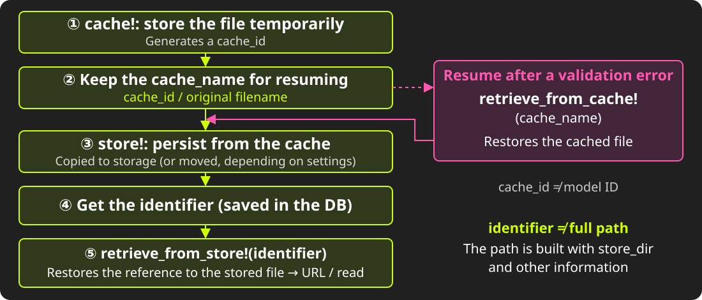

<!-- _class: cover -->
<!-- _paginate: false -->

<!--
English version of index.ja.md. The slide structure and layout directives match it one-to-one.
📊 = verify the number before publishing / ❓ = undecided
-->

---

<!-- _class: title -->
<!-- _paginate: false -->

# Zen and the Art of<br>File Upload Maintenance

## An Inquiry into Legacies

<i>Presentation by Uchio Kondo</i>

---

<!-- _class: section -->

# 0. The Beginning<br>(of Your Web Development)

---

<!-- _class: body -->

- Think back to 200X.
- You built your first blog app with Rails.
- The title and body showed up on the screen.

---

<!-- _class: body -->

- What do you want to build next...?

---

<!-- _class: body -->

- Yes, **file upload**.

---

<!-- _class: section-plain -->

# Let's talk about _file upload_ today.

---

<style scoped>
section { padding-right: 510px; }
.profile-photo {
  position: absolute;
  top: 230px;
  right: 140px;
  width: 300px;
  height: 300px;
  border-radius: 50%;
  object-fit: cover;
  border: 3px solid var(--kor-lime);
}
</style>

# About Me

- Uchio Kondo / @udzura
- SmartHR, Inc.
  - Technology Platform Division
  - Favorite SmartHR feature: Personnel Orders
  - Favorite Rust type: `Cell<T>`
- Fukuoka.rb / Fukuoka.wasm


---

<!-- _class: section -->

# 1. Rails and File Upload

---

# Do You Know File Upload?

- One of the most basic requirements of any web service
- Today, Rails has **ActiveStorage**
    - Introduced in Rails 5.2 (2018)

---

# B.A. (Before ActiveStorage)

- Before that, no "Rail" had been laid for handling files
- Many gems competed for the role
    - attachment_fu
    - Paperclip (deprecated in 2018)
    - **CarrierWave** / Dragonfly / Refile
    - Shrine

<!-- Set-up: choosing CarrierWave was a reasonable decision at the time. This talk does not blame anyone. -->

---

<!-- _class: section -->

# 2. The Situation at SmartHR

---

# When It Was Built

- SmartHR's application got its first commit in February 2015
- A world before ActiveStorage

---

# Side Note: We Have Migrated Once

- We first used **Paperclip**
- Migrated to CarrierWave in May 2017
    - While keeping existing Paperclip files accessible
- Removed Paperclip in November 2017

<!-- "This is not our first library migration. But back then, we had far fewer models and files." -->

---

# Nine Years Later

- 📊 Uploader classes: 32
- 📊 `mount_uploader` calls: 87
- 📊 Up to 8 images per model
- And CarrierWave is still on an old version

---

# Bitemporal Data Model

<div style="position: absolute; top: 160px; left: 90px; width: 1100px;">

</div>

<!-- The dates are for illustration. Periods are half-open [from, to).
Row A's transaction_to is closed at the update time, and rows B and C are added. The old row is not deleted and replaced with two rows.
Reference: https://github.com/kufu/activerecord-bitemporal -->

---

# Bitemporal Data and Files: Problem (1)

- If data never disappears, files must not disappear either
    - We need to suppress CarrierWave's "delete the file on destroy" behavior

---

# Bitemporal Data and Files: Problem (2)

- Each history split duplicates rows that hold the same file
    - In the implementation, it copies values from the previous history, but as a side effect...
    - In unlucky combinations, the upload runs again

---

# The Smell of Legacy

- Little by little, what we wanted to do drifted away from the gem's assumptions
- Let's list the symptoms...

---

# Symptoms

- Path calculation grew complex and broke many times
- Resized images (`version`) are generated synchronously
- EXIF data is processed synchronously on upload
- Combined with history splits, a single update triggers many uploads
- The specs are so complex that we cannot predict the impact of upgrades

---

<!-- _class: section-plain -->

# All of these tangled together into<br>one big lump: "CarrierWave is painful"

---

<!-- _class: section -->

# 3. Splitting the Problem

---

# A Lump Cannot Be Moved

- "Let's drop CarrierWave" is too big for anyone to start
- So we decided to split the problem **by its nature**

---

# Three Problems

| | Problem | Notes |
|---|---|---|
| ① | Prone to incidents (unstable paths) | Affects trust. <strong>We want to fix this first</strong> |
| ② | Cannot upgrade | Unknown risks; holds us back in the future |
| ③ | Performance and productivity | Frustrating for users. To be fixed in the mid to long term |

<!-- ①②③ are problem numbers. The plan and design show the whole picture; the practice and results focus on ①. -->

---

# Most Important: Eliminating Incidents

- HR and payroll files "must never disappear"
    - Identity documents, certificates...
- Missing or broken files directly cost us trust
- And with unstable paths, **we can neither upgrade nor migrate**

---

# The Order

1. ① Eliminate incidents → **stop the bleeding and build the foundation** first
2. ② Prepare to remove the barriers to upgrading
3. ③ Separate heavy processing to improve performance and productivity

---

<!-- _class: section -->

# 4. Plan and Design<br>① Fixing the Paths

---

# First, the Basics: CarrierWave's Lifecycle

<div style="position: absolute; top: 155px; left: 90px; width: 1100px;">

</div>

<!-- A conceptual diagram. cache_name = cache_id / original_filename, which is different from the model's ID.
The identifier identifies the storage location; it does not mean a newly issued random ID.
retrieve_from_store! restores the reference; it does not always fetch all the bytes of the image.
Reference: https://github.com/carrierwaveuploader/carrierwave/tree/master/lib/carrierwave/uploader -->

---

# What Is Stored in the Column?

- The DB column stores **only the file name (identifier)**
- The path is calculated **every time it is read**, from the model's current state

```ruby
def store_dir
  "uploads/#{model.tenant_id}/#{model.class.table_name}/#{mounted_as}/#{model.id}"
end
```

<!-- The code is simplified. -->

---

# Why Does It Break?

- Path calculation depends on model state: tenant, table, ID, and so on
- The file name also contains a hash mixed with the update time
- Each Uploader subclass overrides the path calculation
- In a bitemporal model, even the base ID itself can change

---

# How Did We Get Here?

- Most likely, we wanted the path to have two properties...
    - Unguessability: others cannot easily guess the path to a person's file
    - Collision safety: the path never collides with another file's path

---

# An `if` Statement Based on Time

```ruby
def store_dir
  if after_hotfix?   # Was it updated after a certain date?
    new_store_dir
  else
    legacy_store_dir # Kept for older files
  end
end
```

- Even if we fix the logic, older files keep paths calculated by the older logic

---

# What Happened

- A small change to the logic could make older files unreachable
    - The implementation is complex, so we cannot fully predict the impact
- This also led to incidents

<!-- 🔒 ❓ Maybe add one or two vague incident summaries -->

---

<!-- _class: section-plain -->

# The path calculation code was<br>held hostage by older files

---

# The Idea: Fix the Path

- From "calculated every time" to "decided and recorded at save time"
- There are two points to fix it
    1. Fixing the cache_path
    2. Fixing the store_path

---

# What Do We Gain?

- **The same file stays reachable**, even when the model's state changes
- **We can fix the path logic** without moving older files
- The path becomes data owned by the app, **a foundation for upgrades and migration**

---

<!-- _class: section -->

# 5. Plan and Design<br>② Reducing Dependencies

---

# Two Kinds of Dependency

- **Dependency on internal behavior**: the app is written assuming "an Uploader exists"
- **Implicit specs**: what the Uploader does "along the way"
    - Generating resized images
    - Rotating images and removing EXIF data
    - Preventing deletion

---

# Dependency on Internal Behavior

- 📊 **Nearly 300 call sites** in the app depend on CarrierWave

```ruby
user.avatar.present?          # Actually means Uploader#blank?
user.avatar.expiring_url(:large)  # Assumes the version exists
record.remove_document!       # A method added by mount
```

---

# c.f. Fixed Paths Reduce Dependency

- From "calculated by CarrierWave every time" to "data owned by the app"
    - Fixing paths reduces complexity and prepares us to reduce dependencies
- Our bleeding-stopping work directly prepares us for the future

---

# Compatibility Layer: `CarrierWaveCompatLayer`

- We want to gather all calls to CarrierWave into one module
- First, extract them **without changing any behavior**

```ruby
user.avatar.present?            # before
CarrierWaveCompatLayer.attached?(user, :avatar)  # after (❓ API draft)
```

---

# Can We Extract the Dependencies?

- Could AI and static analysis find all the dependent call sites?
    - grep may be the first step, but...
- In the future, a cop could forbid direct calls

---

<!-- _class: section -->

# 6. Plan and Design<br>③ Offloading Implicit Specs

---

# Too Much Image "Preprocessing"

- Generating resized images (`version`) for each display purpose
- Rotating images based on EXIF orientation
- Removing EXIF data (such as addresses)
    - All of this runs **synchronously** on upload and adds to the wait until saving completes

---

# Let's Move the Synchronous Work Out

- What if a separate service generated resized images on demand?
- → We can remove version generation and EXIF processing from the synchronous path
- With the service's output cached on a CDN, the load should not be a big concern

---

# What to Consider Alongside

- **As a rule, never reference the original directly**
    - The service can generate and return images that are already rotated and stripped of EXIF
    - We may also need a job that gradually removes EXIF data from originals, just in case

---

# A By-product: Better Performance

- Removing the synchronous work should also make things faster, which is nice
- TBA: simple benchmark results

---

# Reducing Complexity

- With the compatibility layer and the external service
    - We reduce direct dependencies on CarrierWave
    - We keep image-related code simple and limit the impact of changes
- (Fixing paths also helps reduce complexity as a side effect)


---

# The Goal: Less Complexity

<div style="position: absolute; top: 160px; left: 90px; width: 1100px;">

</div>

<!-- A planning-stage diagram of responsibilities and dependencies. The arrows do not show how image data is transferred.
Narrow the Uploader's job down to "putting bytes at a fixed path," and separate image processing. -->

---

<!-- _class: section-plain -->

# Make it simple → easier to upgrade and migrate

---

# Summary of the Plan

| | Approach | Current status |
|---|---|---|
| ① | Fix paths to reduce incidents | **Practice and results follow** |
| ② | Reduce dependencies to prepare for migration | Planning, design, and validation |
| ③ | Separate heavy processing | Planning, design, and validation |

---

# Now, Let's Talk About "Path Fixing in Practice"

---

<!-- _class: section -->

# 7. Path Fixing:<br>Practice and Results

---

# Fixing the cache_path

- Between cache and store, the calculated cache path could change
- 📊 This alone caused **5–6 incidents a year**
- Fix: save the path at cache time, and never recalculate it when retrieving

---

# Before the Change

<div style="position: absolute; top: 160px; left: 90px; width: 1100px;">

</div>

<!--
- An ID is issued, yet retrieve involved a complex calculation
- If that logic changes between issuing the ID and retrieving...
- Shouldn't an ID map to exactly one cache_path?
-->

---

# After the Change

<div style="position: absolute; top: 160px; left: 90px; width: 1100px;">

</div>

<!--
- At cache creation, store ID → cache_path in a KVS
    - When retrieving, read it from the KVS instead of recalculating
- Simple!
-->

---

# Results of Fixing the cache_path

- 📊 Completed at the end of 2025 as our first improvement
- Incidents caused by the cache_path dropped to **zero**
- The only remaining ones are caused by the store_path

---

# The Next Challenge: Fixing the store_path

- Add a dedicated column to record the path at save time
    - When reading, prefer that column; otherwise, calculate as before
    - Backfill existing data
- Start with one Uploader, then expand step by step

---

# TODO: Simplified Implementation Code

---

# The store_path Fixing Project

- Unlike the cache, this data is permanent, so the impact is larger
- What should we keep in mind...?

---

<!-- _class: section-plain -->

# Consideration 1: Design for Rollback

---

<!-- _class: scrim -->

# Two-Phase Flags: write / read

| Step | write | read | Notes |
|---|---|---|---|
| 1 | <span style='color: var(--kor-lime);'>Partly ON</span> | OFF | Double write for some tenants. Reads work as before |
| 2 | _All ON_ | OFF | Double write for all tenants. Reads work as before |
| 3 | _All ON_ | <span style='color: var(--kor-lime);'>Partly ON</span> | Some tenants start reading from the fixed paths |
| 4 | _All ON_ | _All ON_ | All tenants read from the fixed paths |

---

# Using Flipper

- Control the write/read flags with Flipper to migrate step by step
    - Release to a limited set of tenants
    - Roll back online

---

# Why Rollback Matters

- Roll back in reverse order
    - At every stage, we keep the ability to go back one step
- To allow rollback, we added a new column unrelated to the existing logic
    - We chose safety over the extra effort of a DB migration
- In QA, we also check that **"rolling back in an emergency causes no problems"**

---

# Controlling the Impact

- It is hard to fully predict the impact of such a large change
- In the end, we can only roll out gradually and watch carefully
    - And roll back safely if something goes wrong
    - The importance of **failing safely**

---

<!-- _class: section-plain -->

# Consideration 2: AI-Driven QA

---

# The Question

- Internally, we changed how paths are decided
- How do we confirm that **nothing has changed from the user's point of view**?
- Screens, APIs, applications, drafts... flag states × paths means a huge number of combinations

---

# Step 1: Write User Stories

- Extract critical user journeys (CUJs) in the form "As X, I can do Y"
- Humans only write the preconditions and an "action / expected result" table

| Action | Expected result |
|---|---|
| Upload a profile image on the edit screen | The upload succeeds |
| Open the detail screen | The image is shown at 230×230 px |

<!-- Preconditions: the logged-in user, the target data, and the flag state (e.g., write ON / read OFF) -->

---

# Step 2: AI Builds and Runs Scenarios

<div style="position: absolute; top: 160px; left: 90px; width: 1100px;">

</div>

<!-- The executor AI is launched from within another AI. They communicate only through files and schemas.
The diagram shows the whole flow, including Step 3. Observation and judgment are separated, and a human reviews the evidence at the end. -->

---

# Step 3: AI Writes the Report

- A judging AI compares the observations with the expected results
    - PASS / FAIL / ERROR / NEEDS_REVIEW
    - Every step includes **the reason for its verdict**
- The report and evidence are bundled into a draft PR
- A human reviews the evidence in the PR and gives final approval

---

<!-- _class: scrim -->

# Example Report

- Findings that do not affect the verdict are kept in a "Warnings" section

| STEP | Action | Verdict | Reason |
|---|---|---|---|
| 01 | Upload an image | _PASS_ | POST returned 302; the redirect target returned 200 |
| 02 | Open the detail screen | _PASS_ | The uploaded image is shown at 230×230 |


<!-- ❓ Replace with a (blurred) screenshot of a real report -->
<!-- ❓ The idea of "having AI review the report itself" has been fed back to the dev team. Mention it briefly if it moves forward -->

---

# Tips That Worked

- Record even small adjustments to the procedure
    - The skill also records the questions it asked, so we can verify that the QA process was sound
- Put "the final human check" into a PR
    - The final check feels like a usual code review
- Make results easy to browse
    - QA results are listed and published on GitHub Pages

---

<!-- _class: section-plain -->

# Because the impact is large, we rely on AI

---

<!-- _class: section -->

# 8. What Comes Next

---

# Next Steps for Reducing Dependencies

- Plan to introduce the compatibility layer
    - We are considering reusing tools we built to analyze our modular monolith
- Plan to move image resizing and EXIF processing to an external service
    - **A PoC is under development**
    - First, we will check that it is feasible

---

# Beyond That: Replace or Upgrade?

- We have not yet decided whether to replace CarrierWave or keep upgrading it
- In the short term, **catching up to the latest version** may be realistic
- Either way, reducing dependencies will help with the next step

---

# After CarrierWave? (Just Ideas)

- **ActiveStorage**: up to 8 attachments per model. Requires JOINs and does not fit well with history
- **Shrine**: loosely coupled plugins are a strength. But GCS support comes from a community gem, so we would end up building a lot ourselves
- **In-house**: considering history and the rise of AI, we cannot rule it out

---

# What We Want to Do After That

- After replacing it, we would like to introduce a mechanism like [HotCell](https://github.com/basecamp/hotcell)
    - It isolates the processing of untrusted files in a separate container with limited privileges
- We want to **decouple** things now, so that we can choose where processing runs

<!-- We have not decided to adopt HotCell itself. This is a personal outlook on mechanisms for isolating processing. -->

---

<!-- _class: section -->

# 9. Conclusion

---

# To All Struggling Rails Developers

1. Split problems **by their nature**
2. Put **eliminating incidents** first. It becomes the foundation for the next step
3. **Design for rollback** and verify thoroughly. Use AI for verification, too
4. **Draw boundaries** without changing behavior, and "replacement" becomes an option

---

<!-- _class: quote -->

# “The real cycle you’re working on is a cycle<br>called yourself.”

## Robert M. Pirsig, <i>Zen and the Art of Motorcycle Maintenance</i>

<!-- Maintaining a library also meant maintaining our team's design decisions and QA culture. -->


---

<!-- _class: title -->
<!-- _paginate: false -->

<style scoped>
h1 { top: 100px; }
h2 { top: 525px; }
</style>

# Thank you!

<a href="https://udzura.jp/slides/2026/kaigionrails" style="position: absolute; top: 230px; left: 532px; display: block; width: 216px; height: 216px;">

</a>

## [udzura.jp/slides/2026/kaigionrails](https://udzura.jp/slides/2026/kaigionrails)

---

<!-- _class: full -->
<!-- _paginate: false -->

<style scoped>
img { object-fit: contain; }
</style>


