<style>
section.section-plain h1 {
  top: 50%;
  transform: translateY(-50%);
}
</style>

<!-- _class: cover -->
<!-- _paginate: false -->

<!--
English version of index.ja.md. Each slide keeps the Japanese text as a speaker note.
-->

---

<!-- _class: title -->
<!-- _paginate: false -->

# Zen and the Art of<br>File Upload Maintenance

## An Inquiry into Legacies

<i>Presentation by Uchio Kondo</i>

<!--
【日本語版】
Zen and the Art of File Upload Maintenance
An Inquiry into Legacies
Presentation by Uchio Kondo
-->

---

<!-- _class: section -->

# 0. Your First Web App

<!--
【日本語版】
0. 始まり （あなたのWeb開発の）
-->

---

<!-- _class: body -->

- Think back to 200X.
- You built your first blog app with Rails scaffold.
- The title and body showed up on the screen.

<!--
【日本語版】
- 200X年を思い出して。
- 初めてのブログアプリを、Railsのscaffoldで作った。
- タイトルと本文が画面に出た。
-->

---

<!-- _class: body -->

- What do you want to build next...?

<!--
【日本語版】
- 次にやりたいことは...？
-->

---

<!-- _class: body -->

- Yes, **file upload**.

<!--
【日本語版】
- そう、**ファイルアップロード**の実装。
-->

---

<!-- _class: section-plain -->

# Let's talk about _file upload_ today

<!--
【日本語版】
今日は _ファイルアップロード_ について語ろう
-->

---

<style scoped>
section { padding-right: 510px; }
.profile-photo {
  position: absolute;
  top: 230px;
  right: 140px;
  width: 300px;
  height: 300px;
  border-radius: 50%;
  object-fit: cover;
  border: 3px solid var(--kor-lime);
}
</style>

# About Me

- Uchio Kondo / @udzura
- SmartHR, Inc.
  - Technology Platform Division
  - Favorite SmartHR feature: Personnel Orders
  - Favorite Rust type: `Cell<T>`
- Fukuoka.rb / Fukuoka.wasm


<!--
【日本語版】
自己紹介
- 近藤うちお / @udzura
- 株式会社SmartHR
  - 技術基盤部所属
  - 好きなSmartHRの機能は発令管理
  - 好きなRustの型は `Cell`
- Fukuoka.rb / Fukuoka.wasm
-->

---

<!-- _class: section -->

# 1. Rails and File Upload

<!--
【日本語版】
1. Railsと ファイルアップロード
-->

---

# Do You Know File Upload?

- One of the most basic requirements of a web service
- Today, Rails has **ActiveStorage**
    - Introduced in Rails 5.2 (2018)

<!--
【日本語版】
ファイルアップロード、知ってる？
- Webサービスの最も基本的な要件の一つ
- 今のRailsには **ActiveStorage** がある
    - Rails 5.2（2018年）で登場
-->

---

# B.A. (Before ActiveStorage)

- Before that, no "Rail" was laid for files
- Many gems competed
    - attachment_fu
    - Paperclip (deprecated in 2018)
    - **CarrierWave** / Dragonfly / Refile
    - Shrine

<!--
【日本語版】
B.A. (Before ActiveStorage)
- それ以前、ファイルに関する「Rail」は敷設されていなかった
- 群雄割拠のgemたち
    - attachment_fu
    - Paperclip（2018年に非推奨化）
    - **CarrierWave** / Dragonfly / Refile
    - Shrine

【メモ】
当時CarrierWaveを選ぶのは妥当な判断だった、という前振り。誰かを責める話ではない。
-->

---

<!-- _class: section -->

# 2. The Situation at SmartHR

<!--
【日本語版】
2. SmartHRの事情
-->

---

# When It Was Built

- SmartHR's application got its first commit in February 2015
- A world before ActiveStorage

<!--
【日本語版】
それが作られた時代
- SmartHRのアプリケーションは2015年2月にファーストコミット
- ActiveStorage以前の世界
-->

---

# Nine Years Later

- Migrated once from Paperclip, then nine years on CarrierWave
- Uploader classes: **32**
- `mount_uploader` calls: **87**
- Up to **8** images per model
- And CarrierWave is still on an older version

<!--
【日本語版】
それから9年
- 一度Paperclipから移行しつつ、CarrierWaveを使い続けて9年
- Uploaderクラス: 32
- `mount_uploader`: 87箇所
- 1モデルに最大8個の画像
- そして、CarrierWaveのバージョンは低いまま

【メモ】
移行の経緯: 2017年5月にPaperclipからCarrierWaveへ移行し、2017年11月にPaperclipを削除（質疑用）
-->

---

# Bitemporal Data Model and Us

<div style="position: absolute; top: 150px; left: 180px; width: 920px;">
<object type="image/svg+xml" data="assets/bitemporal-history-en.svg" width="920" height="385" aria-label="Valid time runs left to right and transaction time runs top to bottom. On 10/17, the location since 10/1 is corrected; the old row is kept and two rows, Tokyo and Hakata, are added."></object>
</div>

<!-- _footer: See also "[履歴 on Rails](https://kaigionrails.org/2025/talks/hypermkt/)" (KoR 2025) -->

<!--
【日本語版】
バイテンポラルデータモデル

【メモ】
日付は説明用。期間は開始を含み終了を含まない [from, to)。
行Aのtransaction_toを更新時刻で閉じ、行B・Cを追加する。旧行を削除して2行にするわけではない。
参考: https://github.com/kufu/activerecord-bitemporal
-->

---

# Bitemporal Data and Files: Problem (1)

- If data never disappears, files must not disappear either
    - But CarrierWave treats an update as an "overwrite" and **deletes the old file**
    - We need to suppress this behavior

<!--
【日本語版】
バイテンポラルとファイルの困り事 (1)
- データが消えないなら、ファイルも消えてはいけない
    - ところがCarrierWaveは、更新を「上書き」とみなして **前のファイルを消す**
    - この挙動を抑える必要がある
-->

---

# Bitemporal Data and Files: Problem (2)

<div style="position: absolute; top: 175px; left: 90px; width: 1100px;">
<object type="image/svg+xml" data="assets/history-copy-upload-en.svg" width="1100" height="390" aria-label="Copy history: previous row to new row → internal assign → upload via cache!"></object>
</div>

<p style="position: absolute; top: 580px; left: 90px; width: 1100px; text-align: center;">Copying history can <strong>upload the same file again.</strong></p>

<!--
【日本語版】
バイテンポラルとファイルの困り事 (2)
- 履歴分割のたびに、同じファイルを持つ行が複製される
    - 実装的には「前の履歴」の値コピー
    - ところがCarrierWaveは、**値を代入しただけでアップロード（`cache!`）が走る**
    - 見えない副作用として、不要なアップロードが走ってしまう
-->

---

# Dirty Hacks Piling Up

- To fill the gaps, dirty hacks piled up
- Let's list the symptoms...

<!--
【日本語版】
ダーティハックの積み重ね
- 相性の悪さを埋めるため、ダーティハックが積み重なっていった
- 症状を並べてみると...
-->

---

# Symptoms

<div style="position: absolute; top: 160px; left: 90px; width: 1100px;">
<object type="image/svg+xml" data="assets/symptoms-cloud-en.svg" width="1100" height="460" aria-label="Fragile Path Logic, Synchronous Image Resizing, EXIF Processing, Implicit Uploads, Tangled Dependencies, Difficult Upgrades">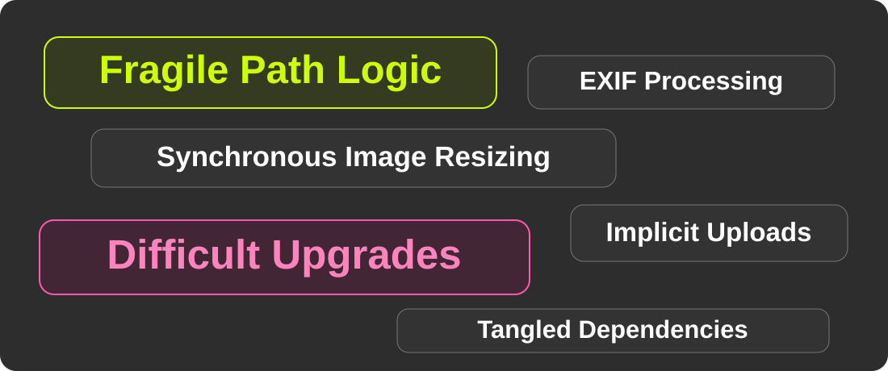</object>
</div>

<!--
【日本語版】
症状
- パスの計算ロジックが複雑化し、何度も壊れた
    - 実際に、ファイルアップロード起因の障害が何度も起きていた
- サイズ違い画像（`version`）を同期的に生成している
- アップロード時にEXIFを同期処理している
- アップロードを制御できない（履歴分割で大量に走る）
- 画像の仕様が、CarrierWave側もSmartHR側も複雑で更新できない
-->

---

<!-- _class: section-plain -->

# All of this tangled into one lump:<br>"CarrierWave is painful"

<!--
【日本語版】
それらが複雑に絡み合って、 「CarrierWaveがつらい」という塊になった
-->

---

<!-- _class: section -->

# 3. Splitting the Problem

<!--
【日本語版】
3. 課題を分割する
-->

---

# A Lump Cannot Be Moved

- "Let's drop CarrierWave" is too big for anyone to start
- So we split the problem **by its nature**

<!--
【日本語版】
塊のままでは動けない
- 「CarrierWaveをやめよう」は大きすぎて、誰も着手できない
- そこで、課題を **性質で** 分けることにした
-->

---

# Three Problems

<div style="position: absolute; top: 160px; left: 90px; width: 1100px;">
<object type="image/svg+xml" data="assets/quality-priorities-en.svg" width="1100" height="460" aria-label="Reliability is the top priority. Maintainability / Security and Usability are the other two areas of improvement."></object>
</div>

<!--
【日本語版】
3つの課題
| 課題 | 関係する性質（-ility） |
| 障害が起きやすい（パスが不安定） | 信頼性（Reliability） |
| バージョンアップができていない | 保守性・セキュリティ（Maintainability / Security） |
| パフォーマンス・生産性の問題 | 利用容易性（Usability） |

【メモ】
この後は信頼性改善の実践を中心に話し、保守性・セキュリティと利用容易性は「今後の展望」で扱う。
-->

---

# Why Split by Nature?

- Looking at each quality, **we can set priorities**
- Focusing on one quality **makes the problem smaller**
    - Small enough to start and to verify

<!--
【日本語版】
なぜ性質で分けるのか
- 性質ごとに見ると、**優先順位を付けられる**
- 性質に絞ることで、**問題のサイズが小さくなる**
    - 着手も検証もできる大きさになる

【メモ】
利用容易性は利用者・開発者双方の使いやすさとして整理。性能そのものをUsabilityと同義にはせず、待ち時間が使いやすさに与える影響として扱う。
-->

---

# Most Important: No More Incidents

- The path design and rules are **complex and easy to get wrong**
    - Even careful changes can overlook the impact on existing files
- For an HR service, **reliability comes first**
    - We have identity documents, certificates...

<!--
【日本語版】
一番大事なのは、障害をなくすこと
- 人事労務のファイルは「消えてはいけないもの」
    - 本人確認書類、各種証明書...
- パスに関する設計・仕様が複雑で、**間違えやすい**
    - 注意深く変更しても、過去のファイルへの影響を見落としやすい
- セキュリティももちろん大事。でも **まずは信頼性** から
-->

---

<!-- _class: section-plain -->

# First, improve reliability

<!--
【日本語版】
まずは信頼性を改善する
-->

---

<!-- _class: section -->

# 4. How Paths Break

<!--
【日本語版】
4. 障害の原因は パスの決まり方にある
-->

---

# CarrierWave: Cache

<div style="position: absolute; top: 155px; left: 90px; width: 1100px;">
<object type="image/svg+xml" data="assets/carrierwave-cache-en.svg" width="1100" height="470" aria-label="Assign uploads to cache_path in GCS. Keep Cache ID in the form and restore the cached file when resuming."></object>
</div>

<!--
【日本語版】
CarrierWave：書き込み

【メモ】
図のCache IDは再開用のcache_nameを指す（cache_id / original_filename）。モデルのIDとは別。
画像の永続化とidentifierのDB保存は役割を示した概念図で、厳密なコールバック順序ではない。
-->

---

# CarrierWave: Store

<div style="position: absolute; top: 155px; left: 90px; width: 1100px;">
<object type="image/svg+xml" data="assets/carrierwave-store-en.svg" width="1100" height="470" aria-label="Persist the image to GCS and save its identifier in PostgreSQL. Read the identifier to resolve store_path and access the image."></object>
</div>

<!--
【日本語版】
CarrierWave：読み出し・参照

【メモ】
identifierはランダムなIDを新規発行する意味ではない。
retrieve_from_store!は参照の復元で、常に画像の全バイトを取得するわけではない。
参考: https://github.com/carrierwaveuploader/carrierwave/tree/master/lib/carrierwave/uploader
-->

---

# cache_path and store_path

- **cache_path**: a temporary place until `store`
    - Even if validation fails, you can resume without uploading again
- **store_path**: the real, persistent location

<!--
【日本語版】
cache_path と store_path
- **cache_path**: storeするまでの一時置き場
    - バリデーションエラーでフォームが戻っても、再アップロードせずに再開できる
- **store_path**: 永続化された、本来の保存先
-->

---

# Paths Are Decided by "Methods"

- `cache_path` / `store_path` are **methods that build a path string**
- Developers can override them, or `cache_dir` / `store_dir`, to change the rules
- But **old files must stay reachable**
    - Old rules and exceptions cannot be dropped

<!--
【日本語版】
パスは「メソッド」で決まる
- `cache_path` / `store_path` は、**保存先の文字列を組み立てるメソッド**
- 開発者はこれらや `cache_dir` / `store_dir` などを上書きし、ルールを変えられる
- 自由に変えられる一方、**過去のファイルの場所も再現し続ける必要がある**
    - 例外や古いルールを捨てられず、負債として積み重なる
-->

---

# Paths Are Calculated from Model State

- A path combines the tenant ID, the table name, and so on
- It is not stored; it is calculated **every time** from the model's state

```ruby
def store_dir
  "uploads/#{model.tenant_id}/#{model.class.table_name}/#{mounted_as}/#{model.id}"
end
```

<!--
【日本語版】
パスはモデルの状態から計算される
- テナントのID、テーブル名などを組み合わせてパスを作る
- 固定で持つのではなく、**その都度** モデルの状態から計算される
（コード）

【メモ】
コードは抽象化したもの
-->

---

# Why Does It Break?

- Model state that has nothing to do with the file changes, **and the file is lost**
- An Uploader is just a Ruby class
    - Each subclass can change the path logic
    - It is hard to see how each change affects access to existing files

<!--
【日本語版】
なぜ壊れるのか
- ファイルと関係ないところでモデルの状態が変わっても、**参照できなくなる**
- Uploaderはただの Ruby のクラス
    - サブクラスごとにパス計算を変更できる
    - 個々の変更が、過去のファイルの参照にどう影響するか分かりにくい
-->

---

# How Did We Get Here?

- We probably wanted two properties for paths...
    - **Unguessability**: others cannot easily guess a person's file
    - **Uniqueness**: a path never collides with another file's
- But we went a bit too far, and now it is hard to operate

<!--
【日本語版】
どうしてこうなった
- おそらく、パスに以下の2つの性質を持たせたかったのだろう...
    - **非推測性**: 本人のファイルを、他人が容易に推測できないこと
    - **非衝突性**: 他のファイルとパスが衝突しないこと
- ただ、ちょっとやりすぎて、運用が難しくなっている
-->

---

# Complexity Leads to a Time-Based `if`

```ruby
def store_dir
  if after_hotfix?   # updated after a certain date?
    new_store_dir
  else
    legacy_store_dir # kept for older files
  end
end
```

- Paths are not kept as snapshots, so **we cannot change the logic**

<!--
【日本語版】
複雑さゆえに: 時刻によるif文
（コード）
- パスをスナップショットとして持たないので、**ロジックを変えられない**

【メモ】
振り分けの基準は created_at ではなく「更新日時」。話すときも更新日時と言う。
-->

---

# What Is the Real Problem?

- A small change in the logic can make old files unreachable
    - The code is complex, so we cannot predict the impact
- This led to incidents :(
- And it happened for **both** cache_path and store_path

<!--
【日本語版】
結局何に困っているか
- ロジックを少し変えただけで、過去のファイルが参照できなくなる
    - 実装が複雑で、影響が読みきれない
- インシデントにも繋がっていた
- しかもこれは、cache_path と store_path の **両方** で起きていた
-->

---

<!-- _class: section-plain -->

# The path code was held hostage<br>by older files

<!--
【日本語版】
パス計算のコードは、 過去のファイルを人質に取られていた
-->

---

<!-- _class: section-plain -->

# One ID should decide<br>exactly one path

<!--
【日本語版】
1つのIDから、 パスは一意に決まるべき
-->

---

# The Idea: Fix the Path

- From "calculated every time" to "decided and recorded at save time"
- Two points to fix
    1. cache_path
    2. store_path

<!--
【日本語版】
固定する、という発想
- パスを「毎回計算するもの」から「保存時に決めて記録するもの」へ
- 固定するタイミングは2つ
    1. cache_path の固定
    2. store_path の固定
- 非衝突性・非推測性は、パスを決めるときに満たせばよい
-->

---

# What Do We Gain?

- **The same file stays reachable**, even when the model changes
- **We can fix the path logic** without moving old files
- Above all, **the logic gets simpler**, so upgrades need less compatibility work

<!--
【日本語版】
パス固定のメリットは？
- モデルの状態が変わっても、**同じファイルを参照できる**
- 過去のファイルの場所を変えずに、**パス計算のロジックを直せる**
- 何より **ロジックがシンプルになり**、ライブラリ更新時の互換性の考慮が小さくなる
-->

---

<!-- _class: section -->

# 5. Fixing cache_path

<!--
【日本語版】
5. 実践: cache_path の固定
-->

---

# Fixing cache_path

- Between cache and store, the calculated cache path could change
    - e.g., code where the path changes depending on whether an ID exists
- In some years, this alone caused **4–5 incidents**
- Fix: save the path at cache time, and never recalculate it

<!--
【日本語版】
cache_path の固定
- cacheしてからstoreするまでの間に、cache pathの計算結果が変わる
    - 例: IDがある／ないでパスが変わる実装
- 年によっては、これだけで **4〜5件** の障害
- 対策: cache時のパスを保存し、取り出すときは再計算しない
-->

---

# Before

<div style="position: absolute; top: 160px; left: 90px; width: 1100px;">
<object type="image/svg+xml" data="assets/cache-path-before-en.svg" width="1100" height="460" aria-label="Even with the same cache ID, if the recalculated path changes at restore time, the app looks at a path different from where the file was saved."></object>
</div>

<!--
【日本語版】
変更以前

【メモ】
- ID発行されるのに、retrieveで複雑な計算があった
- ID発行の前後でそのロジックが変わると...
- ID → cache_path は一意に引けないとダメでは？
-->

---

# After

<div style="position: absolute; top: 160px; left: 90px; width: 1100px;">
<object type="image/svg+xml" data="assets/cache-path-after-en.svg" width="1100" height="460" aria-label="At cache creation, the mapping from the ID to the path is recorded in Redis. At restore time, the same path is read from Redis without recalculation.">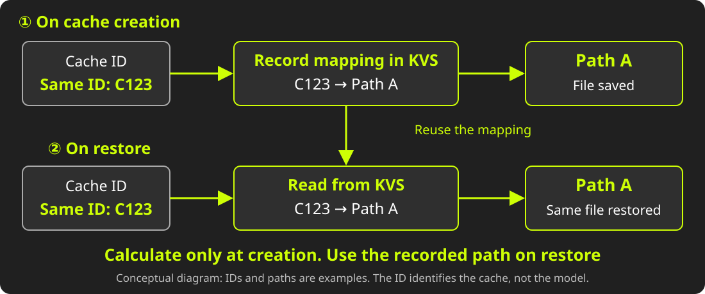</object>
</div>

<!--
【日本語版】
変更以後

【メモ】
- cache作成のタイミングで、ID → cache_pathをRedisに保持
    - 取り出すときは再計算せず、Redisから取得
- シンプルに！
- cache IDはフォームが持つので、提出している本人からは失われない。しかも本人しか知らないIDなので、鍵として安全
- 対応表はあくまでキャッシュなので、1〜2週間ほどで消える。1ヶ月後の再開は対象外（質疑用）
-->

---

# Results of Fixing cache_path

- Completed at the end of 2025, as our first improvement
- Incidents caused by cache_path dropped to **zero**
- Only store_path issues remain

<!--
【日本語版】
cache_path 固定の結果
- 改善第一弾として2025年末に完了
- cache_path起因の障害は **ゼロ** になった
- 残っているのは、store_path起因のものだけ
-->

---

<!-- _class: section -->

# 6. Fixing store_path

<!--
【日本語版】
6. 実践: store_path 固定へのチャレンジ
-->

---

# Next: Fixing store_path

- We could change the identifier format, but chose **a dedicated column**
    - On read, prefer that column; otherwise, calculate as before
    - Backfill existing data by recalculation
- Start with the most problematic Uploader, then expand

<!--
【日本語版】
次の山は store_path の固定
- identifierの形式を変える案もあったが、**専用のカラム** を導入する方針に
    - 読むときはそのカラムを優先、なければ従来どおり計算
    - 既存データはバックフィル。すべて埋まれば、フォールバックを消せる
- 問題の大きいUploaderから始めて、順次広げる
-->

---

# Implementation: Write Side

```ruby
class ApplicationUploader < CarrierWave::Uploader::Base
  after :store, :persist_object_store_path

  def persist_object_store_path(*)
    return if should_not_store_full_path?

    persisted_store_path = object_store_path_to_persist
    save_object_store_path(persisted_store_path)
    log_if_mismatch
  end
end
```

- Right after `store`, record the path in the dedicated column

<!--
【日本語版】
実装イメージ: 書き込み側
（コード）
- store の直後に、パスを専用カラムへ記録する

【メモ】
hanicaのコードからポイントを絞り、若干改変したもの。should_not_store_full_path? が write フラグに相当。
-->

---

# Implementation: Read Side

```ruby
class ApplicationUploader < CarrierWave::Uploader::Base
  def store_path(*args)
    calculated_store_path = super(*args)
    persisted_store_path = resolve_persisted_store_path
    log_if_mismatch
    return calculated_store_path if persisted_store_path.nil?
    use_persisted_store_path ? persisted_store_path : calculated_store_path
  end
end
```

- No record? Use the calculated path, as before
- Log any mismatch between the calculated and recorded paths

<!--
【日本語版】
実装イメージ: 読み込み側
（コード）
- 記録がなければ、従来どおり計算したパスを使う
- 計算値と記録値の不一致は、ログで観測する

【メモ】
use_persisted_store_path が read フラグに相当。次の「戻せる設計」へのつなぎ。
-->

---

# cache and store Differ in Impact

- **cache** fades away
    - Even if it is wrong at some point, the impact disappears over time
- **store** stays forever
    - Inconsistent data stays, and cleaning it up is hard
- So we want to go carefully. What should we keep in mind?

<!--
【日本語版】
cache と store では、影響の大きさが違う
- **cache** は消えていくもの
    - ある時点で間違っても、影響はやがて薄れる
- **store** はずっと残るもの
    - 不整合なデータが作られたら、残り続けて後始末が大変
- だからこそ、慎重に進めたい。考慮すべき点は...？
-->

---

<!-- _class: section-plain -->

# Consideration 1:<br>Design for Rollback

<!--
【日本語版】
考慮点1: 戻せる設計
-->

---

<!-- _class: scrim -->

# Two-Phase Flags: write / read

| Step | write | read | Notes |
|---|---|---|---|
| 1 | <span style='color: var(--kor-lime);'>Partly ON</span> | OFF | Double write for some tenants. Reads as before |
| 2 | _All ON_ | OFF | Double write for all tenants. Reads as before |
| 3 | _All ON_ | <span style='color: var(--kor-lime);'>Partly ON</span> | Some tenants read from the fixed paths |
| 4 | _All ON_ | _All ON_ | All tenants read from the fixed paths |

<!--
【日本語版】
write / read の2フェーズフラグ
| ステップ | write | read | 備考 |
| 1 | 一部ON | OFF | 一部テナントでdouble write。参照は従来どおり |
| 2 | _全体ON_ | OFF | 全体でdouble write。参照は従来どおり |
| 3 | _全体ON_ | 一部ON | 一部テナントでdouble writeした固定パスによる参照を開始 |
| 4 | _全体ON_ | _全体ON_ | 全体で固定パスによる参照へ切り替え |
-->

---

# Using Flipper

- Control the write/read flags with [Flipper](https://rubygems.org/gems/flipper) and migrate step by step
    - **Release to selected tenants**
    - **Roll back online**

<!--
【日本語版】
Flipper の活用
- [Flipper](https://rubygems.org/gems/flipper)でwrite/readフラグを制御し、段階的に移行を進める
    - 対象テナントを絞り込んでの公開
    - オンラインでの切り戻し
-->

---

# Rollback Matters

- To allow rollback, we added a new column unrelated to the old logic
    - Safety over the extra DB migration work
- QA also checks that **rolling back in an emergency is safe**

<!--
【日本語版】
戻せる設計の重要性
- 戻すときは逆順に
    - どの段階でも必ず一つ前に戻せる設計を保つ
- 戻せるように、既存ロジックと関係ないカラムを新設した
    - db migration追加の手間より安全を優先
- QAの中でも **「いざという時戻しても問題ないか」** を確認する
-->

---
<!-- _class: section-plain -->

# Control the impact.<br>Fail safely.

<!--
- 影響をコントロールしながら、**安全に失敗する**
-->

---

<!-- _class: section-plain -->

# Consideration 2:<br>AI-Driven QA

<!--
【日本語版】
考慮点2: AI駆動QA
-->

---

# The Question

- Internally, we changed how paths are decided
- How do we confirm **nothing changed for users**?
- Workflows, invitations, mobile apps...
    - Flag states × paths = a huge number of cases

<!--
【日本語版】
問い
- 内部的には、パスの決め方を変えた
- **ユーザーから見て何も変わっていない** ことを、どう確かめる？
- 経路は申請機能・招待機能・モバイルアプリ... フラグの状態 × 経路で、組み合わせは膨大
-->

---

# For Humans: Just Write User Stories

- **With AI**, extract critical user journeys (CUJs) as "As X, I can Y"
- Humans only need the preconditions and an "action / expected result" story

| Action | Expected result |
|---|---|
| Upload a profile image on the edit screen | The upload succeeds |
| Open the detail screen | The image is shown at 230×230 px |

<!--
【日本語版】
Step 1: ユーザーストーリーを書く
- 重要な利用経路（CUJ）を、**AIと協業して**「〇〇として、△△できる」の形で抜き出す
- 人が把握するのは、前提と「操作 / 期待値」の表だけ
| 操作 | 期待値 |
| 編集画面でプロフィール画像を登録する | 登録に成功する |
| 詳細画面を表示する | 画像が表示され、230×230px である |

【メモ】
前提: ログインユーザー、対象データ、フラグの状態（write ON / read OFF など）
-->

---

# Run and Build Reports with AI

<div style="position: absolute; top: 160px; left: 90px; width: 1100px;">
<object type="image/svg+xml" data="assets/ai-qa-pipeline-en.svg" width="1100" height="460" aria-label="Human → User Story → AI structures scenario.yml → AI runs tests and produces result.yml → AI builds a human-readable report → Human approves or rejects"></object>
</div>

<!--
【日本語版】
Step 2: AIがシナリオにして、実行する

【メモ】
構造化の形式はGherkinなどもあるが、今回は独自形式。
実行役のAIをAIの中で起動。やり取りはファイルとスキーマ。
図は次のStep 3まで含めた全体像。観測と判定を分け、人が最後に証跡をレビューする。
-->

---

<!-- _class: no-logo -->

<style scoped>
section { padding-right: 640px; }
.report-shot {
  position: absolute;
  top: 150px;
  right: 90px;
  width: 520px;
  height: 470px;
  object-fit: cover;
  object-position: top;
  border: 3px solid var(--kor-lime);
  border-radius: 8px;
  box-shadow: 0 0 24px rgba(0, 0, 0, .6);
  -webkit-mask-image: linear-gradient(to bottom, #000 80%, transparent);
  mask-image: linear-gradient(to bottom, #000 80%, transparent);
  transition: object-position 6s ease-in-out;
}
.report-shot:hover { object-position: bottom; }
</style>

# Example Report

- One run = one report
- Verdict, reason, and evidence for each step
    - Evidence: screenshots and logs
- Other findings go to "Warnings"


<!--
【日本語版】
レポートの例
- 1回の実行 = 1つのレポート
- ステップごとに判定・根拠・証跡
    - 証跡はスクショやログ
- 判定外の気づきは「警告」欄へ

【メモ】
マウスを乗せると、レポートが下までゆっくりスクロールする（HTML表示のみ）
-->

---

# Tips That Worked

- **Break the process into small steps**
    - Like a compiler, put structured intermediate data in between
    - Keep results as reproducible as possible, even when AI does the work
- Put the final human check into a PR to reduce the burden
- Make results easy to browse (listed on GitHub Pages)

<!--
【日本語版】
工夫ポイント
- **工程を細かく刻む**
    - 一種のコンパイラのように、構造化した中間データを挟む
    - AIに任せても、なるべく再現性が出るように
- 「人の最終確認」をPRに押し込め、人の負担を減らす
- 結果の一覧性を高める（GitHub PagesにQA結果を一覧化）
-->

---

# Results

- About 30 large stories checked **in 2 days, by about 3 people**
- Automated tests were strengthened, and existing test cases were kept
- For a high-impact change, **being able to try many cases** is what matters

<!--
【日本語版】
結果
- 30件ほどの大きめのストーリーを、**2日・ほぼ3人で** 一通り確認
- 自動テストも補強。既存のテストケースも大事にした
- 影響が大きい変更だからこそ、**たくさん試せる** ことに価値がある
-->

---

<!-- _class: section-plain -->

# Because the impact is large,<br>we rely on AI

<!--
【日本語版】
影響が大きいからこそ、AIに頼る
-->

---

# Where store_path Stands Now

- Some images have **fully switched** to fixed paths
- We will expand to all images, step by step, the same way

<!--
【日本語版】
store_path 固定の現在地
- 一部の画像では、固定パスへ **完全に切り替わった**
- 同じ手法で、少しずつ全画像に広げていく
-->

---

<!-- _class: section -->

# 7. What's Next

<!--
【日本語版】
7. 今後の展望
-->

---

# Remaining Problems and Status

<div style="position: absolute; top: 160px; left: 90px; width: 1100px;">
<object type="image/svg+xml" data="assets/quality-status-en.svg" width="1100" height="460" aria-label="Reliability is the top priority. Maintainability / Security and Usability are the other two areas of improvement.">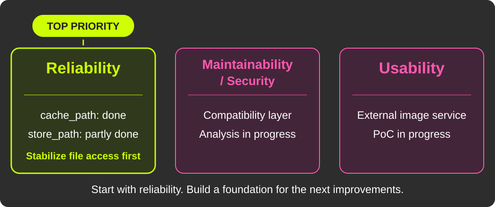</object>
</div>

<!--
【日本語版】
残りの課題と、現在地
| 改善する性質 | 現在地 |
| 信頼性 | cache_path固定完了、store_path固定は一部実施済み |
| 保守性・セキュリティ | 互換レイヤに向けて分析中 |
| 利用容易性 | 外部サービスのPoCを開発中 |
-->

---

<!-- _class: section-plain -->

# Outlook 1: Analyze dependencies<br>for a compatibility layer

<!--
【日本語版】
展望1: 互換レイヤで CarrierWaveへの依存を分析する
-->

---

# To Begin with: Two Kinds of Dependency

- **On carrierwave internals**:
    - the app assumes "a CARRIERWAVE uploader exists"
- **On carrierwave preprocessing**: what the Uploader does "along the way"
    - Generating resized images
    - Rotating images and removing EXIF data
    - Obtaining file metadata

<!--
【日本語版】
前提: 依存の2つの形
- **内部挙動への依存**: アプリが「Uploaderがある」前提で書かれている
- **暗黙の前処理**: Uploaderが「ついでに」やっている処理
    - サイズ違い画像の生成
    - EXIFの回転・除去
    - ファイルのメタデータ取得
-->

---

# Dependency on Internal Behavior

- **Nearly 300 call sites** in the app depend on CarrierWave

```ruby
user.avatar.present?          # actually means Uploader#blank?
user.avatar.expiring_url(:large)  # assumes the version exists
record.remove_document!       # a method added by mount
```

<!--
【日本語版】
内部挙動への依存
- アプリ本体に、CarrierWave依存の呼び出しが **300箇所近く**
（コード）
-->

---

# Compatibility Layer

- A layer one step above CarrierWave: **what SmartHR needs from images**
    - e.g., get a URL, check whether a file exists
- **No behavior change**, and **step by step**, so it is easy to move forward

```ruby
# before
user.avatar.present?            
# ↓
# ↓ after
CarrierWaveCompatLayer.attached?(user, :avatar)
```

<!--
【日本語版】
互換レイヤ `CarrierWaveCompatLayer`
- CarrierWaveの機能より一つ上の、**SmartHRが画像に求める機能** の層を切り出す
    - 例: URLを取得する、ファイルがあるかを確かめる
- **挙動を一切変えずに**、しかも **少しずつ** 切り出せるので進めやすい
（コード）
-->

---

# An API for What SmartHR Needs

<div style="position: absolute; top: 160px; left: 90px; width: 1100px;">
<object type="image/svg+xml" data="assets/compatibility-layer-en.svg" width="1100" height="460" aria-label="SmartHR calls the wrapped image operation API to get a name, get image size, and perform other operations. The CarrierWave API stays inside the wrapper."></object>
</div>

<!-- SmartHRが必要とする画像操作を互換レイヤで公開し、CarrierWave固有のAPIを内側に閉じ込める。 -->

---

# Can We Extract the Dependencies?

- How to extract them is still under discussion
- Methods we used for our modular monolith may help

<!--
【日本語版】
依存を切り出せるか？
- どう切り出すかは、まだ検討中
- モジュラモノリス化で使った分析の手法が、使えるのではと考えている
-->

---

<!-- _class: section-plain -->

# Outlook 2: Move preprocessing<br>to an external service

<!--
【日本語版】
展望2: 画像の前処理を 外部サービスへ切り出す
-->

---

# Too Much Image "Preprocessing"

<div style="position: absolute; top: 170px; left: 90px; width: 1100px;">
<object type="image/svg+xml" data="assets/preprocessing-sync-en.svg" width="1100" height="360" aria-label="File → SmartHR Uploader → large, small, and thumbnail images in GCS. All resizing and uploads run synchronously."></object>
</div>

<p style="position: absolute; top: 555px; left: 90px; right: 90px; text-align: center;">Resizing, EXIF handling, and uploads — <strong>all before saving finishes.</strong></p>

<!--
【日本語版】
画像の「前処理」が非常に多い
- 表示用途に合わせたサイズ違い画像（`version`）の生成
- EXIFの向き情報に基づく回転
- EXIF情報（住所など）の除去
    - これらがアップロード時に**同期で**走り、保存完了までの待ち時間になる
-->

---

# Let's Move the Synchronous Work Out

<div style="position: absolute; top: 170px; left: 90px; width: 1100px;">
<object type="image/svg+xml" data="assets/preprocessing-ondemand-en.svg" width="1100" height="360" aria-label="Upload only the original to GCS. A dynamic resizer reads it and generates images on demand; a CDN caches and delivers them to the browser.">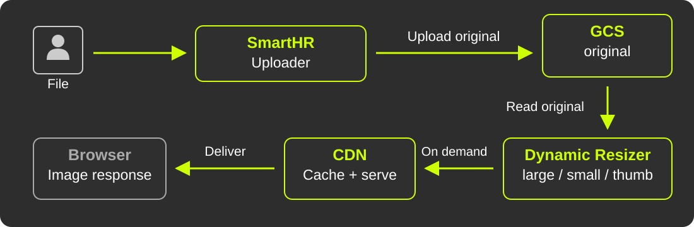</object>
</div>

<p style="position: absolute; top: 550px; left: 90px; right: 90px; text-align: center;"><strong>On-demand image service + CDN</strong><br>Examples: <a href="https://www.slideshare.net/slideshow/20111102-rails-meetuptofu/10084092">Cookpad's tofu</a> · <a href="https://imageflux.sakura.ad.jp/">ImageFlux</a></p>

<!--
【日本語版】
同期処理を切り出したい
- サイズ違い画像は、別サービスでオンデマンドに生成するとどうか？
- → 同期処理から、version生成とEXIF処理を外すことができる
- 別サービスの内容はCDNに載せキャッシュすれば、負荷の懸念も小さい
- 画像変換サービス + CDN という構成は、実サービスでも多く採られている
    - Cookpad の [tofu](https://www.slideshare.net/slideshow/20111102-rails-meetuptofu/10084092) を始め、色々
    - [ImageFlux](https://imageflux.sakura.ad.jp/) 等専用サービスも
-->

---

# A By-product: Better Performance

- Without the synchronous work, it should also get faster
- A quick local measurement shows...

<!--
【日本語版】
副産物: 性能の改善
- 同期で走っていた処理がなくなれば速くなるのも嬉しい
- 現在、**PoCを開発中**。まずは実現性を確かめる
- ローカルで簡単に計測してみると...
-->

---

# A Quick Local Measurement

<div style="position: absolute; top: 160px; left: 90px; width: 1100px;">
<object type="image/svg+xml" data="assets/bench-preprocess-en.svg" width="1100" height="460" aria-label="With all preprocessing: 17.9 seconds. Without preprocessing: 5.8 seconds. Most of the difference comes from thumbnail resizing, getting the image size, EXIF processing, and fewer GCS operations.">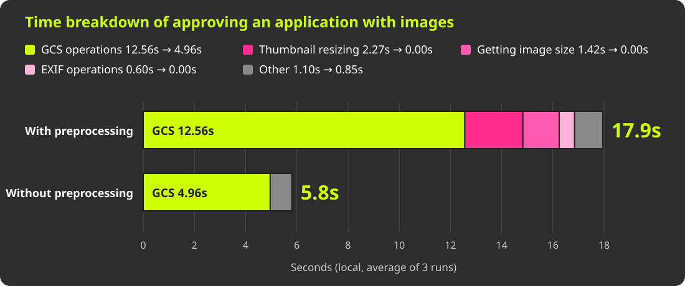</object>
</div>

<!--
【日本語版】
ローカルでの簡単な計測

【メモ】
申請者による作成処理（create_by_applicant）での計測。GCSの往復回数も 39 → 15 回に減っている（質疑用）
-->

---

# What We Learned

- Local, so it is **an extreme case** (production is a bit faster)
- Most of the time goes to **GCS operations**
    - Thumbnails, image size, and EXIF are surprisingly small
- Removing all preprocessing cuts the time to **about 1/3**

<!--
【日本語版】
計測から分かったこと
- ローカルなので **極端な例**（本番はもう少し速い）
- 時間の大半は **GCSの処理**
    - サムネ縮小・サイズ取得・EXIFの処理は、意外と小さい
- 前処理を全部なくすと、所要時間は **約1/3** に
-->

---

# On-demand Image Service Status

- We are now designing and developing it as a PoC!
- Stay tuned for updates!

---

# Another Speedup: Avoid Re-uploads

<div style="position: absolute; top: 165px; left: 90px; width: 1100px;">
<object type="image/svg+xml" data="assets/history-copy-skip-upload-en.svg" width="1100" height="390" aria-label="Proposed: copy the history row and assign internally, but skip the upload when bitemporal operations are marked as in progress.">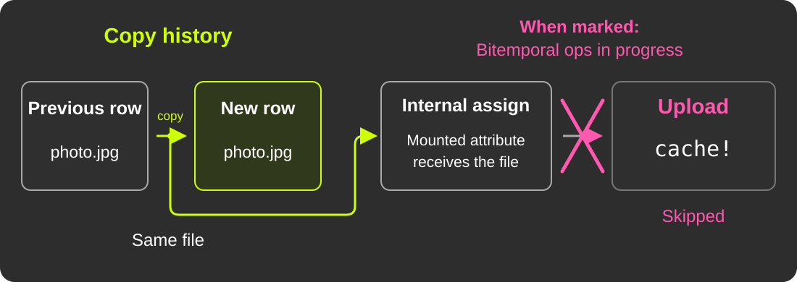</object>
</div>

<p style="position: absolute; top: 560px; left: 90px; right: 90px; text-align: center;"><strong>Under consideration:</strong> use <code>CurrentAttributes</code><br>to pass the “copy in progress” state into hooks.</p>

<!--
【日本語版】
もう一つの性能改善: 再アップロードを防ぐ
- バイテンポラルデータモデル周辺の改善も **検討中**
- 履歴を複製するときに **「履歴複製中」のマーク** を付けたい
    - その間はアップロードを回避し、同じファイルを再アップロードしない
- フック内部へ状態を伝えるため、`CurrentAttributes` を使うことになりそう
-->

---

<!-- _class: section-plain -->

# Outlook 3: What we want<br>after decoupling

<!--
【日本語版】
展望3: 疎結合にした先で やりたいこと
-->

---

# The Goal: Less Complexity

<div style="position: absolute; top: 160px; left: 90px; width: 1100px;">
<object type="image/svg+xml" data="assets/upload-architecture-en.svg" width="1100" height="460" aria-label="The app branches in two directions. Processing that depends on CarrierWave's internals goes into the compatibility layer, and image processing that does not depend on it goes to an external service."></object>
</div>

<!--
【日本語版】
複雑性の削減のために目指す姿

【メモ】
計画段階の責務・依存関係の図。矢印は画像データの転送経路ではない。
Uploaderの仕事を「決まったパスにバイト列を置く」ことへ絞り、画像処理を分離する。
-->

---

# Then: Replace or Upgrade?

- In the end, we want it simple, so **upgrades and migration are easy**
- Replace CarrierWave or keep upgrading it? Still under discussion
- In the short term, **catching up to the latest version** may be realistic
- Either way, fewer dependencies help the next step

<!--
【日本語版】
その先は、リプレースか、更新か
- 最終的には、シンプルにして **更新も移行もしやすく** したい
- CarrierWaveをリプレースするか、使い続けて更新するかは検討段階
- 短期的には、**最新バージョンへのキャッチアップ**が現実的かもしれない
- どちらを選ぶにしても、依存を減らしておくことは次につながる
-->

---

# After CarrierWave? (Ideas)

- **ActiveStorage?**
    - Up to 8 attachments per model, JOINs, and a poor fit with history
- **Shrine?**
    - Good. But GCS support is optional...
- **In-house??**
    - Dreamy. But reasonable actually?

<!--
【日本語版】
CarrierWaveをやめた先は？（案）
- **ActiveStorage**: 厳しそう。1モデルに最大8個の添付で、JOINが必要、履歴とも相性が悪い
- **Shrine**: いい感じ。ただGCS対応はコミュニティgemで、結局いろいろ内製する手間は残る
- **内製**: 履歴との絡みとAIの普及を考えると、捨てきれない
-->

---

# What We Want After That

- When replacing, we want something like [HotCell](https://github.com/basecamp/hotcell)
    - Isolates untrusted file processing in a separate, restricted container
    - Keeps tools like ImageMagick out of the Rails app
    - Also shields the app from vulnerabilities in the libraries
- The key: **decoupling** into a set of small parts

<!--
【日本語版】
その先でやりたいこと
- リプレースにあたっては [HotCell](https://github.com/basecamp/hotcell) のような機構も導入したい
    - 信頼できないファイルの処理を、権限を絞った別コンテナに隔離する仕組み
    - ImageMagickなどを、Rails側（アプリ本体）に入れずに済む
    - ライブラリ自体の脆弱性からも本体を切り離せる
- 小さなものの組み合わせにする **疎結合化** が鍵

【メモ】
HotCellそのものの採用を決めたわけではなく、処理を隔離する機構への個人的な展望。
-->

---

<!-- _class: section -->

# 8. Conclusion

<!--
【日本語版】
8. まとめ
-->

---

# To All Struggling Rails Developers

1. Split problems **by their nature**, and set priorities
2. **Design for rollback** and **verify thoroughly with AI**, to fail safely
3. Build from **small parts**, with clear boundaries

<!--
【日本語版】
苦労しているすべてのRails開発者へ
1. 課題は **性質で** 分割し、優先順位をつける
2. **戻せる設計** と、AIを使った **厚い検証** で、安全に失敗する
3. **小さなものの組み合わせ** に。境界をうまく切れるようにする
-->

---

<!-- _class: quote -->

<style scoped>
h1 { top: 220px; font-size: 60px; line-height: 1.15; }
</style>

# “The real cycle you’re working on<br>is a cycle called <strong>yourself.</strong>”

## Robert M. Pirsig, <i>Zen and the Art of Motorcycle Maintenance</i>

<!--
【日本語版】
“The real cycle you’re working on is a cycle called yourself.”
Robert M. Pirsig, Zen and the Art of Motorcycle Maintenance

【メモ】
試訳: あなたが本当に整備しているのは、「あなた自身」という名のオートバイだ。
技術的負債や課題に向き合うことは、自分自身の成長やエンジニアリングの姿勢に向き合うことでもある、と回収する。
-->

---

<!-- _class: section-plain -->

# Face your problems.<br>Make you and your users happy.

<!--
【日本語版】
課題に向き合って、 自分もユーザーもハッピーに
-->

---

<!-- _class: title -->
<!-- _paginate: false -->

<style scoped>
h1 { top: 100px; }
h2 { top: 525px; }
</style>

# Thank you!

<a href="https://udzura.jp/slides/2026/kaigionrails" style="position: absolute; top: 230px; left: 532px; display: block; width: 216px; height: 216px;">

</a>

## [udzura.jp/slides/2026/kaigionrails](https://udzura.jp/slides/2026/kaigionrails)

<!--
【日本語版】
Thank you!
[udzura.jp/slides/2026/kaigionrails](https://udzura.jp/slides/2026/kaigionrails)
-->

---

<!-- _class: full -->
<!-- _paginate: false -->

<style scoped>
img { object-fit: contain; }
</style>


