----
marp: true
header: "mruby/edge 超入門"
footer: "presentation by Uchio Kondo"
theme: fukuokarb
paginate: true
----

<!--
class: hero
-->

# mruby/edge 超入門

## RubyKaigi の前に知っとくと便利かもしれない気がすること

Uchio Kondo

----
<!--
class: profile
style: section ul { width: 110% }
-->

# 近藤うちお

* 所属: 株式会社ミラティブ
* 福岡市エンジニアカフェ  
ハッカーサポーター
* フィヨブーアドバイザー
* 普段はGoでミドルウェアの  
開発・運用をしてます
* 『入門 eBPF』（オライリージャパン）翻訳しました何卒


---
<!--
class: normal
-->

# 今日の内容

## 主に話すこと

- mruby/edge っち何？
- `/(?:C|m)Ruby/` のVMについて

## 遺憾ながら話せないこと

- WebAssembly自体の話...

----
<!--
_class: hero
-->

# mruby/edgeとは

---
<!--
class: normal
-->

# mruby/edgeとは？

- 一言で: **mrubyを動かすVM実装の一つ**
- これがあると何が嬉しい
  - RubyスクリプトをWebAssembly(wasm)のバイナリにコンパイルできる
- Rustで書いた
- あらゆる機能がないが、fibは動かせる

----
<!--
class: imgright
style: section.imgright h1 {width: 200%} section.imgright ul {width: 110%};
-->

# 世は大wasm時代を迎える

- wasm発表が4つもある！すごい
  - [ref on X](https://twitter.com/kateinoigakukun/status/1774838255827177472)
- @udzura は2日目やで
  - この会場の人は応援に来てね！


----

# mruby/edgeの仕組み

- Rubyスクリプトをmruby bytecodeにコンパイルする（mrbcを使う）
- それと別に、mruby bytecodeを評価するVMを用意する
- mruby bytecodeとVMのコードをwasmのワンバイナリに固める
- RBSファイルを指定して、どの関数をexportするか指定する
  - import は実装予定

----

# ちょっくら動かしましょう

スクリプトを2つ用意

```rb
def fib(n) # fib.rb
  if n < 2
    return 1
  else
    return fib(n-1)+fib(n-2)
  end
end
```

```rb
# fib.export.rbs
def fib: (Integer) -> Integer
```

----

# `mec` コマンドで「コンパイル」

```console
$ cargo install --version 0.2.1 mec
$ mec fib.rb
$ file fib.wasm
fib.wasm: WebAssembly (wasm) binary module version 0x1 (MVP)
```

wasmedge で `fib` 関数を実行

```console
$ wasmedge --reactor fib.wasm fib 10
89
```

----
<!--
style: button { margin-top: 1em; font-size: 34pt; padding: 0.1em 1em;} input {width: 5em}
-->
# 動作デモ

<script type="text/javascript">
  window.fire = function(e) {
    WebAssembly.instantiateStreaming(fetch("./fib.wasm"), {})
      .then(function (o) {
        let value = document.getElementById("myValue").value;
        let answer = o.instance.exports.fib(parseInt(value));
        document.getElementById("myAnswer").style.backgroundColor = "#ffff00";
        document.getElementById("myAnswer").value = answer;
        // alert("answer: fib(" + value + ") = " + answer.toString());
      }
    );    
  };
  console.log("done load function");
</script>

<button onclick="fire();">calc fib</button> 　　fib( <input id="myValue" type="text" value="20"> ) = <input id="myAnswer" type="text" value="?">
<br>

```javascript
WebAssembly.instantiateStreaming(fetch("./fib.wasm"), {}).then((o) => {
    let value = document.getElementById("myValue").value;
    let answer = o.instance.exports.fib(parseInt(value));
    document.getElementById("myAnswer").value = answer;
});
```

----

# 免責事項:sob::

* 現在 `mec` の動作には、システムに以下が入っている必要があります:
  * cargo + rust nightly
  * mrbc コマンド 3.2.0 以上
    * Debian sid ならパッケージで入るらしい(!?)
  * _そのうち、せめて cargo install だけで動くようにしたい..._

----

# mruby/edge + mec の強み

- Rubyのトップレベルメソッドをwasmバイナリ側で**export**できる

```javascript
WebAssembly.instantiateStreaming(fetch("hello.wasm"), importObj).then(
  (obj) => obj.instance.exports.hello(),
);
```

- 何が嬉しい
  - よりwasmらしいやり方で、関数をインタフェースに連携できる
  - proxy-wasm のような特定のABIを満たして欲しい用途に対応できるかも
  - Component Modelにも対応しやすいかも
  - import にももちろん対応予定

----

# mruby/edgeの仕組みagain

- Rubyスクリプトをmruby bytecodeにコンパイルする（mrbcを使う）
- それと別に、**mruby bytecodeを評価するVM**を用意する
- mruby bytecodeとVMのコードを**wasmのワンバイナリに**固める
- RBSファイルを指定して、どの関数をexportするか指定する
  - import は実装予定

----

# 図解です


----
<!--
_class: hero2
-->

# mruby/edge = mruby のbytecodeを実行できるVM

＋バイナリを固める君（`mec` コマンド）

----

# ... VM って？

「そもそもRubyにとってVMとは？」という話をしますね

----
<!--
class: normal
-->

# CRubyのVM

- CRubyが動くとは？
- ざっくり言えば
  - Rubyスクリプト
  - →トークン
  - →パースされたAST
  - →CRubyのバイトコード
  - →YARVでバイトコードを実行

----

# また図にするとこう



- 『Rubyの仕組み』（オーム社）に書いてある気がする
- JITの話はまあ今日はいいじゃないですか

----

# CRuby のinsn（命令）を見てみよう

こういうコードがある時

```ruby
def hello
  p 1 + 2
end

hello
```

----

# insnをダンプするには

`ruby --dump=insns` で表示される

```
$ ruby --dump=insns test.rb
== disasm: #<ISeq:<main>@test.rb:1 (1,0)-(5,5)> (catch: FALSE)
0000 definemethod                           :hello, hello             (   1)[Li]
0003 putself                                                          (   5)[Li]
0004 opt_send_without_block                 <calldata!mid:hello, argc:0, FCALL|VCALL|ARGS_SIMPLE>
0006 leave

== disasm: #<ISeq:hello@test.rb:1 (1,0)-(3,3)> (catch: FALSE)
0000 putself                                                          (   2)[LiCa]
0001 putobject_INT2FIX_1_
0002 putobject                              2
0004 opt_plus                               <calldata!mid:+, argc:1, ARGS_SIMPLE>[CcCr]
0006 opt_send_without_block                 <calldata!mid:p, argc:1, FCALL|ARGS_SIMPLE>
0008 leave                                                            (   3)[Re]
```

----

# mrubyのVMは

- 基本的には同様
- Rubyスクリプト→…→AST→mruby バイトコード（mrb）→mruby VM
- いきなりバイトコードからパスを進めてもOKな作り

----

# mrubyの図


----

# mruby の命令をダンプしよう

こういうコードがある時

```ruby
def hello
  p 1 + 2
end

hello
```

----

# mrbc を使う

`mrbc -v` でパース結果、VM命令も出てくる

```
$ mrbc -v test.rb     # ...中略
irep 0x60000080c0a0 nregs=3 nlocals=1 pools=0 syms=1 reps=1 ilen=15
file: test.rb
    1 000 TCLASS        R1
    1 002 METHOD        R2      I(0:0x60000080c0f0)
    1 005 DEF           R1      :hello
    5 008 SSEND         R1      :hello  n=0
    5 012 RETURN        R1
    5 014 STOP
irep 0x60000080c0f0 nregs=6 nlocals=2 pools=0 syms=1 reps=0 ilen=12
file: test.rb
    1 000 ENTER         0:0:0:0:0:0:0 (0x0)
    2 004 LOADI_3       R3      (3)
    2 006 SSEND         R2      :p      n=1
    2 010 RETURN        R2
```

----

# ちょっとした違い

- CRubyのVMは**スタックマシン**ベース
- mrubyのVMは**レジスタマシン**ベース
  - VMの扱うデータはスタックの他にレジスタにも置かれる

----

# 他の言語のVM

- Java
  - スタックマシンベース
  - YARVの開発以前からある、参考にしたのかも
- Lua
  - レジスタマシンベース
  - Matz曰くmrubyはこれを参考にした
  - 一度tree-walk interpreterから切り替えたらしい。Rubyと同じ

----

# Luaの命令(1)

サンプルスクリプト
見ての通りさっきのRubyスクリプトとほぼ同じことをしている

```lua
function hello()
    print(1 + 2)
end

hello()
```

----

# Luaの命令(2)

```console
$ luac -l test.lua

main <test.lua:0,0> (6 instructions at 0x6000014c8080)
0+ params, 2 slots, 1 upvalue, 0 locals, 1 constant, 1 function
        1       [1]     VARARGPREP      0
        2       [3]     CLOSURE         0 0     ; 0x6000014c8100
        3       [1]     SETTABUP        0 0 0   ; _ENV "hello"
        4       [5]     GETTABUP        0 0 0   ; _ENV "hello"
        5       [5]     CALL            0 1 1   ; 0 in 0 out
        6       [5]     RETURN          0 1 1   ; 0 out

function <test.lua:1,3> (4 instructions at 0x6000014c8100)
0 params, 2 slots, 1 upvalue, 0 locals, 1 constant, 0 functions
        1       [2]     GETTABUP        0 0 0   ; _ENV "print"
        2       [2]     LOADI           1 3
        3       [2]     CALL            0 2 1   ; 1 in 0 out
        4       [3]     RETURN0  
```

----

<!--
_class: hero
-->

# mrubyのバイトコード深掘り

----

<!--
class: normal
-->

# mrubyのバイトコードは色々使える

- mrubyのバイトコードを実行できるランタイムがいくつかある
  - mruby 自体
  - mruby/c →mrubyのバイトコードを解釈可能
  - (PicoRuby ? も同じ発想? キーボードは怖いので詳しく調べていない)

----

# mruby/c とは？

- 九工大田中和明先生らにより開発され、現在mrubyと歩調を合わせて開発中
- mrubyのコンパイラ部分を取り除き、またROSなど限定した環境でも
動かしやすいよう機能を絞ったmruby実行環境
  - 福岡県＋島根県のコラボ

----

# mruby/c はmruby bytecodeを食べられるという話

- mrubycを実行バイナリとしてコンパイル
  - tag: release3.2
  - コードをチェックアウトし `make mrubyc_bin` でバイナリができる

```console
$ make mrubyc_bin
$ # これが mrubyc バイナリ相当、mrbファイルを渡す
$ ./sample_c/sample_scheduler
Usage: ./sample_c/sample_scheduler <xxxx.mrb>
```

----

# mruby/c でmrbファイルを実行

mrbファイルはmruby側の `mrbc` で作る

```console
$ mrbc ./sample_c/test.rb
$ # ./sample_c/test.mrb ができる
```

mruby/c でも実行できる

```console
$ # p 1 + 2 の実行結果
$ ./sample_c/sample_no_scheduler ./sample_c/test.mrb
3
```

----

<!--
_class: hero
-->

# そして mruby/edge の話

----
<!--
_class: hero2
-->

# mruby/edge = (one of) mruby互換のVM

----

<!--
class: normal
-->

# recap: mruby/edge とは？

- コア部分: mrubyを実行するためのRust製のVMである
- mec（mruby/edge compiler） というフロントエンドcliも用意してる
  - mrubyのバイトコードと、mruby/edgeをwasmに固めて動かせる
    - このエコシステム一式を mruby/edge と呼んだりしちゃうかも

----

# mruby/edge のmruby VM

- Rustで一から書いているところ

```rust
// 抜粋。雰囲気だけでも...
pub fn eval_insn1(vm: &mut VM, ...) -> Result<(), Error> {
    vm.pc += ilen;
    match opcode {
        OpCode::MOVE => {
            let (a, b) = fetched.as_bb()?;
            let dst = a as usize;
            let src = b as usize;
            if let Some(val) = vm.regs.get(&src) {
                vm.regs.insert(dst, val.clone());
            }
        }
        OpCode::LOADL => {
            let (a, b) = fetched.as_bb()?; //...
```

----

# なぜそういうアーキテクチャにしたのか？

- in other words: なぜ、既存のmruby familyを再利用しなかったのか？
  1. バイナリサイズをさらに減らしたかった
  2. Rustを使いメモリ安全なmruby VMを用意したかった
  3. wasmの仕様に即した機能を含めたかった（まだWIP）
  4. そもそも、VMを自作したかった

...　

----

# なぜそういうアーキテクチャにしたのか？

- in other words: なぜ、既存のmruby familyを再利用しなかったのか？
  1. バイナリサイズをさらに減らしたかった
  2. Rustを使いメモリ安全なmruby VMを用意したかった
  3. wasmの仕様に即した機能を含めたかった（まだWIP）
  4. **そもそも、VMを自作したかった（がモチベーションの9割）**
    - 憧れますよね？
    - ロマンですよね？　僕だけ？


----

<!--
_class: hero
-->

# …ここでLT終了時間のはず

実際の内部実装の評価や自慢、諸々の成果物の披露はぜひRubyKaigi 沖縄で！
（まだできてないところがた〜くさん）

----

# 終わりに

----

<!--
class: normal
-->

# VM ってなんだろう

by 笹田耕一さん

> こんなわけで、具体的な何かに依存するよりは、中間層を設けることによって別々のものを扱いやすくしましょう、というのが仮想化です。
    
- [YARV Maniacs 【第 2 回】 VM ってなんだろう](https://magazine.rubyist.net/articles/0007/0007-YarvManiacs.html) より

----

OS/言語/ハードウェア は割と繋がってたりする話もあるが、またどこかで...

