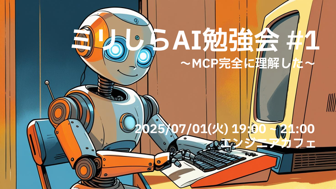

----
marp: true
header: "ミリしらAI勉強会 #1"
footer: "presentation by Uchio Kondo"
theme: default
paginate: true
style: |
  h1 { color: #0f7f85; }
  h2 { color: #0f7f85; }
  section.profile img {
    position: absolute;
    top: 25%;
    left: 65%;
    overflow: hidden !important;
    border-radius: 50% !important;
  }
----

# ミリしらAI勉強会へようこそ！



----

<!--
class: profile
_style: img {}
-->

# 自己紹介

- 近藤うちお (@udzura)
- エンジニアカフェ ハッカーサポーター
- 所属: 株式会社SmartHR プロダクトエンジニア
- 『入門eBPF』（オライリージャパン）という
本を共同翻訳しました


----

# 「ミリしらAI勉強会」とは

* **イベント概要**:  
    * リンク: [https://engineercafe.connpass.com/event/359625/](https://engineercafe.connpass.com/event/359625/)  
    * 福岡市内にあるエンジニアカフェで実施するAIよろず勉強会です。  

----

# 「ミリしらAI勉強会」とは

* **こんな方、いませんか...???**:  
    * AIブームになんとなくついていけていない気がする...。  
    * AIにキャッチアップしたいけど、なかなか手を動かしたり調べる時間がない...。  
    * 実はコーディングエージェント、しっくりこないんです！  

----

# コンセプト  

* 「AIミリしら(=全然勉強していない)でも参加できる」  
* 「とにかく調べるきっかけを作る」  

----

# 主催者について

* 主催者の @udzura も完全にAIに乗り遅れてます！一緒にキャッチアップしましょう！  

----

# Discordについて

* エンジニアカフェのDiscord `#ミリしらai勉強会` チャンネルをやり取りにお使いください！  

----

# 会場の諸注意

----

# 会場の諸注意

* **建物の保護**:  
    * 会場の建物は重要文化財です。破損等しないよう、十分ご注意ください。  
* **飲食について**:  
    * 飲食は制限されています。  
    * **蓋のある飲み物のみ**許可されています。

----

# 参加者へのシステムプロンプト

----

# プロンプトその1

```
素朴な疑問を大事にしましょう。
ただし、最終的には、まずは手を動かしてみることを重視しましょう。
```

----

# プロンプトその2

```
AI関連技術は多様を極めます。
自分の興味に応じた深掘りを推奨します。
```

----

# プロンプトその3

```
AIの勉強会ですが、人との対話や、意見交換も大事にしましょう！
肯定から始めることを意識しましょう。
```

----

# エンジニアカフェのCoCについて

* **Code of Conduct**:  
    * エンジニアカフェの行動規範も尊重し、従ってください。  
    * リンク: [https://engineercafe.jp/ja/topics/3056](https://engineercafe.jp/ja/topics/3056)

----

# 今日の流れ

* **プログラム**:  
    * **簡単な自己紹介**（19:00 ~ 19:30）  
    * **モブ調査・モブプログラミングタイム**（19:30 ~ 20:00）
        * MCPの概要を調べてみんなで見てみる  
        * MCPサーバーの実装の仕方をみんなで見てみる  
        * MCPサーバーの自作を試してみる、など...
    * **一通りモブプログラミングをしたら、黙々タイム** (20:00 ~ 20:50)
    * **最後に今日の成果を共有して終了**（20:50 ~ 21:00）

----

# 今日見ようとしている資料

----

# 今日見ようとしている資料

* **初手**:  
    * おもむろにDeep Researchをさせます！  

----

# 今日見ようとしている資料

* **参考資料案（何も出なければ）**:  
    * シンプルな MCP サーバを作って動作を理解する: [https://zenn.dev/meson\_tech\_blog/articles/simple-mcp-server](https://zenn.dev/meson_tech_blog/articles/simple-mcp-server)  
    * TBA...

----

# 今後の開催について

----

# 今後の開催について

* **今後の予定（案）**:
    * 強い希望がなければこんな感じで...
        * Local LLMを素振りしてみよう
        * 素朴なAI Agentを作ってみよう
            * （Geminiベースのチュートリアルがあるようです）
        * Mastraを素振りしてみよう
        * Mastra+AIプロバイダ+MCPで本格的エージェント？

----

# 今後の開催について

- 次回は8月中旬までに一度開催したいです！（お待ちください）
- 年度内に、あと5回開催が目標