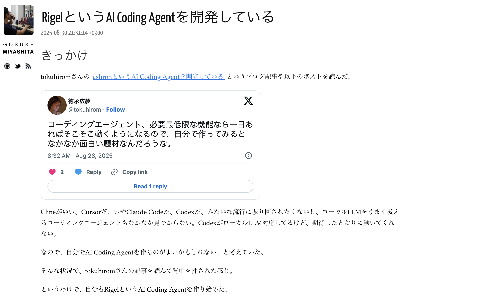
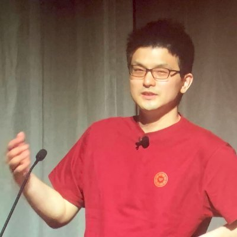

----
marp: true
header: "ミリしらAI勉強会 #2"
footer: "presentation by Uchio Kondo"
theme: default
paginate: true
style: |
  h1 { color: #0f7f85; }
  h2 { color: #0f7f85; }
  section.profile img {
    position: absolute;
    top: 25%;
    left: 65%;
    overflow: hidden !important;
    border-radius: 50% !important;
  }
----

# ミリしらAI勉強会へようこそ！



----

<!--
_class: profile
-->

# 自己紹介

- 近藤うちお (@udzura)
- エンジニアカフェ ハッカーサポーター
- 所属: 株式会社SmartHR プロダクトエンジニア
- 『入門eBPF』（オライリージャパン）という
本を共同翻訳しました



----

# 「ミリしらAI勉強会」とは

* **イベント概要**:  
    * リンク: [https://engineercafe.connpass.com/event/359625/](https://engineercafe.connpass.com/event/359625/)  
    * 福岡市内にあるエンジニアカフェで実施するAIよろず勉強会です。  

----

# 「ミリしらAI勉強会」とは

* **こんな方、いませんか...???**:  
    * AIブームになんとなくついていけていない気がする...。  
    * AIにキャッチアップしたいけど、なかなか手を動かしたり調べる時間がない...。  
    * 実はコーディングエージェント、しっくりこないんです！  

----

# コンセプト  

* 「AIミリしら(=全然勉強していない)でも参加できる」  
* 「とにかく調べるきっかけを作る」  

----

# 主催者について

* 主催者の @udzura も完全にAIに乗り遅れてます！一緒にキャッチアップしましょう！  

----

# Discordについて

* エンジニアカフェのDiscord `#ミリしらai勉強会` チャンネルをやり取りにお使いください！  

----

# 会場の諸注意

----

# 会場の諸注意

* **建物の保護**:  
    * 会場の建物は重要文化財です。破損等しないよう、十分ご注意ください。  
* **飲食について**:  
    * 飲食は制限されています。  
    * **蓋のある飲み物のみ**許可されています。

----

# エンジニアカフェのCoCについて

* **Code of Conduct**:  
    * エンジニアカフェの行動規範も尊重し、従ってください。  
    * リンク: [https://engineercafe.jp/ja/topics/3056](https://engineercafe.jp/ja/topics/3056)

----

# 今日の流れ

* **プログラム**:  
    * **LTタイム**（19:10 ~ 19:40）
        * 順番はこの場で話して決めましょう！
        * 飛び入りも大丈夫です
    * **AI気になるニューを眺める会**（19:40 ~ 20:15）
        * 画面を見ながら一緒に眺めましょう
        * 話した内容もAIにまとめさせようぜ
    * **時間が余れば、黙々タイム** (~ 20:25)
    * **最後にまとめ**（~ 20:30）

----

# 今日のLT

----

# 自作コーディングエージェントのコードを眺めてみる

----

# コーディングエージェント、使ってますか？

----

- Claude Code
- Codex
- GitHub Copilot Agent...

----

# いろいろ出てきてよくわからない...

----

# そんな中

* コーディングエージェントも自作の流れが...???
* 例えば、こんな記事がありました
    * [Build Your Own AI Coding Assistant Using LangChain + GPT-4 + VS Code API](https://medium.com/@3570kumarraushan/build-your-own-ai-coding-assistant-using-langchain-gpt-4-vs-code-api-f198717d9ab2)

----

# 日本でも

- [ashron という coding agent を作っている](https://blog.64p.org/entry/2025/08/29/170302)
- [RigelというAI Coding Agentを開発している](https://mizzy.org/blog/2025/08/30/2/)

----


----

# 有名エンジニアが自作を始めている...!!

- じゃあ次の時代は自作だな（違）

----

# 自作って気になる

- コードを眺めてみました
- Go でできた [Rigel](https://github.com/mizzy/rigel) を軽くみてみる

----

# main.go から

- `cmd/rigel/main.go` から

```go
func main() {
  if err := rootCmd.Execute(); err != nil {
    log.Fatal(err)
  }
}
```

- cobra CLIのエントリーポイント `rootCmd.Execute()` を呼び出し

----


----

# 気になるニュースを眺めてだべる会

----

# やり方

- Notion AppのAI Meeting Notesを使う
    - 録音します。生の録音データは公開しませんが、気になる方はお申し付けください
    - メモも取ります
- 画面を見ながら一緒に眺め、座談会風にだべる
- 最後にNotion AIにまとめさせたらどうなる？いい感じになる？
    - まとめの内容は発言者がわからないようにして、個人のブログで紹介する可能性があります

----

# ソースとか...

- はてブ...
    - https://b.hatena.ne.jp/q/LLM?target=all&sort=popular&users=50&safe=on&date_begin=2025-07-01&date_end=2025-11-01
- Laisoさんの記事
    https://blog.lai.so/
- 聞きたいこと
    - そもそも皆さんどういうソースでキャッチアップしてます？

----

# みてみましょう

----

# 次回について

* 主催者多忙につき、来年2月頃になる予定です...。
    * もしかしたら11月に開催できる可能性がありますが、未定
    * エンジニアカフェDiscordの `#ミリしらai勉強会` チャンネルでお待ちください
