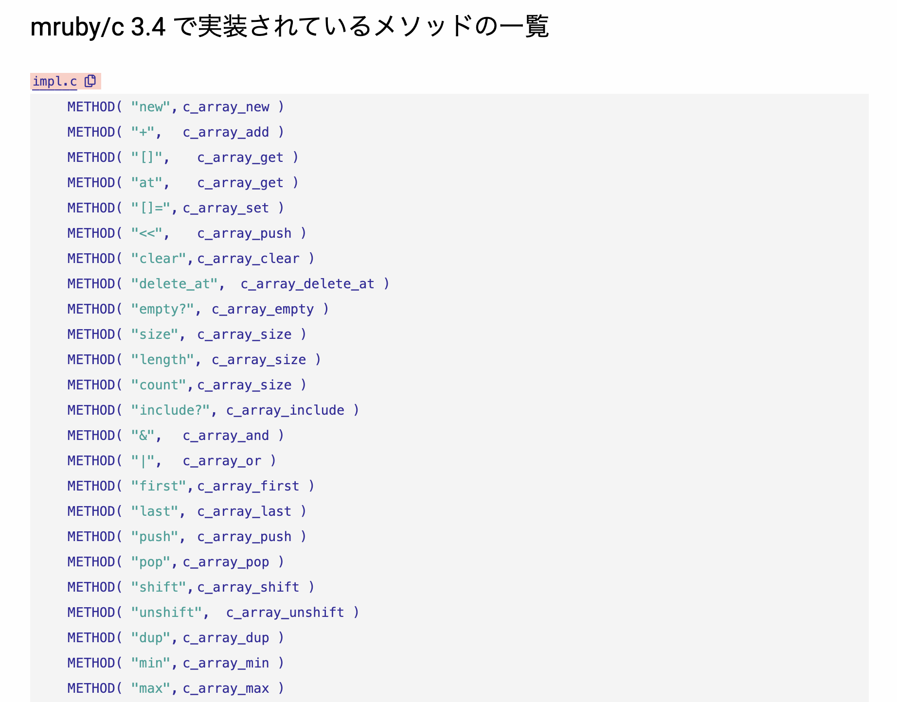

----
marp: true
header: "ミリしらAI勉強会 #3"
footer: "presentation by Uchio Kondo"
theme: default
paginate: true
style: |
  h1 { color: #0f7f85; }
  h2 { color: #0f7f85; }
  section.profile img {
    position: absolute;
    top: 25%;
    left: 65%;
    overflow: hidden !important;
    border-radius: 50% !important;
  }
  section.hero h1 {
    font-size: 2.4em;
    text-align: center;
    position: absolute;
    top: 50%;
    left: 50%;
    transform: translate(-50%, -50%);
    width: 80%;
  }
----

# ミリしらAI勉強会 #3 へようこそ！

----

<!--
_class: profile
-->

# 自己紹介

- 近藤うちお (@udzura)
- エンジニアカフェ ハッカーサポーター
- 所属: 株式会社SmartHR プロダクトエンジニア
- 『入門eBPF』（オライリージャパン）という本を共同翻訳しました

----

<!--
_class: hero
-->

# OSS開発でAIを使って どうなったか

----

# OSSで作っているもの: mruby/edge

- Rubyの軽量実装であるmrubyを、WebAssemblyで動くようにしいたもの
- まあまあバイナリが小さい（最小 〜400KB）

----
# Wasmにコンパイルできる

(prompt: playgroundキャプチャ)

----
# スプレッドシート上で動かせる

(prompt: スプレッドシート上で動いている様子のキャプチャ)

----
# Cloudflare Worker上でも動かせる

(prompt: Uzumibiのコード)

----

# mruby/edge の話を函館で発表します

- 今年の RubyKaigi 2026（函館）でも発表予定
  - 函館に行こう！

(prompt: リンクとキャプチャ)

----

# AI利用の変遷を話します

- mruby/edge というOSSでAIをどう利用していったか？

----

# 2024年: 発表段階

(prompt: 2024へのリンクとサイトのキャプチャを貼る)

----

# 良く言ってPoC

- 実は `fib()` しか動かない...
- ゆうてそんなに実装できていない
- PoCをRubyKaigiで紹介するレベルにとどまった

----

# 2025年1月: VMの書き換え

- VMを書き換えた
- 誤魔化し気味の箇所も直し、ちゃんといろんな命令が実装できそうな感じになってきた

----

# VMを直したので

- Rubyスクリプトをいじりながら、コンパイルして出てくる命令をじわじわ実装していった

----

# この時点でのAI利用

- 時々CopilotのAI補完を使う程度だった
- 命令の実装はものによってはシンプルなので、補完がそのまま使えることも多かった
  - ただし大抵は手直し必須
- shotの質が大事
  - コメントでプロンプトもどきを書いて補完させることもあった

----

# 2025年半ば？ 命令は大体カバーできた

- 大体良く使う命令はカバーできた
- しかし...

----

# 標準ライブラリ問題

- 言語としてまともに動かすには、標準ライブラリが大事
  - これがないと使ってもらえないよな〜と思った
- 標準ライブラリは、APIは整備して「あとはやるだけ」ではあった
- 一旦「contributer募集！」という形にした

----

# しかし...

- 人徳がないためか、いつまでもcontributerは現れなかった...

----

# 閑話: ミドルより下のOSSを使ってもらうには

- いろんなものを作り込む必要がある
  - 標準ライブラリ、一般的なユースケースに必要な機能、エッジケースの対応、QAの充実、テストの充実...
  - 何より、ドキュメント、サンプルコード、チュートリアルなどの充実が必要
- 何が必要か、は大体理解していたつもりだが、圧倒的に工数がない
  - 趣味なので...

----

# 閑話休題、じゃあAIに作らせよう

- 標準ライブラリをAIに作らせることにした
- プロンプトで以下を指示:
  - mruby/cでのCのメソッド定義をまるっと抜き出して...
  - 「このメソッドに相当するものを実装してください」
- shotとしていくつかは実装済みの状態ではあった
- 利用したのは **Copilot Agent + Claude Sonnet 4.5**

----

----

# 結果: 大体動くものが出現した

- テストもshotで用意してたので、同じノリで作ってくれた
- なんなら通らない時は試行錯誤して通した
- mruby/cで実装されている範囲程度の標準ライブラリがだいたいできた
  - 一部命令のバグなどもあった
  - その辺は自分で直したり、AIが直してくれたりした

----

# さらなるAI利用の話

----

# Sonnetでの開発ペース

- Sonnetを使った開発の場合、大体premium requestを月で使い切るぐらいのペース

----

# ある日...

- requestがちょっと余ってたので **Opus 4.6** を使ってみた
- すると...

----

# より精度の高いコードが出てきた...

- **Sonnet**: まあ悪くない、理解できるコードが出る
  - でも若干試行錯誤をさせると迷路にハマったりしてリクエストが無駄
  - あとちょっと...って感じなら自分で直したりしていた
- **Opus**: 一発でほぼ完成された実装が出てくる...
  - 修正も、適切な試行をして大体直してくれる...

----

# Opus活用の戦略（？

- Opusならもっと込み入った実装をお願いできるんでは？
- リクエスト消費は x3 なので:
  - Opusに今までの 1/3 ぐらいの実装をお願いする
  - それもある程度まとまっていて込み入った実装を
  - その方が生産性が上がりそう
- で、人間は、typoの修正とか、誰でもできるようなことをすればいいかな...

----

# AIを使いまくった効果

- いや、使いまくったと言っていいのか？

----

# プロンプトの「感覚」

- プロンプトの「感覚」は使い続けないとわからない...とわかった
- 「ああ、この人はこういう人なんだな」みたいな感覚が育ってくる
  - 人間の不思議

----

# じゃあ丸投げするかっていうと

- 並行作業とか、全部任せようという気持ちにはまだなれない
- だんだん任せる粒度が大きくなる方向にはなりそう

----

# 仕事でも使うようになった

- ゆうて仕事で使っても、結局非効率だと思っていた
  - それなりにレガシーやってるんで...
  - めっちゃ限定的にしか使ってなかった
- だが、プロンプトの使い方だったり、小さめのrepoなら、もうOpusに投げればいけるなと完全理解した
  - とかなんとか言ってたら同僚が CLAUDE.md などを整えてたりしたので乗っかったり

----

# 仕事で使うコツ

- 事前に把握すべきコード資産の範囲、コンテクストを絞る
- 手順やマイルストーンを明確に指示する
- 「こうして」じゃなく「こういう理由でこうなってほしい」「最終的にこうしたい」と指示する
  - 人間への指示だな...。
- あとコードの編集以外にも「このファイルはどこにある？」と尋ねる使い方が増えた
  - 設定の意味を書き起こさせるとか

----

# AIについて思うこと

----

# AIがやっていること/AIにやらせるべきは「翻訳」では？

- 日本語から英語に翻訳
- CからRustへの翻訳
- 設計からコードへの翻訳...
- **「元の情報」が存在していればその変換は高精度でやってくれる**

----

# 逆に言えば

- 情報ソースが開発者の頭の中にしかない、ゼロイチ段階ではAIは役に立たない
  - 訳のわからないものが出てくることが多い
- ゼロ→イチをなんとかかんとか、プロンプトでもなんでもアウトプットすることが大事
  - それは普通に「仕事をする」ってことでは？

----

# すごい人がAIだけでOSSを完成させている事例の話

- [TypeScript/Rust/Goのワンバイナリで動くSQLite互換RDBMSをAIに作らせた](https://gfx.hatenablog.com/entry/2026/01/23/212644)
- [AIがほぼ全てのコードを書いたOSSを公開した](https://mizzy.org/blog/2026/01/24/1/)

----

# この事例から思うこと

- 彼らは、実は実装していないだけで**作るべきものがすでに頭の中にある**
  - それもかなり詳細にある
    - さっき言及した「OSSで必要なこと」が脳内でマイルストーン引かれてる
  - ということが可視化されただけだった
- しかし、「作るべきものがすでに頭の中にある」状態にするには**本物の技術力が必要**という話

----

# まとめ

- 一つ
  - 使わないと分からないことは多いので、否応なく使うしかない...。
- もう一つ
  - AIは翻訳（脳内にあるもののリフレクション）をしてくれるのみと理解する
    - なので人間が鍛えられなければならない気がする、結局

