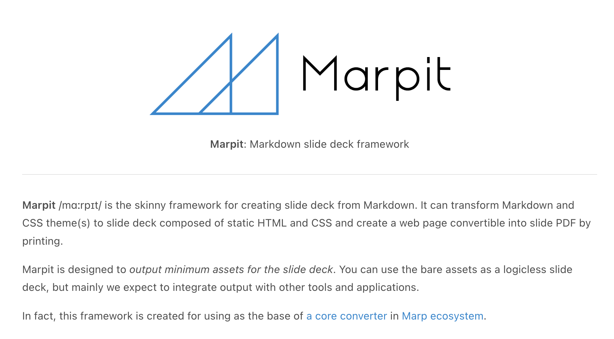

----
marp: true
title: Marpはいいぞ
description: 於 PHPカンファレンス福岡2024・LT (2024/6/22)
header: "Marpはいいぞ"
footer: "presentation by Uchio Kondo"
image: https://udzura.jp/slides/2024/phpconfuk2024-lt/ogp.png
theme: fukuokarb
paginate: true
----

<!--
_class: hero
-->

# Marpはいいぞ

----
<!--
class: profile
style: section.profile ul { width: 110% }
-->

# 近藤うちお / @udzura

- 所属: 株式会社ミラティブ
- 福岡市エンジニアカフェ
ハッカーサポーター
- フィヨルドブートキャンプ
アドバイザー
- 普段はGoでミドルウェア開発
- 『入門 eBPF』（オライリージャパン）翻訳しました何卒

----

<!--
_class: hero
-->

# Marpはいいぞ

----

<!--
_class: hero
-->

----

<!--
_class: hero
-->

# [Marp](https://marpit.marp.app/)っちなん

- Markdownで原稿を書いたらスライドにしてくれるツール
- <s>RubyistだけどRabbitじゃなくてこっち使ってます...</s>

----

<!--
_class: hero
-->

# Marpのいいところ

----

<!--
_class: hero
-->

# Marpのいいところ(1)

- VSCodeの拡張が便利
- プレビュー機能で大体表示確認OK

----

<!--
_class: hero
-->

----

<!--
_class: hero
-->

# Marpのいいところ(2)

- export フォーマットが多い
- HTML/PDF、ogp用の画像もOK

----

<!--
_class: hero
-->

# Marpのいいところ(3)

- テーマがCSSベース
- Webの知識で色々カスタマイズできる
  - 昔の個人サイトをいじってたときのCSS知識でも安心
- フォントも最近はwebフォントが多くて助かる

----

<!--
_class: hero
-->

# Marpのいいところ(4)

- HTMLベースで吐き出せるので、JavaScriptを埋め込める
- WASMも埋め込める
- インタラクティブコンテンツ！

----

<!--
_class: hero
style: button { font-size: 36pt; } 
-->

<h1 id="myTitle">埋め込んだ様子です</h1>

 

<button onclick="fire();">calc fib</button> 　　fib( <input id="myValue" type="text" value="20" size="5"> ) = <input id="myAnswer" type="text" value="?">
 

<button onclick="fire2();">Another interaction</button>

----

<!--
_class: hero
-->

# Marpのいいところ(5)

- HTMLベースで吐き出せるので、一般的なホスティングで配れる
- GitHub PagesでもOK！
- ドメインも設定すればpermalinkもかっこよくできるぞ！
  - e.g. `https://udzura.jp/slides/2024/phpconfuk2024-lt/`

----

<!--
_class: hero
-->

# まとめ

* Marp 試してみてください
* 『入門eBPF』買ってください
（突然の宣伝）

----

<!--
_class: hero
-->

# まとめ

- Marp 試してみてください
- 『入門eBPF』買ってください（突然の宣伝）

