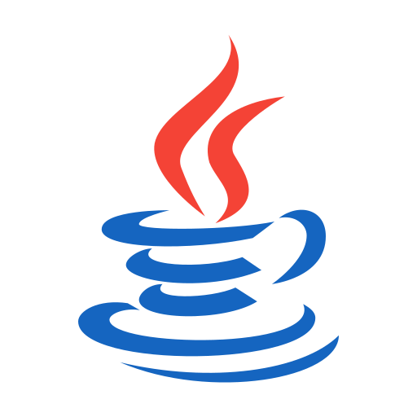
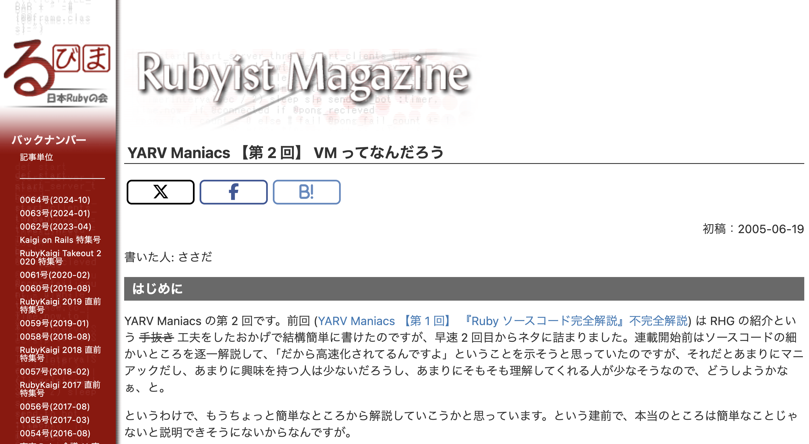
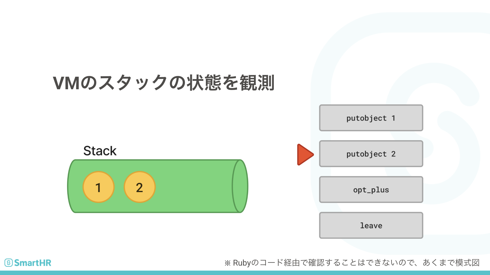

# PHPでWebAssemblyを動かす

## @ PHPカンファレンス福岡2025

-----

# PHPでWebAssemblyを動かす

  - 発表者: 近藤
  - 普段はRubyを書いています
  - 所属: SmartHR (タレントマネジメント、人事労務系サービスを提供)

-----

# WebAssembly (Wasm) とは？

  - **様々な言語をブラウザ上で動かすための技術**
      - C/C++、Rust、Go、Python、Ruby などをサポート
  - **仕組み:**
    1.  各言語のコードをWasm形式のバイナリーにコンパイル
    2.  そのバイナリーをブラウザ内で実行
  - **メリット:**
      - JavaScript以外の言語をブラウザで利用可能
      - コンパイルによる**高速化や最適化**が期待できる


-----

# Wasmの実行環境はブラウザだけではない

  - Wasmバイナリーの形式にしてしまえば、どこでも動かせる
  - **実行環境の多様性:**
      - ブラウザ内
      - ターミナル (CLI)
      - 組み込み環境
      - **ミドルウェア内** (例: ロードバランサー)
  - **コンセプト:** 「どんな言語でも書けるし、どんな場所でも動かせる」

-----



-----

# Wasmの様々な実行環境の実装例

  - Wasmは**他の言語のVM内に組み込んで動かす**使い方ができる
  - **Go言語 (Wazero):**
      - 純粋なGoだけで組まれたWasmランタイム
      - Cコードを使わず、Goから動的にWasmプラグインを読み込ませることが可能
  - **Ruby (Wasmtimeなど):**
      - WasmtimeはRubyで書かれたWasmランタイムがある
  - **一般的な実装:**
      - CやRustで書かれたランタイムを、FFI (外部関数インターフェース) を使って組み込むパターンが多い

-----

# PHPでWasmを動かすには？

  - **方法1: C拡張もしくはFFIを使う**
      - Cで書かれたWasmランタイムをPHPから呼び出す
      - 技術的には可能だが、運用や実装が面倒になることが多い

-----

# PHPでWasmを動かすには？

  - **方法2: PHPで純粋なVMを実装する**
      - PHPだけでWasmバイナリーをパースし、実行するVM（仮想マシン）を実装する
      - **本発表のゴール:** PHPでWasm VMを実装し、WasmをPHP上で動かす！

-----

# VM（仮想マシン）の基本的な概念

  - **VMとは？**
      - 言語処理における**抽象レイヤー（インターフェース）**
      - 様々な環境でコードを動かすために導入される (例: Java、Ruby、Python、PHPのZend VM)

-----



- [YARV Maniacs 【第 2 回】 VM ってなんだろう](https://magazine.rubyist.net/articles/0007/0007-YarvManiacs.html)

-----

# VM ってなんだろう より引用

> で、なんで仮想化するかということですが、まぁ、ぶっちゃけ便利になるからですね。<br />
> ...
> 具体的な何かに依存するよりは、中間層を設けることによって別々のものを扱いやすくしましょう、というのが仮想化です。中間層により、上層で利用することのできるインターフェースを共通化することで利用しやすくしましょうね、ということです。

-----

# VM（仮想マシン）の基本的な概念

  - **VMの構成要素:**
    1.  **命令のセット:** VMが解釈できる命令 (例: `i32.add`, `i32.const`)
    2.  **実行機構（エバリュエーター/評価器）:** 命令を解釈し、処理を行う

-----

# Wasm VMは「スタックマシン」

  - WasmのVMは**スタックマシン**を採用している
  - **スタックマシンとは？**
      - 演算の対象となる値を **スタック（LIFO構造）** で管理するVM
      - **命令の実行プロセス:**
        1.  `Const 10` → スタックに10を積む
        2.  `Const 20` → スタックに20を積む
        3.  `Add` → スタックから20と10を取り出す (Pop)
        4.  計算 ($20 + 10 = 30$)
        5.  結果30をスタックに戻す (Push)
  - 多くのVM (PHP Zend VM, Java, Ruby) がスタックマシンを採用

-----



-----

# PHPでWasm風の命令を動かすデモ (概念)

  - **命令をPHPの配列で表現:**
    `$instructions = ['i32.const 10', 'i32.const 20', 'i32.add'];`
  - **スタックをPHPの配列で表現:**
    1.  `i32.const 10` 実行後: `[10]`
    2.  `i32.const 20` 実行後: `[10, 20]`
    3.  `i32.add` 実行後: `10, 20` を取り出し、計算し、 `30` をスタックに戻す: `[30]`
  - 最終的なスタックのトップ（30）が返り値となる

-----

# 実装コード

- スタックの定義

```php
class VM {
    private $stack = []; // 
    private $instructions = [];
    private $pc = 0; // program counter

    public function load($instructions): void {
        $this->instructions = $instructions;
    }

    public function run(): void {
        // instructions を順に評価
        while ($this->pc < count($this->instructions)) {
            $this->evaluate($this->instructions[$this->pc]);
            $this->pc++;
        }

        print("Final Stack: [" . implode(', ', $this->stack) . "]\n");
    }
    // ...
}
```

-----

- 命令を評価する本体

```php
class VM {
    // ...
    private function evaluate($instruction): void {
        list($op, $arg) = explode(' ', $instruction . ' ', 2);
        switch ($op) {
            case 'i32.const':
                $this->stack[] = (int)$arg;
                break;
            case 'i32.add':
                $b = array_pop($this->stack);
                $a = array_pop($this->stack);
                $this->stack[] = $a + $b;
                break;
            default:
                throw new Exception("Unimplemented or unsupported instruction: $op");
        }
    }
}
```

----

```php
$vm = new VM();
$vm->load([
    'i32.const 10',
    'i32.const 20',
    'i32.add',
]);
$vm->run();
```

---

```php
$ php ./samplevm/main.php
Final Stack: [30]
```

-----

# Wasm VMを実装するための学習リソース

  - Wasmの完全な実装は複雑でボリュームがある
  - **参考資料:** **「RustでWebAssemblyを実装しよう」** (Gorillaさんによる本)
      - RustでWasmの最小実装を解説している
      - Wasmの仕様に忠実な設計を採用

-----

# Wasm実装のポイント (1): バイナリーフォーマット

  - Wasmファイルは**バイナリーフォーマット**に従う
  - **構造:** 複数の**セクション**が並んで構成されている
  - **サイズ表記:** **LEB128**という可変長の形式が使われている

-----

# Wasm実装のポイント (2): 内部設計と命令

  - Wasmの仕様にはVMの**内部アーキテクチャ**に関する記述がある
  - **命令セット:** Wasmには約200種類の命令がある
  - **最小限の実装:** まずはGorilla本で紹介されている**最低限の命令セット** (例: $I32$型の算術命令) から実装していくことで、十分に動作させることが可能

-----

# Wasm実装のポイント (3): WASI (System Interface)

  - **WASI (WebAssembly System Interface) とは？**
      - Wasm VMで「Hello World」のようなOS機能（標準出力など）を使うための**抽象化されたインターフェース**
  - Wasmバイナリー内でWASI仕様を満たす関数を呼び出すことで、システム機能を利用できる
  - **例:** 標準出力に書き出す命令の実装が必要

-----

# PHPによるWasm VMの実装 (デモ)

  - **実装:** Gorilla本の設計をベースに、過去にRubyで実装した経験を活かし、**PHPに移植**した
  - **デモ環境:** Wasmtime (標準的なWasmランタイム) と自作PHP VMで同じWasmバイナリー (Hello World) を実行
  - **結果:** PHPで実装したWasm VMでも、正しく"Hello World"のWasmバイナリーが実行できた

-----

# まとめと今後

  - **本日の発表:** PHPによるWasm VMの最小限の実装を紹介しました
  - **実装の感想:** PHPのバイナリー操作関数が豊富で、実装は比較的容易に感じた
  - **今後の展望:**
      - 命令をさらに追加することで、本格的に動作するVMになる
      - 興味がある方は、ぜひプルリクエストをお待ちしています

-----

# ご清聴ありがとうございました