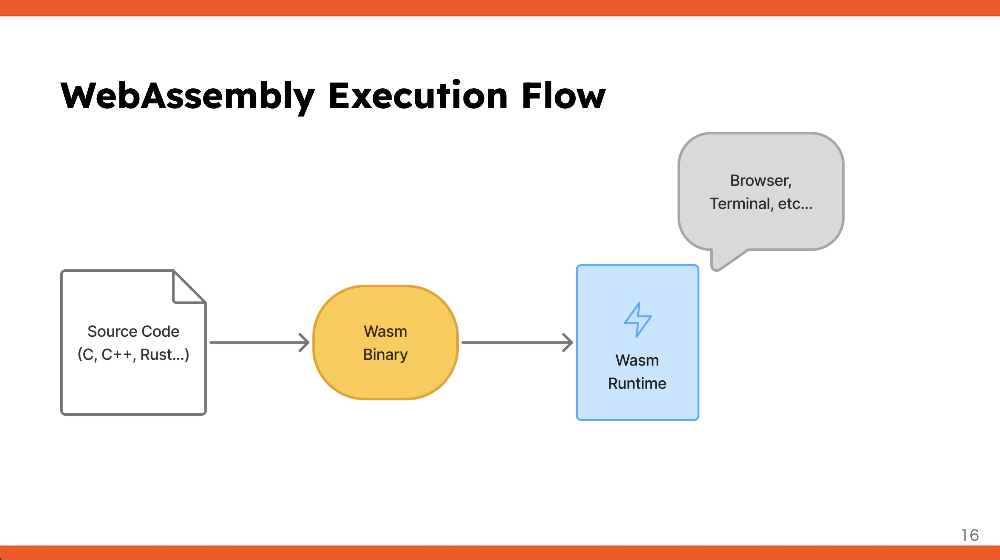
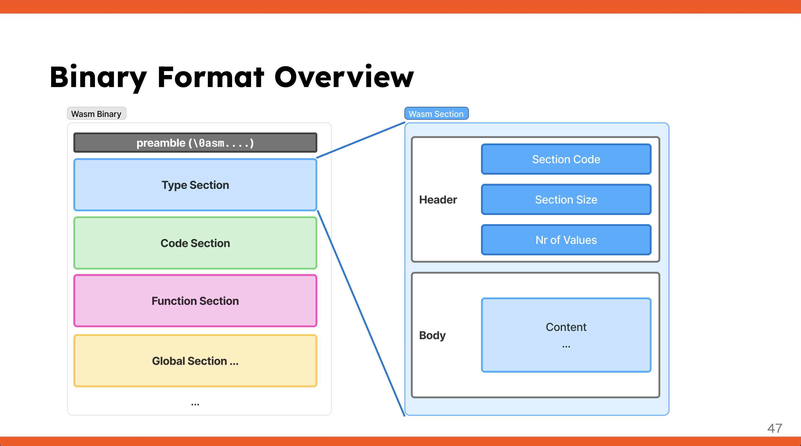
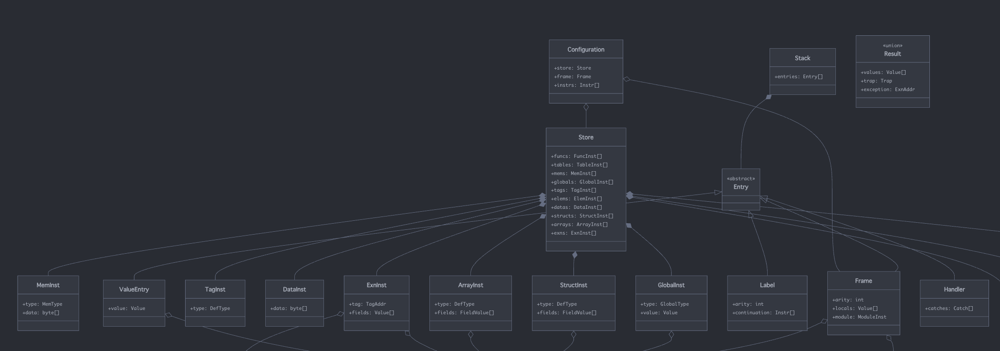
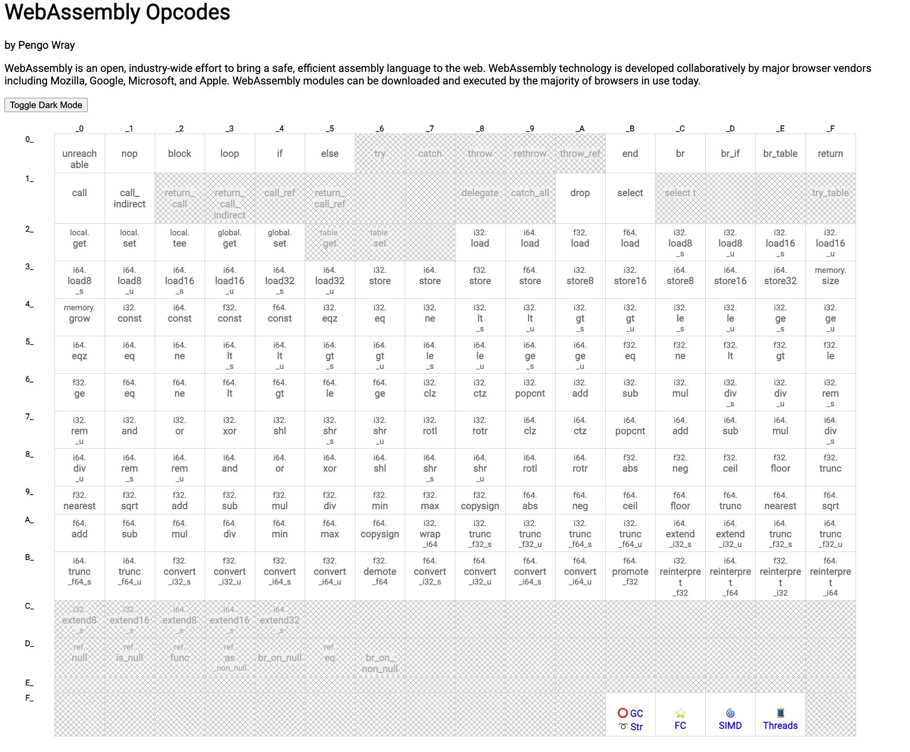
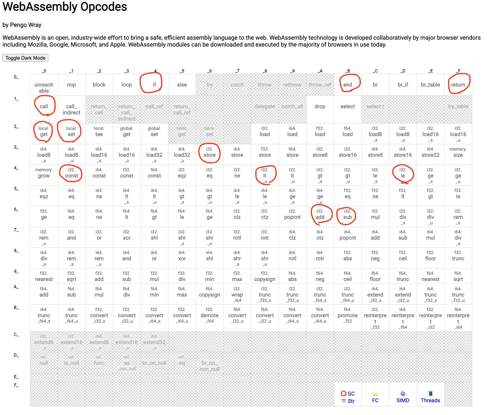
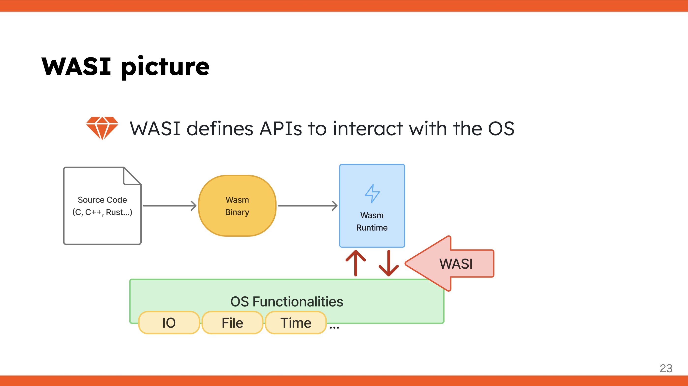

# PHPで“本気で”WebAssemblyを動かす方法

## PHPカンファレンス福岡2025 @ 2025.11.8

-----

# 自己紹介

  - Uchio Kondo
  - 普段はRubyを書いています
  - 好きなカレー: Tiki
  - 所属: SmartHR (人事労務/タレントマネジメントSaaS)

-----

# 宣伝

- 福岡Rubyist会議05 (2026.2.28 @ 博多)
- CfP is open!!!!!!!!!
- 来年も福岡でワイワイやりましょう！
- Rubyistでなくても、"""やってる人"""はしゃべってほしい！

-----

# 今日のテーマは WebAssembly

<!--
  HERO
-->

-----

# WebAssembly (Wasm) とは？

  - **様々な言語をブラウザ上で動かすための技術**
      - C/C++、Rust、Go、Python、Ruby などをサポート
  - **仕組み:**
    1.  各言語のコードをWasm形式のバイナリーにコンパイル
    2.  そのバイナリーをブラウザ内で実行

-----



> https://udzura.jp/slides/2025/rubykaigi/#16

<!--
  IMAGE_ONLY
-->

-----

# Why WebAssembly?

  - **メリット:**
      - JavaScript以外の言語をブラウザで利用可能
      - コンパイルによる**高速化や最適化**が期待できる

-----

# Wasmの実行環境はブラウザだけではない

  - Wasmバイナリーの形式にしてしまえば、どこでも動かせる:
      - ブラウザ内
      - ターミナル (CLI)
      - 組み込み環境
      - ミドルウェア内 (例: Envoy)
  - 「どんな言語でも書けるし、どんな場所でも動かせる」

-----


<!--
  IMAGE_ONLY
-->

-----

# Wasmの様々な実行環境の実装例

  - Wasmは**他の言語に組み込んで動かす**使い方ができる
  - **一般的な実装:**
      - CやRustで書かれたランタイムを使う
      - ネイティブライブラリやFFI (外部関数インターフェース) を使って組み込むパターンが多い
      - Wasmで他言語のプラグインが書ける

-----

# 純粋に特定の言語で書かれたWasmランタイムの例

  - **Go言語 (Wazero):**
      - 純粋なGoだけで組まれたWasmランタイム
      - Cコードを使わず、Goから動的にWasmプラグインを読み込ませることが可能
  - **Ruby (Wardite; 拙作):**
      - WarditeはRubyで書かれたWasmランタイム

-----

# PHPでWasmを動かすには？

  - **方法1: C拡張もしくはFFIを使う**
      - Cで書かれたWasmランタイムをPHPから呼び出す
          - ネイティブ拡張が必須になる
      - 技術的には可能だが、運用や実装が面倒になることが多い

-----

# PHPでWasmを動かすには？

  - **方法2: PHPで純粋なVMを実装する**
      - PHPだけでWasmバイナリーをパースし、実行するVM（仮想マシン）を実装する...
      - え!!　PHPだけでWasm VMを!?

-----

# できらぁ！（画像略）

-----

# 本発表のゴール: PHPでWasm VMを実装し、WasmをPHP上で動かす！

<!--
  HERO
-->

-----

# Wasm VM実装に必要な知識

<!--
  HERO
-->

-----

# VM（仮想マシン）の基本的な概念

  - **VMとは？**
      - 言語処理における**抽象レイヤー（インターフェース）**
      - 様々な環境でコードを動かすために導入される (例: Java、Ruby、Python、PHPのZend VM)

-----


- [YARV Maniacs 【第 2 回】 VM ってなんだろう](https://magazine.rubyist.net/articles/0007/0007-YarvManiacs.html)

-----

# 『VM ってなんだろう』 より引用

で、なんで仮想化するかということですが、まぁ、ぶっちゃけ便利になるからですね。<br />
... 具体的な何かに依存するよりは、中間層を設けることによって別々のものを扱いやすくしましょう、というのが仮想化です。中間層により、上層で利用することのできるインターフェースを共通化することで利用しやすくしましょうね、ということです。

<!--
  QUOTE
-->

-----

# VM（仮想マシン）の基本的な概念

  - **VMの構成要素:**
    1.  **命令のセット:** VMが解釈できる命令 (例: `i32.add`, `i32.const`)
    2.  **実行機構（エバリュエーター/評価器）:** 命令を解釈し、処理を行う

-----

# Wasm VMは「スタックマシン」

  - WasmのVMは**スタックマシン**を採用している
  - 多くのVM (PHP Zend VM, Java, Ruby) もスタックマシンを採用

-----

# スタックマシンとは？

  - 演算の対象となる値を **スタック（LIFO構造）** で管理するVM
  - **命令の実行プロセス例:**
    1.  `Const 10` → スタックに10を積む
    2.  `Const 20` → スタックに20を積む
    3.  `Add` → スタックから20と10を取り出す (Pop)
    4.  計算 (`20 + 10 = 30`)
    5.  結果30をスタックに戻す (Push)

-----


> https://docs.google.com/presentation/d/1W5H9NkaF6rDWWF387XXHMMMTs9GU1dDcCCCC1n5aaDs/edit?usp=sharing

<!--
  IMAGE_ONLY
-->

-----

# PHPでWasm風の命令を動かす概念プログラム

  - **命令をPHPの文字列の配列で表現:**
  - **スタックもPHPの配列で表現:**
    1.  `i32.const 10` 実行後: `[10]`
    2.  `i32.const 20` 実行後: `[10, 20]`
    3.  `i32.add` 実行後: `10, 20` を取り出し、計算し、 `30` をスタックに戻す: `[30]`
  - 最終的なスタックのトップ（30）が返り値となればOK

-----

# 実装コード: スタック等の定義

```php
class VM {
    private $stack = [];
    private $instructions = [];
    private $pc = 0; // program counter

    public function load($instructions): void {
        $this->instructions = $instructions;
    }

    public function run(): void {
        // instruction loop:
        while ($this->pc < count($this->instructions)) {
            $this->evaluate($this->instructions[$this->pc]);
            $this->pc++;
        }
        print("Final Stack: [" . implode(', ', $this->stack) . "]\n");
    }
    // ...
}
```

-----

# 実装コード: 命令を評価する本体

```php
class VM {
    private function evaluate($instruction): void {
        list($op, $arg) = explode(' ', $instruction . ' ', 2);
        switch ($op) {
            case 'i32.const':
                $this->stack[] = (int)$arg;
                break;
            case 'i32.add':
                $b = array_pop($this->stack);
                $a = array_pop($this->stack);
                $this->stack[] = $a + $b;
                break;
            default:
                throw new Exception("Unimplemented or unsupported instruction: $op");
        }
    }
}
```

----

# このVMを動かしてみる

```php
$vm = new VM();
$vm->load([
    'i32.const 10',
    'i32.const 20',
    'i32.add',
]);
$vm->run();
```

---

# 結果

```php
$ php ./samplevm/main.php
Final Stack: [30]
```

-----

# Wasm VMを学ぶ

<!--
  HERO
-->

-----

# Wasm VMを実装するための学習リソース

  - Wasmの完全な実装は複雑でボリュームがある
  - **「[RustでWasm Runtimeを実装する](https://zenn.dev/skanehira/books/writing-wasm-runtime-in-rust)」** (ゴリラさんによる本) がある
      - RustでWasmの最小実装を解説している
      - Wasmの仕様に忠実な設計を採用

-----

# Wasm実装のポイント (1): バイナリーフォーマット

  - Wasmファイルは**バイナリーフォーマット**を持っている
  - **構造:** 複数の**セクション**が並んで構成されている

-----



-----

# 余談: LEB128という数値エンコーディング

- Wasmの内部では**LEB128**という可変長の形式が使われている

-----

# Wasm実装のポイント (2): 内部設計と命令

  - Wasmの仕様にはVMの**内部アーキテクチャ**に関する記述がある
  - **命令セット:** Wasmには約200種類の命令がある
  - まずはゴリラ本で紹介されている**最低限の命令セット** から実装

-----



[4.2. Runtime Structure](https://webassembly.github.io/spec/core/bikeshed/#runtime-structure%E2%91%A0)

-----



-----



-----

# Wasm実装のポイント (3): WASI (System Interface)

  - **WASI (WebAssembly System Interface) とは？**
      - Wasm VMで「Hello World」のようなOS機能（標準出力など）を使うための**抽象化されたインターフェース**
  - Wasmバイナリー内でWASI仕様を満たす関数を呼び出すことで、システム機能を利用できる
  - **例:** 標準出力に書き出す命令の実装が必要

-----



-----

# 実際に作ってみた

<!--
  HERO
-->

-----

# リポジトリは以下です

- [GitHub - udzura/phpconvm](https://github.com/udzura/phpconvm)

-----

# PHPによるWasm VMの実装 (デモ)

  - **実装:** Gorilla本の設計をベースに、過去にRubyで実装した経験を活かし、**PHPに移植**した
  - **デモ内容:** 自作PHP VM/Ruby製VMでWasmバイナリー (Hello World, fib) を実行

-----

```console
$ php src/main.php examples/helloworld.wasm 
[debug] VM initialized.
warning: unimplemented section: 0x0
Hello, World!
```

<!--
  IMAGE_ONLY
-->

-----

```console
$ time php src/main.php examples/fib.wasm fib 30
[debug] VM initialized.
warning: unimplemented section: 0x0
Return value: 1346269
php src/main.php ...  6.60s user 0.03s system 99% cpu 6.640 total
```

<!--
  IMAGE_ONLY
-->

-----

```console
## JIT enabled:
$ time php src/main.php examples/fib.wasm fib 30
[debug] VM initialized.
warning: unimplemented section: 0x0
Return value: 1346269
php src/main.php ...  4.29s user 0.04s system 99% cpu 4.334 total
```

<!--
  IMAGE_ONLY
-->

-----

# ちなみに元のRuby実装

```console
$ time bundle exec ruby exe/wardite ../../examples/fib.wasm fib 30
warning: unimplemented section: 0x00
return value: 1346269
bundle exec ruby ...  7.90s user 0.07s system 99% cpu 8.019 total
```

-----

# ちなみに元のRuby実装(YJIT enabled)

```console
$ time bundle exec ruby --yjit exe/wardite ../../examples/fib.wasm fib 30
warning: unimplemented section: 0x00
return value: 1346269
bundle exec ruby --yjit ...  3.44s user 0.06s system 98% cpu 3.549 total
```

-----

# 結果を比較

- `fib(30)``を計算した場合の実行時間比較

| 実装               | 実行時間(通常) | 実行時間(JIT有効) |
|--------------------|----------------|--------------------|
| PHP実装            | 6.64秒         | 4.33秒           |
| Ruby実装           | 8.02秒         | 3.55秒           |

-----

# PHPによるWasm VMの実装の感想

  - **学び:**
      - PHP、豊富な文字列操作関数があるので結構サクサク作れた...
      - オンメモリバッファの作り方知らなかった。 `fopen('php://memory', 'r+b')`
  - あと正直な話
      - AIありがとう...

-----

# まとめと今後

  - **本日の発表:**
      - PHPによるWasm VMの最小限の実装を紹介
  - **今後の展望:**
      - 命令をさらに追加することで、本格的に動作するVMになるはず
      - 興味がある方は、ぜひプルリクエストをお待ちしています

-----

# ご清聴ありがとう<br />ございました！！

<!--
  GOODBYE
-->
