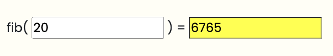
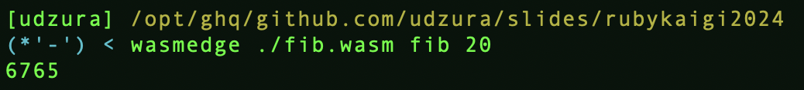
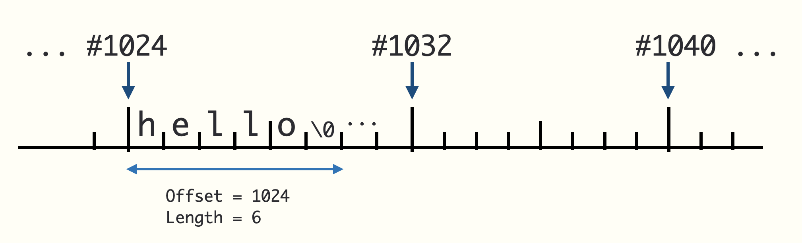

----
marp: true
theme: rubykaigi2024
paginate: true
backgroundImage: url(./rubykaigi2024-bgs-main.png)
title: An mruby for WebAssembly
description: On RubyKaigi 2024 Okinawa / An mruby for WebAssembly
header: "An mruby for WebAssembly"
image: https://udzura.jp/slides/2024/rubykaigi/ogp.png
----


----
<!--
_class: title
_backgroundImage: url(./rubykaigi2024-bgs-title.png)
-->

# An mruby for WebAssembly

## Presentation by Uchio Kondo

----
<!--
_class: normal
-->


# self.introduce!

- Uchio Kondo
  - from Fukuoka.rb
- Infra Engineer @ Mirrativ, Inc.
  - livestreaming & "live" gaming
- Translator of "Learning eBPF"


----
<!--
_class: hero
_backgroundImage: url(./rubykaigi2024-bgs-yellowback.png)
-->

# Ruby and WebAssembly

----
<!--
_class: normal
-->

# Code sample background rule:

```ruby
Ruby.has :red, :background
```

```javascript
(window.JavaScript || TypeScript).then("yellow");
```

```rust
Rust::<BackGround>::purple().unwrap();
```

```lua
other_lang { "Lua" = green.background, "and" = so.on }
```

Other code or command sample has default gray back

----
<!--
_class: normal
-->

# Ruby for WebAssembly(WASM)?

- It's `ruby.wasm`, You know.
- A CRuby(MRI) That is compiled into wasm
  - C-based code -> Ruby runtime on wasm
  - WASI support

----
<!--
_class: normal
-->

# Showing another approach

- **mruby/edge** is yet another "Ruby on wasm"
- It is a basically mruby
  - but specialized for WebAssembly use case

----

<!--
_class: hero
_backgroundImage: url(./rubykaigi2024-bgs-whiteback.png)
-->

# So, What is mruby/edge?

----
<!--
_class:
  - normal
  - pre-top75
-->

# mruby/edge getting started

- mruby/edge consists of 2 components
  - mruby/edge "core" crate
  - the `mec` command (**m**ruby/**e**dge **c**ompiler)
  - Install `mec` first!

```
$ cargo install mec
```

----
<!--
_class: normal
-->

# Prepare "Plain Old" Ruby script

```ruby
# fib.rb
def fib(n)
  case n
  when 0
    0
  when 1..2
    2
  else
    fib(n - 1) + fib(n - 2)
  end
end
```

----
<!--
_class: normal
-->

# Prepare RBS file for fib()

```ruby
# fib.export.rbs
def fib: (Integer) -> Integer
```

※ We have another option, but recommend to make this


----
<!--
_class: normal
-->

# Compile it into... WASM file

```
$ mec --no-wasi fib.rb
...
running: `cd .. && rm -rf work-mrubyedge-bhuxkrgcgOe5TAmDWFiMkgF5uVbnS9lR`
[ok] wasm file is generated: fib2.wasm

$ file fib.wasm
fib.wasm: WebAssembly (wasm) binary module version 0x1 (MVP)
```

----
<!--
_class: normal
-->

# Note that it has exported function `fib`

```
$ wasm-objdump -x -j Export ./fib.wasm

fib.wasm:       file format wasm 0x1
module name: <mywasm.wasm>

Section Details:

Export[3]:
 - memory[0] -> "memory"
 - func[417] <fib.command_export> -> "fib"
```

----
<!--
_class: normal
-->

# Then we can try it using (e.g.) wasmedge

```
$ wasmedge ./fib.wasm fib 15
610

$ wasmedge ./fib.wasm fib 20
6765
# ...
```

----
<!--
_class:
  - normal
  - sample2
-->

# Can this WASM available on a browser?

- prepare `wasm.html` including:

```html
<script async type="text/javascript">
  window.fire = function(e) {
    WebAssembly.instantiateStreaming(fetch("./fib.wasm"), {}).then(function (o) {
      let value = document.getElementById("myValue").value;
      let answer = o.instance.exports.fib(parseInt(value));
      document.getElementById("myAnswer").value = answer;
  });};
</script>
```

----
<!--
_class: normal
-->

# A working demo on the slide

<script type="text/javascript">
  const wasiImport = {
    fd_write: function(id, iovs_ptr, iovs_len, nwritten_ptr) { return 0; },
    random_get: function(buf, buf_len) {},
    clock_time_get: function(buf, buf_len) {},
    environ_get: function(environ, environ_buf) { return 0; },
    environ_sizes_get: function(environ_count, environ_size) { return 0; },
    proc_exit: function(exit_code) { return 0; }
  };
  window.fire = function(e) {
    const importObject = {
      "wasi_snapshot_preview1": wasiImport,
	  };
    WebAssembly.instantiateStreaming(fetch("./fib.wasm"), importObject)
      .then(function (o) {
        let value = document.getElementById("myValue").value;
        let answer = o.instance.exports.fib(parseInt(value));
        document.getElementById("myAnswer").style.backgroundColor = "#ffff00";
        document.getElementById("myAnswer").value = answer;
      }
    );    
  };
  console.log("done load function");
</script>

<button onclick="fire();">calc fib</button> 　　fib( <input id="myValue" type="text" value="20"> ) = <input id="myAnswer" type="text" value="?">
<br>

----
<!--
_class: normal
-->

# So with mruby/edge we can...

- Create a WASM file from Ruby script
- **Export** a specific "function" on that WASM
- In addition, we can specify **import functions**

----
<!--
_class: normal
-->

# Today, I will present you mruby/edge

- But before we understand mruby/edge, we have to have a graps with 2 technologies...
  - WebAssembly
  - ... and mruby!
- So let's start the journey together!

----
<!--
_class: hero
_backgroundImage: url(./rubykaigi2024-bgs-yellowback.png)
-->


# A Tour of WebAssembly

----
<!--
_class: normal
-->

# How do you know WebAssembly?

- Browser-based something...
- C++? or Rust? can be executed via WASM...
- Ruby or Python can run on browser by magical WASM power...
- Google meet? or Unity web games? or some cool contents

----
<!--
_class: normal
-->

# WebAssembly in a nutshell

- WebAssembly is a stack-based virtual machine
  - That can run its instructions on browser --
  - -- or *everywhere*

----
<!--
_class: normal
-->

# WebAssembly is used in:

- For example:
  - Browsers
  - Server-side programmes
  - Load Balancer Plugins, Containers, Supervisor
- ... everywhere!

----
<!--
_class:
  - normal
  - logos
-->

# WebAssembly as a embedded config

- e.g. some of middlewares supports
wasm configuration
  - envoy
  - fluent-bit
  - Open Policy Agent ...


----
<!--
_class:
  - normal
  - two-samples
-->

# Both browsers and servers

- As we have seen, one wasm binary can be executed
both on browser and on terminal:

| environment | sample |
| ----------- | ------ |
| Browser |  |
| Terminal |  |

----
<!--
_class: normal
-->

# WASM's interface

- WASM can:
  - *export* its functions to outer libraries (as a normal sharedlibs)
  - *import* functions from outer world

----
<!--
_class: normal
-->

# How to import and export function

```ruby
# rk2024.rb
def runit(arg)
  answer = arg + 42
  show_answer(answer)
end
```

```ruby
# rk2024.export.rbs
def runit: (Integer) -> void
```

```ruby
# rk2024.import.rbs
def show_answer: (Integer) -> void
```

----
<!--
_class:
  - normal
  - pre-top5
-->

# Setting up this in browser

```javascript
// Will be imvoked via main()
function show_answer(ans) {
  console.log("answer = ", ans);
}
// Specify what func to import
const importObject = {
  env: {show_answer: show_answer}
};
WebAssembly.instantiateStreaming(fetch("./rk2024.wasm"), importObject).then(
  (obj) => {
    // Call exported main() after load, with arg 21
    obj.instance.exports.runit(21);
  },
);
```

----
<!--
_class:
  - normal
  - img-front
-->

# The result:

- Note: modified version

<script type="text/javascript">
  const wasiImport2 = {
    fd_write: function(id, iovs_ptr, iovs_len, nwritten_ptr) { return 0; },
    random_get: function(buf, buf_len) {},
    clock_time_get: function(buf, buf_len) {},
    environ_get: function(environ, environ_buf) { return 0; },
    environ_sizes_get: function(environ_count, environ_size) { return 0; },
    proc_exit: function(exit_code) { return 0; }
  };
  function show_answer(answer) {
    console.log("answer = ", answer);
    document.getElementById("myAnswer2").style.backgroundColor = "#ffff00";
    document.getElementById("myAnswer2").value = answer;
  }
  
  window.fire2 = function(e) {
    const importObject2 = {
      "wasi_snapshot_preview1": wasiImport2,
      env: {show_answer: show_answer},
	  };
    WebAssembly.instantiateStreaming(fetch("./rk2024.wasm"), importObject2)
      .then(function (o) {
        let answer = o.instance.exports.runit(21);
      }
    );    
  };
  console.log("done load function");
</script>

<button onclick="fire2();">Show anwser?</button> 　　<input id="myAnswer2" type="text" value="??"><br>

----
<!--
_class: hero
_backgroundImage: url(./rubykaigi2024-bgs-whiteback.png)
-->

# One more step into WebAssembly

----
<!--
_class: normal
-->

# WebAssembly is a binary with laid-out info

- magic: `0x00 0x61 0x73 0x6D`
- version: `0x01 0x00 0x00 0x00` (for v1)
- sections:
  - Known sections: type, import, function, table, memoty, export...
    - 12 kinds
  - Custom sections

----
<!--
_class: normal
-->

# Kind of WASM known sections (excerpt.) 1/2:

| name | description |
| ---- | ----------- |
| Type | Function signatures to use in wasm |
| Function | Function declaretions |
| Memory | Linear-memory descriptions |
| Global | Global declarations |

----
<!--
_class: normal
-->

# Kind of WASM known sections (excerpt.) 2/2:

| name | description |
| ---- | ----------- |
| Export | Name of exports(functions, memory, globals...) |
| Import | Module and function names to import |
| Code | Bodies of functions |
| Data | Data initializers that will be loaded into the linear memory |

----
<!--
_class: normal
-->

# Inspecting WASM code as WAT format:

```
$ wasm-objdump -d ./fib.wasm | less
...
0006ad func[12] <fib>:
 0006ae: 03 7f                      | local[2..4] type=i32
 0006b0: 01 7c                      | local[5] type=f64
 0006b2: 23 80 80 80 80 00          | global.get 0 <__stack_pointer>
 0006b8: 41 b0 02                   | i32.const 304
 0006bb: 6b                         | i32.sub
 0006bc: 22 01                      | local.tee 1
 0006be: 24 80 80 80 80 00          | global.set 0 <__stack_pointer>
 0006c4: 20 01                      | local.get 1
 0006c6: 41 38                      | i32.const 56
 0006c8: 6a                         | i32.add
 0006c9: 41 ff 80 c0 80 00          | i32.const 1048703
 0006cf: 41 83 02                   | i32.const 259
 0006d2: 10 a3 81 80 80 00          | call 163 <_ZN9mrubyedge4rite4rite4load17h9f737249e845f4b1E>
```

----
<!--
_class:
  - normal
  - pre-with-desc
-->

# How to check "exported" `fib` signature

- Check Type section, Function section

```
$ wasm-objdump -x -j Function ./fib.wasm | grep fib
 - func[12] sig=2 <fib>

$ wasm-objdump -x -j Type ./fib.wasm           
Type[23]:
 - type[0] (i32, i32) -> nil
 - type[1] (i32, i32, i32) -> i64
 - type[2] (i32) -> i32
 # => Here's fib(i32) -> i32 !
 - type[3] (i32, i32, i32) -> i32
 ...
```

----
<!--
_class: hero
_backgroundImage: url(./rubykaigi2024-bgs-whiteback.png)
-->

# WASI (in preview1)

----
<!--
_class: normal
-->

# What is WASI

- An interface to "system" functionalities for WASM
- Accessing file, socket, randomness ... 
  - or raise/exit process thread, ...
- Allow WASM programs to run on systems as usual middlewares

----
<!--
_class:
  - normal
  - pre-top20
-->

# What is WASI in practice

- Bunch of functions to "import" 

```
$ mec fib.rb
$ wasm-objdump -x -j Import ./fib.wasm 
...
Import[5]:
 - func[0] sig=7 <_ZN4wasi13lib_...> <- wasi_snapshot_preview1.fd_write
 - func[1] sig=5 <_ZN4wasi13lib_...> <- wasi_snapshot_preview1.random_get
 - func[2] sig=5 <__imported_wasi_...> <- wasi_snapshot_preview1.environ_get
 - func[3] sig=5 <__imported_wasi_...> <- wasi_snapshot_preview1.environ_sizes_get
 - func[4] sig=4 <__imported_wasi_...> <- wasi_snapshot_preview1.proc_exit
```

----
<!--
_class: normal
-->

# c.f. They're very like system calls:

- fd_write
  - `write(2)`
- random_get
  - `getrandom(2)`
- proc_exit
  - `_exit(2)` ...

----
<!--
_class:
  - normal
  - pre-top20
-->

# When you want to stub WASI...

- Delve into [bjorn3/browser_wasi_shim](https://github.com/bjorn3/browser_wasi_shim) for example

```javascript
let args = ["bin", "arg1", "arg2"]; //...
let wasi = new WASI(args, _env, _fds);
let wasm = await WebAssembly.compileStreaming(fetch("bin.wasm"));
let inst = await WebAssembly.instantiate(wasm, {
  // Here specifies the import object
  "wasi_snapshot_preview1": wasi.wasiImport,
});
wasi.start(inst);
```

----
<!--
_class:
  - normal
  - pre-top20
-->

# More concrete examples

- Delve into [browser_wasi_shim](https://github.com/bjorn3/browser_wasi_shim) for example
  - impl of [clock_time_get()](https://github.com/bjorn3/browser_wasi_shim/blob/7d86a13b9b38900bccfd7374bfaa7315ac299d08/src/wasi.ts#L160-L183)

```typescript
// NOTE: time is a pointer to feed result back
clock_time_get(id: number, precision: bigint, time: number): number {
  const buffer = new DataView(self.inst.exports.memory.buffer);
    if (id === wasi.CLOCKID_REALTIME) {
      buffer.setBigUint64(
        time,
        BigInt(new Date().getTime()) * 1_000_000n,
        true,
      );
    } else ... 
  ...
  return 0
}
```

----
<!--
_class: normal
-->

# Sample use of "random"

```ruby
def test_random
  Random.rand(10)
end
```

```
$ mec random.rb
$ wasm-objdump -x ./random.wasm
...
Export[3]:
 - func[430] <test_random.command_export> -> "test_random"
...
Import[5]:
 - func[0] sig=5 <_ZN4wasi13lib_generated...> <- wasi_snapshot_preview1.random_get
 - func[1] ...
```

----
<!--
_class:
  - normal
  - pre-top5
-->

# Prepare "random" on browser WASI

```javascript
const wasiImport = {
  random_get: function(buf, buf_len) {
    let buffer8 = new Uint8Array(
      window.mywasm.exports.memory.buffer
    ).subarray(buf, buf + buf_len);
    for (let i = 0; i < buf_len; i++) {
      buffer8[i] = (Math.random() * 256) | 0;
    }
  },...};
const importObject = {"wasi_snapshot_preview1": wasiImport};
WebAssembly.instantiateStreaming(fetch("./random.wasm"), importObject).then(
  (obj) => { window.mywasm = obj.instance;
    for( var i = 0; i < 10; i++ ) {
      console.log("getrandom = ", window.mywasm.exports.test_random());
    }}
)
```

----
<!--
_class:
  - normal
  - img-top5
-->

# Result of "random" on browser WASI

- Result of function invocation 
is at random:


----

<!--
_class: hero
_backgroundImage: url(./rubykaigi2024-bgs-yellowback.png)
-->

# The mruby VM

----
<!--
_class: normal
-->

# What do you know about VMs?

- The rest of the tour is about **mruby**'s **VM**
- But, what do you know abour mruby?
- ...And what the heck is "VM"s?

----
<!--
_class: hero
_backgroundImage: url(./rubykaigi2024-bgs-whiteback.png)
-->

# VM in a nutshell

----
<!--
_class: normal
-->

# First, let's take a tour of VMs

- Some language has its VM
  - Java
  - Erlang / BEAM
  - Python, Lua...

----
<!--
_class: normal
-->

# CRuby's VM

- CRuby has a stack machine VM since 1.9
- So-called **YARV**

----
<!--
_class:
  - normal
  - img-front
-->

# How CRuby works (simplified)



----
<!--
_class:
  - normal
  - pre-top20
-->

# How to check CRuby insn:

- Use `--dump=insns` to check "compiled" instructions:

```
# def hello; p 1 + 2; end
$ ruby --dump=insns test.rb
== disasm: #<ISeq:<main>@test.rb:1 (1,0)-(5,5)> (catch: FALSE)
0000 definemethod                           :hello, hello             (   1)[Li]
0003 putself                                                          (   5)[Li]
0004 opt_send_without_block                 <calldata!mid:hello, argc:0, FCALL|VCALL|ARGS_SIMPLE>
0006 leave

== disasm: #<ISeq:hello@test.rb:1 (1,0)-(3,3)> (catch: FALSE)
0000 putself                                                          (   2)[LiCa]
0001 putobject_INT2FIX_1_
0002 putobject                              2
0004 opt_plus                               <calldata!mid:+, argc:1, ARGS_SIMPLE>[CcCr]
0006 opt_send_without_block                 <calldata!mid:p, argc:1, FCALL|ARGS_SIMPLE>
0008 leave                                                            (   3)[Re]
```

----
<!--
_class:
  - normal
  - vm-example-desc
-->

# Read the insns:

- `0001 putobject_INT2FIX_1_`
  - Putting `1`
- `0002 putobject  2`
  - Putting `2`
- `0004 opt_plus`
  - Execute plus over `1 2` on stack
  - then put result `3` back to stack

----
<!--
_class: hero
_backgroundImage: url(./rubykaigi2024-bgs-whiteback.png)
-->

# mruby in a nutshell

----
<!--
_class: normal
-->

# Describe mruby in short words

- One of Ruby implementations
  - Another approach to "Enjoy Programming" by Matz
- Features:
  - Register-based _VM_ and bytecode
  - Smaller footprint
  - Composable runtime library...

----
<!--
_class:
  - normal
  - img-top6
-->

# ... And mruby has its VM, too


----
<!--
_class:
  - normal
  - pre-top5
-->

# How to dump mruby's instruction

```
$ mrbc -v test.rb     # ...snip
irep 0x60000080c0a0 nregs=3 nlocals=1 pools=0 syms=1 reps=1 ilen=15
file: test.rb
    1 000 TCLASS        R1
    1 002 METHOD        R2      I(0:0x60000080c0f0)
    1 005 DEF           R1      :hello
    5 008 SSEND         R1      :hello  n=0
    5 012 RETURN        R1
    5 014 STOP
irep 0x60000080c0f0 nregs=6 nlocals=2 pools=0 syms=1 reps=0 ilen=12
file: test.rb
    1 000 ENTER         0:0:0:0:0:0:0 (0x0)
    2 004 LOADI_3       R3      (3)
    2 006 SSEND         R2      :p      n=1
    2 010 RETURN        R2
```

----
<!--
_class:
  - normal
  - pre-code-top10
-->

# c.f. Lua's VM

- Lua's compiles inst set can be checked via `-l` flag

```lua
function hello(a, b)
  print(a + b)
end

hello(3, 5)
```

```
$ luac -l sample.lua 
```

----
<!--
_class:
  - normal
  - pre-top9
-->

# Dump of Lua's instruction

```
main <sample.lua:0,0> (8 instructions at 0x600000604000)
0+ params, 3 slots, 1 upvalue, 0 locals, 1 constant, 1 function
        1       [1]     VARARGPREP      0
        2       [3]     CLOSURE         0 0     ; 0x600000604080
        3       [1]     SETTABUP        0 0 0   ; _ENV "hello"
        4       [5]     GETTABUP        0 0 0   ; _ENV "hello"
        5       [5]     LOADI           1 3
        6       [5]     LOADI           2 5
        7       [5]     CALL            0 3 1   ; 2 in 0 out
        8       [5]     RETURN          0 1 1   ; 0 out
function <sample.lua:1,3> (5 instructions at 0x600000604080)
2 params, 4 slots, 1 upvalue, 2 locals, 1 constant, 0 functions
        1       [2]     GETTABUP        2 0 0   ; _ENV "print"
        2       [2]     ADD             3 0 1
        3       [2]     MMBIN           0 1 6   ; __add
        4       [2]     CALL            2 2 1   ; 1 in 0 out
        5       [3]     RETURN0  
```

----
<!--
_class: normal
-->

# Difference between `{C,m}ruby`

- VM architecture
  - CRuby: stack-based machine
  - mruby: register-based machine
- mruby: Portable bytecode by default
  - mruby can handle compiled bytecode in first class
  - VM and bytecode can be combined into "one binary"

----
<!--
_class: normal
-->

# What is happy with a VM?

- Many merits
  - Tuning points
  - Cross-runtime portability
- Today focus on Cross-runtime

----
<!--
_class: normal
-->

# Do you know mruby/c ?

- Yet another... "mruby" for microcontrollers
  - First developed by Dr. Tanaka at Kyushu Institute of Technology
  - For use in limited environments such as ROS
  - Developed under support of Fukuoka Pref. and Shimane Pref. in Japan

----
<!--
_class:
  - normal
  - pre-top5-2
-->

# mruby/c can also handle mruby's bytecode

```
$ git clone https://github.com/mrubyc/mrubyc.git
$ cd mrubyc
$ make mrubyc_bin
$ ./sample_c/sample_scheduler
Usage: ./sample_c/sample_scheduler <xxxx.mrb>
```

```
$ mrbc ./test.rb
$ # generated ./test.mrb
...
$ # result of `p 1 + 2`
$ ./sample_c/sample_no_scheduler ./test.mrb
3
```

----
<!--
_class:
  - normal
-->

# FYI: PicoRuby uses mruby/c

- Your keyboards can be on mruby VM


----
<!--
_class: normal
-->

# As you can imagine from the name...

- mruby/edge also accepts **mruby bytecode**!
- The next story is about how mruby/edge uses
mruby bytecode


----
<!--
_class: hero
_backgroundImage: url(./rubykaigi2024-bgs-yellowback.png)
-->

# mruby/edge in Depth

----
<!--
_class: normal
-->

# mruby/edge also a mruby-compat VM

- Designed and specialized for running on WebAssembly
- 2 components
  - mruby/edge : Core VM to eval mruby bytecode
  - `mec` : The mruby/edge compiler cli

----
<!--
_class:
  - normal
  - pre-top80
-->

# What is good in mruby/edge?

- 1: Binary size
  - ruby.wasm (Ruby 3.3.1): 18 MB
    - With all dependencies (w/o deps ~ 8 MB)
  - fib.wasm: (mec 0.3.1/mre 0.1.5) 174 KB
    - But it omits basic features of Ruby...

```
$ ls -l fib.wasm 
-rwxr-xr-x  1 udzura  staff  178080  5 12 20:20 fib.wasm
```

----
<!--
_class:
  - normal
  - pre-top20
-->

# What is good in mruby/edge?

- 2: First-class support of function import/export

```
$ wasm-objdump -x -j Export fib.wasm                                              

fib.wasm:       file format wasm 0x1
module name: <mywasm.wasm>

Section Details:

Export[4]:
 - memory[0] -> "memory"
 - func[414] <__mrbe_grow.command_export> -> "__mrbe_grow"
 - func[415] <fib.command_export> -> "fib"
 - func[416] <hello.command_export> -> "hello"
```

----
<!--
_class: normal
-->

# But the core motivation is?

- Desire to implement **my own VM**!
  - Love Rust's memory safety...
  - but lots of `unsafe {}` for now :(

----
<!--
_class:
  - normal
-->

# How it works


----
<!--
_class: hero
_backgroundImage: url(./rubykaigi2024-bgs-whiteback.png)
-->

# Import/Export support


----
<!--
_class: normal
-->

# Import/Export requires "Types"

```
Type[24]:
 - type[3] (i32) -> i32

Function[412]:
 - func[17] sig=3 <fib>
 - func[415] sig=3 <fib.command_export>

Export[4]:
 - func[415] <fib.command_export> -> "fib"
```

So, `fib` has signature `(i32) -> i32`

----
<!--
_class:
  - normal
  - pre-top20
-->

# How to detect the signature `(i32) -> i32` ?

- This fib method has no type declaration, right?

```ruby
def fib(n)
  if n < 1
    return 0
  elsif n < 3
    return 1
  else
    return fib(n-1)+fib(n-2)
  end
end
```

----
<!--
_class:
  - normal
  - pre-top9
-->

# RBS file can be used for "declare" type

- Prapere `file.export.rbs`

```ruby
# Classes can be corresponded with Rust/wasm types
# e.g. Integer -> i32
#      Float   -> f32, ...
def fib: (Integer) -> Integer
```

----
<!--
_class:
  - normal
  - pre-top30
-->

# Naming convention

- When you want to compile `FILE.rb`:
  - Prepare `FILE.export.rbs` to specify functions to export 
  - Prepare `FILE.import.rbs` to declare import functions 

```
./
├── foobar.export.rbs
├── foobar.import.rbs
└── foobar.rb
```

----
<!--
_class: hero
_backgroundImage: url(./rubykaigi2024-bgs-whiteback.png)
-->

# Handling Strings

----
<!--
_class: normal
-->

# Handling Strings is something to be...

----
<!--
_class: normal
-->

# Understanding WASM memory model

- WASM instance has linear memory
- Basically WASM is **isolated** from host env memory
- Linear memory can be used:
  - for storing WASM runtime data
  - for sharing data between WASM and host

----
<!--
_class:
  - normal
  - img-top20
-->

# What we call “String” is...

- Bytearray on wasm's linear memory



----
<!--
_class: normal
-->

# Pass String from outer world

- When you want to pass string from browser
to WASM, you must **copy bytes** one by one
into WASM linear memory!

----
<!--
_class: normal
-->

# Pass String from outer world

```javascript
function putSomeString(str) {
  // Requires start point of memory!
  var off = window.instance.exports.__some_malloc();
  off = off >>> 0;
  var len = str.length;
  var buffer = new Uint8Array(
    window.instance.exports.memory.buffer, off, len);
  for( var i = 0; i < length; i++ ) {
    buffer[i] = str.charCodeAt(i);
  }
  window.instance.exports.use_string_i_just_put(off, len);
}
```

----
<!--
_class:
  - normal
  - pre-top9
-->

# Use that String in WASM module

- Rust example

```rust
pub fn use_string_i_just_put(p: *const u8, len: usize) {
  let s = unsafe { // unsafe!
    let u8buf = std::slice::from_raw_parts(p, len);
    std::str::from_utf8(u8buf).unwrap()
  };
  println!("{}", s);
}
```

----
<!--
_class:
  - normal
  - pre-top9
-->

# And passing String from WASM to JS

- ... Is vice versa

```javascript
var off = window.instance.exports.get_my_string_from_wasm();
off = off >>> 0;
var len = getAnywayOrFixedLength(window.instance);
var buffer = new Uint8Array(
  window.instance.exports.memory.buffer, off, len);

console.log(String.fromCharCode.apply(null, buffer));
```

----
<!--
_class:
  - normal
  - table-top15
-->

# So, mruby/edge handles String for now...(1)

- on export:

| RBS def | Rust def | note |
| ------- | -------- | ---- |
| `def: foo(String) -> void` | `foo(*const u8, usize)` |  |
| `def: bar() -> String`     | `bar() -> *const u8`    | (*1), (*2) |

(*1) also export `__get__bar_size() -> u32` for getting buffer size
(*2) the buffer is forced to be ended with `\0` automatically

----
<!--
_class:
  - normal
  - table-top15
-->

# So, mruby/edge handles String for now...(2)

- on import:

| RBS def | Rust def | note |
| ------- | -------- | ---- |
| `def: foo(String) -> void` | `foo(*const u8, usize)` |  |
| `def: bar() -> String`     | `bar() -> *const u8`    | (*3), (*4) |

(*3) also export `__set__bar_size(u32)` to pass string's size
(*4) when `__set__bar_size()` not set, mruby/edge assumes the buffer to be ended with `\0`, and tries to detect its length

----
<!--
_class:
  - normal
  - pre-ruby-top5
-->

# Sample code of passing string from JS

```ruby
# @_wasm_expoert
def handle_msg: (String) -> void
# converted -> handle_msg(ptr, len)
```

```javascript
var str = "The WASM Era's emerging"; var len = str.length;
var pageLen = Math.ceil(len+1/65536);
var off = window.instance.exports.__mrbe_grow(pageLen);
var buffer = new Uint8Array(
  window.instance.exports.memory.buffer, off, len);
for( var i = 0; i < length; i++ ) {
  buffer[i] = str.charCodeAt(i);
}
// Finally!
window.instance.exports.handle_msg()
```

----
<!--
_class:
  - normal
  - pre-ruby-top5
-->

# Sample code of passing string to JS

```ruby
# @_wasm_import
def handle_wasm_msg: (String) -> void

# in Ruby script
str = "The WASM user's growing"
handle_wasm_msg(str)
# will pass -> handle_wasm_msg(off, len)
```

```javascript
function handle_wasm_msg(off, len) {
  let instance = window.instance;
  let buffer = new Uint8Array(instance.exports.memory.buffer, off, len);
  console.log(String.fromCharCode.apply(null, buffer));
}
```

----
<!--
_class: normal
-->

# Future plan...

- Expecting **WASM Component Model** to solve this complication...
  - The Canonical ABI supports `string`
  - With Component Model, there will be better
  specification of types and better generators

----
<!--
_class:
  - normal
  - pre-top5
-->

# FYI: [WIT](https://github.com/WebAssembly/component-model/blob/main/design/mvp/WIT.md): Wasm Interface Type Format

```lua
package wasi:filesystem;

interface types {
  use wasi:clocks.wall-clock.{datetime};

  record stat {
    ino: u64,
    size: u64,
    mtime: datetime,
    // ...
  }

  stat-file: func(path: string) -> result<stat>;
}
```

----
<!--
_class: hero
_backgroundImage: url(./rubykaigi2024-bgs-yellowback.png)
-->

# Evaluation

----
<!--
_class: normal
-->

# Microbench challenge

- Using `fibonacci` example
  - ruby.wasm / mruby/edge
  - Purely JavaScript (browser only)
- Both browser and server-side(wasmedge)

----
<!--
_class:
  - normal
  - pre-top9
-->

# mruby/edge (0.1.7) bench code:

```ruby
def fib(n)
  if n < 1
    return 0
  elsif n < 3
    return 1
  else
    return fib(n-1)+fib(n-2)
  end
end

def bench(num)
  # import these JS functions from browser, using performance.now()
  performance_start
  fib(num)
  performance_finish
end
```

----
<!--
_class:
  - normal
  - table-top5
-->

# Result:

| target | test case | elapsed |
| ------ | --------- | ------- |
| mruby/edge | fib(15) | 8.9 ms |
| mruby/edge | fib(20) | 97.7 ms |
| mruby/edge | fib(25) | 1024.2 ms |
| mruby/edge | fib(30) | 11318.1 ms |

※ Browser: Chrome 125.0.6422.41 on MBP-2021 M1 Max

----
<!--
_class:
  - normal
  - pre-top20
-->

# ruby.wasm bench code:

- Used `@ruby/3.3-wasm-wasi`

```ruby
def bench(num)
  console = JS.global[:console]
  performance = JS.global[:performance]
  p1 = performance.now
  n = fib(num)
  p2 = performance.now
  console.log("fib(#{num}) = #{n}")
  console.log("Elapsed #{p2.to_f - p1.to_f} ms")
end

bench(15) #...
```

----
<!--
_class:
  - normal
  - table-top5
-->

# Result:

| target | test case | elapsed |
| ------ | --------- | ------- |
| ruby.wasm | fib(15) | 0.2 ms |
| ruby.wasm | fib(20) | 1.1 ms |
| ruby.wasm | fib(25) | 12.8 ms |
| ruby.wasm | fib(30) | 139.1 ms |
| ruby.wasm | fib(35) | 1548.3 ms |

----
<!--
_class: normal
-->

# cf. JavaScript bench code:


```javascript
function fib(num) {
	if (num < 1) {
		return 0;
	}
	if (num < 3) {
		return 1;
	}

	return fib(num-1) + fib(num-2);
}
```

----
<!--
_class:
  - normal
  - table-top5
-->

# Result:

| target | test case | elapsed |
| ------ | --------- | ------- |
| JavaScript | fib(15) | 0.2 ms |
| JavaScript | fib(20) | 0.2 ms |
| JavaScript | fib(25) | 0.6 ms |
| JavaScript | fib(30) | 6.8 ms |
| JavaScript | fib(35) | 58.7 ms |

----
<!--
_class: normal
-->

# Comparison:

| test case | mruby/edge | ruby.wasm | JS | mre / r.w |
| --------- | ---------- | --------- | -- | --------- |
| fib(20) | 97.7 ms | 1.1 ms | 0.2 ms | 88.81818182 |
| fib(25) | 1024.2 ms | 12.8 ms | 0.6 ms | 80.015625 |
| fib(30) | 11318.1 ms | 139.1 ms | 6.8 ms | 81.3666427 |

mruby/edge is about x80 ~ x100 slower! Lots of room for growth!

----
<!--
_class:
  - normal
  - pre-top20
-->

# Bench using wasmedge:

- ruby.wasm can create script-bundled wasm
- mruby/edge is called via --reactor

```
# ruby.wasm ruby-3.3-wasm32-unknown-wasip1
$ rbwasm pack ruby.wasm --dir ./src::/src --dir \
  ./ruby-3.3-wasm32-unknown-wasip1-full/usr::/usr -o bench.wasm
$ wasmedge bench.wasm /src/bench.rb

# mruby/edge 0.1.7
$ wasmedge --reactor bench.wasm bench 15
```

----
<!--
_class:
  - normal
-->

# Code base (on server side):

```ruby
def fib(n)
  # ...
end

def bench(num)
  start = Time.now.to_f
  p fib(num)
  fin = Time.now.to_f
  p (fin - start) * 1000
end

bench(15) # ...
```

----
<!--
_class:
  - normal
  - table-top5
-->

# Result (1):

| target | test case | elapsed |
| ------ | --------- | ------- |
| mruby/edge | fib(15) | 205.3 ms |
| mruby/edge | fib(20) | 2229.6 ms |
| mruby/edge | fib(25) | 24203.5 ms |

----
<!--
_class:
  - normal
  - table-top5
-->

# Result (2):

| target | test case | elapsed |
| ------ | --------- | ------- |
| ruby.wasm | fib(15) | 16.8 ms |
| ruby.wasm | fib(20) | 179.3 ms |
| ruby.wasm | fib(25) | 1976.9 ms |

----
<!--
_class:
  - normal
  - pre-top20
-->

# Focus on bootstrap:

- mruby/edge is faster on bootstrap time, for now

```
$ time wasmedge --reactor bench2.wasm bench 15
610
200628000 # nanos
0.21s user 0.01s system 96% cpu 0.227 total

$ time wasmedge my-ruby-app.wasm /src/bench.rb
610
16.70217514038086
6.67s user 0.19s system 99% cpu 6.906 total
```
----
<!--
_class: normal
-->

# mruby/edge internal bench

- Bench of mruby/edge bootstrap process step by step
- Using `criterion` crate

----
<!--
_class:
  - normal
  - img-top6
-->

# mruby/edge initialization overview



----
<!--
_class: normal
-->

# Bench code sample

```rust
// e.g. benchmarking eval_insn()
fn bm0_eval(c: &mut Criterion) {
    let bin = include_bytes!("./fib.mrb");
    let rite = mrubyedge::rite::load(bin).unwrap();
    let mut vm = mrubyedge::vm::VM::open(rite);
    vm.prelude().unwrap();
    c.bench_function("Eval time", |b| {
        b.iter(|| {
            vm.eval_insn().unwrap();
        })
    });
}
```

----
<!--
_class: normal
-->

# Result

```
Load time               time:   [148.22 ns 149.17 ns 150.19 ns]

Prelude time            time:   [629.93 ns 631.64 ns 633.60 ns]

Eval time               time:   [1.9061 ns 1.9080 ns 1.9100 ns]

Fib 1                   time:   [758.75 ns 760.10 ns 761.40 ns]

# for comparison
Fib 5                   time:   [9.5152 µs 9.5342 µs 9.5528 µs]
```

----
<!--
_class: hero
_backgroundImage: url(./rubykaigi2024-bgs-yellowback.png)
-->

# Wrap up

----
<!--
_class: normal
-->

# What we learned:

- WebAssembly basics
- mruby && VM basics
- mruby/edge is combination of these

----
<!--
_class: normal
-->

# mruby/edge is still actively developed

- Component Model support...
- Bunch of unsupported Ruby features...
- Better wrapper for users...
- Documents...
- Examples...

----
<!--
_class: normal
-->

# WASM is cool technology for embed use

- proxy-wasm, configs, containers...
- mruby/edge will help you to "embed" your Ruby code!

----

<!--
_class: title
_backgroundImage: url(./rubykaigi2024-bgs-title.png)
-->

# Thank you!

## I hope you enjoy Kaigi && Okinawa
