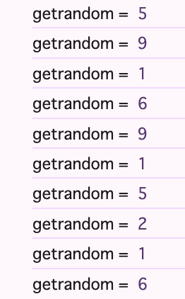
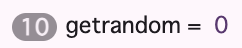

----
marp: true
theme: rubykaigi2024
paginate: true
backgroundImage: url(./rubykaigi2024-bgs-main.png)
----


----
<!--
_class: title
_backgroundImage: url(./rubykaigi2024-bgs-title.png)
-->

# An mruby for WebAssembly

## Presentation by Uchio Kondo

----
<!--
_class: normal
-->


# self.introduce!

- Uchio Kondo
  - from Fukuoka.rb
- Infra Engineer @ Mirrativ, Inc.
  - livestreaming & "live" gaming
- Translator of "Learnig eBPF"


----
<!--
_class: hero
_backgroundImage: url(./rubykaigi2024-bgs-yellowback.png)
-->

# Ruby and WebAssembly

----
<!--
_class: normal
-->

# Ruby for WebAssembly(WASM)?

- It's `ruby.wasm`, You know.
- A CRuby(MRI) That is compiled into wasm
  - C-based code -> Ruby runtime on wasm
  - WASI support

----
<!--
_class: normal
-->

# Showing another approach

- **mruby/edge** is yet another "Ruby on wasm"
- It is a basically mruby
  - but specialized for WebAssembly use case

----

<!--
_class: hero
_backgroundImage: url(./rubykaigi2024-bgs-whiteback.png)
-->

# So, What is mruby/edge?

----
<!--
_class:
  - normal
  - special1
-->

# mruby/edge getting started

- mruby/edge consists 2 components
  - mruby/edge "core" crate
  - the `mec` command (**m**ruby/**e**dge **c**ompiler)
  - Install `mec` first!

```
$ cargo install --version 0.3.0 mec
```

----
<!--
_class: normal
-->

# Prepare "Plain Old" Ruby script

```ruby
# fib.rb
def fib(n)
  case n
  when 0
    0
  when 1..2
    2
  else
    fib(n - 1) + fib(n - 2)
  end
end
```

----
<!--
_class: normal
-->

# Prepare RBS file for fib()

```ruby
# fib.export.rbs
def fib: (Integer) -> Integer
```

※ We have another option, but recommend to make this


----
<!--
_class: normal
-->

# Compile it into... WASM file

```
$ mec --no-wasi fib.rb
...
running: `cd .. && rm -rf work-mrubyedge-bhuxkrgcgOe5TAmDWFiMkgF5uVbnS9lR`
[ok] wasm file is generated: fib2.wasm

$ file fib.wasm
fib.wasm: WebAssembly (wasm) binary module version 0x1 (MVP)
```

----
<!--
_class: normal
-->

# Note that it has exported function `fib`

```
$ wasm-objdump -x -j Export ./fib.wasm

fib.wasm:       file format wasm 0x1
module name: <mywasm.wasm>

Section Details:

Export[3]:
 - memory[0] -> "memory"
 - func[417] <fib.command_export> -> "fib"
```

----
<!--
_class: normal
-->

# Then we can try it using (e.g.) wasmedge

```
$ wasmedge ./fib.wasm fib 15
610

$ wasmedge ./fib.wasm fib 20
6765
# ...
```

----
<!--
_class:
  - normal
  - sample2
-->

# Can this WASM available on a browser?

- prepare `wasm.html` including:

```html
<script async type="text/javascript">
  window.fire = function(e) {
    WebAssembly.instantiateStreaming(fetch("./fib.wasm"), {}).then(function (o) {
      let value = document.getElementById("myValue").value;
      let answer = o.instance.exports.fib(parseInt(value));
      document.getElementById("myAnswer").value = answer;
  });};
</script>
```

----
<!--
_class: normal
-->

# A working demo on the slide

<script type="text/javascript">
  window.fire = function(e) {
    WebAssembly.instantiateStreaming(fetch("./fib.wasm"), {})
      .then(function (o) {
        let value = document.getElementById("myValue").value;
        let answer = o.instance.exports.fib(parseInt(value));
        document.getElementById("myAnswer").style.backgroundColor = "#ffff00";
        document.getElementById("myAnswer").value = answer;
      }
    );    
  };
  console.log("done load function");
</script>

<button onclick="fire();">calc fib</button> 　　fib( <input id="myValue" type="text" value="20"> ) = <input id="myAnswer" type="text" value="?">
<br>

----
<!--
_class: normal
-->

# So with mruby/edge we can...

- Create a WASM file from Ruby script
- **Export** a specific "function" on that WASM
- In addition, we can specify **import functions**

----
<!--
_class: normal
-->

# Today, I will present you mruby/edge

- But before we understand mruby/edge, we have to have a graps with 2 technologies...
  - WebAssembly
  - ... and mruby!
- So let's start the journey together!

----
<!--
_class: hero
_backgroundImage: url(./rubykaigi2024-bgs-yellowback.png)
-->


# A Tour of WebAssembly

----
<!--
_class: normal
-->

# How do you know WebAssembly?

- Browser-based something...
- C++? or Rust? can be executed via WASM...
- Ruby or Python can run on browser by magical WASM power...
- Google meet? or Unity web games? or some cool contents

----
<!--
_class: normal
-->

# WebAssembly in a nutshell

- WebAssembly is a stack-based virtual machine
  - That can run its instructions on browser --
  - -- or *everywhere*

----
<!--
_class: normal
-->

# WebAssembly is used in:

- For example:
  - Browsers
  - Server-side programmes
  - Load Balancer Plugins, Containers, Supervisor
- ... everywhere!

----
<!--
_class:
  - normal
  - two-sides
-->

# Both browsers and servers

- As we have seen, one wasm binary can be executed both on browser and on terminal:

```
$ wasmedge ./fib.wasm fib 20
6765
```


----
<!--
_class: normal
-->

# e.g. Server-side WASM embedding

* wasmer's Go API example

```golang
// ... omitted import
// go:embed fib.wasm
var wasmBytes []byte
func main() {
  store := wasmer.NewStore(wasmer.NewEngine())
  module, _ := wasmer.NewModule(store, wasmBytes)
  importObject := wasmer.NewImportObject()
  importObject.Register("env", map[string]wasmer.IntoExtern{"foo": fn})
  instance, _ := wasmer.NewInstance(module, importObject)
  addOne, _ := instance.Exports.GetFunction("add_one")
  result, _ := addOne(41)
}
```

----
<!--
_class: normal
-->

# e.g. proxy-wasm

```yaml
http_filters:
- name: envoy.filters.http.wasm
  typed_config:
    "@type": type.googleapis.com/envoy.extensions.filters.http.wasm.v3.Wasm
    config:
      name: "sample_envoy_filter"
      root_id: "sample_envoy_filter"
      vm_config:
        vm_id: sample_envoy_filter
        runtime: "envoy.wasm.runtime.v8"
        code:
          local:
            filename: "/etc/filter.wasm" # Here!
```

----
<!--
_class: normal
-->

# WASM's interface

- WASM can:
  - *export* its functions to outer libraries (as a normal sharedlibs)
  - *import* functions from outer world

----
<!--
_class: normal
-->

# How to import and export function

```ruby
# rk2024.rb
def main(arg)
  answer = arg + 42
  show_answer(answer)
end
```

```ruby
# rk2024.export.rbs
def main: (Integer) -> void
```

```ruby
# rk2024.import.rbs
def show_answer: (Integer) -> void
```

----
<!--
_class: normal
-->

# Import this in browser

```javascript
// Will be imvoked via main()
function show_answer(ans) {
  console.log("answer = ", ans);
}
// Specify what func to import
const importObject = {
  env: {show_answer: show_answer}
};
WebAssembly.instantiateStreaming(fetch("./rk2024.wasm"), importObject).then(
  (obj) => {
    // Call exported main() after load, with arg 21
    obj.instance.exports.main(21);
  },
);
```

----
<!--
_class: normal
-->

# The result:


----
<!--
_class: hero
_backgroundImage: url(./rubykaigi2024-bgs-whiteback.png)
-->

# One more step into WebAssembly

----
<!--
_class: normal
-->

# WebAssembly is a binary with laid-out info

- magic: `0x00 0x61 0x73 0x6D`
- version: `0x01 0x00 0x00 0x00` (for v1)
- sections:
  - Known sections: type, import, function, table, memoty, export...
    - 12 kinds
  - Custom sections

----
<!--
_class: normal
-->

# Kind of WASM known sections (excerpt.) 1/2:

| name | description |
| ---- | ----------- |
| Type | Function signatures to use in wasm |
| Function | Function declaretions |
| Memory | Linear-memory descriptions |
| Global | Global declarations |

----
<!--
_class: normal
-->

# Kind of WASM known sections (excerpt.) 2/2:

| name | description |
| ---- | ----------- |
| Export | Name of exports(functions, memory, globals...) |
| Import | Module and function names to import |
| Code | Bodies of functions |
| Data | Data initializers that will be loaded into the linear memory |

----
<!--
_class: normal
-->

# Inspecting WASM sections:

```
# cf. WebAssembly/wabt:
$ wasm-objdump -x -j Export ./fib.wasm

fib.wasm:       file format wasm 0x1
module name: <mywasm.wasm>

Section Details:

Export[6]:
 - memory[0] -> "memory"
 - func[11] <__mrbe_grow> -> "__mrbe_grow"
 - func[12] <fib> -> "fib"
 - func[13] <hello> -> "hello"
 - global[1] -> "__data_end"
 - global[2] -> "__heap_base"
```

----
<!--
_class: normal
-->

# Inspecting WASM code as ASM(WAT):

```
$ wasm-objdump -d ./fib.wasm | less
...
0006ad func[12] <fib>:
 0006ae: 03 7f                      | local[2..4] type=i32
 0006b0: 01 7c                      | local[5] type=f64
 0006b2: 23 80 80 80 80 00          | global.get 0 <__stack_pointer>
 0006b8: 41 b0 02                   | i32.const 304
 0006bb: 6b                         | i32.sub
 0006bc: 22 01                      | local.tee 1
 0006be: 24 80 80 80 80 00          | global.set 0 <__stack_pointer>
 0006c4: 20 01                      | local.get 1
 0006c6: 41 38                      | i32.const 56
 0006c8: 6a                         | i32.add
 0006c9: 41 ff 80 c0 80 00          | i32.const 1048703
 0006cf: 41 83 02                   | i32.const 259
 0006d2: 10 a3 81 80 80 00          | call 163 <_ZN9mrubyedge4rite4rite4load17h9f737249e845f4b1E>
```

----
<!--
_class:
  - normal
  - pre-with-desc
-->

# How to check "exported" `fib` signature

- Check Type section, Function section

```
$ wasm-objdump -x -j Function ./fib.wasm | grep fib
 - func[12] sig=2 <fib>

$ wasm-objdump -x -j Type ./fib.wasm           
Type[23]:
 - type[0] (i32, i32) -> nil
 - type[1] (i32, i32, i32) -> i64
 - type[2] (i32) -> i32
 # => Here's fib(i32) -> i32 !
 - type[3] (i32, i32, i32) -> i32
 ...
```

----
<!--
_class: hero
_backgroundImage: url(./rubykaigi2024-bgs-whiteback.png)
-->

# More topics on WASM

----
<!--
_class: hero
_backgroundImage: url(./rubykaigi2024-bgs-whiteback.png)
-->

# WASI (in preview1)


----
<!--
_class: normal
-->

# What is WASI

- An interface to "system" functionalities for WASM
- Accessing file, socket, randomness ... 
  - or raise/exit process thread, ...
- Allow WASM programs to run on systems as usual middlewares

----
<!--
_class: normal
-->

# What is WASI in practice

- Bunch of functions to "import" 

```javascript
mec fib.rb
$ wasm-objdump -x -j Import ./fib.wasm 
...
Import[5]:
 - func[0] sig=7 <_ZN4wasi13lib_...> <- wasi_snapshot_preview1.fd_write
 - func[1] sig=5 <_ZN4wasi13lib_...> <- wasi_snapshot_preview1.random_get
 - func[2] sig=5 <__imported_wasi_...> <- wasi_snapshot_preview1.environ_get
 - func[3] sig=5 <__imported_wasi_...> <- wasi_snapshot_preview1.environ_sizes_get
 - func[4] sig=4 <__imported_wasi_...> <- wasi_snapshot_preview1.proc_exit
```

----
<!--
_class: normal
-->

# c.f. They're very like system calls:

- fd_write
  - `write(2)`
- random_get
  - `getrandom(2)`
- proc_exit
  - `_exit(2)` ...

----
<!--
_class: normal
-->

# When you want to stub WASI...

- Delve into [browser_wasi_shim](https://github.com/bjorn3/browser_wasi_shim) for example

```javascript
let args = ["bin", "arg1", "arg2"]; //...
let wasi = new WASI(args, _env, _fds);
let wasm = await WebAssembly.compileStreaming(fetch("bin.wasm"));
let inst = await WebAssembly.instantiate(wasm, {
  // Here specifies the import object
  "wasi_snapshot_preview1": wasi.wasiImport,
});
wasi.start(inst);
```

----
<!--
_class: normal
-->

# More concrete examples

- Delve into [browser_wasi_shim](https://github.com/bjorn3/browser_wasi_shim) for example
  - impl of [clock_time_get()](https://github.com/bjorn3/browser_wasi_shim/blob/7d86a13b9b38900bccfd7374bfaa7315ac299d08/src/wasi.ts#L160-L183)

```typescript
// NOTE: time is a pointer to feed result back
clock_time_get(id: number, precision: bigint, time: number): number {
  const buffer = new DataView(self.inst.exports.memory.buffer);
    if (id === wasi.CLOCKID_REALTIME) {
      buffer.setBigUint64(
        time,
        BigInt(new Date().getTime()) * 1_000_000n,
        true,
      );
    } else ... 
  ...
  return 0
}
```

----
<!--
_class: normal
-->

# Sample use of "random"

```ruby
def test_random
  Random.rand(10)
end
```

```
$ mec random.rb
$ wasm-objdump -x ./random.wasm
...
Export[3]:
 - func[430] <test_random.command_export> -> "test_random"
...
Import[5]:
 - func[0] sig=5 <_ZN4wasi13lib_generated...> <- wasi_snapshot_preview1.random_get
 - func[1] ...
```

----
<!--
_class: normal
-->

# Prepare "random" on browser WASI

```javascript
const wasiImport = {
  random_get: function(buf, buf_len) {
    let buffer8 = new Uint8Array(
      window.mywasm.exports.memory.buffer
    ).subarray(buf, buf + buf_len);
    for (let i = 0; i < buf_len; i++) {
      buffer8[i] = (Math.random() * 256) | 0;
    }
  },...};
const importObject = {"wasi_snapshot_preview1": wasiImport};
WebAssembly.instantiateStreaming(fetch("./random.wasm"), importObject).then(
  (obj) => { window.mywasm = obj.instance;
    for( var i = 0; i < 10; i++ ) {
      console.log("getrandom = ", window.mywasm.exports.test_random());
    }})
```

----
<!--
_class: normal
-->

# Result of "random" on browser WASI



----
<!--
_class: normal
-->

# Change random source to "All zero"

```javascript
const wasiImport = {
  random_get: function(buf, buf_len) {
    let buffer8 = new Uint8Array(
      window.mywasm.exports.memory.buffer
    ).subarray(buf, buf + buf_len);
    for (let i = 0; i < buf_len; i++) {
      // Fill in all zero!
      buffer8[i] = 0;
    }
  },...};
//...
```



----
<!--
_class: hero
_backgroundImage: url(./rubykaigi2024-bgs-whiteback.png)
-->

# Component Models

----
<!--
_class: normal
-->

# What and how is Component Models

- Component Models: WASM's broader-reaching interfacing spec for interoperablity
- Concerns in libraries, applications, and environments
- e.g. defines module interfaces with detailed types!

----
<!--
_class: normal
-->

# WIT: The Wasm Interface Type Format

- [The wit format](https://github.com/WebAssembly/component-model/blob/main/design/mvp/WIT.md)

```lua
package wasi:filesystem;

interface types {
  use wasi:clocks.wall-clock.{datetime};

  record stat {
    ino: u64,
    size: u64,
    mtime: datetime,
    // ...
  }

  stat-file: func(path: string) -> result<stat>;
}
```

----
<!--
_class: normal
-->

# WIT is a type declaration, like RBS...

- It's worth enough to challenge creating converter
from RBS to WIT, or vice varsa
- Support of WIT in mec compiler...
  - All future work! 

----

<!--
_class: hero
_backgroundImage: url(./rubykaigi2024-bgs-yellowback.png)
-->

# The mruby VM

----
<!--
_class: normal
-->

# What do you know about VMs?

- The rest of the tour is about **mruby**'s **VM**
- But, what do you know abour mruby?
- ...And what the heck is "VM"s?

----
<!--
_class: hero
_backgroundImage: url(./rubykaigi2024-bgs-whiteback.png)
-->

# VM in a nutshell

----
<!--
_class: normal
-->

# First, let's take a tour of VMs

- Some language has its VM
  - Java
  - Erlang / BEAM
  - Python, Lua...

----
<!--
_class: normal
-->

# CRuby's VM

- CRuby has a stack machine VM since 1.9

----
<!--
_class: normal
-->

# How CRuby works (simply)

- Simplified work


----
<!--
_class: normal
-->

# How to check CRuby insn:

- Use `--dump=insns` to check "compiled" instructions:

```
$ ruby --dump=insns test.rb
== disasm: #<ISeq:<main>@test.rb:1 (1,0)-(5,5)> (catch: FALSE)
0000 definemethod                           :hello, hello             (   1)[Li]
0003 putself                                                          (   5)[Li]
0004 opt_send_without_block                 <calldata!mid:hello, argc:0, FCALL|VCALL|ARGS_SIMPLE>
0006 leave

== disasm: #<ISeq:hello@test.rb:1 (1,0)-(3,3)> (catch: FALSE)
0000 putself                                                          (   2)[LiCa]
0001 putobject_INT2FIX_1_
0002 putobject                              2
0004 opt_plus                               <calldata!mid:+, argc:1, ARGS_SIMPLE>[CcCr]
0006 opt_send_without_block                 <calldata!mid:p, argc:1, FCALL|ARGS_SIMPLE>
0008 leave                                                            (   3)[Re]
```

----
<!--
_class: normal
-->

# Read the insns:

```ruby
def hello
  p 1 + 2
end
```

```
0000 putself                                                          (   2)[LiCa]
// Putting `1`
0001 putobject_INT2FIX_1_
// Putting `2`
0002 putobject                              2
// Execute plus over `1 2` on stack, then put result `3` back to stack
0004 opt_plus                               <calldata!mid:+, argc:1, ARGS_SIMPLE>[CcCr]
// Call self.p with arg `3`
0006 opt_send_without_block                 <calldata!mid:p, argc:1, FCALL|ARGS_SIMPLE>
0008 leave                                                            (   3)[Re]
```

----
<!--
_class: hero
_backgroundImage: url(./rubykaigi2024-bgs-whiteback.png)
-->

# mruby in a nutshell

----
<!--
_class: normal
-->

# Describe mruby in short words

- One of Ruby implementations
  - Another approach to "Enjoy Programming" by Matz
- Features:
  - Register-based _VM_ and bytecode
  - Smaller footprint
  - Composable runtime library...

----
<!--
_class: normal
-->

# ... And mruby has its VM, too


----
<!--
_class: normal
-->

# How to dump mruby's instruction

```
$ mrbc -v test.rb     # ...snip
irep 0x60000080c0a0 nregs=3 nlocals=1 pools=0 syms=1 reps=1 ilen=15
file: test.rb
    1 000 TCLASS        R1
    1 002 METHOD        R2      I(0:0x60000080c0f0)
    1 005 DEF           R1      :hello
    5 008 SSEND         R1      :hello  n=0
    5 012 RETURN        R1
    5 014 STOP
irep 0x60000080c0f0 nregs=6 nlocals=2 pools=0 syms=1 reps=0 ilen=12
file: test.rb
    1 000 ENTER         0:0:0:0:0:0:0 (0x0)
    2 004 LOADI_3       R3      (3)
    2 006 SSEND         R2      :p      n=1
    2 010 RETURN        R2
```

----
<!--
_class: normal
-->

# Let's read the instruction

```ruby
def hello
  p 1 + 2
end
```

```
1 000 ENTER         0:0:0:0:0:0:0 (0x0)
// Load number 3 to R3 - it's just optimized!
2 004 LOADI_3       R3      (3)
// Call self.p with arg R(2+1), put result back to R2
2 006 SSEND         R2      :p      n=1
2 010 RETURN        R2
```

※ Note mruby has shorter VM instructions

----
<!--
_class: normal
-->

# c.f. Lua's VM

- Lua's compiles inst set can be checked via `-l` flag

```lua
function hello(a, b)
  print(a + b)
end

hello(3, 5)
```

```
$ luac -l sample.lua 
```

----
<!--
_class: normal
-->

# Dump of Lua's instruction

```
main <sample.lua:0,0> (8 instructions at 0x600000604000)
0+ params, 3 slots, 1 upvalue, 0 locals, 1 constant, 1 function
        1       [1]     VARARGPREP      0
        2       [3]     CLOSURE         0 0     ; 0x600000604080
        3       [1]     SETTABUP        0 0 0   ; _ENV "hello"
        4       [5]     GETTABUP        0 0 0   ; _ENV "hello"
        5       [5]     LOADI           1 3
        6       [5]     LOADI           2 5
        7       [5]     CALL            0 3 1   ; 2 in 0 out
        8       [5]     RETURN          0 1 1   ; 0 out
function <sample.lua:1,3> (5 instructions at 0x600000604080)
2 params, 4 slots, 1 upvalue, 2 locals, 1 constant, 0 functions
        1       [2]     GETTABUP        2 0 0   ; _ENV "print"
        2       [2]     ADD             3 0 1
        3       [2]     MMBIN           0 1 6   ; __add
        4       [2]     CALL            2 2 1   ; 1 in 0 out
        5       [3]     RETURN0  
```

----
<!--
_class: normal
-->

# Difference between C and m

- VM architecture
  - CRuby: stack-based machine
  - mruby: register-based machine
- mruby: Portable bytecode by default
  - mruby can handle compiled bytecode in first class
  - VM and bytecode can be combined into "one binary"

----
<!--
_class: normal
-->

# What is happy with a VM?

- Many aspects...
  - Tuning points
  - Cross-runtime portability
- Today focus on Cross-runtime

----
<!--
_class: normal
-->

# Do you know mruby/c ?

- Yet another... "mruby" for microcontrollers
  - First developed by Dr. Tanaka at Kyushu Institute of Technology
  - For use in limited environments such as ROS
  - Developed under support of Fukuoka Pref. and Shimane Pref. in Japan

----
<!--
_class: normal
-->

# mruby/c can also handle mruby's bytecode

```
$ git clone https://github.com/mrubyc/mrubyc.git
$ cd mrubyc
$ make mrubyc_bin
$ ./sample_c/sample_scheduler
Usage: ./sample_c/sample_scheduler <xxxx.mrb>
```

```
$ mrbc ./test.rb
$ # generated ./test.mrb
...
$ # result of `p 1 + 2`
$ ./sample_c/sample_no_scheduler ./test.mrb
3
```

----
<!--
_class: normal
-->

# PicoRuby uses mruby/c, so your keyboards ar on mruby VM


----
<!--
_class: normal
-->

# As you can imagine from the name...

- mruby/edge also accepts mruby bytecode!


----
<!--
_class: hero
_backgroundImage: url(./rubykaigi2024-bgs-yellowback.png)
-->

# mruby/edge in Depth

----
<!--
_class: normal
-->

# mruby/edge also a mruby-compat VM

- Designed and specialized for running on WebAssembly
- 2 components
  - mruby/edge : Core VM to run mruby bytecode
  - `mec` : The mruby/edge compiler cli

----
<!--
_class: normal
-->

# What is good in mruby/edge?

- 1: Binary size
  - ruby.wasm (Ruby 3.3.1): 18 MB
    - Small enough for its feature
  - fib.wasm: (mec 0.3.1/mre 0.1.5) 174 KB
    - But it include almost no feature of Ruby...

```
$ ls -l fib.wasm 
-rwxr-xr-x  1 udzura  staff  178080  5 12 20:20 fib.wasm
```

----
<!--
_class: normal
-->

# What is good in mruby/edge?

- 2: First-class support of function import/export
  - As I descibed...

```
$ wasm-objdump -x -j Export fib.wasm                                              

fib.wasm:       file format wasm 0x1
module name: <mywasm.wasm>

Section Details:

Export[4]:
 - memory[0] -> "memory"
 - func[414] <__mrbe_grow.command_export> -> "__mrbe_grow"
 - func[415] <fib.command_export> -> "fib"
 - func[416] <hello.command_export> -> "hello"
```

----
<!--
_class: normal
-->

# But the core motivation is?

- Desire to implement **my own VM**!
  - Love Rust's memory safety...
  - but lots of `unsafe {}` for now :(

----
<!--
_class: normal
-->

# How it works


----
<!--
_class: normal
-->

# The VM is written in Rust, from scratch

```rust
// Code image
pub fn eval_insn1(vm: &mut VM, ...) -> Result<(), Error> {
    vm.pc += ilen;
    match opcode {
        OpCode::NOP => {
            fetched.as_z()?;
        }
        OpCode::MOVE => {
            let (a, b) = fetched.as_bb()?; ...
        }
        OpCode::LOADL => {
            let (a, b) = fetched.as_bb()?; ...
        }
        OpCode::JMP => {
            let a = fetched.as_s()?;
            vm.pc += (off as usize);
        }
        ...
```

----
<!--
_class: hero
_backgroundImage: url(./rubykaigi2024-bgs-whiteback.png)
-->

# Import/Export support


----
<!--
_class: normal
-->

# Import/Export requires "Types"

```
Type[24]:
 - type[3] (i32) -> i32

Function[412]:
 - func[17] sig=3 <fib>
 - func[415] sig=3 <fib.command_export>

Export[4]:
 - func[415] <fib.command_export> -> "fib"
```

So, `fib` has signature `(i32) -> i32`

----
<!--
_class: normal
-->

# How to detect the signature `(i32) -> i32` ?

```ruby
def fib(n)
  if n < 1
    return 0
  elsif n < 3
    return 1
  else
    return fib(n-1)+fib(n-2)
  end
end
```

----
<!--
_class: normal
-->

# RBS file can be used for "declare" type

- Prapere `file.export.rbs`

```ruby
# Classes can be corresponded with Rust/wasm types
# e.g. Integer -> i32
#      Float   -> f32, ...
def fib: (Integer) -> Integer
```

----
<!--
_class: normal
-->

# Naming convention

- When you want to compile `FILE.rb`:
  - Prepare `FILE.export.rbs` to specify functions to export 
  - Prepare `FILE.import.rbs` to declare import functions 

```
./
├── foobar.export.rbs
├── foobar.import.rbs
└── foobar.rb
```

----
<!--
_class: normal
-->

# Code generation logic from RBS

- mec has its own (simplified) RBS parser
- Parse RBS, extract type info, generate Rust code

----
<!--
_class: normal
-->

# Generated code example

```rust
// import function
extern "C" {
    fn plus(a0: i32, a1: i32) -> i32;
}

// function to export
#[no_mangle]          
pub fn fib(a0: i32) -> i32 {
    let rite = mrubyedge::rite::load(DATA).unwrap();
    let mut vm = mrubyedge::vm::VM::open(rite);
    // ...
    let retval = mrb_helper::mrb_funcall(
      &mut vm, &top_self, "fib".to_string(), &args);
    // ...
}
```

----
<!--
_class: hero
-->

# Handling Strings

----
<!--
_class: normal
-->

# Handling Strings is something to be...

----
<!--
_class: normal
-->

# Understanding WASM memory model

- WASM instance has linear memory
- Basically WASM is **isolated** from host env memory
- Linear memory can be used:
  - for storing WASM runtime data
  - for sharing data between WASM and host

----
<!--
_class: normal
-->

# What we call “String” is...

- Bytearray on wasm.memory


----
<!--
_class: normal
-->

# Pass String from outer world

- When you want to pass string from browser
to WASM, you must copy bytes one by one
into WASM linear memory!

----
<!--
_class: normal
-->

# Pass String from outer world

```javascript
function putSomeString(str) {
  // Requires start point of memory!
  var off = window.instance.exports.__some_malloc();
  off = off >>> 0;
  var len = str.length;
  var buffer = new Uint8Array(
    window.instance.exports.memory.buffer, off, len);
  for( var i = 0; i < length; i++ ) {
    buffer[i] = str.charCodeAt(i);
  }
  window.instance.exports.use_string_i_just_put(off, len);
}
```

----
<!--
_class: normal
-->

# Use that String in WASM module

- Rust example

```rust
pub fn use_string_i_just_put(p: *const u8, len: usize) {
  let s = unsafe { // unsafe!
    let u8buf = std::slice::from_raw_parts(p, len);
    std::str::from_utf8(u8buf).unwrap()
  };
  println!("{}", s);
}
```

----
<!--
_class: normal
-->

# ...And passing String from WASM to JS

- Is vice versa

```javascript
var off = window.instance.exports.get_my_string_from_wasm();
off = off >>> 0;
var len = getAnywayOrFixedLength(window.instance);
var buffer = new Uint8Array(
  window.instance.exports.memory.buffer, off, len);

console.log(String.fromCharCode.apply(null, buffer));
```

----
<!--
_class: normal
-->

# So, mruby/edge handles String for now...(1)

- on export:

| RBS def | Rust def | note |
| ------- | -------- | ---- |
| `def: foo(String) -> void` | `foo(*const u8, usize)` |  |
| `def: bar() -> String`     | `bar() -> *const u8`    | (*1), (*2) |

(*1) also export `__get__bar_size() -> u32` for getting buffer size
(*2) the buffer is forced to be ended with `\0` automatically

----
<!--
_class: normal
-->

# So, mruby/edge handles String for now...(2)

- on import:

| RBS def | Rust def | note |
| ------- | -------- | ---- |
| `def: foo(String) -> void` | `foo(*const u8, usize)` |  |
| `def: bar() -> String`     | `bar() -> *const u8`    | (*3), (*4) |

(*3) also export `__set__bar_size(u32)` to set passed
(*4) when `__set__bar_size()` not set, mruby/edge assumes the buffer to be ended with `\0`, and tries to detect its length

----
<!--
_class: normal
-->

# Sample code of passing string from JS

```ruby
# @wasm_expoert
def handle_msg: (String) -> void
# converted -> handle_msg(ptr, len)
```

```javascript
var str = "The WASM Era's emerging"; var len = str.length;
var pageLen = Math.ceil(len+1/65536);
var off = window.instance.exports.__mrbe_grow(pageLen);
var buffer = new Uint8Array(
  window.instance.exports.memory.buffer, off, len);
for( var i = 0; i < length; i++ ) {
  buffer[i] = str.charCodeAt(i);
}
// Finally!
window.instance.exports.handle_msg()
```

----
<!--
_class: normal
-->

# Sample code of passing string to JS

```ruby
# @wasm_import
def handle_wasm_msg: (String) -> void

# in Ruby script
str = "The WASM user's growing"
handle_wasm_msg(str)
# will pass -> handle_wasm_msg(off, len)
```

```javascript
function handle_wasm_msg(off, len) {
  let instance = window.instance;
  let buffer = new Uint8Array(instance.exports.memory.buffer, off, len);
  console.log(String.fromCharCode.apply(null, buffer));
}
```

----
<!--
_class: normal
-->

# Future plan...

- Expecting WASM Component Model to solve this complication...
  - Canonical ABI supports `string`
  - Hope these to be ii-kanji
- Better heap handling with wasm-gc

----
<!--
_class: hero
-->

# Evaluation

----
<!--
_class: hero
-->

# Wrap up

----
<!--
_class: normal
-->

# WebAssembly is...


----


----
<!--
_class: normal
-->

# WebAssembly is...

----

<!--
_class: normal2
style: section.normal2 h2 + ul { top: 66%; }
-- >

# But for mruby?

- I created yet another ruby for wasm...
- Named "mruby/edge"

## You should have 2 Questions...

- Why "yet another" wasm ruby?
- Why and How is it "mruby"?

----
<!--
_class: normal
-- >

# Here's Code

```ruby
def fib(n)
  case n
  when 0
    return 0
  when 1..2
    return 1
  else
    return fib(n-1) + fib(n-2)
  end
end
```

----
<!--
_class: normal
-- >

# Here's the Image, Niñas

- Here is the desc
- Also desc


----
<!--
_class: normal
-- >

# Here's the Image #2, Niños

- Here is the desc
- Also desc


----
<!--
_class: hero
_backgroundImage: url(./rubykaigi2024-bgs-whiteback.png)
-- >

# My first slide

----
<!--
_class: hero
_backgroundImage: url(./rubykaigi2024-bgs-yellowback.png)
-->

# My first slide v2
