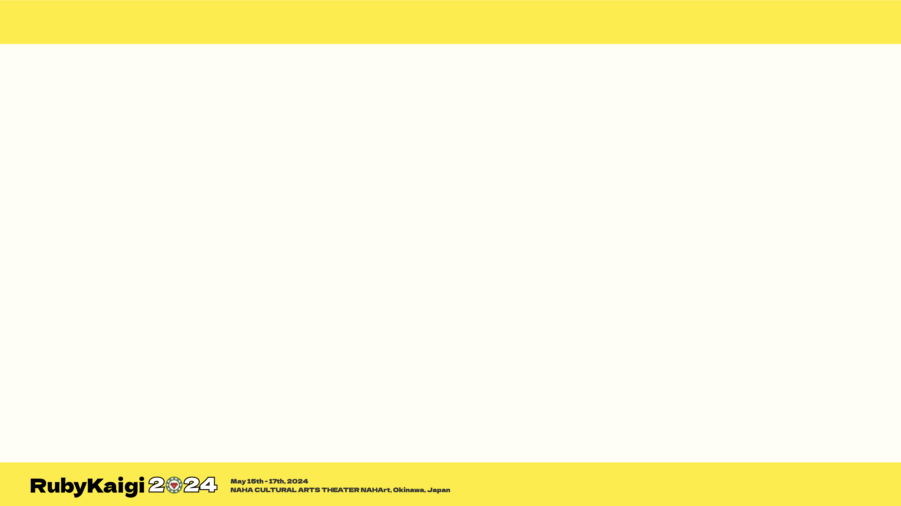

----
marp: true
theme: rubykaigi2024
----


----

# RubyKaigi 2024


----


# self.introduce!

- uchio kondo
- from Fukuoka
  - hello world!

----


# Why wasm is good

* Run this code!

```ruby
def fib
  return fib(n-1) + fib(n-2)
end
```

----

# My first slide


