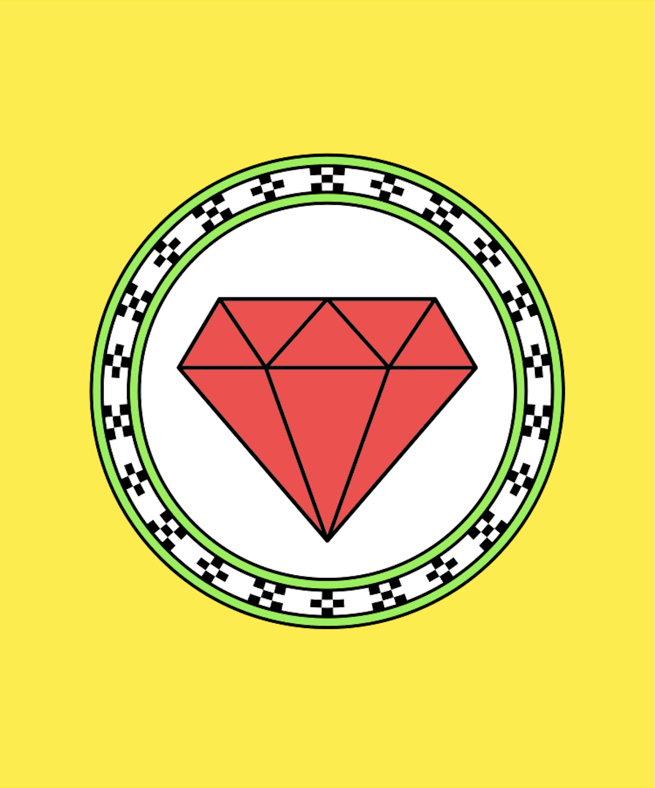

----
marp: true
theme: rubykaigi2024
paginate: true
----


----
<!--
_class: title
-->

# All about My Super Great Code


## Presentation by Uchio Kondo

----
<!--
_class: normal
-->


# self.introduce!

- Uchio Kondo: Infra Engineer @ Mirrativ, Inc.
- from Fukuoka
  - hello world!

----
<!--
_class: normal
-->


# Content.should( Be.more! ) !!1

- Uchio Kondo: Infra Engineer @ Mirrativ, Inc.
- from Fukuoka
  - hello world!
- Fukuoka nice Ramens
  - Hacchan ramen @ Yakuin
  - Gaga @ Imaizumi
  - Ryuu @ San-ga-Mori

----
<!--
_class: normal
-->


# Why wasm is good

* Run this code!

```ruby
def fib
  return fib(n-1) + fib(n-2)
end
```

----
<!--
_class: normal
-->


# Here's the Image, Niñas

- Here is the desc
- Also desc



----
<!--
_class: normal
-->


# Here's the Image #2, Niños

- Here is the desc
- Also desc


----
<!--
_class: hero
-->

# My first slide


----
<!--
_class: hero
-->

# My first slide v2


