----
marp: true
theme: rubykaigi2025
paginate: true
backgroundImage: url(./rubykaigi2025_bg.004.jpeg)
title: 今後は Wardite の高速化をしたいと思います
description: RubyKaigi 2025 follow up / Wardite の高速化について
# header: "Running ruby.wasm on Pure Ruby Wasm Runtime"
image: https://udzura.jp/slides/2025/rubykaigi-followup/ogp.png
size: 16:9
----

<!--
_class: title
_backgroundImage: url(./rubykaigi2025_bg.002.jpeg)
-->

# 今後は Wardite の高速化をしたいと思います

## Presentation by Uchio Kondo

----

<!--
_class: hero0
_backgroundImage: url(./rubykaigi2025_bg.005.jpeg)
-->

# 福岡市<s>博多区</s> 中央区から来ました

<!--
ナンバーガールです。
-->

----
<!--
_class: profile
-->


# self.introduce!

- Uchio Kondo
  - from Fukuoka.rb
- 所属: 
  - 今日はブースにお土産あります
- Product Engineer / Architect

----

<!--
_class: hero
_backgroundImage: url(./rubykaigi2025_bg.003.jpeg)
-->

# 今日話すこと

----


----

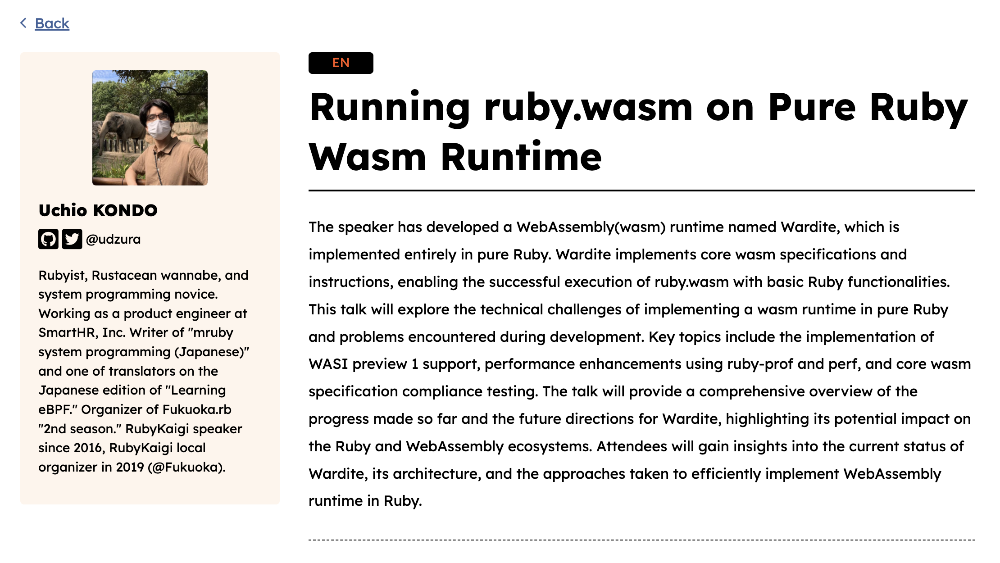

----

# 主にWarditeの高速化の話

- メイントピック
  - バイナリのパース処理を高速化しました
  - 大体 6.6 秒 → 1.6 秒 (ruby.wasm)
- 進捗がないこと
  - VM自体の高速化

----

<!--
_class: hero
_backgroundImage: url(./rubykaigi2025_bg.003.jpeg)
-->

# バイナリパースの高速化

----

# 環境

- Apple M3 Pro (2023) / 12 Core / メモリ 36 GB
- Ruby 3.4.5 +PRISM +YJIT (ruby.wasm は 3.4.2)

----

# ruby.wasm の実行

```
$ time bundle exec wardite ./tmp/ruby.wasm -- --version
Activated Vernier profiling
ruby 3.4.2 (2025-02-15 revision d2930f8e7a) +PRISM [wasm32-wasi]
bundle exec wardite ./tmp/ruby.wasm -- --version 
    21.40s user 2.84s system 100% cpu 24.126 total
```

----

# vernier でのflame graph

<br>
<br>

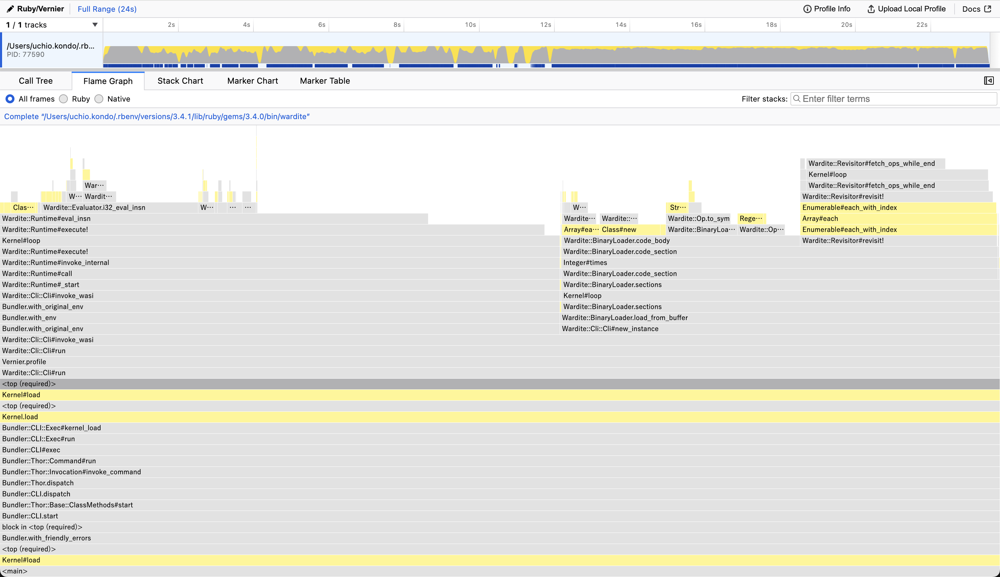

----

# vernier のflame graph 所感

- バイナリ解析に、処理本体と同じぐらい時間がかかっている

----

# バイナリ解析のみのベンチプログラム

```ruby
f = File.open($options.wasm_file)
Vernier.profile(out: "./tmp/load_perf.json") do
  start = Time.now
  _instance = Wardite::BinaryLoader::load_from_buffer(f);
  puts "Profile saved to ./tmp/load_perf.json"
  puts "Load time: #{Time.now.to_f - start.to_f} seconds"
end
```

----

# 今のmainでの結果

```
YJIT enabled: true
Profile saved to ./tmp/load_perf.json
Load time: 6.609860897064209 seconds
OK

# 12秒、というレベルではなかったが十分高速化の余地がありそう
```

----

# flame graph

<br>
<br>

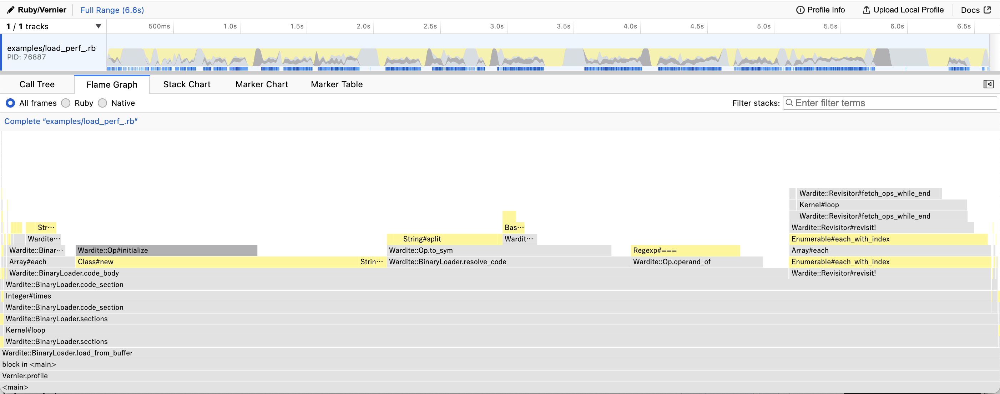

----

<!--
_class: hero
_backgroundImage: url(./rubykaigi2025_bg.003.jpeg)
-->

# やったことをつらつらと

----

# `Op.to_sym`, `Op.operand_of` 最適化

- バイナリ表現からOpcodeやオペランド情報を取得している処理
- たくさん命令があるので...
  - 命令の数だけ実行される
  - ちなみに ruby.wasm には `3314498` 命令あるらしい

----

```ruby
    # @rbs chr: String
    # @rbs return: [Symbol, Symbol]
    def self.to_sym(chr)
      if chr.ord == 0xfc
        return [:fc, :fc]
      end

      code = table[chr.ord]
      if ! code
        raise "found unknown code 0x#{chr.ord.to_s(16)}"
      end
      # opcodes equal to or larger than are "convert" ops
      if chr.ord >= 0xa7
        return [:convert, code]
      end

      prefix = code.to_s.split("_")[0]
      case prefix
      when "i32", "i64", "f32", "f64"
        [prefix.to_sym, code]
      else
        [:default, code]
      end
    end
```

----

```ruby
    # @rbs code: Symbol
    # @rbs return: Array[Symbol]
    def self.operand_of(code)
      case code
      when /load/, /store/
        [:u32, :u32]
      when :local_get, :local_set, :local_tee, :global_get, :global_set, :call, :br, :br_if
        [:u32]
      when :memory_init, :memory_copy
        [:u32, :u32]
      when :memory_size, :memory_grow, :memory_fill
        [:u32]
      when :call_indirect
        [:u32, :u32]
      when :br_table
        [:u32_vec, :u32]
      when :i32_const
        [:i32]
      when :i64_const
        [:i64]
      when :f32_const
        [:f32]
      when :f64_const
        [:f64]
      when :if, :block, :loop
        [:u8_block]
      else
        []
      end
    end
```

----

# 重そうな処理を削る

- 見えてるのは String#split, 正規表現あたり

<br>
<br>
<br>
<br>
<br>

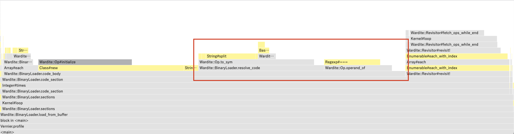

----

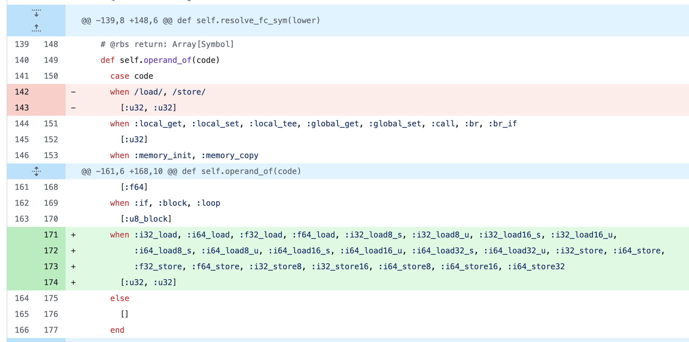

----

# さらにシンボルテーブル探索の最適化

- メソッドを毎回呼んでそう
- 別に定数から直接取得できるのでは...

<br>
<br>
<br>
<br>

```ruby
    SYMS = %i[
      unreachable nop block loop if else try catch
      throw rethrow throw_ref end br br_if br_table return ...
    ]
```

----

# これだけで割と改善

```
# Before: 6.6 seconds
YJIT enabled: true
Profile saved to ./tmp/load_perf.json
Load time: 4.619668006896973 seconds
OK
```

----

# `fetch_ops_while_end` の最適化

<br>
<br>

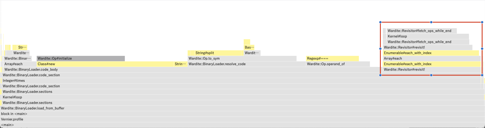

----

# `fetch_ops_while_end` の最適化

- どう言う処理？
  - if, block, loop 命令で、対応する end の位置を事前に取得する必要
  - Opのパースが終わった段階で一度計算してキャッシュしている
  - なんだか素朴な実装になってて無駄が多い感じ...

----

# そもそも

- Opをパースしながらendの位置を計算できるんでは...
- そういうふうに書き換えた
  - スタックを操作する感じでやれば素直

----

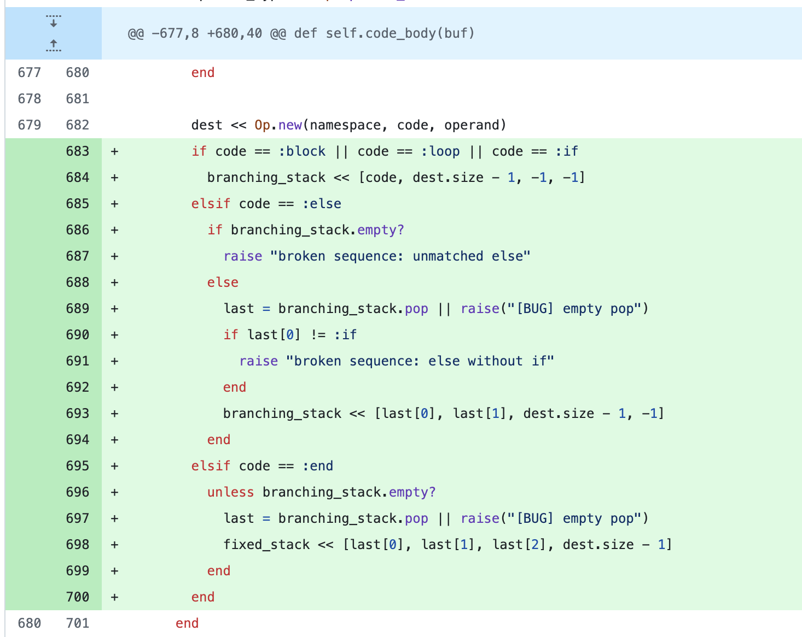

----

# 結果

```
# Before: 4.6 seconds
YJIT enabled: true
Profile saved to ./tmp/load_perf.json
Load time: 3.4930167198181152 seconds
OK
```

----

# Opインスタンスを作るのをやめる

<br>
<br>

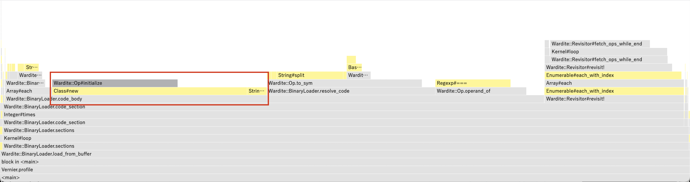

----

# Opインスタンスを作るのをやめる

- ruby.wasm に存在する命令数は `3314498` （再掲）
- この数だけ Op.new してるということ

----

# Opインスタンス→配列

<br>
<br>
<br>

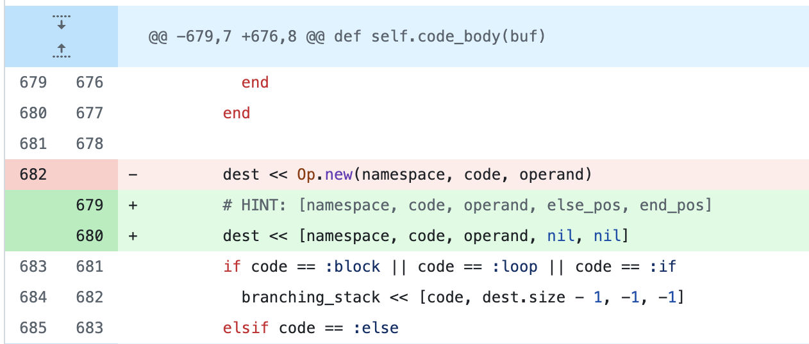

----

# Opインスタンス→配列

- 可読性が犠牲になるが...。
- TODO: RBSレベルでエイリアスをつければマシになるかも

----

# ポイント

- 始め、meta情報の格納先として素直にHashを作った
- 今、2つしかキーがないので、それぞれ要素をバラしたら
  - それだけで速度改善した（0.2~0.3秒）
  - Hashをそもそも作らないというのが大事っぽい

----

# 結果は？

```
# Before: 3.5 seconds
YJIT enabled: true
Profile saved to ./tmp/load_perf.json
Load time: 2.267056941986084 seconds
OK
```

----

# さらに高速化の余地は？

- 今、命令ごとのざっくり分類をnamespaceとして計算している
  - そういえばこれって本当に必要？
  - namespace の情報を削るとどう？
- OpインスタンスやめてるのでどうせVMを改修しなきゃだもんなあ

----

# namespace の算出をやめてみた結果 

- 2秒切った！嬉しい！

<br>

```
# Before: 2.26 seconds
YJIT enabled: true
Profile saved to ./tmp/load_perf.json
Load time: 1.9164891242980957 seconds
OK
```

----

# さらに細かい改修

- operand情報解決テーブルの事前作成
- leb128 の処理の高速化

----

# operand情報解決テーブルの事前作成

- code -> operand のHashを事前に作ってcase文をやめる

<br>
<br>
<br>
<br>
<br>


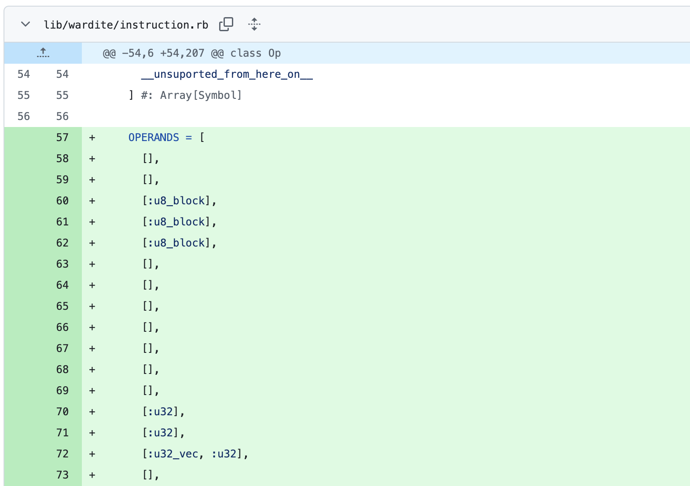

----

# leb128 の処理の高速化

- leb128 符号化形式とは...
  - 各バイトを最上位ビットとそれ以下に分けて表現する方式
  - 小さな数値は1バイトで、大きな数値は複数バイトで表現できる
- [Claude Sonnet 4が解説してくれたんで...](https://claude.ai/public/artifacts/a1144bc7-0799-499c-be34-0820caa4631d) それを見てね

----


----

# leb128 がなぜ大事か

- WebAssemblyのバイナリでは、数値は基本的に leb128 でエンコードされている
- leb128 をパースする箇所が非常に多い

----

# ほとんどの数値は1バイトのはず...

- 可変長の符号化形式とはいえ、1バイトで収まる数値がほとんど
- 127以下の数値だと分かったら early return した

<br>
<br>
<br>
<br>
<br>
<br>


```ruby
    def fetch_uleb128(buf, max_level: 8)
      dest = 0; level = 0
      while b = buf.read(1)
        c = b.ord
        # 127以下ならもうここで抜ける
        return c if c < 0x80 && level.zero?
        # ....
```

----

# この辺を適用した結果

- ＋あとはできるところでメソッド呼び出しの削減もした

```
# Before: 1.9 seconds
YJIT enabled: true
Profile saved to ./tmp/load_perf.json
Load time: 1.6453030109405518 seconds
OK
```

----

# と思ったが...

- namespaceでcase文を分割しないとVMが動かない...
- code -> namespace のHashで解決、計算するよう再変更
- そんなに変わらないので許容

<br>
<br>
<br>
<br>
<br>
<br>

```
Load time: 1.6500530433654785 seconds
OK
```

----

# 最終的なflame graph

<br>
<br>

<!-- 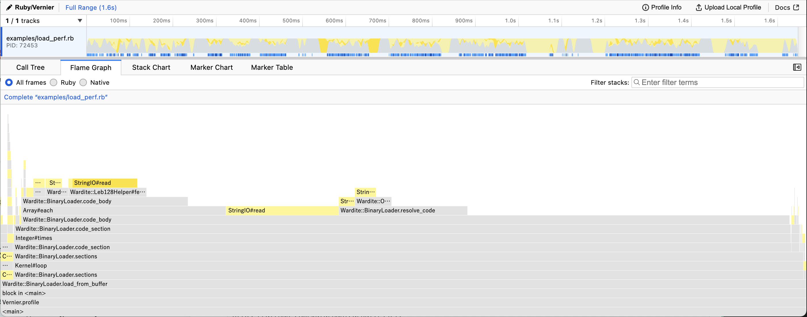 -->

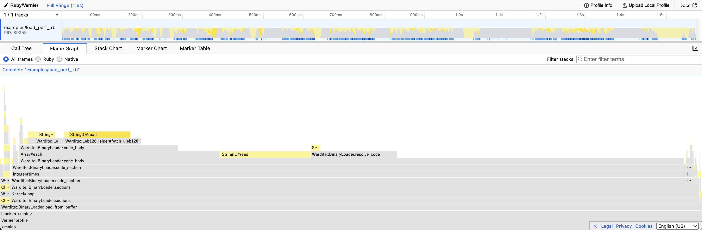

----

# 変化のまとめ

- 6.61s -> 1.65s
- おおよそ4x faster

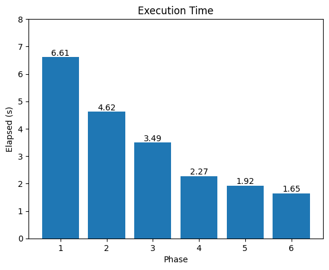

----

# ruby --version 現状の所要時間

- VM側も新データ構造に対応し既存テストを通した
- `ruby --version` も元のように動く
- 21.4s -> 14.5s

<br>
<br>
<br>
<br>
<br>
<br>
<br>
<br>

```
$ time bundle exec wardite tmp/ruby.wasm -- --version
ruby 3.4.2 (2025-02-15 revision d2930f8e7a) +PRISM [wasm32-wasi]
bundle exec wardite tmp/ruby.wasm -- --version
  14.51s user 0.74s system 98% cpu 15.554 total
```

----

# リリース済み

- wardite `0.9.0`

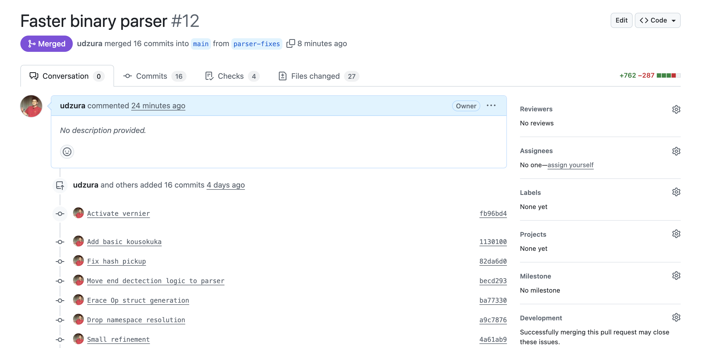

----

<!--
_class: hero
_backgroundImage: url(./rubykaigi2025_bg.003.jpeg)
-->

# Sidetrack

----

# VM処理側も高速にしたいね

- 何かやれることある？
  - 値をIntegerだけで表現する？

----

# 値をIntegerだけで表現する

- 今、値を素直にオブジェクトで表現している
- だいたいこういうコード

<br>
<br>
<br>
<br>
<br>
<br>

```ruby
class I32
  attr_reader :value
end

class I64
  attr_reader :value
end #...
```

----

# 値は大量にオブジェクトを作る

- そこがボトルネックである可能性はまあまあある
  - バイナリパーサで見た通り
- 内部設計を見直し、オブジェクトを作らないようにしたい
- F32/F64のような値も内部的にIntegerにすることができる

----

# 浮動小数点数を32bit/64bitのIntegerで表現する

```ruby
> [2.0e-10].pack("d").unpack("b64")
=> ["1101110110111101111010111001101111111011001111101101011110111100"]
> [2.0e-10].pack("d").unpack("Q<")
=> [4461797156714954171]
```

----

# 結果はまだまだ

- 小さな四則演算だけをひたすらループするプログラムを用意
- 一部命令を置き換えてそのパフォーマンスを比較してみた
  - とはいえ効果が今ひとつ見えない...

----

# 今後はこうしていこうと思っています

- 一通り置き換えたうえで
  - 実際的なプログラムで比較しないと効果が見えづらいかも
  - なのでえいやと置き換え頑張る
- <s>マリオカートワールドで忙しいので</s>もうちょっとだけ待って...

----

<!--
_class: hero
_backgroundImage: url(./rubykaigi2025_bg.003.jpeg)
-->

#  Conclusion

----

# Warditeのバイナリパーサを高速化した

- ruby.wasm のサイズのバイナリで6.6秒から1.6秒に短縮した
- VM処理自体の高速化もしたいが、効果がまだ確信できず
- 今後もいい感じにしていこうと思っています
