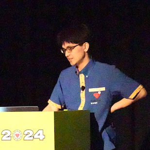

----
marp: true
theme: rubykaigi2025
paginate: true
backgroundImage: url(./rubykaigi2025_bg.004.jpeg)
title: Wardite 高速化 どうやって
description: RubyKaigi 2025 follow up / Wardite の高速化について
# header: "Running ruby.wasm on Pure Ruby Wasm Runtime"
image: https://udzura.jp/slides/2025/rubykaigi-followup/#TODO
size: 16:9
----

<!--
_class: title
_backgroundImage: url(./rubykaigi2025_bg.002.jpeg)
-->

# Wardite 高速化 どうやって

## Presentation by Uchio Kondo

----

<!--
_class: hero0
_backgroundImage: url(./rubykaigi2025_bg.005.jpeg)
-->

# 福岡市<s>博多区</s> 中央区から来ました

<!--
ナンバーガールです。
-->

----
<!--
_class: profile
-->



# self.introduce!

- Uchio Kondo
  - from Fukuoka.rb
- 所属: 
  - 今日はブースにお土産あります
- Product Engineer / Architect

----

<!--
_class: hero
_backgroundImage: url(./rubykaigi2025_bg.003.jpeg)
-->

# 今日話すこと

----

<blockquote class="twitter-tweet"><p lang="ja" dir="ltr">RubyKaigi follow upの準備が… <a href="https://t.co/A7nNAUhtym">pic.twitter.com/A7nNAUhtym</a></p>&mdash; Uchio Kondo💥 (@udzura) <a href="https://twitter.com/udzura/status/1954094966831001886?ref_src=twsrc%5Etfw">August 9, 2025</a></blockquote> <script async src="https://platform.twitter.com/widgets.js" charset="utf-8"></script>

----

# 主にWarditeの高速化の話

- メイントピック
  - バイナリのパース処理を高速化しました
  - 大体 7.5 秒 → 1.5 秒 (ruby.wasm)
- 進捗がないこと
  - VM自体の高速化

----

<!--
_class: hero
_backgroundImage: url(./rubykaigi2025_bg.003.jpeg)
-->

# バイナリパースの高速化

----

# ruby.wasm での分析

----

# vernier で可視化した結果

----

# vernier で可視化した結果

- バイナリ解析に、処理本体と同じぐらい時間がかかっている

----

# バイナリ解析のみのベンチプログラム

- スーパー簡易版

----

# 今のmainでの結果

----

<!--
_class: hero
_backgroundImage: url(./rubykaigi2025_bg.003.jpeg)
-->

# やったことをつらつらと

----

# `Op.to_sym`, `Op.operand_of` 最適化

- バイナリ表現からOpcodeやオペランド情報を取得
- 元のコード

----

# 重そうな処理を削る

- 見えてるのは String#split, 正規表現

----

# 削った結果

----

# シンボルテーブル探索の最適化

- メソッドを毎回読んでいたが、別に定数から直接取得できるのでは...

----

# これだけで改善

----

# `fetch_ops_while_end` の最適化

- どう言う処理？
  - if, block, loop 命令で、対応する end の位置を事前に取得する必要がある
  - なのでOpのパースが終わった段階で一度計算してキャッシュしている
  - なんだか素朴な実装になってて無駄が多い

----

# そもそも

- Opをパースしながらendの位置を計算できるんでは...
- 書き換えた


----

# 結果


----

# Opインスタンスを作るのをやめる

- ruby.wasm に存在する命令数
- この数だけ Op.new してるということだ

----

# Opインスタンス→配列

- 可読性が犠牲になるが...。
- RBSレベルでエイリアスをつければマシになるかも

----

# 結果は？


----

# もうちょっと速く出来ない？

- meta情報で配列を作っているけど...
  - 今、2つしかキーがないので、バラしたらどうなる？

----

# バラすコード

----

# バラした結果

- Hashをそもそも作らないのは割と効く

----

# さらに高速化の余地は？

- Opの配列の要素数がもっと小さいといいのかな？
  - namespace の情報を削る？
- OpインスタンスやめてるのでどうせVMを改修しなきゃだもんなあ

----

# やめてみた結果 


----

# さらに細かい改修

- operand情報解決テーブルの事前作成
- leb128 の処理の高速化

----

# operand情報解決テーブルの事前作成

- `operand_of` 内でcase文でマッチしていたが、code -> operand のHashを事前に作れるのでそれを使った

----

# leb128 の処理の高速化

- leb128 符号化形式とは
- https://claude.ai/public/artifacts/a1144bc7-0799-499c-be34-0820caa4631d
- WebAssemblyのバイナリでは、数値は基本的に leb128 になっている

----

# ほとんどの数値は1バイトのはず...

- 可変長の符号化形式とはいえ、1バイトで収まる数値がほとんど
- 127以下の数値だと分かったら early return した

----

# この辺を適用した結果


----

# 最終的ghqなflame graph

----

# 今後のアクション

- バイナリパーサが作るデータ構造が変わったので
  - VM側の処理を直さなきゃ...
  - （まだやってないんかい）

----

<!--
_class: hero
_backgroundImage: url(./rubykaigi2025_bg.003.jpeg)
-->

# Sidetrack

----

# VM処理側も高速にしたいね

- 
- 

----

# 値をIntegerだけで表現する

- 今、値を素直にオブジェクトで表現している

```ruby
class I32
  attr_reader :value
end
```

----

# 値は大量にオブジェクトを作る

- そこがボトルネックである可能性はまあまあある
  - バイナリパーサで見た通り
- 内部設計を見直し、オブジェクトを作らないようにしたい
- F32/F64のような値も内部的にIntegerにすることができる

----

# 浮動小数点数を32bit/64bitのIntegerで表現する

```ruby
> [2.0e-10].pack("d").unpack("b64")
=> ["1101110110111101111010111001101111111011001111101101011110111100"]
> [2.0e-10].pack("d").unpack("Q<")
=> [4461797156714954171]
```

----

# 結果はまだまだ

- 小さな四則演算だけをひたすらループするするプログラムで置き換えて比較
  - とはいえ効果が今ひとつ見えない
- 一通り置き換えたうえで実際的なプログラムで比較しないと効果が見えづらいかも

----

# case文の最適化

- VMの中で巨大なcase文がある
- 一方、使われる命令数には偏りがある

```
命令数の図
```

----

# よく使う命令はFast pathを設けては？

- 例えば i32.add, i32.const, local.get, local.set など
- 小さな四則演算だけをするプログラムで、local.get/local.setのFast pathを設けてみた結果を掲載する
- とはいえ...
  - 命令の偏りってワークロードにより変わるしなあ
  - `local.*` 等はどのプログラムでも多いとは思う

----

# Fast pathの結果

```
結果
```

----

<!--
_class: hero
_backgroundImage: url(./rubykaigi2025_bg.003.jpeg)
-->

#  Conclusion

----

# Warditeのバイナリパーサを高速化した

- ruby.wasm のサイズのバイナリで7.5秒から1.5秒に短縮した
- VMの処理自体の高速化もしたいが、効果が見えづらそう
- 他にもやることたくさん
  - specのカバー率も上げたいな...
