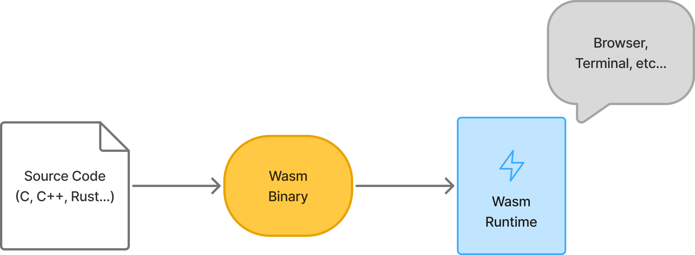
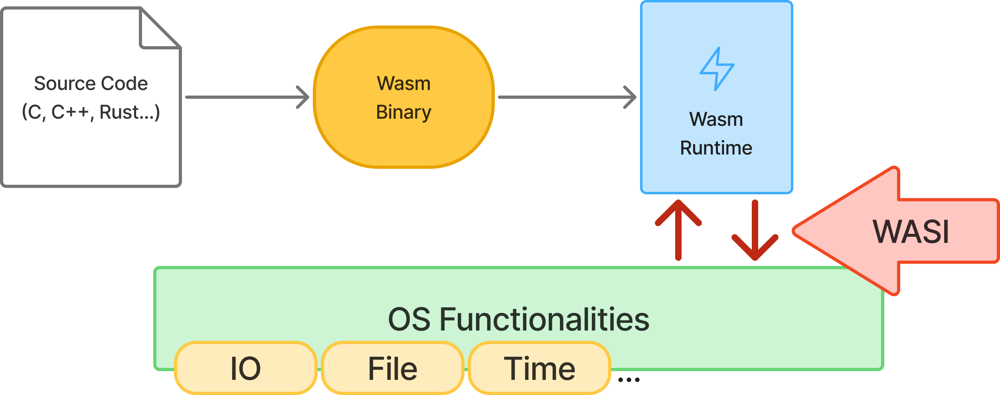
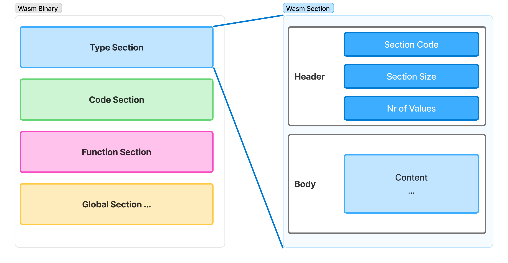
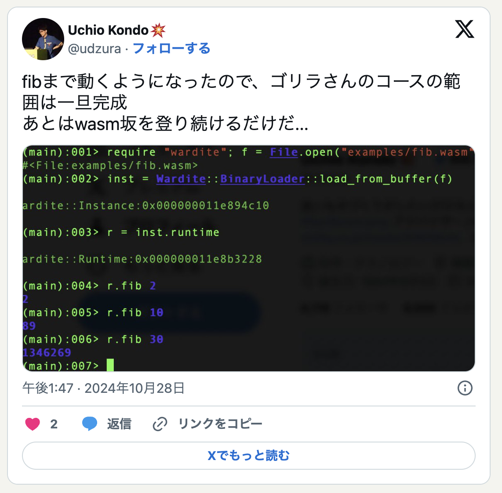
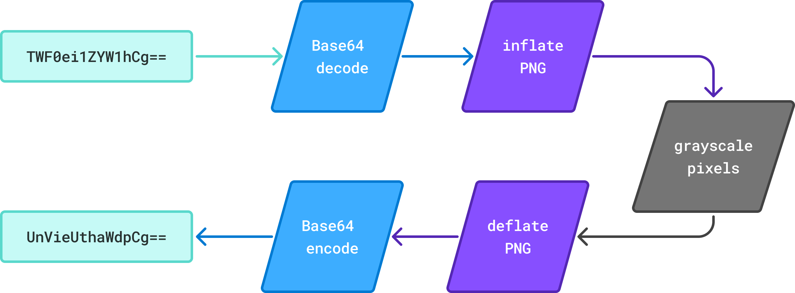
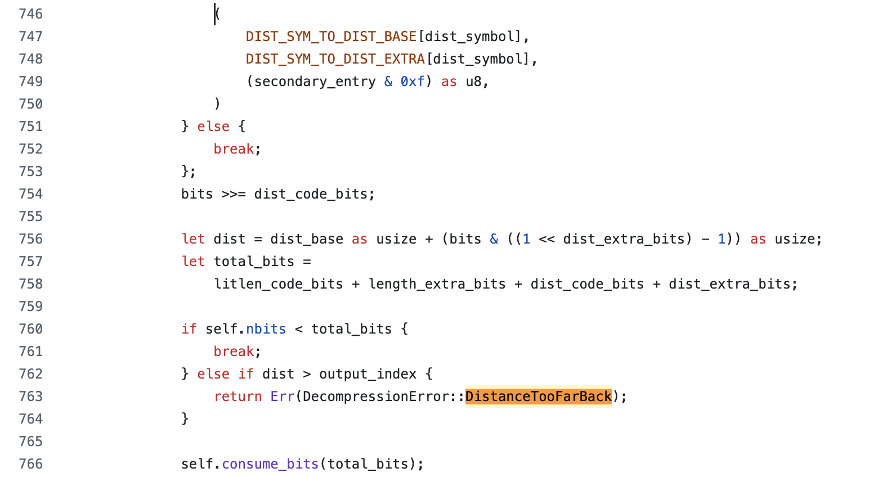
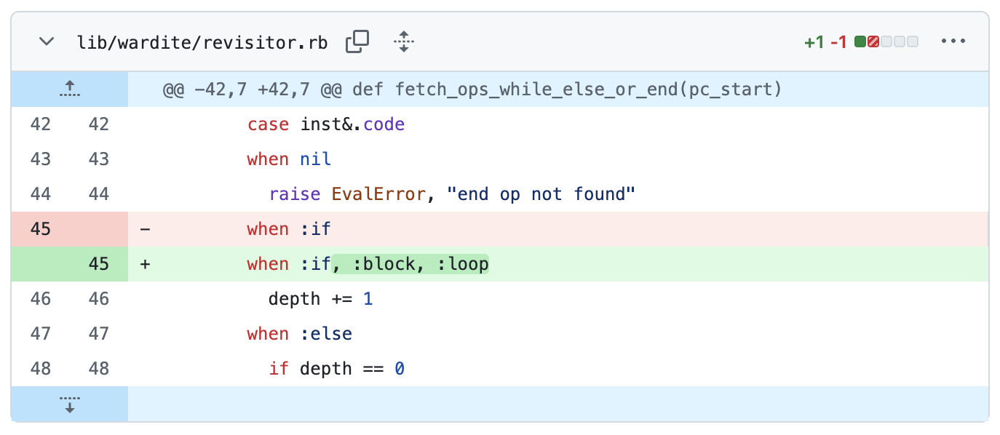
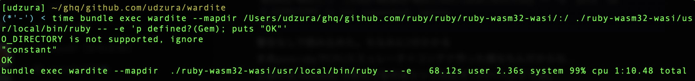
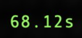
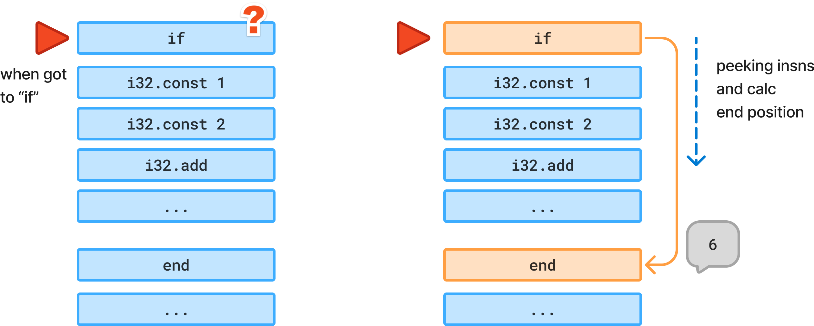

----
marp: true
theme: rubykaigi2025
paginate: true
backgroundImage: url(./rubykaigi2025_bg.004.jpeg)
title: Running ruby.wasm on Pure Ruby WASM Runtime
description: On RubyKaigi 2025 Matzyama / Running ruby.wasm on Pure Ruby WASM Runtime
# header: "Running ruby.wasm on Pure Ruby WASM Runtime"
image: https://udzura.jp/slides/2025/rubykaigi/ogp.png
size: 16:9
----


----
<!--
_class: title
_backgroundImage: url(./rubykaigi2025_bg.002.jpeg)
-->

# Running ruby.wasm<br>On Pure Ruby WASM Runtime

## Presentation by Uchio Kondo

----

<!--
_class: hero0
_backgroundImage: url(./rubykaigi2025_bg.005.jpeg)
-->

# Hello from Matzyama!

----
<!--
_class: profile
-->


# self.introduce!

- Uchio Kondo
  - from Fukuoka.rb
- Affiliation: SmartHR, Inc.
  - Product Engineer
- Translator of "Learning eBPF"

----

<!--
_class: hero0
_backgroundImage: url(./rubykaigi2025_bg.005.jpeg)
-->

# Today's Theme: Wardite

----

<!--
_class: hero
_backgroundImage: url(./rubykaigi2025_bg.003.jpeg)
-->

# What's Wardite?

----

# Wardite?

- A Pure Ruby WebAssembly Runtime


<address>
<br>
<br>
<br>
<br>
<br>
<br>
<br>
photo: https://en.wikipedia.org/wiki/Wardite#/media/File:Wardite.jpg 
</address>


----

# Running Wardite

```
$ gem install wardite
$ wardite ./helloworld.wasm
Hello, world
```

----

# Using Wardite as a Gem

```ruby
require 'wardite'

instance = Wardite.new(path: './helloworld.wasm', enable_wasi: true)
ret = instance._start
#=> Output: Hello, world
p ret
#=> I32(0)
```

----

# Revisiting: What is Wardite?

- A Pure Ruby WebAssembly Runtime...
- What is WebAssembly?
- What is a WebAssembly Runtime?

----

# What is WebAssembly?

- WebAssembly is:
  - A binary instruction format
  - Originally designed for execution in web browsers
  - Nowadays used in various environments including server-side

----

# WebAssembly Runs in Browsers

- You can compile C code like this into wasm and run it

```c
int add(int a, int b) {
    return a + b;
}
```

// TBA: Browser console example

----

# WebAssembly Runs Anywhere

- You can run wasm binaries as CLI commands

```
$ wasmtime --invoke add add.wasm 100 200
300
```

<ul class="lowered">
<li>As we'll discuss later, you can also run them within applications that have a Wasm execution environment</li>
</ul>


----

# WebAssembly Execution Flow

- First, prepare source code (in C, C++, Rust...)
- Then compile it into wasm binary
- Finally, executing wasm binary via runtime

----

# WebAssembly Execution Flow



----

# What is a WebAssembly Runtime?

- A WebAssembly Runtime is an environment for executing WebAssembly
- Browsers can also be considered as Runtimes
- Notable implementations include wasmtime and wasmedge

----

# What is a WebAssembly Runtime?

- Some implementations can be embedded within languages
  - Embedded library implementations are sometimes written purely in that language
  - Examples: Go = wazero, Swift = swiftwasm ...

----

# So, What is Wardite?

- A WebAssembly Runtime written in Pure Ruby
- Since it's written in Ruby, you can run WebAssembly within Ruby
- For quick try, we also provide a command-line tool

----

# Wardite's Design Principles

- Depend only on Ruby's standard and bundled libraries
  - Especially the core part (discussed later) is implemented using only Ruby's standard library
- Fully adopt rbs-inline

----

# Wardite's Implementation Status

- WebAssembly Core Spec implementation
  - Basic parts are complete
  - Sufficient testing is still pending
- WASI preview1 (p1)
  - Implemented some WASI p1 functions
  - Implemented (roughly) everything needed to run ruby.wasm

----

# What is WebAssembly Core Spec?

- A set of basic WebAssembly specifications
  - Defines WebAssembly's binary and text formats, instruction set, type system, memory model, etc.
  - Runtimes can execute binaries by implementing these specifications
- Specifications like WASI and Component Model
  - Are built on top of the Core Spec

----

# What is WASI?

- WebAssembly System Interface
- The Core Spec itself doesn't define OS interactions
- WASI defines APIs for WebAssembly to interact with the OS
- There are p1 and p2, currently implementing p1

----

# WASI

<br>
<br>



----

<!--
_class: hero
_backgroundImage: url(./rubykaigi2025_bg.003.jpeg)
-->

# Why Wardite?

----

# Wardite's Goals

- Expand use cases for wasm language embedding in Ruby
- Very portable implementation
  - (works where Ruby works, or works with mruby)
- Helps with Ruby's performance testing
- But the real reason is...


----

<!--
_class: hero
_backgroundImage: url(./rubykaigi2025_bg.003.jpeg)
-->

# Just for Fun.

----

# Previous Implementation

- https://github.com/technohippy/wasmrb
- However, there were many unimplemented parts, so I decided to do it!

----

# WebAssembly's Potential

- IMO: WebAssembly has great potential
- And aim to increase access paths in Ruby

----

# WebAssembly's Potential

- Expectations for language-agnostic aspects
- Interest in the simplicity of the Core
- Possibilities for application embedding

----

# Language-Agnostic Aspects

- Many compiled languages support wasm targets
  - Rust, Go, C/C++, Swift, Zig, Dart, Scala...
  - LLVM backend
- Many assets can be converted to wasm via C...
  - Some languages are written in C. Ruby, Python, Lua, Perl...

----

# Interest in the Simple Core

- The WebAssembly Core Spec seems to maintain simplicity and rationality
  - Therefore, implementation is relatively easy
  - The runtime itself is easy to embed in various places
- About extension specifications... there are various opinions...

----

# Possibilities for Application Embedding

- Suitability for embedded execution in applications
  - Runtimes can often be made small, making them easy to embed in various environments
  - Runtime implementations are actually emerging in various languages

----

# Example: Using Embedded wasm in Go

- Pure Go plugin mechanism using wazero
  - wazero = Pure Go WebAssembly Runtime
  - wasm can be prepared with GOARCH=wasm32 or tinygo
- Generally, direct C function usage from Go has many considerations and is difficult
  - Therefore, dlload() etc. is also difficult 

----

# [knqyf263/go-plugin](https://github.com/knqyf263/go-plugin)

- Go Plugin System over WebAssembly
- Dynamic loading of Go from Go

----

# Browser as an Embedded Environment

- Browser execution can be better understood as "a wasm runtime embedded in the browser"

<br>
<br>
<br>
<br>
<br>
<br>

&nbsp;&nbsp;&nbsp;&nbsp;&nbsp;&nbsp;&nbsp;&nbsp;&nbsp;&nbsp;&nbsp;&nbsp;&nbsp;&nbsp;&nbsp;&nbsp;&nbsp;&nbsp;&nbsp;&nbsp;&nbsp;&nbsp;&nbsp;&nbsp;&nbsp;&nbsp;&nbsp; 

----

# Exploring the Possibilities

- High affinity for embedded execution
  - Converting various application parts to wasm
    - As configuration languages e.g. envoy, fluent-bit,...
  - Could potentially replace intended uses of mruby and Lua
- Since wasm can be written in any language...
  - It hints at a future where various languages can be combined

----

# Conceptual Diagram from wasmCloud's Website

<br>

&nbsp;&nbsp;&nbsp;&nbsp;&nbsp;&nbsp;&nbsp;&nbsp;&nbsp;&nbsp;&nbsp;&nbsp;&nbsp;&nbsp;&nbsp;&nbsp;&nbsp;&nbsp;&nbsp;&nbsp;&nbsp;&nbsp;&nbsp;&nbsp;&nbsp;&nbsp;&nbsp;&nbsp;&nbsp;&nbsp;&nbsp;&nbsp;&nbsp;&nbsp;&nbsp;&nbsp;&nbsp; 

<ul class="underpre">
<li><a href="https://wasmcloud.com/">From wasmCloud official website</a></li>
</ul>

----

# Personal Opinions

- The Core spec is very small, allowing for various runtime implementations and easy embedding in different environments
  - There's a clear intention to keep wasm's core simple despite various extensions
  - This design philosophy feels different from JVM (personal opinion)
  - Limiting the value to just "running in browsers" might be too narrow-minded

----

<!--
_class: hero
_backgroundImage: url(./rubykaigi2025_bg.003.jpeg)
-->

# How to Develop Wardite

----

# Wardite's Development History

- Several milestones were achieved
  - Porting the Gorilla Book (Hello, World)
  - Covering basic Core Spec instructions
  - Running the grayscale sample program
  - Starting ruby.wasm
  - Making require work in ruby.wasm

----

# Port the "Implementing Wasm Runtime" Book

- Goal: Make "Hello, World" work
- Required implementation...
  - Basic VM structure and instructions
    - Local variables, global variables (+ control structures)
    - Memory allocation and deallocation
    - Function import/export sections
    - Only supporting WASI's fd_write()

----

# What is "Implementing Wasm Runtime in Rust"?

- 『[RustでWasm Runtimeを実装する](https://zenn.dev/skanehira/books/writing-wasm-runtime-in-rust)』
  -  "Gorilla Book" after the author's penname
- A book for learning basic Wasm implementation in Rust
- Got a chance to use paid leave...
- Thought "So let's write it in Ruby"
  - Rust -> Ruby with full RBS seemed like a great challenge

----

# Book Impressions

- Although wasm is relatively simple, understanding the overall VM design philosophy is quite challenging
- However, it's understandable with careful reading of the book and spec documentation
- Having a Rust reference implementation was very helpful!

----

# Binary Format

- Implemented straightforwardly following the Gorilla Book
  - Section format
    - Header and content size at the beginning
    - Simple structure with section-specific content following

----

# Binary Format Overview

<br>
<br>



----

# Basic VM Code

```ruby
def execute!
  loop do
    cur_frame = self.call_stack.last #: Frame
    break unless cur_frame
    cur_frame.pc += 1
    insn = cur_frame.body[cur_frame.pc] #: Op
    break unless insn
    eval_insn(cur_frame, insn)
  end
end
```

<ul class="underpre">
<li>This is almost a real Wardite code!</li>
</ul>

----

# Actually, "Output" is Difficult

- A common issue for programming language creator?
- "Output" requires using OS functionality
- Had to implement WASI's `fd_write()` just for "output"
  - Following the book was sufficient. Thank goodness

----

# "Hello World" Worked

> @ 2024-10-28
> Allowing `fib()` to work, I just completed "Gorilla Book" basic course for now!
> All that's left is to thoroughly master Wasm...



----

# Covering Basic Core Spec Instructions

- After Hello World worked, wanted to implement more
- Goals
  - Cover basic Core Spec instructions
  - At this point, had the desire to "make ruby.wasm work", so investigated which instructions were used

----

# wasm Instruction Set

- There are basic and extended sets
- Basic range is written in the Core Spec
- About extended sets
  - GC, atomic, reference types, simd, exception handling...
  - Extentions are... future work!

----


# [WebAssembly Opcodes](https://pengowray.github.io/wasm-ops/)

----

# Challenges

- Wow, there are so many... (or maybe not that many?)
- Implemented 192 instructions in total
  - Doesn't seem that many...
- Just kept working diligently

----

# Wanting to Implement Numeric Operations Declaratively

- Numeric operations are handled through file generation
- Since there are 4 types, there're common ones
  - i32, i64, f32, f64
- Created a generator with Rake task
- Apparently, there are 167 insns automatically generated

----

# Even with Automatic Generation

- Still had to work hard on the templates...
  - TBA: Code around the generator

----

# Running Sample Programs

- With instructions implemented, moved to practical testing
- Tried running a grayscale processing program made in Rust from another project

----

# It Didn't Work...

- So started debugging this
  - TBA: Capture of the failure

----

# Overview of the Grayscale Program

<br>



----

# Fixing Memory Allocation (memory.grow)

- Memory allocation wasn't working correctly, causing overflow
- The fix was just one line, but
  - It took quite some effort to identify the cause...
    - Ran the wasm in a browser, set breakpoints where it crashed around memory to check variable changes
    - Looking back, should have run core spec tests to verify if the instruction behavior was correct overall

----

# But It Still Didn't Work

- Rust's panic was converted to `unreachable`...
  - `unreachable` = a wasm instruction meaning "this point should never be reached, error if reached"
- Modified it to return error strings instead of panicking

----

# Error String

- Content:
  > `Format error decoding Png: Corrupt deflate stream. DistanceTooFarBack`
- [Looking at the Rust implementation](https://github.com/image-rs/fdeflate/blob/4610c916ae1000c9b5839059340598a7c55130e8/src/decompress.rs#L42)
- Hmm, not sure what's going on

----



----

# What It's Doing

- On decoding PNG
- Decompressing deflate compression
- Getting an error in this process

----

# Correctly Handling Deflate...?

- Looking at the inflate/deflate processing
  - it's clear that **bit shift operations** are heavily used
- Maybe one of the related insns isn't working correctly?

----

# Verifying i32 Instruction Correctness

- Let's run core spec tests
- How to run:
  - [Official wasm core spec test cases](https://github.com/WebAssembly/spec/tree/main/test/core) are available
  - Generate wasm binaries and execution scenarios from them
  - Run them with Wardite

----

# Reference: Example of Running Core Spec

- Can generate test cases with `wast2json`
  - ref: [自作Wasmランタイムを公式のテストスイートを用いてテストする話](https://zenn.dev/ri5255/articles/bac96cf74f82f0)

----

# Created a Tester Like This

- Generate test case files with wast2json
- Iterate through those files and execute as Ruby test-unit tests
  - Call Wardite.load().call based on binary and parameters
- Since I'm using Ruby
  - automating these tedious tasks is easy

----

```ruby
testcase = JSON.load_file("spec/i32.json", symbolize_names: true)
testcase[:commands].each do |command|
  case command[:type]
  when "module"
    command => {filename:}
    current = filename
  when "assert_return"
    command => {line:, action:, expected:}
    action => {type:, field:, args:}
    args_ = args.map{|v| parse_value(v) } 
    expected_ = expected.map{|v| parse_result(v) }
    ret = Wardite::new(path: "spec/" + current).runtime.call(field, args_)
    if ret != expected_[0]
      warn "test failed! expect: #{expected_} got: #{ret}"
    end
  end
end
```

----

# Then Fix One by One

- Indeed, bit shift instructions were failing, so fixed those
- Normal cases now pass
- Note: Temporarily omitted test cases with corrupted binary format, etc.
- TBA: test pass capture

----

# Grayscale Worked!

&nbsp;
&nbsp;


<ul class="underpre">
<li>Grayscale execution result looks OK</li>
</ul>

----

# Want to Run Something More (?) Practical

- Finally, the challenge of running ruby.wasm

----

<!--
_class: hero
_backgroundImage: url(./rubykaigi2025_bg.003.jpeg)
-->

# Running ruby.wasm

----

# Running ruby.wasm

- Make it work by passing ruby.wasm to `wardite` command
- Besides instruction coverage, what else is needed?
  - WASI support is needed for ruby.wasm to work

----

# What WASI Functions Does ruby.wasm Need?

- Can be checked with this command:

```
$ wasm-objdump -x -j Import ./ruby-wasm32-wasi/usr/local/bin/ruby
```

<ul class="underpre2">
<li>This time, 37 functions are needed. </li>
<li>※ Depending on bundled gems or build env</li>
</ul>

----

```
Import[37]:
 - func[0] sig=1 <__imported_wasi_snapshot_preview1_args_get> <- wasi_snapshot_preview1.args_get
 - func[1] sig=1 <__imported_wasi_snapshot_preview1_args_sizes_get> <- wasi_snapshot_preview1.args_sizes_get
 - func[2] sig=1 <__imported_wasi_snapshot_preview1_environ_get> <- wasi_snapshot_preview1.environ_get
 - func[3] sig=1 <__imported_wasi_snapshot_preview1_environ_sizes_get> <- wasi_snapshot_preview1.environ_sizes_get
 - func[4] sig=1 <__imported_wasi_snapshot_preview1_clock_res_get> <- wasi_snapshot_preview1.clock_res_get
 - func[5] sig=37 <__imported_wasi_snapshot_preview1_clock_time_get> <- wasi_snapshot_preview1.clock_time_get
 - func[6] sig=38 <__imported_wasi_snapshot_preview1_fd_advise> <- wasi_snapshot_preview1.fd_advise
 - func[7] sig=2 <__imported_wasi_snapshot_preview1_fd_close> <- wasi_snapshot_preview1.fd_close
 - func[8] sig=2 <__imported_wasi_snapshot_preview1_fd_datasync> <- wasi_snapshot_preview1.fd_datasync
 - func[9] sig=1 <__imported_wasi_snapshot_preview1_fd_fdstat_get> <- wasi_snapshot_preview1.fd_fdstat_get
 - func[10] sig=1 <__imported_wasi_snapshot_preview1_fd_fdstat_set_flags> <- wasi_snapshot_preview1.fd_fdstat_set_flags
 - func[11] sig=1 <__imported_wasi_snapshot_preview1_fd_filestat_get> <- wasi_snapshot_preview1.fd_filestat_get
 - func[12] sig=26 <__imported_wasi_snapshot_preview1_fd_filestat_set_size> <- wasi_snapshot_preview1.fd_filestat_set_size
 - func[13] sig=27 <__imported_wasi_snapshot_preview1_fd_pread> <- wasi_snapshot_preview1.fd_pread
 - func[14] sig=1 <__imported_wasi_snapshot_preview1_fd_prestat_get> <- wasi_snapshot_preview1.fd_prestat_get
 - func[15] sig=0 <__imported_wasi_snapshot_preview1_fd_prestat_dir_name> <- wasi_snapshot_preview1.fd_prestat_dir_name
 - func[16] sig=27 <__imported_wasi_snapshot_preview1_fd_pwrite> <- wasi_snapshot_preview1.fd_pwrite
 - func[17] sig=3 <__imported_wasi_snapshot_preview1_fd_read> <- wasi_snapshot_preview1.fd_read
 - func[18] sig=27 <__imported_wasi_snapshot_preview1_fd_readdir> <- wasi_snapshot_preview1.fd_readdir
 - func[19] sig=1 <__imported_wasi_snapshot_preview1_fd_renumber> <- wasi_snapshot_preview1.fd_renumber
 - func[20] sig=45 <__imported_wasi_snapshot_preview1_fd_seek> <- wasi_snapshot_preview1.fd_seek
 - func[21] sig=2 <__imported_wasi_snapshot_preview1_fd_sync> <- wasi_snapshot_preview1.fd_sync
 - func[22] sig=1 <__imported_wasi_snapshot_preview1_fd_tell> <- wasi_snapshot_preview1.fd_tell
 - func[23] sig=3 <__imported_wasi_snapshot_preview1_fd_write> <- wasi_snapshot_preview1.fd_write
 - func[24] sig=0 <__imported_wasi_snapshot_preview1_path_create_directory> <- wasi_snapshot_preview1.path_create_directory
 - func[25] sig=5 <__imported_wasi_snapshot_preview1_path_filestat_get> <- wasi_snapshot_preview1.path_filestat_get
 - func[26] sig=64 <__imported_wasi_snapshot_preview1_path_filestat_set_times> <- wasi_snapshot_preview1.path_filestat_set_times
 - func[27] sig=13 <__imported_wasi_snapshot_preview1_path_link> <- wasi_snapshot_preview1.path_link
 - func[28] sig=65 <__imported_wasi_snapshot_preview1_path_open> <- wasi_snapshot_preview1.path_open
 - func[29] sig=9 <__imported_wasi_snapshot_preview1_path_readlink> <- wasi_snapshot_preview1.path_readlink
 - func[30] sig=0 <__imported_wasi_snapshot_preview1_path_remove_directory> <- wasi_snapshot_preview1.path_remove_directory
 - func[31] sig=9 <__imported_wasi_snapshot_preview1_path_rename> <- wasi_snapshot_preview1.path_rename
 - func[32] sig=5 <__imported_wasi_snapshot_preview1_path_symlink> <- wasi_snapshot_preview1.path_symlink
 - func[33] sig=0 <__imported_wasi_snapshot_preview1_path_unlink_file> <- wasi_snapshot_preview1.path_unlink_file
 - func[34] sig=3 <__imported_wasi_snapshot_preview1_poll_oneoff> <- wasi_snapshot_preview1.poll_oneoff
 - func[35] sig=4 <__imported_wasi_snapshot_preview1_proc_exit> <- wasi_snapshot_preview1.proc_exit
 - func[36] sig=1 <__imported_wasi_snapshot_preview1_random_get> <- wasi_snapshot_preview1.random_get
```

----

# Wardite's WASI Implementation Strategy

- Implement everything in a class called
  - `Wardite::WasiSnapshotPreview1`
- This class is treated specially during import

----

```ruby
module Wardite
  class WasiSnapshotPreview1
    # @rbs store: Store
    # @rbs args: Array[wasmValue]
    # @rbs return: Object
    def clock_time_get(store, args)
      clock_id = args[0].value
      _precision = args[1].value
      timebuf64 = args[2].value
      if clock_id != 0 # - CLOCKID_REALTIME
        return Wasi::EINVAL
      end
      now = Time.now.to_i * 1_000_000
      memory = store.memories[0]
      now_packed = [now].pack("Q!")
      memory.data[timebuf64...(timebuf64+8)] = now_packed
      0
    end
  end
end
```

----

# Basic Strategy

- `loop do`
  - Try to start ruby.wasm
  - Get "`**** function not found!`" error
  - Implement that function
- `end`

----

# Examples of Functions Implemented

- Getting argv, environment variables
- Getting current time
- Getting random numbers
- prestat functions
  - As mentioned later, this was implemented incorrectly.
- read/write, other functions to get various info from `fd`

----

# By the Way

- Implemented the required WASI functions, but...
- At the very end, got stuck because of a mistake
  - in `if/block/loop` implementation
  - It wasn't working regardless of WASI
  - Finally noticed after staring format with `wasm-tools print`...

----

# [The Fix Commit](https://github.com/udzura/wardite/commit/605dd7cb6db1ddfd3b84078d733400d56f400f3c#diff-bff9b2bd05ba0d106ae6c1e3e5a1b41c41aff0e0e6e245aa123bf6589627a711)



----

# ruby.wasm's `--version` Now Works!

```
$ bundle exec wardite ./ruby -- --version        
ruby 3.4.2 (2025-02-15 revision d2930f8e7a) +PRISM [wasm32-wasi]
```

----

# Release information

- Released this version as Wardite 0.6.0
- [Code at that point](https://github.com/udzura/wardite/blob/7ef48389415df9e44784d515f3e0e96aa00f2ad2/lib/wardite/wasi.rb)
- Worked with 12 WASI functions

----

# Behavior at This Point

<br>

```
$ bundle exec wardite ./ruby -- -e '5.times { p "hello: #{_1}" }'
`RubyGems' were not loaded.
`error_highlight' was not loaded.
`did_you_mean' was not loaded.
`syntax_suggest' was not loaded.
"hello: 0"
"hello: 1"
"hello: 2"
"hello: 3"
"hello: 4"
```

<ul class="underpre">
<li>Ruby's C implementation core library works</li>
</ul>

----

# Behavior at This Point

<br>

```
$ bundle exec wardite ./ruby -- -e 'puts "Hello"'        
`RubyGems' were not loaded.
`error_highlight' were not loaded.
`did_you_mean' were not loaded.
`syntax_suggest' were not loaded.
Hello
```

<ul class="underpre">
<li>Cannot recognize file system</li>
<li>Cannot require, of course - load warnings at startup</li>
</ul>

----

# Want to Make `Kernel#require` Work

- For that...
  - Need to make Wardite properly recognize the file system

----

# Initial File System Implementation

- Start with opening files
  - Tried implementing `path_open` function roughly, but
  - Doesn't work properly...
  - Not even being called?
- Why?

----

# WASI Has a Mechanism Called preopens

- Refer to wasi-sdk's libc
- [See codes in `libc-bottom-half/sources/preopens.c`](https://github.com/WebAssembly/wasi-libc/blob/e9524a0980b9bb6bb92e87a41ed1055bdda5bb86/libc-bottom-half/sources/preopens.c#L246-L276)

----

```c
    for (__wasi_fd_t fd = 3; fd != 0; ++fd) {
        __wasi_prestat_t prestat;
        __wasi_errno_t ret = __wasi_fd_prestat_get(fd, &prestat);
        if (ret == __WASI_ERRNO_BADF)
            break;
        if (ret != __WASI_ERRNO_SUCCESS)
            goto oserr;
        switch (prestat.tag) {
        case __WASI_PREOPENTYPE_DIR: {
            char *prefix = malloc(prestat.u.dir.pr_name_len + 1);
            if (prefix == NULL)
                goto software;

            ret = __wasi_fd_prestat_dir_name(fd, (uint8_t *)prefix,
                                             prestat.u.dir.pr_name_len);
            if (ret != __WASI_ERRNO_SUCCESS)
                goto oserr;
            prefix[prestat.u.dir.pr_name_len] = '\0';

            if (internal_register_preopened_fd_unlocked(fd, prefix) != 0)
                goto software;
            free(prefix);

            break;
        }
        default:
            break;
        }
    }
```

----

# File System Handling in WASI p1

- In WASI p1 compatible WASM runtimes, by default, they **cannot** access the parent environment's file system at startup.
- When starting a WASM runtime, you need to pass information about the file system you want to share with the parent environment at `fd = 3` and beyond
  - This is called "preopens"

----

# File System Sharing Initialization Process

- (Based on wasi-sdk's assumptions)
- File system registration is done 
  - in the `__wasilibc_populate_preopens(void)` function
  - Checks preopens sequentially from fd = 3 using `fd_prestat_get()`
  - Gets names with `fd_prestat_dir_name()` and register
  - Returns `EBADF` and exits when there's no more preopens

----

# Why Couldn't We Access Files?

- Functions like `path_open()` aren't even called if the preopen environment isn't registered
- See `__wasilibc_find_abspath()`:
  - [`libc-bottom-half/sources/preopens.c#L190-L213`](https://github.com/WebAssembly/wasi-libc/blob/e9524a0980b9bb6bb92e87a41ed1055bdda5bb86/libc-bottom-half/sources/preopens.c#L190-L213)

----

```c
    // by udzura: Process to find matching path from preopens
    for (size_t i = num_preopens; i > 0; --i) {
        const preopen *pre = &preopens[i - 1];
        const char *prefix = pre->prefix;
        size_t len = strlen(prefix);

        // If we haven't had a match yet, or the candidate path is longer than
        // our current best match's path, and the candidate path is a prefix of
        // the requested path, take that as the new best path.
        if ((fd == -1 || len > match_len) &&
            prefix_matches(prefix, len, path))
        {
            fd = pre->fd;
            match_len = len;
            *abs_prefix = prefix;
        }
    }
```

----

# So Fixed the prestat Functions

- Mostly correctly fixed
  - `fd_prestat_get()` and `fd_prestat_dir_name()`
- Moreover, had to implement a few more things
  - Especially `fd_readdir()` was tough...

----

# Normal Ruby Started Without load Warnings

- All's well that ends well



----



----

# ...It's Taking Quite Some Time...

- Let's talk about performance at the end

----

# Let's Demo the Startup Here

- Please let me use `--disable-gems` for speed

```
$ bundle exec wardite \
    --mapdir ./ruby-wasm32-wasi/:/ ./ruby -- \
    --disable-gems -e '5.times { p "hello: #{_1}" }'
```

----

<!--
_class: hero
_backgroundImage: url(./rubykaigi2025_bg.003.jpeg)
-->

# Dealing with Performance Measurement

----

# Dealing with Performance Measurement

- Still halfway there!
  - Haven't been doing nothing
- Let me talk about some implemented improvements
  - Block jump improvements
  - Instance creation issues
  - YJIT effects

----

# Measurement Assumptions (1)

- For now, prepared benchmark programs for these use cases
  - Grayscale processing (Rust)
    - Internally does base64 encode/decode + PNG expansion (deflate)
  - ruby.wasm version display
  - ruby.wasm w/ RubyGems

----

# Measurement Assumptions (2)

- Software versions etc.
  - macOS 14.0 / Apple M3 Pro
  - ruby 3.4.2 (2025-02-15 revision d2930f8e7a) +YJIT +PRISM [arm64-darwin24]
    - Both Mac and wasm sides
    - Mac side is YJIT enabled unless specified otherwise
  - Wardite 0.6.1

----

<!--
_class: hero
_backgroundImage: url(./rubykaigi2025_bg.003.jpeg)
-->

# Block Jump Improvements

----

# Background: About Jump Instructions

- WebAssembly's jump instructions
  - There are if, block, and loop
  - These instructions need to know the position of their corresponding end
    - Unlike common jump instructions, they don't hold offsets

----

# When measuring the first version with ruby-prof

- Clearly, the `fetch_ops_while_end` method was at the top...

<br>
<br>

```
-------------------------------------------------------------------------------------------------------------------------------------
                     54.539      9.845      0.000     44.69413069318/13069318     Kernel#loop
  73.63%  13.29%     54.539      9.845      0.000     44.694         13069318     Wardite::Runtime#eval_insn     /.../lib/wardite.rb:420
                     19.493      0.024      0.000     19.469      95886/95886     Wardite::Runtime#fetch_ops_while_end
                     15.638      6.483      0.000      9.156  5225913/5225913     <Module::Wardite::Evaluator>#i32_eval_insn
                      3.330      1.238      0.000      2.093  1155055/1155055     Wardite::Runtime#do_branch
                      0.773      0.773      0.000      0.00013069318/13069318     Wardite::Op#namespace
                      0.757      0.757      0.000      0.00012631671/73174992     Array#[]
                      0.749      0.749      0.000      0.00015275900/53340046     BasicObject#!
                      0.542      0.542      0.000      0.00010109073/23362733     Wardite::Runtime#stack
```

----

# Initial Naive Implementation

- Every time an if/block/loop instruction was encountered:
  - Looked ahead in the current code to calculate the position of the corresponding end
- Therefore, when looping many times or calling functions containing if statements repeatedly, it had to fetch and calculate each time...

----



----

# Decided to Calculate in Advance

- Under the assumption that instructions don't change dynamically, moved towards pre-calculating end positions
  - Wardite doesn't do JIT, so...

----

# Specific Implementation of Pre-calculation

- Once instructions are parsed, revisit the instruction sequence
  - When finding if/block/loop instructions, calculate their end positions on the spot
- Decided to **cache end positions** in instruction metadata and use that

----

# This Alone Reduced Execution Time by 43%

- Improvement for now!
- TBA: Comparison capture or graph

----

<!--
_class: hero
_backgroundImage: url(./rubykaigi2025_bg.003.jpeg)
-->

# Instance Creation Issues

----

# Instance Creation Issues

- Next, measured Wardite's bottlenecks with perf, but...
- Common occurrences were:
  - `rb_vm_set_ivar_id`
  - `rb_class_new_instance_pass_kw`
- These appear at the top even with YJIT

----

# In Other Words

- Creating too many instances is slow
- Wardite's internal Value implementation looks like this

<br>
<br>
<br>
<br>
<br>

```ruby
class I32
  def initialize(value)
    @value = value
  end
end
```

----

# How Many Are Actually Being Created?

- Measured Wardite's internal Value-making functions:

<br>
<br>
<br>
<br>

```ruby
$COUNTER = {}
TracePoint.trace(:call) do |tp|
  if %i(I32 I64 F32 F64).include?(tp.method_id)
    $COUNTER[tp.method_id] ||= 0
    $COUNTER[tp.method_id] += 1
  end
end

END {
  pp $COUNTER
}
```

----

# For Example, Grayscale Processing

```
{:I32=>18845604, :I64=>1710552, :F32=>247500}
```

- In the case of I32, 18.8 million instances are being created...

----

# Thoughts

- Even though they're I32
  - there might be many instances of specific values?
  - For example, `-1, 0, 1, 2, 3, 4, 8, 16` ... ?
- Let's try memoization

----

```ruby
class I32
  (0..64).each do |value|
    @@i32_object_pool[value] = I32.new(value)
  end
  value = -1 & I32::I32_MAX
  @@i32_object_pool[value] = I32.new(value)

  def self.cached_or_initialize(value)
    @@i32_object_pool[value] || I32.new(value)
  end
end
```

----

# There Was Some Effect

- Changed by about 1 second
- TBA: Can't find measurement results. Will remeasure later and add graph

----

# Further Tuning?

- Could have more effect by not creating objects for I32 etc. (using Integer directly)
- However, this would require major design changes...
  - Left as a future task

----

# Reference: Breakdown of ruby.wasm Startup Time

- Want to measure:
  - Time taken for binary parsing relative to total
  - Comparison with and without `--disable-gems`
  - Time taken for WASI function calls relative to total

----


```
TBA!!!1
```

----

# YJIT Effects

- YJIT has a significant effect on Wardite's execution speed
- Just putting the results here for reference
  - All environments are aarch64

----

# Results on Ruby 3.3 TBA

- Default
- `--yjit`

----

# Results on Ruby 3.4 TBA

- Default
- `--yjit`
- As you can see, the effect is greater than in 3.3. Thanks as always!

----

# What About Ruby 3.5-dev@2025/04/0X...?

- `# TODO TBA`

----

<!--
_class: hero
_backgroundImage: url(./rubykaigi2025_bg.003.jpeg)
-->

# Conclusion

----

# Wardite's Future

- Still need more implementation
  - Improve Core Spec coverage
  - Overall refactoring
  - Performance improvements
  - Improve WASI coverage
  - Component model support ...

----

# Looking for People Interested in Wasm Runtime

- First, please try using it, even just for fun

----

<!--
_class: hero0
_backgroundImage: url(./rubykaigi2025_bg.005.jpeg)
-->

# Thanks!

<br>

<blockquote>
一枝の花おもさうや酒の酔<br />
&nbsp;<small><small>... A Haiku from Shiki Masaoka</small></small>
</blockquote>


