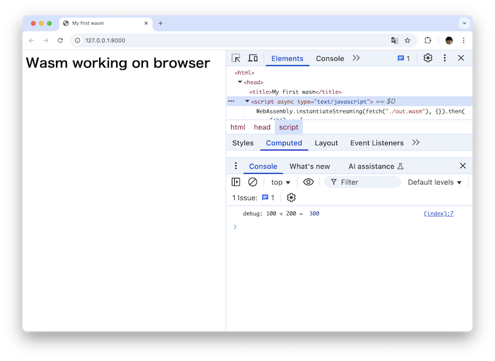
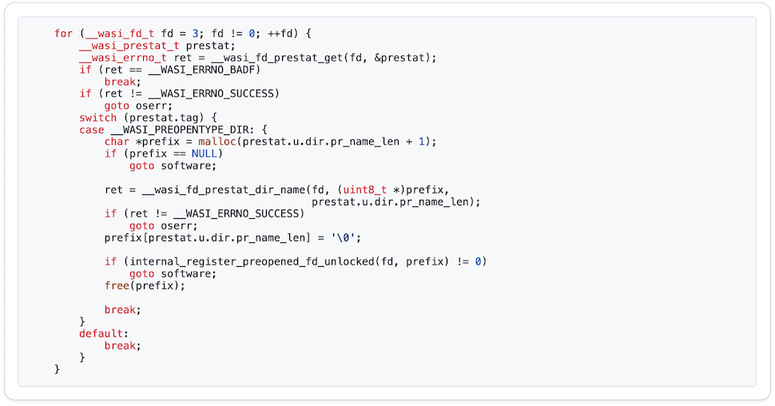
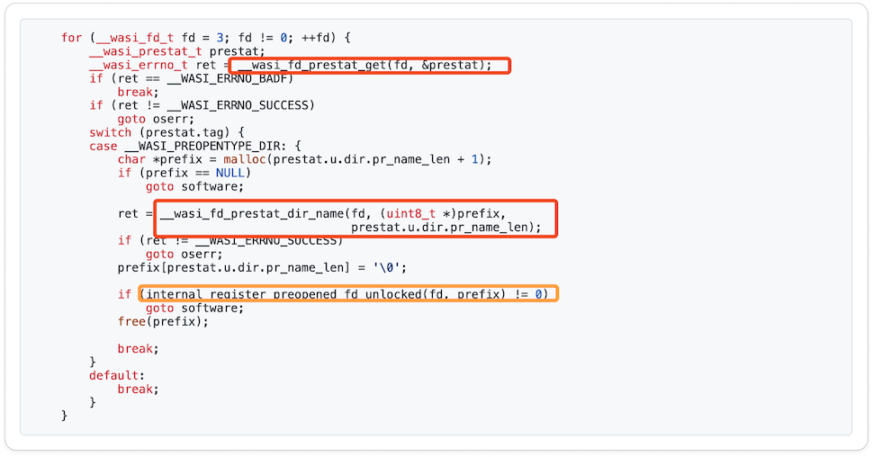

----
marp: true
theme: rubykaigi2025
paginate: true
backgroundImage: url(./rubykaigi2025_bg.004.jpeg)
title: Running ruby.wasm on Pure Ruby Wasm Runtime
description: On RubyKaigi 2025 Matzyama / Running ruby.wasm on Pure Ruby Wasm Runtime
# header: "Running ruby.wasm on Pure Ruby Wasm Runtime"
image: https://udzura.jp/slides/2025/rubykaigi/ogp.png
size: 16:9
----

<!--
_class: title
_backgroundImage: url(./rubykaigi2025_bg.002.jpeg)
-->

# Running ruby.wasm<br>On Pure Ruby Wasm Runtime

## Presentation by Uchio Kondo

----

<!--
_class: hero0
_backgroundImage: url(./rubykaigi2025_bg.005.jpeg)
-->

# Hello from Matz-yama!

<!--
This is a first time for me to visit Matsuyama! I'm really excited to be here.
-->

----
<!--
_class: profile
-->


# self.introduce!

- Uchio Kondo
  - from Fukuoka.rb
- Member of 
  - Product Engineer
- Translator of "Learning eBPF"

<!--
I'm Uchio Kondo.
I'm from Fukuoka, Japan and a Product Engineer at SmartHR, which is a Ruby Kaigi platinum sponsor.
I have 2 things to advertise:
-->

----

# Translator of "Learning eBPF"

- It's on sale! <strong>Visit @. bookstore!</strong>
- If you're interested in Ivo's talk,<br>&nbsp;&nbsp;&nbsp;&nbsp;&nbsp;&nbsp;&nbsp;&nbsp;&nbsp;&nbsp;&nbsp;&nbsp;&nbsp;&nbsp;BPF's also helpful (?)


<!--
One is about Satoru and my book. If you're interested in Ivo and yfractal's talk, I believe BPF's also helpful! Give it a shot at this lunch time!
-->

----

<!--
_class: hero0
_backgroundImage: url(./rubykaigi2025_bg.005.jpeg)
-->

# Today's Theme: Wardite

<!--
Ok, Today's topic is Wardite -
-->

----

<!--
_class: hero
_backgroundImage: url(./rubykaigi2025_bg.003.jpeg)
-->

# What's Wardite?

<!--
What is Wardite?
-->

----

# Wardite?

<ul>
<li style="margin-left: -2.2em !important;">A Pure Ruby WebAssembly Runtime</li>
</ul>

<!--
It is a WebAssembly or Wasm runtime written entirely in pure Ruby.
-->

----

# Wardite?

- Wardite is named<br>&nbsp;&nbsp;&nbsp;&nbsp;&nbsp;&nbsp;after the real mineral<br>&nbsp;&nbsp;&nbsp;&nbsp;&nbsp;&nbsp;**WA**rdite.


<address>
<br>
<br>
<br>
<br>
<br>
<br>
<br>
photo: https://en.wikipedia.org/wiki/Wardite#/media/File:Wardite.jpg 
</address>

<!--
Wardite is named after the real mineral Wardite, which starts with letters "W" and "A".
-->

----

# Running Wardite

```
$ gem install wardite
$ wardite ./helloworld.wasm
Hello, world
```

<!--
Wardite allows you to execute Wasm binaries directly within your Ruby applications.
Because it's a standard Ruby Gem, you can simply run `gem install Wardite` and start using it.
-->

----

# Using Wardite as a Gem

```ruby
require 'wardite'

instance = Wardite.new(path: './helloworld.wasm', enable_wasi: true)
ret = instance._start
#=> Output: Hello, world
p ret
#=> I32(0)
```

<!--
You can also use Wardite as a library to load and interact with existing Wasm modules directly from your Ruby code.
-->

----

<!--
_class: hero
_backgroundImage: url(./rubykaigi2025_bg.003.jpeg)
-->

# What is WebAssembly?

<!--
So let's have a look at WebAssembly.
-->

----

# What is WebAssembly?

- WebAssembly is:
  - A binary instruction format
  - Originally designed for execution in web browsers
  - Nowadays used in various environments including server-side

<!--
For a quick description: WebAssembly is a binary instruction format.
Think of it as a portable compilation target for compilers, such as rustc or clang.
Originally for browsers, Wasm is now designed to run anywhere – servers, edge devices, embedded systems, and yes, inside other applications.
-->

----

# WebAssembly Runs in Browsers

- You can compile C code like this into wasm and run it

<br>
<br>
<br>
<br>
<br>

```c
int add(int a, int b) {
    return a + b;
}
```

```javascript
WebAssembly.instantiateStreaming(fetch("./out.wasm"), {}).then(
    (obj) => {
        let answer = obj.instance.exports.add(100, 200);
        console.log("debug: 100 + 200 = ", answer);
    }
);
```

<!--
Here's a simple WebAssembly example. This C code, as you can see, just performs addition. If we compile this code into a Wasm binary, and then write JavaScript like this in the browser...
-->

----

# Result



<!--
...we can verify that the addition function, originally written in C, is now running successfully within the browser.
-->

----

# WebAssembly Execution Flow

- First, prepare source code (in C, C++, Rust...)
- Then compile it into wasm binary
- Finally, executing wasm binary via WebAssembly runtime

<!--
Here's the flow of how a wasm program works:
First, prepare source code such as C, C++, Rust...
Then compile it into a wasm binary,
and finally, execute the wasm binary via a WebAssembly runtime
-->

----

# WebAssembly Execution Flow


<!--
To execute Wasm binaries, you need a Wasm runtime.
Browsers have built-in runtimes, and there are standalone ones for terminal, like Wasmtime or WasmEdge.
-->

----

<!--
_class: hero
_backgroundImage: url(./rubykaigi2025_bg.003.jpeg)
-->

# So, What is Wardite?

<!--
Now, let's return to the topic of Wardite.
-->

----

# So, What is Wardite?

- A WebAssembly Runtime written in Pure Ruby
- We can run WebAssembly within Ruby

<!--
It's a Wasm runtime for the Ruby ecosystem, built in Ruby.
Since it's written in Ruby, you can run WebAssembly within Ruby.
-->

----

# Wardite's Design Principles

- Purity:
  - Depends only on Ruby's standard and bundled libraries
  - No external C dependencies or third-party Ruby gems
- Portability:
  - Can run on any Ruby environment
  - Even on mruby (planned for future versions)

<!--
A key design principle is its purity and portability:
Wardite depends only on Ruby's standard libraries. No external C dependencies or gems.
This means if you have Ruby, you can run Wardite. Maybe even on mruby, JRuby or others... in the future.
-->

----

# Wardite's Implementation Status

- Supports basic WebAssembly Core specifications
- WASI Preview 1

<!--
Currently, Wardite has a near-complete implementation of the WebAssembly Core Specification and very basic WASI support.
-->

----

# WebAssembly Core Spec is...

- A set of basic WebAssembly specifications
  - Defines WebAssembly's...
    - binary and text formats
    - instruction set
    - type system
    - memory model, etc.

<!--
WebAssembly Core Spec covers the fundamental instruction set, types, and memory model needed to execute compliant Wasm files.
-->

----

# And what is WASI?

- = WebAssembly System Interface
- The Core Spec itself doesn't define OS interactions
  - e.g. I/O, filesystem, clock, etc.

<!--
Crucially, Wardite also implements WASI – the WebAssembly System Interface, specifically the common Preview 1 version.
The Core Wasm spec doesn't define how to interact with the outside world, like filesystems or clocks.
-->

----

# WASI picture

- WASI defines APIs to interact with the OS

<br>
<br>
<br>
<br>
<br>

&nbsp;&nbsp;&nbsp;&nbsp;&nbsp;

<!--
WASI provides that standard interface.
It allows Wardite to run more complex applications compiled to Wasm, including, excitingly, Ruby itself compiled to Wasm.
-->

----

<!--
_class: hero
_backgroundImage: url(./rubykaigi2025_bg.003.jpeg)
-->

# Why Wardite?

<!--
So, why did I build this? There are several reasons:
-->

----

# Wardite's Goals

- #1
  - Expand use cases for wasm language embedding in Ruby

<!--
First is to expand integration between Ruby and Wasm. The primary goal is to unlock the potential of WebAssembly's power within Ruby applications.
-->

----

# Wardite's Goals

- #2
  - Desire to make very portable implementation
  - (works where Ruby works, or works with mruby)

<!--
Then I required High Portability. We wanted a runtime that works wherever standard Ruby works, potentially even extending to environments like mruby in the future.
-->

----

# c.f. Using wasmtime-rb

- Or other native-based solutions...
- On install, they require:
  - Native compilation or pre-compiled fat gem
  - Separate approaches for CRuby/mruby/...
- Wasm engine in pure Ruby provides greater maintainability

<!--
For comparison, consider other solutions such as wasmtime-rb.
During installation, these gems require either building native libraries or using pre-compiled artifacts called "Fat Gems".
These requirements can potentially increase operational overhead depending on the environment.
Furthermore, separate approaches are needed for different Ruby implementations like CRuby and mruby.
Writing Wasm engine in pure Ruby provides greater maintainability and compatibility.
-->

----

# Wardite's Goals

- #3
  - Helps with Ruby's performance testing
    - or complicated program usecase
  - Like optcarrot?

<!--
And third one: Leverage Wasm's Strengths into Ruby ecosystem. Fundamentally, WebAssembly offers compelling advantages.
-->

----

<!--
_class: hero
_backgroundImage: url(./rubykaigi2025_bg.003.jpeg)
-->

# But the real reason is...

<!--
But, honestly, the main reason was that I wanted to play with a complicated problem with Ruby,
-->

----

<!--
_class: hero0
_backgroundImage: url(./rubykaigi2025_bg.005.jpeg)
-->

# Just for Fun.

<!--
just for fun.
-->

----

<!--
_class: hero
_backgroundImage: url(./rubykaigi2025_bg.003.jpeg)
-->

# Bet WebAssembly's Potential!

<!--
In my opinion, WebAssembly holds significant potential due to several key strengths. such as:
-->

----

# Language-Agnostic Aspects

- Many compiled languages support wasm targets
  - Rust, Go, C/C++, Swift, Scala...
  - LLVM supporting wasm
  - And Some languages are written in C.
    - Ruby, Python, Lua, Perl...

<!--
Language-Agnostic nature: It serves as a compilation target for many languages like Rust, Go, and C++.
And crucially, C support potentially allows C-based languages (like Ruby or Python) to run via Wasm as well.
-->

----

# Possibilities for Application Embedding

- The WebAssembly Core Spec seems to maintain simplicity
- Suitability for embedded execution in applications

<!--
Also it's Embeddable & Portable: Its relatively simple core specification leads to small, efficient runtimes.
This makes Wasm easy to embed securely within diverse applications.
-->

----

# Browser as an Embedded Environment

- Browser execution can be better understood...
  - As "a wasm runtime embedded in the browser"

<br>
<br>
<br>
<br>
<br>
<br>

&nbsp;&nbsp;&nbsp;&nbsp;&nbsp;&nbsp;&nbsp;&nbsp;&nbsp;&nbsp;&nbsp;&nbsp;&nbsp;&nbsp;&nbsp;&nbsp;&nbsp;&nbsp;&nbsp;&nbsp;&nbsp;&nbsp;&nbsp;&nbsp;&nbsp;&nbsp;&nbsp; 

<!--
It's helpful to view the browser itself as just one prominent example of an environment embedding a Wasm runtime.
-->

----

# Polyglot Systems

- Language agnosticism + Embeddability
  - Write (wasm) component in any language
  - Combine them into an application in another language!

<!--
And finally, it enables Polyglot Systems in the future: Combining language agnosticism with embeddability allows developers...
-->

----

# Conceptual Diagram

<br>
<br>
<br>


<!--
...to build applications by combining components written in different languages,
choosing the best tool for each specific job.
-->

----

# FYI: wasmCloud Concept

<br>
<br>

&nbsp;&nbsp;&nbsp;&nbsp;&nbsp;&nbsp;&nbsp;&nbsp;&nbsp;&nbsp;&nbsp;&nbsp;&nbsp;&nbsp;&nbsp;&nbsp;&nbsp;&nbsp;&nbsp;&nbsp;&nbsp;&nbsp;&nbsp;&nbsp;&nbsp;&nbsp;&nbsp;&nbsp;&nbsp;&nbsp;&nbsp;&nbsp;&nbsp;&nbsp;&nbsp;&nbsp;&nbsp; 

<ul class="underpre">
<li><a href="https://wasmcloud.com/">From wasmCloud official website</a></li>
</ul>

<!--
The diagram on the website of WasmCloud, which is an open source wasm apps orchestrator, does a really good job of showing this concept.
-->

----

<!--
_class: hero
_backgroundImage: url(./rubykaigi2025_bg.003.jpeg)-->

# Wasm is Going Beyond the Browser

<!--
In essence, Wasm's value extends well beyond just the browser, enabling flexible and powerful new ways to construct software across many environments.

Now that you understand Wardite's background, let's dive deeper.
-->

----

<!--
_class: hero0
_backgroundImage: url(./rubykaigi2025_bg.005.jpeg)-->

# How to Develop Wardite

<!--
Let's look back at the development process of Wardite.
-->

----

<!--
_class: hero
_backgroundImage: url(./rubykaigi2025_bg.003.jpeg)
-->

# Retrospective of Past Development Milestones

<!--
There were several milestones...
-->

----

# Wardite's Development Milestones

- "Gorilla Book" (Hello, World)
- Core instructions
- Running grayscale
- Starting up ruby.wasm
- Letting ruby.wasm require

<!--
...during Wardite's development.
I'm going to describe them in order.
-->

----

<!--
_class: hero
_backgroundImage: url(./rubykaigi2025_bg.003.jpeg)-->

# Gorilla Book

<!--
The first milestone was porting a concepts from a resource called GorillaBook and getting "Hello World" to run in Wardite.
-->

----

# "Implementing Wasm Runtime in Rust"

- 『[RustでWasm Runtimeを実装する](https://zenn.dev/skanehira/books/writing-wasm-runtime-in-rust)』
  -  "Gorilla Book" after the author's penname
- A book for learning basic wasm implementation in Rust
- Goal: Make "Hello, World" work

<!--
GorillaBook, so named after the author's pen name, is a web book originally written for learning the basic implementation of WebAssembly using Rust.
Since I happened to have an opportunity to study it, I decided to implement a Ruby version, and that's how it started.
-->

----

# Port the "Implementing Wasm Runtime" Book

- Understanding the overall VM design is quite challenging...
  - Basic VM structure and instructions
  - Memory initialization
  - Function call/import/export
  - Some support of WASI


<!--
My impression was that it's an excellent book, but understanding the overall design philosophy of the VM was quite challenging.
-->

----

# Book Impressions

- Challenging, however,
  - It's understandable with careful reading of the book and spec documentation
- Having a Rust reference implementation was very helpful!

<!--
However, the book itself includes Rust reference implementations, which was extremely helpful.

Let me briefly explain the internals of Wasm.
-->

----

# Task #1: Binary Format

- A wasm binary has a specific size of sections
- Section format:
  - Header, including content size at the beginning
  - Simple structure with section-specific content following

<!--
First, you must parse the Wasm binary format.
However, the binary format is quite simple.
-->

----

# Binary Format Overview

<br>
<br>


<!--
Here's a diagram illustrating it.
It starts with some preamble, then hits a header, which contains the type and size, followed by the content of various sections. It's a simple combination of sections.
-->

----

# Task #2: VM Implementation

<br>

```ruby
def execute!
  loop do
    cur_frame = self.call_stack.last #: Frame
    break unless cur_frame
    cur_frame.pc += 1
    insn = cur_frame.body[cur_frame.pc] #: Op
    break unless insn
    eval_insn(cur_frame, insn)
  end
end
```

<ul class="underpre">
<li>This is almost a real Wardite code!</li>
</ul>

<!--
Once the binary is parsed, the next step is just running the VM. The VM implementation is also fundamentally a loop:
fetch the current frame and an instruction, execute it, then fetch the next one.
Repeating this loop is the basic VM implementation.
This snippet is almost a real Wardite code.
-->

----

# Task #3: "Output"

- A common issue for programming language creator?
- "Output" requires using OS functionality
- Had to implement WASI's `fd_write()` just for "output"
  - Following the book was sufficient. Thank goodness

<!--
Conversely, while the VM is simple, interacting with the outside world, like handling output, is a bit more difficult.
To produce output, you must implement at least the WASI function `fd_write`. So, I implemented this as well, having the book made it manageable.
-->

----

# "Hello World" Worked

> @ 2024-10-28
> Allowing `fib()` to work, I just completed "Gorilla Book" basic course for now!
> All that's left is to thoroughly master Wasm...


<!--
Afrer all that coding, "Hello World" worked!
"Hello World" is always a great thing, isn't it?
-->

----

<!--
_class: hero
_backgroundImage: url(./rubykaigi2025_bg.003.jpeg)
-->

# Core Instructions

<!--
Next, I decided to cover the basic instructions of the Wasm Core Spec.
-->

----

# Covering Basic Core Spec Instructions

- After Hello World worked, wanted to implement more
- Goals
  - Cover basic Core Spec instructions
  - At this point, had the desire to "make ruby.wasm work"

<!--
At this point, I had a slight desire to run Ruby Wasm.
-->

----

# wasm Instruction Set

- There are basic and extended sets
- Basic range is written in the Core Spec
- About extended sets
  - GC, atomic, reference types, simd...
  - Supporting extentions are... future work!

<!--
The Wasm instruction set has a basic range and extension sets.
The Core Spec defines which instructions belong to which range. There are special extension sets for things like GC, SIMD instructions, concurrency, and others.
-->

----


# [Opcodes Table](https://pengowray.github.io/wasm-ops/)

<!--
This time, I focused only on the basic parts.
You can refer to the Opcode Table website to see which instructions are included in the basic set.
-->

----

# Challenges

- Implemented **192** instructions in total
- Just kept working diligently

<!--
The challenging part was the sheer number of instructions. Naturally.
Even focusing on the basic part, I had to implement 192 instructions.
However, each VM instruction is relatively small, so it felt like doing many small tasks diligently.
-->

----

# Implement Numeric Operations

- Since there're 4 types, there're common ones
  - `i32, i64, f32, f64`
- Created a generator using `rake` task
- There are **167** insns automatically generated
  - Note: this includes converting insns

<!--
By the way Wasm has four numeric types: integer32, integer64, float32, float64.
Often, similar instructions exist for each of these types, like Add or Sub.
For these common instructions, I created a generator to produce them collectively.
Surprisingly, it turned out there were apparently about 167 such generated instructions.
-->

----

# Automatic Generation Templates

<br>
<br>

```ruby
  DEFS = { #: Hash[Symbol, String]
    # ...
  
    add: <<~RUBY,
      when :${PREFIX}_add
        right, left = runtime.stack.pop, runtime.stack.pop
        if !right.is_a?(${CLASS}) || !left.is_a?(${CLASS})
          raise EvalError, "maybe empty or invalid stack"
        end
        runtime.stack.push(${CLASS}(left.value + right.value))
    RUBY
    # ...
```

<!--
I created a very simple template like this.
-->

----

# Generated Codes

<br>
<br>

```ruby
module Wardite
  module Evaluator
    # @rbs ...
    def self.i32_eval_insn(runtime, frame, insn)
      case insn.code
      # ...
      when :i32_add
        right, left = runtime.stack.pop, runtime.stack.pop
        if !right.is_a?(I32) || !left.is_a?(I32)
          raise EvalError, "maybe empty or invalid stack"
        end
        runtime.stack.push(I32(left.value + right.value))

      # ...
```

<!--
And here's the generated code.

Okay. With the basic instructions covered, I thought about running a more practical program. 
-->

----

<!--
_class: hero
_backgroundImage: url(./rubykaigi2025_bg.003.jpeg)-->

# Grayscale Journey

<!--
This led to the 'grayscale journey'.
-->

----

# Running Sample Programs

- With instructions implemented, moved to practical testing
- Tried running a grayscale processing program
  - Made in Rust from another personal project

<!--
I tried running a Rust program for grayscale conversion
that I had created for another project.
-->

----

# It Didn't Work...


<!--
And... it didn't work.
-->

----

<!--
_class: hero
_backgroundImage: url(./rubykaigi2025_bg.003.jpeg)
-->

# Let's start debugging

<!--
Thus began the days of debugging.
-->

----

# Overview of the Grayscale Program

<br>


<!--
Briefly, the grayscale program takes Base64 encoded data, like a data URL, decodes it, treats the result as a PNG image, converts the pixels to grayscale, re-encodes it as a PNG, and finally encodes it back to Base64 text.
-->

----

# Fixing Memory Allocation (memory.grow)

- Found memory allocation wasn't working correctly
- The fix was [just one line](https://github.com/udzura/wardite/commit/ecd64f25856c99c12a644efac4becb2573021e45), but took quite some effort
  - Note: tracing wasm binary in browser debugger was efficient

<!--
The first issue I encountered was that
the memory allocation process wasn't working correctly.
-->

----

# Fix Commit


<!--
The fix was just one line, but it took some hard effort.
-->

----

# But It Still Didn't Work

- Rust's panic was converted to `unreachable`...
  - `unreachable` = a wasm instruction meaning "this point should never be reached, error if reached"
- Modified it to return error strings instead of panicking

<!--
Memory issues were fixed, but it still didn't work.
The problem was that Rust panics are translated into the Wasm `Unreachable` instruction.
`Unreachable` simply means "make error if reached," which wasn't very helpful for debugging.
So, instead of letting it panic, I modified it to return the error string directly from target wasm function.
-->

----

# Error String

- Content:
  > `Format error decoding Png: Corrupt deflate stream. DistanceTooFarBack`
- [Looking at the Rust implementation](https://github.com/image-rs/fdeflate/blob/4610c916ae1000c9b5839059340598a7c55130e8/src/decompress.rs#L42)

<!--
This revealed the error message: "Corrupted deflate stream."
Now I had an error ID and a message.
-->

----


<ul class="underpre">
<li>Hmm, not sure what's going on</li>
</ul>

<!--
I looked at the Rust code.
"I see... I'm not sure."
-->

----

# What It's Doing

- On decoding PNG
- Decompressing deflate compression
- Have to study the deflate algorithm from scratch? 😵‍💫

<!--
This part was clearly decompressing a Deflate stream, based on the function names.
I wondered if I had to study the Deflate algorithm from scratch, which felt a bit daunting.
-->

----

# Correctly Handling Deflate...?

- Looking at the inflate/deflate processing
  - it's clear that **bit shift operations** are heavily used
- Maybe one of the related insns isn't working correctly?

<!--
However, looking at the code, I could see that
bitshift operations were heavily used.
So, I decided to first verify if the bitshift and other numeric instructions were correct.
-->

----

# Verifying i32 Instruction Correctness

- There're [official wasm core spec test cases](https://github.com/WebAssembly/spec/tree/main/test/core) !

<!--
The correctness of numeric instructions like i32 operations can be verified using the official Wasm test suite.
-->

----

# Running the Test Cases

- The official test suite provides `wast` format files
- Using a command called `wast2json`
  - Can generate JSON files and Wasm binaries
  - Run tests from these testcase files

<!--
Here are the testing processes.
-->

----

# Flow Diagram:

&nbsp;&nbsp;&nbsp;&nbsp;

<!--
The official WebAssembly test suite is provided in a format called Wast.
Using a command called `wast2json`, you can generate JSON files describing the test cases,
along with the corresponding Wasm binaries needed for testing, directly from these Wast files.
Each test case specification in the JSON includes input values
and either the expected output value or the expected error that should occur.
Testing then simply involves executing the Wasm binaries according to these JSON specifications.
-->

----

```ruby
testcase = JSON.load_file("spec/i32.json", symbolize_names: true)
testcase[:commands].each do |command|
  case command[:type]
  when "module"
    command => {filename:}
    current = filename
  when "assert_return"
    command => {line:, action:, expected:}
    action => {type:, field:, args:}
    args_ = args.map{|v| parse_value(v) } 
    expected_ = expected.map{|v| parse_result(v) }
    result = Wardite.new(path: "spec/" + current).runtime.call(field, args_)
    if result != expected_[0]
      warn "test failed! expect: #{expected_} got: #{ret}"
    end
  end
end
```

<!--
I found examples where this process was automated using Python. For us, doing this with Ruby is straightforward.
-->

----

# Then Fix One by One

- Indeed, bit shift instructions were failing, so fixed those
- Normal cases now pass (omitted some exeption tests)

<br>
<br>
<br>
<br>
<br>

```
$ bundle exec ruby spec/runner.rb
...
Finished in 0.272498 seconds.
-------------------------------------------------------------------------------------------
442 tests, 368 assertions, 0 failures, 0 errors, 0 pendings, 83 omissions, 0 notifications
100% passed
-------------------------------------------------------------------------------------------
1622.03 tests/s, 1350.47 assertions/s
```

<!--
When I first ran the test cases related to i32 operations, several tests failed,
including bitshift instructions, as I somewhat expected.
After fixing all of those failures, I was able to get the grayscale example program to run successfully to completion.
-->

----

# Grayscale Worked!

- Grayscale execution result looks OK

<br>
<br>
<br>
<br>
<br>


<!--
It's working correctly, right? Looks like the expected examples.
-->

----

# Want to Run Something More (?) Practical

- Finally, started the challenge of running ruby.wasm

<!--
This gave me the momentum to run something even more practical:
-->

----

<!--
_class: hero
_backgroundImage: url(./rubykaigi2025_bg.003.jpeg)
-->

# Running ruby.wasm

<!--
Yes Ruby dot Wasm.
-->

----

# Running ruby.wasm

- Passing ruby.wasm to `wardite` command successfully
- Besides instruction coverage:
  - WASI support is needed for ruby.wasm to work

<!--
Running Ruby dot Wasm requires proper WASI support in addition to the instructions.
-->

----

# What WASI Functions Does ruby.wasm Need?

- This time, <strong>37</strong> functions are needed. 
  -  Depending on bundled gems or build env
- Note: Checked with this command:

<br>
<br>
<br>
<br>
<br>
<br>

```
$ wasm-objdump -x -j Import ./ruby-wasm32-wasi/usr/local/bin/ruby
```

<!--
Building Ruby dot Wasm with default options requires...
-->

----

# WASI Functions Imported...

```
Import[37]:
 - func[0] sig=1 <__imported_wasi_snapshot_preview1_args_get> <- wasi_snapshot_preview1.args_get
 - func[1] sig=1 <__imported_wasi_snapshot_preview1_args_sizes_get> <- wasi_snapshot_preview1.args_sizes_get
 - func[2] sig=1 <__imported_wasi_snapshot_preview1_environ_get> <- wasi_snapshot_preview1.environ_get
 - func[3] sig=1 <__imported_wasi_snapshot_preview1_environ_sizes_get> <- wasi_snapshot_preview1.environ_sizes_get
 - func[4] sig=1 <__imported_wasi_snapshot_preview1_clock_res_get> <- wasi_snapshot_preview1.clock_res_get
 - func[5] sig=37 <__imported_wasi_snapshot_preview1_clock_time_get> <- wasi_snapshot_preview1.clock_time_get
 - func[6] sig=38 <__imported_wasi_snapshot_preview1_fd_advise> <- wasi_snapshot_preview1.fd_advise
 - func[7] sig=2 <__imported_wasi_snapshot_preview1_fd_close> <- wasi_snapshot_preview1.fd_close
 - func[8] sig=2 <__imported_wasi_snapshot_preview1_fd_datasync> <- wasi_snapshot_preview1.fd_datasync
 - func[9] sig=1 <__imported_wasi_snapshot_preview1_fd_fdstat_get> <- wasi_snapshot_preview1.fd_fdstat_get
 - func[10] sig=1 <__imported_wasi_snapshot_preview1_fd_fdstat_set_flags> <- wasi_snapshot_preview1.fd_fdstat_set_flags
 - func[11] sig=1 <__imported_wasi_snapshot_preview1_fd_filestat_get> <- wasi_snapshot_preview1.fd_filestat_get
 - func[12] sig=26 <__imported_wasi_snapshot_preview1_fd_filestat_set_size> <- wasi_snapshot_preview1.fd_filestat_set_size
 - func[13] sig=27 <__imported_wasi_snapshot_preview1_fd_pread> <- wasi_snapshot_preview1.fd_pread
 - func[14] sig=1 <__imported_wasi_snapshot_preview1_fd_prestat_get> <- wasi_snapshot_preview1.fd_prestat_get
 - func[15] sig=0 <__imported_wasi_snapshot_preview1_fd_prestat_dir_name> <- wasi_snapshot_preview1.fd_prestat_dir_name
 - func[16] sig=27 <__imported_wasi_snapshot_preview1_fd_pwrite> <- wasi_snapshot_preview1.fd_pwrite
 - func[17] sig=3 <__imported_wasi_snapshot_preview1_fd_read> <- wasi_snapshot_preview1.fd_read
 - func[18] sig=27 <__imported_wasi_snapshot_preview1_fd_readdir> <- wasi_snapshot_preview1.fd_readdir
 - func[19] sig=1 <__imported_wasi_snapshot_preview1_fd_renumber> <- wasi_snapshot_preview1.fd_renumber
 - func[20] sig=45 <__imported_wasi_snapshot_preview1_fd_seek> <- wasi_snapshot_preview1.fd_seek
 - func[21] sig=2 <__imported_wasi_snapshot_preview1_fd_sync> <- wasi_snapshot_preview1.fd_sync
 - func[22] sig=1 <__imported_wasi_snapshot_preview1_fd_tell> <- wasi_snapshot_preview1.fd_tell
 - func[23] sig=3 <__imported_wasi_snapshot_preview1_fd_write> <- wasi_snapshot_preview1.fd_write
 - func[24] sig=0 <__imported_wasi_snapshot_preview1_path_create_directory> <- wasi_snapshot_preview1.path_create_directory
 - func[25] sig=5 <__imported_wasi_snapshot_preview1_path_filestat_get> <- wasi_snapshot_preview1.path_filestat_get
 - func[26] sig=64 <__imported_wasi_snapshot_preview1_path_filestat_set_times> <- wasi_snapshot_preview1.path_filestat_set_times
 - func[27] sig=13 <__imported_wasi_snapshot_preview1_path_link> <- wasi_snapshot_preview1.path_link
 - func[28] sig=65 <__imported_wasi_snapshot_preview1_path_open> <- wasi_snapshot_preview1.path_open
 - func[29] sig=9 <__imported_wasi_snapshot_preview1_path_readlink> <- wasi_snapshot_preview1.path_readlink
 - func[30] sig=0 <__imported_wasi_snapshot_preview1_path_remove_directory> <- wasi_snapshot_preview1.path_remove_directory
 - func[31] sig=9 <__imported_wasi_snapshot_preview1_path_rename> <- wasi_snapshot_preview1.path_rename
 - func[32] sig=5 <__imported_wasi_snapshot_preview1_path_symlink> <- wasi_snapshot_preview1.path_symlink
 - func[33] sig=0 <__imported_wasi_snapshot_preview1_path_unlink_file> <- wasi_snapshot_preview1.path_unlink_file
 - func[34] sig=3 <__imported_wasi_snapshot_preview1_poll_oneoff> <- wasi_snapshot_preview1.poll_oneoff
 - func[35] sig=4 <__imported_wasi_snapshot_preview1_proc_exit> <- wasi_snapshot_preview1.proc_exit
 - func[36] sig=1 <__imported_wasi_snapshot_preview1_random_get> <- wasi_snapshot_preview1.random_get
```

<!--
37 WASI functions.
-->

----

# Introduce `Wardite::WasiSnapshotPreview1`

- Implement everything in a class called
  - `Wardite::WasiSnapshotPreview1`
- This class is treated specially during import

<!--
I started to implement these 37 functions,
grouping them into a single class for easy importing.
-->

----

```ruby
module Wardite
  class WasiSnapshotPreview1
    # @rbs store: Store
    # @rbs args: Array[wasmValue]
    # @rbs return: Object
    def clock_time_get(store, args)
      clock_id = args[0].value
      _precision = args[1].value
      timebuf64 = args[2].value
      if clock_id != 0 # - CLOCKID_REALTIME
        return Wasi::EINVAL
      end
      now = Time.now.to_i * 1_000_000
      memory = store.memories[0]
      now_packed = [now].pack("Q!")
      memory.data[timebuf64...(timebuf64+8)] = now_packed
      0
    end
  end
end
```

<!--
As an example, implementing `clock_time_get` essentially just wraps Ruby's `Time.now`.
It might look a bit odd, since it's just bridging the Wasm world and the OS world using Ruby, but it is an essential process for a runtime.
-->

----

# Basic Strategy

- `loop do`
  - Try to start ruby.wasm
  - Get "`**** function not found!`" error
  - Implement that function
- `end`

<!--
Thus, the task became diligently implementing these WASI functions one by one.
My strategy was simple:
- Repeatedly try to launch Ruby Wasm.
- When it failed saying "function X is missing,"
- I implemented that function. and again.
-->

----

# Examples of Functions Implemented

- Getting `ARGV`, environment variables
- Getting current time
- Getting random numbers
- read/write, other functions to get various info from `fd`

<!--
The functions implemented were truly basic system interactions: getting arguments, current time, random numbers, environment variables, file descriptor operations etc.
-->

----

# ruby.wasm's `--version` Now Works!

<br>

```
$ bundle exec wardite ./ruby -- --version        
ruby 3.4.2 (2025-02-15 revision d2930f8e7a) +PRISM [wasm32-wasi]
```

<br>

<ul class="underpre">
<li>Released this version as Wardite 0.6.0</li>
<li><a href="https://github.com/udzura/wardite/blob/7ef48389415df9e44784d515f3e0e96aa00f2ad2/lib/wardite/wasi.rb">Code at that point</a></li>
</ul>

<!--
After some of these functionalities were implemented, the Ruby dot Wasm version option started working. Booyah!
-->

----

# Behavior at This Point

<br>

```
$ bundle exec wardite ./ruby -- -e '5.times { p "hello: #{_1}" }'
`RubyGems' were not loaded.
`error_highlight' was not loaded.
`did_you_mean' was not loaded.
`syntax_suggest' was not loaded.
"hello: 0"
"hello: 1"
"hello: 2"
"hello: 3"
"hello: 4"
```

<ul class="underpre">
<li>Ruby's C implementation core library works</li>
</ul>

<!--
At this stage, Ruby's embedded core libraries worked, so things like `Integer#times` ran correctly.
-->

----

# Behavior at This Point #2

<br>

```
$ bundle exec wardite ./ruby -- -e 'puts "Hello"'        
`RubyGems' were not loaded.
`error_highlight' were not loaded.
`did_you_mean' were not loaded.
`syntax_suggest' were not loaded.
Hello
```

<ul class="underpre">
<li>Cannot recognize file system</li>
<li>Cannot require, of course - load warnings at startup</li>
</ul>

<!--
However, even though it could handle basic standard i/o, the file system wasn't recognized yet.
This meant `require` didn't work correctly, and loading warnings appeared.
-->

----

<!--
_class: hero
_backgroundImage: url(./rubykaigi2025_bg.003.jpeg)
-->

# Required Work to Solve<br>`require` Issues

<!--
So, the next step was to make `require` work correctly.
-->

----

# How to Make `Kernel#require` Work

- For that...
  - Need to make Wardite properly recognize the file system

<!--
To do this, Wardite needed to recognize the file system collectively.
-->

----

# Initial File System Implementation

- Start with opening files
  - Tried implementing `path_open` function roughly.
  - But not even being called?
- Why?

<!--
So, I tried implementing the file system handling functions.
Initially, I crudely tried to make `path_open` work, assuming it would be called.
But that function wasn't even being called.
Why?
-->

----

<!--
_class: hero
_backgroundImage: url(./rubykaigi2025_bg.003.jpeg)
-->

# "Pre-opens" Mechanism

<!--
Because I needed to correctly implement the Pre-opens mechanism first.
-->

----

# WASI Has a Mechanism Called pre-opens

- Many WASI runtimes, by default:
  - They **cannot** access the host's file system at all.
- We have to pre-open host directries to share
  - And register them to the process on startup

<!--
Now I'll try to describe overview of preopens:
-->

----


<!--
- By default, a Wasm runtime, even with WASI enabled, cannot access the host environment's file system at all,
for security reasons.
- When launching the Wasm runtime, information about the host file systems to be shared
must be passed via pre-registered file descriptors.
- After initialization, When Runtime is goning to access the file system, it must check these pre-registered file descriptors first.
This mechanism is often referred to as Preopens.
-->

----

# Implementation

- Let's inspect codes in wasi-sdk's<br>&nbsp;&nbsp;&nbsp;&nbsp;&nbsp;&nbsp;&nbsp;&nbsp;&nbsp;&nbsp;&nbsp;&nbsp;&nbsp;&nbsp;[`libc-bottom-half/sources/preopens.c`](https://github.com/WebAssembly/wasi-libc/blob/e9524a0980b9bb6bb92e87a41ed1055bdda5bb86/libc-bottom-half/sources/preopens.c#L246-L276)

<!--
Looking at the WASI SDK's Lib C implementation,
-->

----



<!--
you can see a specific process.
-->

----



<!--
Inside the WASI SDK, before a program attempts to open a file, a function named `__wasilibc_populate_preopens` is called.
Within that function, it iterates through file descriptors starting from number 3,
attempting to retrieve information about pre-registered host filesystem entries.
If it successfully retrieves information for a file descriptor,
it registers the mapping between the guest path and the corresponding host path within the current process's state.
It continues this process for the next file descriptor until it encounters an error.
-->

----

# Inside `path_open()`

<br>
<br>

```c
    // libc-bottom-half/sources/preopens.c#L190-L213
    int fd = -1;
    for (size_t i = num_preopens; i > 0; --i) {
        const preopen *pre = &preopens[i - 1];
        const char *prefix = pre->prefix;
        size_t len = strlen(prefix);

        // If we haven't had a match yet, or the candidate path is longer than
        // our current best match's path, and the candidate path is a prefix of
        // the requested path, take that as the new best path.
        if ((fd == -1 || len > match_len) &&
            prefix_matches(prefix, len, path))
        {
            fd = pre->fd;
            match_len = len;
            *abs_prefix = prefix;
        }
    }
```

<!--
Actually, functions like `path_open` are implemented such that
if no relevant preopen information has been registered, they won't even attempt to call
the underlying internal WASI function.
This appears to be a design choice focused on safety.
-->

----

# So Fixed the prestat Functions

- Implemented properly:
  - `fd_prestat_get()`
  - `fd_prestat_dir_name()`

<!--
So, I implemented the necessary functions related to Preopens.
-->

----

# Ruby Started Without Load Warnings

- All's well that ends well

<br>
<br>
<br>


<!--
After all that, standard Ruby command started
without any loading warnings, right?
So, all's well that ends well. However...
-->

----


<!--
...
-->

----

# ...It's Taking Quite Some Time...

- Initializing all of RubyGems takes 60 ~ 70 seconds
- Let's talk about performance at the end

<!--
In my environment, initializing all of RubyGems takes about 70 seconds.
-->

----

<!--
_class: hero0
_backgroundImage: url(./rubykaigi2025_bg.005.jpeg)
-->

# Performance and Measurement

<!--
This leads into the final topic: performance.
-->

----

# Dealing with Performance Measurement

- Still halfway there!
- Let me talk about some implemented improvements
  - or future plans.

<!--
Now that we saw ruby.wasm working, let's talk about performance measurement.
This is still ongoing work, but I hope it's informative.
-->

----

# Topics

- Block jump improvements
- Instance creation issues
- YJIT effects

<!--
Here are the benchmark topics:
-->

----

# Measurement Assumptions

- Use grayscale wasm program (basically)
- Software versions etc.
  - macOS 15.3.2 / Apple M3 Pro
  - ruby 3.4.2 +YJIT +PRISM [arm64-darwin24]
  - Wardite 0.6.1

<!--
Additionally, the measurement premise is primarily based on the grayscale processing benchmark,
so it's heavily skewed towards numerical calculations.
Unless otherwise noted, I'm using grayscale benchmark. The software versions are as listed. I'm using an M3 Mac.
-->

----

<!--
_class: hero
_backgroundImage: url(./rubykaigi2025_bg.003.jpeg)
-->

# Block Jump Improvements

----

# Background: About Jump Instructions

- WebAssembly's jump insns: `if, block, loop`
  - Unlike common jump instructions, they don't hold offsets themselves as an operand
  - These instructions need to pick the position of their corresponding end
  - This was done in `fetch_ops_while_end`

<!--
Let's start with improvements to block jumps. WebAssembly's jump instructions (like `if, block, loop`) are a bit unusual. 
Instead of instructions holding fixed offsets, the target 'End' position is calculated dynamically when the instruction is encountered.
This was done in a method called `fetch_ops_while_end`.
-->

----


<!--
This method was dynamically calculating the corresponding 'End' position
every time an If, Block, or Loop instruction was encountered by peeking ahead at subsequent instructions.
-->

----

# When measuring the first version with ruby-prof

- Clearly, the `fetch_ops_while_end` method took some time

<br>
<br>
<br>


<!--
When I profiled the very first implementation with RubyProf,  `fetch_ops_while_end` was consuming a lot of time.
Since the calculation happened inside functions called repeatedly, it would naturally be slow.
-->

----

# Use the Cache

- **Cache end positions** in instruction metadata
- Once instructions are parsed:
  - revisit the instruction sequence
  - calc end positon
  - then cache it on-memory

<!--
So, assuming that the instructions aren't dynamically rewritten, I pre-calculated the 'End' positions.
-->

----

```ruby
    def revisit!
      @ops.each_with_index do |op, idx|
        case op.code
        when :block, :loop
          next_pc = fetch_ops_while_end(idx)
          op.meta[:end_pos] = next_pc
  
        when :if
          next_pc = fetch_ops_while_end(idx)
          else_pc = fetch_ops_while_else_or_end(idx)
          op.meta[:end_pos] = next_pc
          op.meta[:else_pos] = else_pc
        end
      end
    end
```

<!--
After parsing the instructions once, I iterate through them again, calculate the 'End' positions, and cache them.
This is the implementation.
-->

----

# Reduce Time by 43%


- PR: [Cache end position #1](https://github.com/udzura/wardite/pull/1)
- Used grayscale program

<!--
This change reduced execution time by 43% for the grayscale benchmark. This is Wardite's first speed improvement.
-->

----

<!--
_class: hero
_backgroundImage: url(./rubykaigi2025_bg.003.jpeg)
-->

# Instance Creation Issues

<!--
Next is instance creation, which is something I'm currently struggling with.
-->

----

# Instance Creation Issues

- Next, measured Wardite's bottlenecks with perf...

<!--
Profiling Wardite using `perf` identified bottlenecks in C functions...
-->

----

# Examine Perf Results

- Common occurrences were:
  - `rb_vm_set_ivar_id`
  - `rb_class_new_instance_pass_kw`
- Note: These appear at the top even with YJIT enabled

<!--
...like `rb_vm_set_ivar_id` and `rb_class_new_instance_pass_kw`.
-->

----


<!--
Here's an excerpt from the perf results.
-->

----

# In Other Words

- Creating too many instances is slow
- Wardite's internal Value implementation looks like this

<br>
<br>
<br>
<br>
<br>

```ruby
class I32
  def initialize(value)
    @value = value
  end
end
```

<!--
The problem is that it's creating way too many object instances, which is slow.
Wardite's internal representation for types like integer32 or integer64 uses a simple class,
but creating these repeatedly is slow.
-->

----

# How Many Are Actually Being Created?

- Measured Wardite's internal Value-making functions:

<br>
<br>
<br>
<br>

```ruby
$COUNTER = {}
TracePoint.trace(:call) do |tp|
  if %i(I32 I64 F32 F64).include?(tp.method_id)
    $COUNTER[tp.method_id] ||= 0
    $COUNTER[tp.method_id] += 1
  end
end

END {
  pp $COUNTER
}
```

<!--
How many? Using tracepoints on the grayscale benchmark, ...
-->

----

# For Example, Grayscale Processing

<br>
<br>
<br>

```
{:I32=>18845604, :I64=>1710552, :F32=>247500}
```

- In case of I32, 18.8 million instances are being created
  - w/ grayscale processing

<!--
I found it creates about 18.8 million integer32 objects.
Even if creating each object took only a tiny fraction of time, this adds up significantly.
-->

----

# Thoughts

- Hypothesis:
  - there might be many instances of specific values?
  - For example, `-1, 0, 1, 2, 3, 4, 8, 16` ... ?
- Let's try memoization

<!--
I tried a simple experiment: memoizing frequently used integer instances.
-->

----

```ruby
class I32
  (0..64).each do |value|
    @@i32_object_pool[value] = I32.new(value)
  end
  value = -1 & I32::I32_MAX
  @@i32_object_pool[value] = I32.new(value)

  def self.cached_or_initialize(value)
    @@i32_object_pool[value] || I32.new(value)
  end
end
```

<!--
I memoized values from 0 to 64 and -1 as a hypothesis.
-->

----

# Results


- Good to some extent
- [Commit `e5b8f3a`](https://github.com/udzura/wardite/commit/e5b8f3ada850791d2170823d8a33c73362b62ec2)
  - [With remove tap `16ef6b5`](https://github.com/udzura/wardite/commit/)
- Note: Ruby 3.3 w/YJIT

<!--
This did result in a speedup of about 1 second in the measurement.
Note that this result includes a commit that eliminates some Object#tap calls.
-->

----

# Future Challenges

- TODO:
  - Try eliminating whole instance creation in value assignment...
  - This requires a fundamental change in the design

<!--
So, I've kept this optimization. However, ideally, immediate values should be used for integers and floats. But this requires significant design changes, so it's marked as a ToDo.
-->

----

<!--
_class: hero
_backgroundImage: url(./rubykaigi2025_bg.003.jpeg)
-->

# Further Tuning?

<!--
There are some more TODOs:
-->

----

# Inspection

- Breakdown of ruby.wasm bootstrap via Wardite

<!--
for example, addressing Ruby dot Wasm startup time:
-->

----

# Execution Overview

- Over half is loading
- Sample:

<br>
<br>
<br>

```
$ ruby.wasm --version
```


<!--
Parsing the binary file accounts for over half of the startup time.
There might be room for optimization in the binary parsing phase.Replacing it with StringScanner might be worth a try. I'm also looking into alternative methods.
-->

----

# BTW: Measured WASI function calls

- Sample: `ruby.wasm -e 'puts "Hello, World"'`
- Seems to be less controlling

<br>
<br>
<br>
<br>

```
total process done: 69.89s
load_from_buffer: 6.05s
external call count: 1049
external call elapsed: 0.0611s (0.087% ... )
```

<!--
On the other hand, the impact of interactions with WASI functions appears to be relatively minimal.
-->

----

<!--
_class: hero
_backgroundImage: url(./rubykaigi2025_bg.003.jpeg)
-->

# YJIT, YJIT, YJIT!

<!--
Last topic: Does YJIT help?
-->

----

# YJIT Effects

- YJIT has a significant effect on Wardite's execution speed
- Just putting the results here for reference
  - All environments are aarch64
- Sample: `ruby.wasm --version`

<!--
Yes, it's extremely effective. All the benchmarks previously shown were run with YJIT enabled.
How effective?
-->

----

# Results


<!--
On my Arm environment, compared to running without YJIT: Ruby 3.3 showed about 52% improvement, and 3.4 showed even more. 3.4 benchmark resulted in roughly a 57% reduction in execution time.
YJIT provides a significant boost. Thank you always (to the YJIT team)!
-->

----

<!--
_class: hero0
_backgroundImage: url(./rubykaigi2025_bg.005.jpeg)
-->

# Demonstration

<!--
Before I conclude, I would like to present a startup demonstration.
-->

----

# Let's Demo the Startup Here

- Please let me use `--disable-gems` for speed

```
$ bundle exec wardite \
    --mapdir ./ruby-wasm32-wasi/:/ ./ruby -- \
    --disable-gems -e '5.times { p "hello: #{_1}" }'
```

<!--
Note I run it with `disable-gems`, so it should start up in about 10 seconds.
(switch to terminal)
-->

----

<!--
_class: hero0
_backgroundImage: url(./rubykaigi2025_bg.005.jpeg)
-->


# Conclusion

<!--
Okay, thank you.

Now I've covered a lot, and I think I've said most of what I wanted to say.
-->

----

# Wardite's Future

- Improve Core Spec coverage
- Overall refactoring
- Performance improvements
- Improve WASI coverage
- Component model support ...

<!--
To conclude, while summarizing, let me mention one more thing. There's a next-generation Wasm format called the Component Model.
-->

----

# Wardite's Future

- Improve Core Spec coverage
- Overall refactoring
- Performance improvements
- Improve WASI coverage
- **Component model support ...**

<!--
I would like to support it eventually. That's just my intention for now, but I'm aware of it, want to do it.
Because I believe the Component Model will further enhance Wasm's language-agnostic nature, which I discussed earlier in today's talk.
And I would likely accept contributions if pull requests come in.
Otherwise, I plan to continue making steady improvements, especially focusing on compatibility and performance.
-->

----

# Looking for People Interested in Wasm Runtime

- First, please try using it, even just for fun
- Thank you for your attention!

<!--
Running a Wasm runtime purely in Ruby still feels quite like "bold" adventure in some ways.
I'm going bold.
But even just playing around with it might spark ideas for various interesting use cases, so please give Wardite a try.
Thank you very much for listening.
-->

----

# Acknowledgements

- [@kateinoigakukun](https://x.com/kateinoigakukun) for general advice
- Colleagues at SmartHR for support
- Fukuoka.rb
- My Family

<!--
Acknowledgements: Yuta Sato for general advice, and my colleagues at SmartHR and Fukuoka.rb members for their support. Thank you my children Kaz & Kei!
-->

----

<!--
_class: fin
_backgroundImage: url(./rubykaigi2025_bg.003.jpeg)
-->

<!--
候補
- 人を見ん桜は酒の肴なり
- 一枝の花おもさうや酒の酔
- 花に酔ふた頭重たし春の雨
  - の、方が情景としてはいいが、雨は降ってほしくないので
-->

<blockquote>
花に酔ふた頭重たし春の風<br />
&nbsp;<small><small>... A Haiku from Masaoka Shiki</small></small>
</blockquote>

<address>
<small>See you in last day drinkups!</small>
</address>

<!--
And a final digression: this is a haiku about Sakura and a hangover.
It's a work by the founder of modern haiku-style poetry, Masaoka Shiki, who was from Matsuyama.
Let's enjoy the final day's drink ups, for those who love drinks, with respect to Shiki!
-->

----


