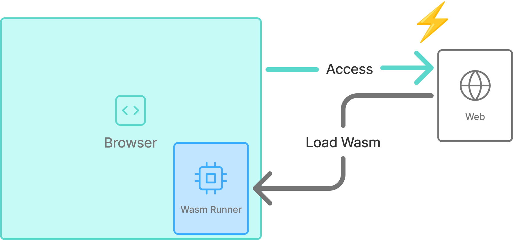
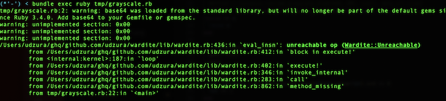

----
marp: true
theme: rubykaigi2025
paginate: true
backgroundImage: url(./rubykaigi2025_bg.004.jpeg)
title: Running ruby.wasm on Pure Ruby WASM Runtime
description: On RubyKaigi 2025 Matzyama / Running ruby.wasm on Pure Ruby WASM Runtime
# header: "Running ruby.wasm on Pure Ruby WASM Runtime"
image: https://udzura.jp/slides/2025/rubykaigi/ogp.png
size: 16:9
----

<!--
_class: title
_backgroundImage: url(./rubykaigi2025_bg.002.jpeg)
-->

# Running ruby.wasm<br>On Pure Ruby WASM Runtime

## Presentation by Uchio Kondo

----

<!--
_class: hero0
_backgroundImage: url(./rubykaigi2025_bg.005.jpeg)
-->

# Hello from Matz-yama!

----
<!--
_class: profile
-->


# self.introduce!

- Uchio Kondo
  - from Fukuoka.rb
- Member of 
  - Product Engineer
- Translator of "Learning eBPF"

----

<!--
_class: hero0
_backgroundImage: url(./rubykaigi2025_bg.005.jpeg)
-->

# Today's Theme: Wardite

----

<!--
_class: hero
_backgroundImage: url(./rubykaigi2025_bg.003.jpeg)
-->

# What's Wardite?

----

# Wardite?

<ul>
<li style="margin-left: -2.2em !important;">A Pure Ruby WebAssembly Runtime</li>
</ul>

----

# Wardite?

- Wardite is named<br>&nbsp;&nbsp;&nbsp;&nbsp;&nbsp;&nbsp;after the real mineral<br>&nbsp;&nbsp;&nbsp;&nbsp;&nbsp;&nbsp;**WA**rdite.


<address>
<br>
<br>
<br>
<br>
<br>
<br>
<br>
photo: https://en.wikipedia.org/wiki/Wardite#/media/File:Wardite.jpg 
</address>


----

# Running Wardite

```
$ gem install wardite
$ wardite ./helloworld.wasm
Hello, world
```

----

# Using Wardite as a Gem

```ruby
require 'wardite'

instance = Wardite.new(path: './helloworld.wasm', enable_wasi: true)
ret = instance._start
#=> Output: Hello, world
p ret
#=> I32(0)
```

----

<!--
_class: hero
_backgroundImage: url(./rubykaigi2025_bg.003.jpeg)
-->

# What is WebAssembly?

----

# What is WebAssembly?

- WebAssembly is:
  - A binary instruction format
  - Originally designed for execution in web browsers
  - Nowadays used in various environments including server-side

----

# WebAssembly Runs in Browsers

- You can compile C code like this into wasm and run it

<br>
<br>
<br>
<br>
<br>

```c
int add(int a, int b) {
    return a + b;
}
```

```javascript
WebAssembly.instantiateStreaming(fetch("./out.wasm"), {}).then(
    (obj) => {
        let answer = obj.instance.exports.add(100, 200);
        console.log("debug: 100 + 200 = ", answer);
    },
);
```

----

# Result


----

# WebAssembly Execution Flow

- First, prepare source code (in C, C++, Rust...)
- Then compile it into wasm binary
- Finally, executing wasm binary via WebAssembly runtime

----

# WebAssembly Execution Flow


----

<!--
_class: hero
_backgroundImage: url(./rubykaigi2025_bg.003.jpeg)
-->

# So, What is Wardite?

----

# So, What is Wardite?

- A WebAssembly Runtime written in Pure Ruby
- We can run WebAssembly within Ruby

----

# Wardite's Design Principles

- Purity:
  - Depend only on Ruby's standard and bundled libraries
  - No external C dependencies or gems
- Portability:
  - Can be run on any Ruby environment
  - Even on mruby (...future work!)

----

# Wardite's Implementation Status

- Support basic WebAssembly Core specifications
- WASI preview1 (p1)

----

# WebAssembly Core Spec is...

- A set of basic WebAssembly specifications
  - Defines WebAssembly's...
    - binary and text formats
    - instruction set
    - type system
    - memory model, etc.

----

# And what is WASI?

- = WebAssembly System Interface
- The Core Spec itself doesn't define OS interactions
  - e.g. I/O, filesystem, clock, etc.

----

# WASI picture

- WASI defines APIs to interact with the OS

<br>
<br>
<br>
<br>
<br>

&nbsp;&nbsp;&nbsp;&nbsp;&nbsp;

----

<!--
_class: hero
_backgroundImage: url(./rubykaigi2025_bg.003.jpeg)
-->

# Why Wardite?

----

# Wardite's Goals

- #1
  - Expand use cases for wasm language embedding in Ruby

----

# Wardite's Goals

- #2
  - Desire to make very portable implementation
  - (works where Ruby works, or works with mruby)

----

# Wardite's Goals

- #3
  - Helps with Ruby's performance testing
    - or complicated program usecase
  - Like optcarrot?

----

<!--
_class: hero
_backgroundImage: url(./rubykaigi2025_bg.003.jpeg)
-->

# But the real reason is...

----

<!--
_class: hero0
_backgroundImage: url(./rubykaigi2025_bg.005.jpeg)
-->

# Just for Fun.

----

<!--
_class: hero
_backgroundImage: url(./rubykaigi2025_bg.003.jpeg)
-->

# Bet WebAssembly's Potential!

----

# Language-Agnostic Aspects

- Many compiled languages support wasm targets
  - Rust, Go, C/C++, Swift, Scala...
  - LLVM supporting wasm
  - And Some languages are written in C.
    - Ruby, Python, Lua, Perl...

----

# Possibilities for Application Embedding

- The WebAssembly Core Spec seems to maintain simplicity
- Suitability for embedded execution in applications

----

# Browser as an Embedded Environment

- Browser execution can be better understood...
  - As "a wasm runtime embedded in the browser"

<br>
<br>
<br>
<br>
<br>
<br>

&nbsp;&nbsp;&nbsp;&nbsp;&nbsp;&nbsp;&nbsp;&nbsp;&nbsp;&nbsp;&nbsp;&nbsp;&nbsp;&nbsp;&nbsp;&nbsp;&nbsp;&nbsp;&nbsp;&nbsp;&nbsp;&nbsp;&nbsp;&nbsp;&nbsp;&nbsp;&nbsp; 

----

# Polyglot Systems

- Language agnosticism + Embeddability
  - Write (wasm) component in any language
  - Combine them into an application in another language!

<!-- TBA: 図？ -->

----

# Conceptual Figure

<br>
<br>

&nbsp;&nbsp;&nbsp;&nbsp;&nbsp;&nbsp;&nbsp;&nbsp;&nbsp;&nbsp;&nbsp;&nbsp;&nbsp;&nbsp;&nbsp;&nbsp;&nbsp;&nbsp;&nbsp;&nbsp;&nbsp;&nbsp;&nbsp;&nbsp;&nbsp;&nbsp;&nbsp;&nbsp;&nbsp;&nbsp;&nbsp;&nbsp;&nbsp;&nbsp;&nbsp;&nbsp;&nbsp; 

<ul class="underpre">
<li><a href="https://wasmcloud.com/">From wasmCloud official website</a></li>
</ul>

----

<!--
_class: hero
_backgroundImage: url(./rubykaigi2025_bg.003.jpeg)-->

# Wasm is Going Beyond the Browser

----

<!--
_class: hero0
_backgroundImage: url(./rubykaigi2025_bg.005.jpeg)-->

# How to Develop Wardite

----

<!--
_class: hero
_backgroundImage: url(./rubykaigi2025_bg.003.jpeg)
-->

# Retrospective of Past Development Milestones

----

# Wardite's Development Milestones

- "Gorilla Book" (Hello, World)
- Core instructions
- Running grayscale
- Starting up ruby.wasm
- Letting ruby.wasm require

----

<!--
_class: hero
_backgroundImage: url(./rubykaigi2025_bg.003.jpeg)-->

# Gorilla Book

----

# Port the "Implementing Wasm Runtime" Book

- Goal: Make "Hello, World" work
- Required implementation:
  - Basic VM structure and instructions
  - Memory initialization
  - Function call/import/export
  - Some support of WASI

----

# What is "Implementing Wasm Runtime in Rust"?

- 『[RustでWasm Runtimeを実装する](https://zenn.dev/skanehira/books/writing-wasm-runtime-in-rust)』
  -  "Gorilla Book" after the author's penname
- A book for learning basic wasm implementation in Rust

----

# Book Impressions

- Understanding the overall VM design is quite challenging
  - However, it's understandable with careful reading of the book and spec documentation
- Having a Rust reference implementation was very helpful!

----

# Task #1: Binary Format

- A wasm binary has a specific size of sections
- Section format:
  - Header, including content size at the beginning
  - Simple structure with section-specific content following

----

# Binary Format Overview

<!-- TBA preamble が図に反映されていない！ -->

<br>
<br>


----

# Task #2: VM Implementation

<br>

```ruby
def execute!
  loop do
    cur_frame = self.call_stack.last #: Frame
    break unless cur_frame
    cur_frame.pc += 1
    insn = cur_frame.body[cur_frame.pc] #: Op
    break unless insn
    eval_insn(cur_frame, insn)
  end
end
```

<ul class="underpre">
<li>This is almost a real Wardite code!</li>
</ul>

----

# Task #3: "Output"

- A common issue for programming language creator?
- "Output" requires using OS functionality
- Had to implement WASI's `fd_write()` just for "output"
  - Following the book was sufficient. Thank goodness

----

# "Hello World" Worked

> @ 2024-10-28
> Allowing `fib()` to work, I just completed "Gorilla Book" basic course for now!
> All that's left is to thoroughly master Wasm...


----

<!--
_class: hero
_backgroundImage: url(./rubykaigi2025_bg.003.jpeg)-->

# Core Instructions

----

# Covering Basic Core Spec Instructions

- After Hello World worked, wanted to implement more
- Goals
  - Cover basic Core Spec instructions
  - At this point, had the desire to "make ruby.wasm work"

----

# wasm Instruction Set

- There are basic and extended sets
- Basic range is written in the Core Spec
- About extended sets
  - GC, atomic, reference types, simd...
  - Supporting extentions are... future work!

----


# [Opcodes Table](https://pengowray.github.io/wasm-ops/)

----

# Challenges

- Implemented **192** instructions in total
  - Doesn't seem that many...
- Just kept working diligently

----

# Implement Numeric Operations

- Since there are 4 types, there're common ones
  - `i32, i64, f32, f64`
- Created a generator using `rake` task
- There are **167** insns automatically generated
  - Note: this includes converting insns

----

# Automatic Generation Templates

<br>
<br>

```ruby
  DEFS = { #: Hash[Symbol, String]
    # ...
  
    add: <<~RUBY,
      when :${PREFIX}_add
        right, left = runtime.stack.pop, runtime.stack.pop
        if !right.is_a?(${CLASS}) || !left.is_a?(${CLASS})
          raise EvalError, "maybe empty or invalid stack"
        end
        runtime.stack.push(${CLASS}(left.value + right.value))
    RUBY
    # ...
```

----

# Generated Codes

<br>
<br>

```ruby
module Wardite
  module Evaluator
    # @rbs ...
    def self.i32_eval_insn(runtime, frame, insn)
      case insn.code
      # ...
      when :i32_add
        right, left = runtime.stack.pop, runtime.stack.pop
        if !right.is_a?(I32) || !left.is_a?(I32)
          raise EvalError, "maybe empty or invalid stack"
        end
        runtime.stack.push(I32(left.value + right.value))

      # ...
```

----

<!--
_class: hero
_backgroundImage: url(./rubykaigi2025_bg.003.jpeg)-->

# Grayscale Journey

----

# Running Sample Programs

- With instructions implemented, moved to practical testing
- Tried running a grayscale processing program
  - Made in Rust from another personal project

----

# It Didn't Work...



----

<!--
_class: hero
_backgroundImage: url(./rubykaigi2025_bg.003.jpeg)
-->

# Let's start debugging

----

# Overview of the Grayscale Program

<br>


----

# Fixing Memory Allocation (memory.grow)

- Found memory allocation wasn't working correctly
- The fix was [just one line](https://github.com/udzura/wardite/commit/ecd64f25856c99c12a644efac4becb2573021e45), but took quite some effort
  - Note: tracing wasm binary in browser debugger was efficient

----

# Fix Commit


----

# But It Still Didn't Work

- Rust's panic was converted to `unreachable`...
  - `unreachable` = a wasm instruction meaning "this point should never be reached, error if reached"
- Modified it to return error strings instead of panicking

----

# Error String

- Content:
  > `Format error decoding Png: Corrupt deflate stream. DistanceTooFarBack`
- [Looking at the Rust implementation](https://github.com/image-rs/fdeflate/blob/4610c916ae1000c9b5839059340598a7c55130e8/src/decompress.rs#L42)
- Hmm, not sure what's going on

----


----

# What It's Doing

- On decoding PNG
- Decompressing deflate compression
- Have to study the deflate algorithm from scratch? 😵‍💫

----

# Correctly Handling Deflate...?

- Looking at the inflate/deflate processing
  - it's clear that **bit shift operations** are heavily used
- Maybe one of the related insns isn't working correctly?

----

# Verifying i32 Instruction Correctness

- There're [Official wasm core spec test cases](https://github.com/WebAssembly/spec/tree/main/test/core) !

----

# Running the Test Cases

- The official test suite provides `wast` format files
- Using a command called `wast2json`
  - Can generate JSON files and Wasm binaries
  - Run tests from these testcase files

----

# TBA:

- スクリプトに合わせてテストケース実行の流れを作図する

----

```ruby
testcase = JSON.load_file("spec/i32.json", symbolize_names: true)
testcase[:commands].each do |command|
  case command[:type]
  when "module"
    command => {filename:}
    current = filename
  when "assert_return"
    command => {line:, action:, expected:}
    action => {type:, field:, args:}
    args_ = args.map{|v| parse_value(v) } 
    expected_ = expected.map{|v| parse_result(v) }
    ret = Wardite::new(path: "spec/" + current).runtime.call(field, args_)
    if ret != expected_[0]
      warn "test failed! expect: #{expected_} got: #{ret}"
    end
  end
end
```

----

# Then Fix One by One

- Indeed, bit shift instructions were failing, so fixed those
- Normal cases now pass (omitted some exeption tests)

<br>
<br>
<br>
<br>
<br>

```
$ bundle exec ruby spec/runner.rb
...
Finished in 0.272498 seconds.
-------------------------------------------------------------------------------------------
442 tests, 368 assertions, 0 failures, 0 errors, 0 pendings, 83 omissions, 0 notifications
100% passed
-------------------------------------------------------------------------------------------
1622.03 tests/s, 1350.47 assertions/s
```

----

# Grayscale Worked!

<!-- TBA: ワイの像ではなくエンジニアカフェの外観の例に変更 -->

&nbsp;
&nbsp;


<ul class="underpre">
<li>Grayscale execution result looks OK</li>
</ul>

----

# Want to Run Something More (?) Practical

- Finally, started the challenge of running ruby.wasm

----

<!--
_class: hero
_backgroundImage: url(./rubykaigi2025_bg.003.jpeg)
-->

# Running ruby.wasm

----

# Running ruby.wasm

- Passing ruby.wasm to `wardite` command successfully
- Besides instruction coverage:
  - WASI support is needed for ruby.wasm to work

----

# What WASI Functions Does ruby.wasm Need?

- This time, <strong>37</strong> functions are needed. 
  -  Depending on bundled gems or build env
- Note: Checked with this command:

<br>
<br>
<br>
<br>
<br>
<br>

```
$ wasm-objdump -x -j Import ./ruby-wasm32-wasi/usr/local/bin/ruby
```


----

```
Import[37]:
 - func[0] sig=1 <__imported_wasi_snapshot_preview1_args_get> <- wasi_snapshot_preview1.args_get
 - func[1] sig=1 <__imported_wasi_snapshot_preview1_args_sizes_get> <- wasi_snapshot_preview1.args_sizes_get
 - func[2] sig=1 <__imported_wasi_snapshot_preview1_environ_get> <- wasi_snapshot_preview1.environ_get
 - func[3] sig=1 <__imported_wasi_snapshot_preview1_environ_sizes_get> <- wasi_snapshot_preview1.environ_sizes_get
 - func[4] sig=1 <__imported_wasi_snapshot_preview1_clock_res_get> <- wasi_snapshot_preview1.clock_res_get
 - func[5] sig=37 <__imported_wasi_snapshot_preview1_clock_time_get> <- wasi_snapshot_preview1.clock_time_get
 - func[6] sig=38 <__imported_wasi_snapshot_preview1_fd_advise> <- wasi_snapshot_preview1.fd_advise
 - func[7] sig=2 <__imported_wasi_snapshot_preview1_fd_close> <- wasi_snapshot_preview1.fd_close
 - func[8] sig=2 <__imported_wasi_snapshot_preview1_fd_datasync> <- wasi_snapshot_preview1.fd_datasync
 - func[9] sig=1 <__imported_wasi_snapshot_preview1_fd_fdstat_get> <- wasi_snapshot_preview1.fd_fdstat_get
 - func[10] sig=1 <__imported_wasi_snapshot_preview1_fd_fdstat_set_flags> <- wasi_snapshot_preview1.fd_fdstat_set_flags
 - func[11] sig=1 <__imported_wasi_snapshot_preview1_fd_filestat_get> <- wasi_snapshot_preview1.fd_filestat_get
 - func[12] sig=26 <__imported_wasi_snapshot_preview1_fd_filestat_set_size> <- wasi_snapshot_preview1.fd_filestat_set_size
 - func[13] sig=27 <__imported_wasi_snapshot_preview1_fd_pread> <- wasi_snapshot_preview1.fd_pread
 - func[14] sig=1 <__imported_wasi_snapshot_preview1_fd_prestat_get> <- wasi_snapshot_preview1.fd_prestat_get
 - func[15] sig=0 <__imported_wasi_snapshot_preview1_fd_prestat_dir_name> <- wasi_snapshot_preview1.fd_prestat_dir_name
 - func[16] sig=27 <__imported_wasi_snapshot_preview1_fd_pwrite> <- wasi_snapshot_preview1.fd_pwrite
 - func[17] sig=3 <__imported_wasi_snapshot_preview1_fd_read> <- wasi_snapshot_preview1.fd_read
 - func[18] sig=27 <__imported_wasi_snapshot_preview1_fd_readdir> <- wasi_snapshot_preview1.fd_readdir
 - func[19] sig=1 <__imported_wasi_snapshot_preview1_fd_renumber> <- wasi_snapshot_preview1.fd_renumber
 - func[20] sig=45 <__imported_wasi_snapshot_preview1_fd_seek> <- wasi_snapshot_preview1.fd_seek
 - func[21] sig=2 <__imported_wasi_snapshot_preview1_fd_sync> <- wasi_snapshot_preview1.fd_sync
 - func[22] sig=1 <__imported_wasi_snapshot_preview1_fd_tell> <- wasi_snapshot_preview1.fd_tell
 - func[23] sig=3 <__imported_wasi_snapshot_preview1_fd_write> <- wasi_snapshot_preview1.fd_write
 - func[24] sig=0 <__imported_wasi_snapshot_preview1_path_create_directory> <- wasi_snapshot_preview1.path_create_directory
 - func[25] sig=5 <__imported_wasi_snapshot_preview1_path_filestat_get> <- wasi_snapshot_preview1.path_filestat_get
 - func[26] sig=64 <__imported_wasi_snapshot_preview1_path_filestat_set_times> <- wasi_snapshot_preview1.path_filestat_set_times
 - func[27] sig=13 <__imported_wasi_snapshot_preview1_path_link> <- wasi_snapshot_preview1.path_link
 - func[28] sig=65 <__imported_wasi_snapshot_preview1_path_open> <- wasi_snapshot_preview1.path_open
 - func[29] sig=9 <__imported_wasi_snapshot_preview1_path_readlink> <- wasi_snapshot_preview1.path_readlink
 - func[30] sig=0 <__imported_wasi_snapshot_preview1_path_remove_directory> <- wasi_snapshot_preview1.path_remove_directory
 - func[31] sig=9 <__imported_wasi_snapshot_preview1_path_rename> <- wasi_snapshot_preview1.path_rename
 - func[32] sig=5 <__imported_wasi_snapshot_preview1_path_symlink> <- wasi_snapshot_preview1.path_symlink
 - func[33] sig=0 <__imported_wasi_snapshot_preview1_path_unlink_file> <- wasi_snapshot_preview1.path_unlink_file
 - func[34] sig=3 <__imported_wasi_snapshot_preview1_poll_oneoff> <- wasi_snapshot_preview1.poll_oneoff
 - func[35] sig=4 <__imported_wasi_snapshot_preview1_proc_exit> <- wasi_snapshot_preview1.proc_exit
 - func[36] sig=1 <__imported_wasi_snapshot_preview1_random_get> <- wasi_snapshot_preview1.random_get
```

----

# Inrtrocuse `Wardite::WasiSnapshotPreview1`

- Implement everything in a class called
  - `Wardite::WasiSnapshotPreview1`
- This class is treated specially during import

----

```ruby
module Wardite
  class WasiSnapshotPreview1
    # @rbs store: Store
    # @rbs args: Array[wasmValue]
    # @rbs return: Object
    def clock_time_get(store, args)
      clock_id = args[0].value
      _precision = args[1].value
      timebuf64 = args[2].value
      if clock_id != 0 # - CLOCKID_REALTIME
        return Wasi::EINVAL
      end
      now = Time.now.to_i * 1_000_000
      memory = store.memories[0]
      now_packed = [now].pack("Q!")
      memory.data[timebuf64...(timebuf64+8)] = now_packed
      0
    end
  end
end
```

----

# Basic Strategy

- `loop do`
  - Try to start ruby.wasm
  - Get "`**** function not found!`" error
  - Implement that function
- `end`

----

# Examples of Functions Implemented

- Getting `ARGV`, environment variables
- Getting current time
- Getting random numbers
- read/write, other functions to get various info from `fd`

----

# ruby.wasm's `--version` Now Works!

<br>

```
$ bundle exec wardite ./ruby -- --version        
ruby 3.4.2 (2025-02-15 revision d2930f8e7a) +PRISM [wasm32-wasi]
```

<br>

<ul class="underpre">
<li>Released this version as Wardite 0.6.0</li>
<li><a href="https://github.com/udzura/wardite/blob/7ef48389415df9e44784d515f3e0e96aa00f2ad2/lib/wardite/wasi.rb">Code at that point</a></li>
</ul>


----

# Behavior at This Point

<br>

```
$ bundle exec wardite ./ruby -- -e '5.times { p "hello: #{_1}" }'
`RubyGems' were not loaded.
`error_highlight' was not loaded.
`did_you_mean' was not loaded.
`syntax_suggest' was not loaded.
"hello: 0"
"hello: 1"
"hello: 2"
"hello: 3"
"hello: 4"
```

<ul class="underpre">
<li>Ruby's C implementation core library works</li>
</ul>

----


# Behavior at This Point #2

<br>

```
$ bundle exec wardite ./ruby -- -e 'puts "Hello"'        
`RubyGems' were not loaded.
`error_highlight' were not loaded.
`did_you_mean' were not loaded.
`syntax_suggest' were not loaded.
Hello
```

<ul class="underpre">
<li>Cannot recognize file system</li>
<li>Cannot require, of course - load warnings at startup</li>
</ul>

----

<!--
_class: hero
_backgroundImage: url(./rubykaigi2025_bg.003.jpeg)
-->

# Required to solve<br>`require` issues

----

# How to Make `Kernel#require` Work

- For that...
  - Need to make Wardite properly recognize the file system

----

# Initial File System Implementation

- Start with opening files
  - Tried implementing `path_open` function roughly.
  - But not even being called?
- Why?

----

<!--
_class: hero
_backgroundImage: url(./rubykaigi2025_bg.003.jpeg)
-->

# "Preopens" Mechanism

----

# WASI Has a Mechanism Called preopens

- Many WASI runtimes, by default:
  - They **cannot** access the host's file system at all.
- We have to pre-open host directries to share
  - And register them to the process on startup

----

# Preopens diagram

- TBA: Preopens diagram

----

# Implementation

- See codes in wasi-sdk's [`libc-bottom-half/sources/preopens.c`](https://github.com/WebAssembly/wasi-libc/blob/e9524a0980b9bb6bb92e87a41ed1055bdda5bb86/libc-bottom-half/sources/preopens.c#L246-L276)

----

```c
    for (__wasi_fd_t fd = 3; fd != 0; ++fd) {
        __wasi_prestat_t prestat;
        __wasi_errno_t ret = __wasi_fd_prestat_get(fd, &prestat);
        if (ret == __WASI_ERRNO_BADF)
            break;
        if (ret != __WASI_ERRNO_SUCCESS)
            goto oserr;
        switch (prestat.tag) {
        case __WASI_PREOPENTYPE_DIR: {
            char *prefix = malloc(prestat.u.dir.pr_name_len + 1);
            if (prefix == NULL)
                goto software;

            ret = __wasi_fd_prestat_dir_name(fd, (uint8_t *)prefix,
                                             prestat.u.dir.pr_name_len);
            if (ret != __WASI_ERRNO_SUCCESS)
                goto oserr;
            prefix[prestat.u.dir.pr_name_len] = '\0';

            if (internal_register_preopened_fd_unlocked(fd, prefix) != 0)
                goto software;
            free(prefix);

            break;
        }
        default:
            break;
        }
    }
```

----

<!-- TBA: コードに丸をつけたり簡単に作図する -->

```c
    for (__wasi_fd_t fd = 3; fd != 0; ++fd) {
        __wasi_prestat_t prestat;
        __wasi_errno_t ret = __wasi_fd_prestat_get(fd, &prestat);
        if (ret == __WASI_ERRNO_BADF)
            break;
        if (ret != __WASI_ERRNO_SUCCESS)
            goto oserr;
        switch (prestat.tag) {
        case __WASI_PREOPENTYPE_DIR: {
            char *prefix = malloc(prestat.u.dir.pr_name_len + 1);
            if (prefix == NULL)
                goto software;

            ret = __wasi_fd_prestat_dir_name(fd, (uint8_t *)prefix,
                                             prestat.u.dir.pr_name_len);
            if (ret != __WASI_ERRNO_SUCCESS)
                goto oserr;
            prefix[prestat.u.dir.pr_name_len] = '\0';

            if (internal_register_preopened_fd_unlocked(fd, prefix) != 0)
                goto software;
            free(prefix);

            break;
        }
        default:
            break;
        }
    }
```

----

# Why Couldn't We Access Files?

- Functions like `path_open()` aren't even called...
  - if the preopen environment isn't registered
- See `__wasilibc_find_abspath()`:
  - [`libc-bottom-half/sources/preopens.c#L190-L213`](https://github.com/WebAssembly/wasi-libc/blob/e9524a0980b9bb6bb92e87a41ed1055bdda5bb86/libc-bottom-half/sources/preopens.c#L190-L213)

----

# So Fixed the prestat Functions

- Implemented properly:
  - `fd_prestat_get()`
  - `fd_prestat_dir_name()`

----

# Normal Ruby Started Without load Warnings

- All's well that ends well

<br>
<br>
<br>


----


----

# ...It's Taking Quite Some Time...

- Initializing all of RubyGems takes 68 seconds
- Let's talk about performance at the end

----

<!--
_class: hero0
_backgroundImage: url(./rubykaigi2025_bg.005.jpeg)
-->

# Performance + Measurement

----

# Dealing with Performance Measurement

- Still halfway there!
  - Haven't been doing nothing
- Let me talk about some implemented improvements

----

# Topics

- Block jump improvements
- Instance creation issues
- YJIT effects

----

# Measurement Assumptions

- Use grayscale wasm program (basically)
- Software versions etc.
  - macOS 15.3.2 / Apple M3 Pro
  - ruby 3.4.2 +YJIT +PRISM [arm64-darwin24]
  - Wardite 0.6.1

----

<!--
_class: hero
_backgroundImage: url(./rubykaigi2025_bg.003.jpeg)
-->

# Block Jump Improvements

----

# Background: About Jump Instructions

- WebAssembly's jump insns: `if, block, loop`
  - Unlike common jump instructions, they don't hold offsets themselves as an operand
  - These instructions need to pick the position of their corresponding end
  - This was done in `fetch_ops_while_end`

----


----

# When measuring the first version with ruby-prof

- Clearly, the `fetch_ops_while_end` method took some time

<br>
<br>

<!-- TBA: 図に丸つけをする -->

```
-------------------------------------------------------------------------------------------------------------------------------------
                     54.539      9.845      0.000     44.69413069318/13069318     Kernel#loop
  73.63%  13.29%     54.539      9.845      0.000     44.694         13069318     Wardite::Runtime#eval_insn     /.../lib/wardite.rb:420
                     19.493      0.024      0.000     19.469      95886/95886     Wardite::Runtime#fetch_ops_while_end
                     15.638      6.483      0.000      9.156  5225913/5225913     <Module::Wardite::Evaluator>#i32_eval_insn
                      3.330      1.238      0.000      2.093  1155055/1155055     Wardite::Runtime#do_branch
                      0.773      0.773      0.000      0.00013069318/13069318     Wardite::Op#namespace
                      0.757      0.757      0.000      0.00012631671/73174992     Array#[]
                      0.749      0.749      0.000      0.00015275900/53340046     BasicObject#!
                      0.542      0.542      0.000      0.00010109073/23362733     Wardite::Runtime#stack
```

----

# Use the Cache

- **Cache end positions** in instruction metadata
- Once instructions are parsed:
  - revisit the instruction sequence
  - calc end positon
  - then cache it on-memory

----

```ruby
    def revisit!
      @ops.each_with_index do |op, idx|
        case op.code
        when :block, :loop
          next_pc = fetch_ops_while_end(idx)
          op.meta[:end_pos] = next_pc
  
        when :if
          next_pc = fetch_ops_while_end(idx)
          else_pc = fetch_ops_while_else_or_end(idx)
          op.meta[:end_pos] = next_pc
          op.meta[:else_pos] = else_pc
        end
      end
    end
```

----

# Reduce Time by 43%


- PR: [Cache end position #1](https://github.com/udzura/wardite/pull/1)
- Used grayscale program

----

<!--
_class: hero
_backgroundImage: url(./rubykaigi2025_bg.003.jpeg)
-->

# Instance Creation Issues

----

# Instance Creation Issues

- Next, measured Wardite's bottlenecks with perf...

----

# Examine Perf Results

- Common occurrences were:
  - `rb_vm_set_ivar_id`
  - `rb_class_new_instance_pass_kw`
- Note: These appear at the top even with YJIT enabled

----

```
# Children      Self  Command  Shared Object          Symbol 
# ........  ........  .......  .....................  ....................................................
#
   100.00%     0.00%  ruby     ruby                   [.] _start
            |
            ---_start
               __libc_start_main
               0xffffbd7173fc
               main
               ruby_run_node
               rb_ec_exec_node
               rb_vm_exec
               |          
               |--98.93%--vm_exec_core
               |          |          
               |          |--9.67%--0xffffbe152a58
               |          |          |          
               |          |          |--7.26%--rb_vm_set_ivar_id
               |          |          |          |          
               |          |          |          |--2.86%--rb_shape_get_iv_index
               |          |          |          |          | ....
               |          |          
               |          |--7.32%--0xffffbe1525cc
               |          |          |          
               |          |           --6.62%--rb_class_new_instance_pass_kw
               |          |                     |          
               |          |                     |--2.52%--vm_call0_cc
               |          |                     |          |          
               |          |                     |          | ....
               |          |                     |          
               |          |                     |--2.22%--rb_class_allocate_instance
               |          |                     |          |          
               |          |                     |           --2.15%--newobj_alloc
               |          |                     |                     | ....
               |          |          
               |          |--5.78%--0xffffbe14a65c
....
```

----

# In Other Words

- Creating too many instances is slow
- Wardite's internal Value implementation looks like this

<br>
<br>
<br>
<br>
<br>

```ruby
class I32
  def initialize(value)
    @value = value
  end
end
```

----

# How Many Are Actually Being Created?

- Measured Wardite's internal Value-making functions:

<br>
<br>
<br>
<br>

```ruby
$COUNTER = {}
TracePoint.trace(:call) do |tp|
  if %i(I32 I64 F32 F64).include?(tp.method_id)
    $COUNTER[tp.method_id] ||= 0
    $COUNTER[tp.method_id] += 1
  end
end

END {
  pp $COUNTER
}
```

----

# For Example, Grayscale Processing

<br>
<br>
<br>

```
{:I32=>18845604, :I64=>1710552, :F32=>247500}
```

- In case of I32, 18.8 million instances are being created
  - w/ grayscale processing

----

# Thoughts

- Hypothesis:
  - there might be many instances of specific values?
  - For example, `-1, 0, 1, 2, 3, 4, 8, 16` ... ?
- Let's try memoization

----

```ruby
class I32
  (0..64).each do |value|
    @@i32_object_pool[value] = I32.new(value)
  end
  value = -1 & I32::I32_MAX
  @@i32_object_pool[value] = I32.new(value)

  def self.cached_or_initialize(value)
    @@i32_object_pool[value] || I32.new(value)
  end
end
```

----

# Results


- Good to some extent
- [Commit `e5b8f3a`](https://github.com/udzura/wardite/commit/e5b8f3ada850791d2170823d8a33c73362b62ec2)
  - [With remove tap `16ef6b5`](https://github.com/udzura/wardite/commit/)
- Note: Ruby 3.3 w/YJIT

----

# Future Challenges

- TODO:
  - Try eliminating whole instance creation in value assignment...
  - This requires a fundamental change in the design


----

<!--
_class: hero
_backgroundImage: url(./rubykaigi2025_bg.003.jpeg)
-->

# Further Tuning?

----

# Inspection

- Breakdown of ruby.wasm bootstrap via Wardite

----

# Execution Overview

- Over half is laoding
- Sample:

<br>
<br>
<br>

```
$ ruby.wasm --version
```


----

# BTW: Measured WASI function calls

- Sample: `ruby.wasm -e 'puts "Hello, World"'`
- Seems to be less controlling

<br>
<br>
<br>
<br>

```
total process done: 69.89s
load_from_buffer: 6.05s
external call count: 1049
external call elapsed: 0.0611s (0.087% ... )
```

----

<!--
_class: hero
_backgroundImage: url(./rubykaigi2025_bg.003.jpeg)
-->

# YJIT, YJIT, YJIT!

----

# YJIT Effects

- YJIT has a significant effect on Wardite's execution speed
- Just putting the results here for reference
  - All environments are aarch64
- Sample: `ruby.wasm --version`

----

# Results


<!--
# Ruby version, YJIT Off, YJIT On
# 3.3,14.98,7.09
# 3.4,15.22,6.57
# 3.5-dev,14.51,6.6

(15.22-6.57)/15.22 => 0.5683311432325887
-->

----

<!--
_class: hero0
_backgroundImage: url(./rubykaigi2025_bg.005.jpeg)
-->

# Demonstration

----

# Let's Demo the Startup Here

- Please let me use `--disable-gems` for speed

```
$ bundle exec wardite \
    --mapdir ./ruby-wasm32-wasi/:/ ./ruby -- \
    --disable-gems -e '5.times { p "hello: #{_1}" }'
```

----

<!--
_class: hero0
_backgroundImage: url(./rubykaigi2025_bg.005.jpeg)
-->


# Conclusion

----

# Wardite's Future

- Improve Core Spec coverage
- Overall refactoring
- Performance improvements
- Improve WASI coverage
- Component model support ...

----

# Wardite's Future

- Improve Core Spec coverage
- Overall refactoring
- Performance improvements
- Improve WASI coverage
- **Component model support ...**

----

# Looking for People Interested in Wasm Runtime

- First, please try using it, even just for fun
- Thank you for your attention!

----

<!--
_class: fin
_backgroundImage: url(./rubykaigi2025_bg.003.jpeg)
-->

<!--
候補
- 人を見ん桜は酒の肴なり
- 一枝の花おもさうや酒の酔
- 花に酔ふた頭重たし春の雨
  - の、方が情景としてはいいが、雨は降ってほしくないので
-->

<blockquote>
花に酔ふた頭重たし春の風<br />
&nbsp;<small><small>... A Haiku from Masaoka Shiki</small></small>
</blockquote>

<address>
<small>See you in last day drinkups!</small>
</address>

----


