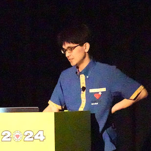

----
marp: true
theme: rubykaigi2025
paginate: true
backgroundImage: url(./rubykaigi2025_bg.004.jpeg)
title: Running ruby.wasm on Pure Ruby WASM Runtime
description: On RubyKaigi 2025 Matzyama / Running ruby.wasm on Pure Ruby WASM Runtime
# header: "Running ruby.wasm on Pure Ruby WASM Runtime"
image: https://udzura.jp/slides/2025/rubykaigi/ogp.png
----


----
<!--
_class: title
_backgroundImage: url(./rubykaigi2025_bg.002.jpeg)
-->

# Running ruby.wasm<br>On Pure Ruby WASM Runtime

## Presentation by Uchio Kondo

----
<!--
_class: profile
-->



# self.introduce!

- Uchio Kondo
  - from Fukuoka.rb
- Affiliation: SmartHR, Inc.
  - Product Engineer
- Translator of "Learning eBPF"


----
<!--
_class: hero0
_backgroundImage: url(./rubykaigi2025_bg.005.jpeg)
-->

# Ruby and WebAssembly

----
<!--
_class: normal
-->

# Code sample background rule:

```ruby
Ruby.has :red, :background
```

```javascript
(window.JavaScript || TypeScript).then("yellow");
```

```rust
Rust::<BackGround>::purple().unwrap();
```

```lua
other_lang { "Lua" = green.background, "and" = so.on }
```

Other code or command sample has default gray back

----

<!--
_class: hero
_backgroundImage: url(./rubykaigi2025_bg.003.jpeg)
-->

# So, What is mruby/edge?

----
<!--
_class:
  - normal
  - pre-top75
-->

# mruby/edge getting started

- mruby/edge consists of 2 components
  - mruby/edge "core" crate
  - the `mec` command (**m**ruby/**e**dge **c**ompiler)
  - Install `mec` first!

```
$ cargo install mec
```

