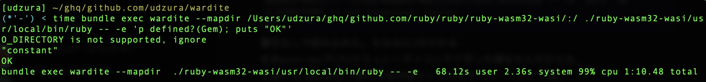

----
marp: true
theme: rubykaigi2025
paginate: true
backgroundImage: url(./rubykaigi2025_bg.004.jpeg)
title: Running ruby.wasm on Pure Ruby WASM Runtime
description: On RubyKaigi 2025 Matzyama / Running ruby.wasm on Pure Ruby WASM Runtime
# header: "Running ruby.wasm on Pure Ruby WASM Runtime"
image: https://udzura.jp/slides/2025/rubykaigi/ogp.png
size: 16:9
----

Running ruby.wasm on Pure Ruby WASM Runtime
=============

----

# 自己紹介

- Uchio Kondo
- Product Engineer at SmartHR

----

# 今日のテーマ: Wardite

----

# Warditeとは

- Pure Ruby WebAssembly Runtimeです

----

# Warditeを動かす

```
$ gem install wardite
$ wardite ./helloworld.wasm
Hello, world
```

----

# Warditeをgemとして使う

```ruby
require 'wardite'

instance = Wardite.new(path: './helloworld.wasm', enable_wasi: true)
ret = instance._start
#=> Output: Hello, world
p ret
#=> I32(0)
```

----

# 改めて、Warditeとは

- Pure Ruby WebAssembly Runtimeです
- WebAssembly って何？
- WebAssembly Runtimeって何？

----

# WebAssembly とは何か

- WebAssemblyは
  - バイナリ形式の一種の命令セットアーキテクチャ
  - 元々ウェブブラウザ上で実行されることを目的としていた
  - 近年はサーバーサイドやIoTデバイスなど、様々な環境で利用されている

----

# WebAssemblyはブラウザで動く

- こういうCのコードをwasmにコンパイルして動かせる

```c
int add(int a, int b) {
    return a + b;
}
```

// TBA ブラウザのconsoleの様子

----

# WebAssembly はどこでも動く

- cli commandにwasmバイナリを渡せば動く
- 後述するが、Wasm実行環境を組み込んだアプリケーションの内部でも動かせる

```
$ wasmtime --invoke add add.wasm 100 200
300
```

----

# WebAssembly 実行の流れ

- ここにtokyo12で作った図解を置く
- まずソースコード
- それをコンパイル
- wasmバイナリをランタイムで実行

----

# WebAssembly Runtime とは何か

- WebAssemblyを実行するための環境 = WebAssembly Runtime
- ブラウザもRuntimeとみなす
- 代表的な実装は wasmtime、wasmedge
- 言語内部に組み込める実装もある
    - Go = wazero, Swift = swiftwasm
    - これらの実装はその言語でpureな実装をしている

----

# ということで、Warditeとは

- Pure Rubyで書かれたWebAssembly Runtime
- Rubyで書かれているので、Rubyの中でWebAssemblyを動かすことができる
- すぐ試す場合、コマンドラインツールも用意している

----

# Warditeの設計方針

- Rubyの標準・標準添付ライブラリだけに依存する
  - 特にコア部分（後述）はRubyの標準ライブラリだけで実装する
- rbs-inlineを全面的に採用する

----

# Warditeの実装状況

- WebAssembly Core Specの実装
  - 基本的な部分は終わった
  - 十分なテストはこれからとなる
- WASI p1
  - WASI p1の一部関数を実装
  - ruby.wasm の動作に必要なものは一通り実装できているはず

----

# WebAssembly Core Specとは何か

- WebAssemblyの基本的な仕様のセット
  - WebAssemblyのバイナリ形式とテキスト形式、命令セット、型システム、メモリモデルなどを定義している
  - ランタイムはこれらの仕様を実装すれば、バイナリを動作させられる
- WASI、Componentn Modelのような仕様は
  - Core Specの上に成り立っている

----

# WASIとは何か

- WebAssembly System Interface
- WebAssemblyのCore Spec自体には、OSとのやり取りの定義はない
- WASIは、WebAssemblyがOSとやり取りするためのAPIを定義している

----

# Why Wardite？

----

# Warditeの目的

- Rubyで、wasmの言語への組み込み活用のユースケースを広げたい
- 可搬性（Rubyが動けば動く/あるいはmrubyなどで動く）が高い実装が欲しい
- Ruby自体のパフォーマンステストの助けになると嬉しい

----

# 本音

- Just for fun
- wasmの勉強

----

# WebAssemblyの可能性

- そもそもwasmに大きな可能性を感じており、Rubyでのアクセスパスを増やしたい

----

# WebAssemblyの可能性

- 言語アグノスティックな部分への期待
- シンプルなCoreの興味深さ
- アプリケーション組み込みの可能性

----

# 言語アグノスティックな部分

- 様々なコンパイル型言語で、wasmターゲットをサポートしている
  - Rust、Go、C/C++、Swift、Zig、Dart、Scala...
  - LLVM
- C言語を経由で数多くの資産がwasmに...
  - C言語で書かれた言語もある。Ruby、Python、Lua、Perl...

----

# シンプルなCoreの興味深さ

- WebAssembly Core Specは、シンプルさと合理性をキープしている様に思える
  - そのため、実装が比較的容易
  - ランタイム自体を色々なところに埋め込みやすい
- 拡張仕様についいては...諸説あるが...

----

# アプリケーション組み込みの可能性

- アプリケーション組み込み実行への適正
  - ランタイムも小さくできがちで、各環境に組み込みやすい
  - 実際各言語でのランタイム実装が出てきている
    - Goのwazeroによるpure goプラグイン機構
      - Goでは普通できない動的ロードの実現

----

# アプリケーション組み込みの可能性

- ブラウザ実行も、「ブラウザにwasm runtimeが組み込まれている」と考えた方が正しそう

----

# 言語組み込みの可能性

- 組み込み実行への強さ
  - 設定言語としてのwasm
    - envoy、fluent-bit、...
    - wasmbots
  - mrubyもLuaもピンチ！

----

# 個人的に可能性を感じるポイント

- Core specは非常に小く、いろいろなランタイムを作れるし、いろいろな環境に組み込みやすいという点
  - 色々拡張はあるけどwasmのコアはシンプルに保ちたい意志
  - この点は例えばJVMとは設計思想が違う感じがする(感想です)
  - 「ブラウザで動くから価値がある」なんて観点だけでは可能性を狭めるんじゃないかなあ

<!--
# JVMとの違い？

- JVMにあまり詳しくないのでツッコミ歓迎です
- JVMは以下の様な部分への意識が弱そうに思える。違ったらごめんね

----

# JVMとの違い？

- 言語アグノスティックな点
  - C言語資産、LLVMとの相性がよいwasmは、「どんな言語でもwasmに移植できる」という点の強みがありそう。
  - 理論上は。

----

# JVMとの違い？

- アプリケーション組み込みというフィールド
  - JVMもアプリケーション組み込みは可能だが、wasmはさらに適性がありそう
  - 今の時点でwasmによる設定言語実装、各言語製のランタイムなど多数

----

# JVMとの違い？

- 全体に色々拡張はあるけどwasmのコアはシンプルに保ちたい方向性があり、それがうまく作用してそう

-->

----

# Warditeの作り方

----

# Warditeの開発の歴史

- いくつかのマイルストーンがあった
  - ゴリラ本の移植(Hello, World)
  - Core Specの基本的な命令のカバー
  - grayscaleサンプルプログラムの動作
  - ruby.wasmの起動
  - ruby.wasmでrequireの動作

----

# ゴリラ本の移植

- ゴール: Hello, Worldが動く
- 必要な実装
  - 基本的なVM構造と命令
    - ローカル変数、グローバル変数（＋制御構文）
    - メモリの確保と解放
    - 関数のimport/exportセクション
    - WASIのfd_write()だけはサポート

----

# ゴリラ本とは？

- RustでWebAssemblyの基本的な実装を学ぶための本
- ほなRubyで書くか〜RBS全体に使えば元コードがRustでもいけるっしょ

----

# 苦労した点

- 基本的な実装をえいやとやったので大変だった
- Rustの参考実装があったので助かった

----

# バイナリフォーマット

- ゴリラ本の通りに素直に実装している
  - セクションのフォーマット
    - 冒頭にヘッダ、中身のサイズ
    - その後にセクションごとの中身というシンプルな構造ではある
- leb128という数値表現の実装が必要で、自作した

----

# VMの基本的なコード

- 基本的にはこういうコードなのでVMもシンプル

```ruby
def execute!
  loop do
    cur_frame = self.call_stack.last #: Frame
    break unless cur_frame
    cur_frame.pc += 1
    insn = cur_frame.body[cur_frame.pc] #: Op
    break unless insn
    eval_insn(cur_frame, insn)
  end
end
```

- 細かい点はデバッグしながら修正

----

# Core Specの基本的な命令のカバー

- Hello worldが動いたので、もう少し実装を進めたい
- ゴール
  - Core Specの基本的な命令をカバーする
  - 一応この時点で「ruby.wasmを動かしたい」という気持ちがあったので、どういう命令が使われているかは調べた

----

# wasmの命令セット

- 基本的な範囲と、拡張セットがある
- 基本的な範囲は、Core Specに書いてある
- 拡張セットについて
  - GC、atomic、reference types、simd、multi-value、exception handling...
  - この辺りはおいおいやる

----

# 苦労した点

- いやめっちゃ数多いやん...（もしかしたら、めっちゃ、でもない？）
- 全部で 192 命令を実装した
  - そんなに多くなく見える...
- なんか地道に頑張った

----

# 数値演算系をなるべく宣言的に実装したい

- 数値演算系はファイル生成で対応している
- Rake taskでgenerator作った
- この自動生成した命令が167個らしい

```
$ git grep 'when :' lib/*/*generated.rb | wc -l
     167
```

----
# 自動生成と言っても

- 割とテンプレートは頑張って書かないといけない...
- 型が4つあるので、共通のものは同じ様になる
  - i32, i64, f32, f64

----

# サンプルプログラムの動作

- 命令が実装できたので
- 別のプロジェクトで作ってた、Rust製のgrayscale処理のプログラムを動かしてみた

----

# 動かない...

- ということでこれをデバッグしていく
- ref: https://udzura.hatenablog.jp/entry/2024/11/24/210124

----

# メモリ確保(memory.grow)の修正

- メモリの確保が正しく動いてなくてオーバーフロー
- 修正箇所は1行だが、
  - 原因箇所を突き止めるのになかなか苦労...
    - ブラウザで当該のwasmを動かし、メモリ周りで落ちる箇所にブレークポイントを置いて変数の変遷を確認
    - 今思うと、そもそも命令の挙動が全体に正しいかcore spec testを流すべきだった感もある

----

# しかしそれでも動かない

- Rustのpanicは `unreachable` に変換されてしまいよくわからない
- panicさせず、エラー文字列を返却する様に変えてみた

----

# エラー文字列

> `Format error decoding Png: Corrupt deflate stream. DistanceTooFarBack`
- [Rust側の処理を眺めてみる](https://github.com/image-rs/fdeflate/blob/4610c916ae1000c9b5839059340598a7c55130e8/src/decompress.rs#L42)
- なるほどわからん
----

# やってることは

- pngをデコードしている
- deflateの圧縮を解いている
- その中でエラーが出ている

----

# deflateを正しく...？

- deflateの処理を見る限りビットシフト演算が多用されているのはわかる
- 関係する命令うちどれかがうまく動いていないのでは？

----

# i32 の命令の正しさを確認する

- core specのテストを実行してみる
- 動かし方
  - core specのテストケースが用意されている
  - それから、wasmのバイナリと実行シナリオを生成する
  - それをWarditeで実行する

----

# 参考: core spec を動かしている例

- wast2json でテストケースを生成できる
- そもそもRubyを使っているので、こういう地道なタスクの自動化は楽チン
- ref: https://zenn.dev/ri5255/articles/bac96cf74f82f0

----

# こういう感じのテスターを作成

- wast2json でテストケースのためのファイルを作る
- そのファイルをiterateして、Rubyのtest-unitのテストとして実行する
  - バイナリ、パラメータをもとに Wardite.load().call する

----

```ruby
testcase = JSON.load_file("spec/i32.json", symbolize_names: true)
testcase[:commands].each do |command|
  case command[:type]
  when "module"
    command => {filename:}
    current = filename
  when "assert_return"
    command => {line:, action:, expected:}
    action => {type:, field:, args:}
    args_ = args.map{|v| parse_value(v) } 
    expected_ = expected.map{|v| parse_result(v) }
    ret = Wardite::new(path: "spec/" + current).runtime.call(field, args_)
    if ret != expected_[0]
      warn "test failed! expect: #{expected_} got: #{ret}"
    else
      puts "test OK: line=#{line}"
    end
  end
end
```

----

# それで逐一直していく

- バイナリフォーマットが壊れている等のテストケースは一旦オミット
- 実際、確かにビットシフト系の命令中心に通ってなかったので修正
- 正常系は全体が通る様になった

----

# grayscaleが動いた！

- 変換された画像の様子


----

# もっと（？）実用的なものを動かしたい

- いよいよruby.wasmを動かすチャレンジ

----

# ruby.wasmを動かす

- warditeコマンドにruby.wasmを渡すと動くようにしたい
- 必要なものは？
  - ruby.wasmの動作にはWASIの対応が必要

----

# ruby.wasmに必要なWASI関数は？

- 全部じゃないがそれなりにある
  - ビルドオプションによって変わりそうだが
  - 37関数が必要

```
$ wasm-objdump -x -j Import ./ruby-wasm32-wasi/usr/local/bin/ruby
```

----

```
Import[37]:
 - func[0] sig=1 <__imported_wasi_snapshot_preview1_args_get> <- wasi_snapshot_preview1.args_get
 - func[1] sig=1 <__imported_wasi_snapshot_preview1_args_sizes_get> <- wasi_snapshot_preview1.args_sizes_get
 - func[2] sig=1 <__imported_wasi_snapshot_preview1_environ_get> <- wasi_snapshot_preview1.environ_get
 - func[3] sig=1 <__imported_wasi_snapshot_preview1_environ_sizes_get> <- wasi_snapshot_preview1.environ_sizes_get
 - func[4] sig=1 <__imported_wasi_snapshot_preview1_clock_res_get> <- wasi_snapshot_preview1.clock_res_get
 - func[5] sig=37 <__imported_wasi_snapshot_preview1_clock_time_get> <- wasi_snapshot_preview1.clock_time_get
 - func[6] sig=38 <__imported_wasi_snapshot_preview1_fd_advise> <- wasi_snapshot_preview1.fd_advise
 - func[7] sig=2 <__imported_wasi_snapshot_preview1_fd_close> <- wasi_snapshot_preview1.fd_close
 - func[8] sig=2 <__imported_wasi_snapshot_preview1_fd_datasync> <- wasi_snapshot_preview1.fd_datasync
 - func[9] sig=1 <__imported_wasi_snapshot_preview1_fd_fdstat_get> <- wasi_snapshot_preview1.fd_fdstat_get
 - func[10] sig=1 <__imported_wasi_snapshot_preview1_fd_fdstat_set_flags> <- wasi_snapshot_preview1.fd_fdstat_set_flags
 - func[11] sig=1 <__imported_wasi_snapshot_preview1_fd_filestat_get> <- wasi_snapshot_preview1.fd_filestat_get
 - func[12] sig=26 <__imported_wasi_snapshot_preview1_fd_filestat_set_size> <- wasi_snapshot_preview1.fd_filestat_set_size
 - func[13] sig=27 <__imported_wasi_snapshot_preview1_fd_pread> <- wasi_snapshot_preview1.fd_pread
 - func[14] sig=1 <__imported_wasi_snapshot_preview1_fd_prestat_get> <- wasi_snapshot_preview1.fd_prestat_get
 - func[15] sig=0 <__imported_wasi_snapshot_preview1_fd_prestat_dir_name> <- wasi_snapshot_preview1.fd_prestat_dir_name
 - func[16] sig=27 <__imported_wasi_snapshot_preview1_fd_pwrite> <- wasi_snapshot_preview1.fd_pwrite
 - func[17] sig=3 <__imported_wasi_snapshot_preview1_fd_read> <- wasi_snapshot_preview1.fd_read
 - func[18] sig=27 <__imported_wasi_snapshot_preview1_fd_readdir> <- wasi_snapshot_preview1.fd_readdir
 - func[19] sig=1 <__imported_wasi_snapshot_preview1_fd_renumber> <- wasi_snapshot_preview1.fd_renumber
 - func[20] sig=45 <__imported_wasi_snapshot_preview1_fd_seek> <- wasi_snapshot_preview1.fd_seek
 - func[21] sig=2 <__imported_wasi_snapshot_preview1_fd_sync> <- wasi_snapshot_preview1.fd_sync
 - func[22] sig=1 <__imported_wasi_snapshot_preview1_fd_tell> <- wasi_snapshot_preview1.fd_tell
 - func[23] sig=3 <__imported_wasi_snapshot_preview1_fd_write> <- wasi_snapshot_preview1.fd_write
 - func[24] sig=0 <__imported_wasi_snapshot_preview1_path_create_directory> <- wasi_snapshot_preview1.path_create_directory
 - func[25] sig=5 <__imported_wasi_snapshot_preview1_path_filestat_get> <- wasi_snapshot_preview1.path_filestat_get
 - func[26] sig=64 <__imported_wasi_snapshot_preview1_path_filestat_set_times> <- wasi_snapshot_preview1.path_filestat_set_times
 - func[27] sig=13 <__imported_wasi_snapshot_preview1_path_link> <- wasi_snapshot_preview1.path_link
 - func[28] sig=65 <__imported_wasi_snapshot_preview1_path_open> <- wasi_snapshot_preview1.path_open
 - func[29] sig=9 <__imported_wasi_snapshot_preview1_path_readlink> <- wasi_snapshot_preview1.path_readlink
 - func[30] sig=0 <__imported_wasi_snapshot_preview1_path_remove_directory> <- wasi_snapshot_preview1.path_remove_directory
 - func[31] sig=9 <__imported_wasi_snapshot_preview1_path_rename> <- wasi_snapshot_preview1.path_rename
 - func[32] sig=5 <__imported_wasi_snapshot_preview1_path_symlink> <- wasi_snapshot_preview1.path_symlink
 - func[33] sig=0 <__imported_wasi_snapshot_preview1_path_unlink_file> <- wasi_snapshot_preview1.path_unlink_file
 - func[34] sig=3 <__imported_wasi_snapshot_preview1_poll_oneoff> <- wasi_snapshot_preview1.poll_oneoff
 - func[35] sig=4 <__imported_wasi_snapshot_preview1_proc_exit> <- wasi_snapshot_preview1.proc_exit
 - func[36] sig=1 <__imported_wasi_snapshot_preview1_random_get> <- wasi_snapshot_preview1.random_get
```

----

# WarditeのWASI実装方針

- `Wardite::WasiSnapshotPreview1` というクラスにまとめて実装する様にした

----

```ruby
module Wardite
  class WasiSnapshotPreview1
    # @rbs store: Store
    # @rbs args: Array[wasmValue]
    # @rbs return: Object
    def clock_time_get(store, args)
      clock_id = args[0].value
      _precision = args[1].value
      timebuf64 = args[2].value
      if clock_id != 0 # - CLOCKID_REALTIME
        return Wasi::EINVAL
      end
      now = Time.now.to_i * 1_000_000
      memory = store.memories[0]
      now_packed = [now].pack("Q!")
      memory.data[timebuf64...(timebuf64+8)] = now_packed
      0
    end
  end
end
```

----

# 基本戦略

- `loop do`
  - ruby.wasm を起動させようとする
  - **** という関数がなくて動かない！と言われる
  - それを実装していく
- `end` !

----

# どんな関数を実装したか

```
- argvの取得
- 環境変数の取得
- 現在時間の取得
- 乱数の取得
- prestat系の関数
  - 後述するがこれは実装を間違えていた。いわゆる `stat(2)` と無関係な関数
- read/write
- その他、 `fd` から各種情報を取得する関数(filestat系)
```

----

# ちなみに

- 最後の最後で `if/block/loop` の実装を間違えていてハマってた
  - いやなんかWASI無関係に動かないんだけどってなって
  - `wasm-tools print` でwat形式と睨めっこしてたらやっと気づいた...。

----

# [当該コミット](https://github.com/udzura/wardite/commit/605dd7cb6db1ddfd3b84078d733400d56f400f3c#diff-bff9b2bd05ba0d106ae6c1e3e5a1b41c41aff0e0e6e245aa123bf6589627a711)


----

# ruby.wasmの `--version` が動く様になった

- Wardite 0.6.0 としてリリースした
- [その時点でのコード](https://github.com/udzura/wardite/blob/7ef48389415df9e44784d515f3e0e96aa00f2ad2/lib/wardite/wasi.rb)
- 12個の関数で動いた

----

# この時点での挙動

- ファイルを認識できない。requireで警告
- RubyのC実装コアライブラリは読み込んでるので動く
  - Integer#timesの例

```
$ bundle exec wardite ./ruby -- -e '5.times { p "hello: #{_1}" }'
`RubyGems' were not loaded.
`error_highlight' was not loaded.
`did_you_mean' was not loaded.
`syntax_suggest' was not loaded.
"hello: 0"
"hello: 1"
"hello: 2"
"hello: 3"
"hello: 4"
```

----

# requireを動かしたい

- そのためには、Warditeにファイルシステムをまともに認識させる必要がある

----

# ファイルシステムはじめの実装

- まずはファイルをオープンさせるところから
  - 雑に `path_open` という関数を実装してみたが、ちゃんと動かない
- そもそも呼ばれない。なぜ？

----

# preopensという仕組み

- wasi-sdkのlibcを参照する
- https://github.com/WebAssembly/wasi-libc/blob/e9524a0980b9bb6bb92e87a41ed1055bdda5bb86/libc-bottom-half/sources/preopens.c#L246-L276

----

# WASI p1対応ランタイムにおけるファイルシステムの扱い

- WASI p1対応のWASMランタイムは、通常、何もしないと起動時に親のファイルシステムに触れることができない。
- WASMランタイムを起動する時、事前に、 fd = 3 以降に親環境の共有したいファイルシステムの情報を渡す必要がある

----

# ファイルシステム共有の初期化処理

- wasi-sdkであれば `__wasilibc_populate_preopens(void)` という関数でファイルシステムの登録を行っている
  - fd = 3 から順番にpreopen環境を検査: `fd_prestat_get()`
  - 正常なら、 `fd_prestat_dir_name()` で名前を取得し、プロセスに登録している
  - 登録がなくなれば `EBADF` を返却して抜ける

----

# なぜファイルにアクセスできなかったのか？

- `path_open()` などはそのpreopen環境が登録されていないとそもそも呼ばれない
- `__wasilibc_find_abspath()` を参照せよ:
  - https://github.com/WebAssembly/wasi-libc/blob/e9524a0980b9bb6bb92e87a41ed1055bdda5bb86/libc-bottom-half/sources/preopens.c#L190-L213

----

# ということでprestat系の関数を修正

- `fd_prestat_get()` と `fd_prestat_dir_name()` を大体正しく直した
- これで動くか...と思いきや追加でいくつか実装した
  - 特に `fd_readdir()` がしんどかったですね...。

----

# requireの警告なしで通常のRubyが起動した

- めでたしめでたし



- ただし、起動はすごく遅い...
  - パフォーマンスの話は後ほど

----

# ここまでで起動のデモをします

- `--disable gems` でやらせてください(1分近く違うので...)

```
$ bundle exec wardite \
    --mapdir ./ruby-wasm32-wasi/:/ ./ruby -- \
    --disable-gems -e '5.times { p "hello: #{_1}" }'
```

----

# パフォーマンス計測との向き合い

----

# パフォーマンス計測との向き合い

- いくつか実施した内容を話します
  - ブロックジャンプ先のキャッシュ
  - インスタンス生成の問題（TODO）
  - YJITの効果

----

# お断り

- サンプルプログラムはgrayscale処理(Rust製)を使っている
  - 内部はbase64 encode/decode + PNGの展開(deflate)
  - ワークロードで結果が変わるもんであることは留意の上で読んでほしい

----

# 前提: ブロックジャンプ先のキャッシュ

- WebAssemblyのジャンプ系の命令
  - if, block, loop がある
  - これらの命令は、対応するendの位置を知っている必要がある
    - よくあるジャンプ系の命令の様にオフセットを保持しているわけではない

----

# ところで、　ruby-profで初期実装を計測したところ

- 明らかに `fetch_ops_while_end` というメソッドが上位に...

```
-------------------------------------------------------------------------------------------------------------------------------------
                     54.539      9.845      0.000     44.69413069318/13069318     Kernel#loop
  73.63%  13.29%     54.539      9.845      0.000     44.694         13069318     Wardite::Runtime#eval_insn     /.../lib/wardite.rb:420
                     19.493      0.024      0.000     19.469      95886/95886     Wardite::Runtime#fetch_ops_while_end
                     15.638      6.483      0.000      9.156  5225913/5225913     <Module::Wardite::Evaluator>#i32_eval_insn
                      3.330      1.238      0.000      2.093  1155055/1155055     Wardite::Runtime#do_branch
                      0.773      0.773      0.000      0.00013069318/13069318     Wardite::Op#namespace
                      0.757      0.757      0.000      0.00012631671/73174992     Array#[]
                      0.749      0.749      0.000      0.00015275900/53340046     BasicObject#!
                      0.542      0.542      0.000      0.00010109073/23362733     Wardite::Runtime#stack
```

----

# 最初の素朴な実装

- if/block/loop 命令に来るごとに：
  - 現在のcodeの先を見て、対応するendの位置を計算していた
- したがって、何回もループしたり、ifを含む関数を何度も呼んだりしたら毎回fetchして計算していることになる...

----

# 事前に計算させることにした

- WebAssemblyは命令が動的に書き変わることはないので、事前計算の方向でやっていった
  - WarditeはJITをしないんで...。

----

# 事前に計算の具体的実装

- 一度命令をパースしたら命令列をrevisitさせる
  - その際if/block/loop 命令を見つけたら、その場でendの位置を計算させる
- 命令のメタデータで `end` の位置を持たせてそれを使うことにした

----

# これだけで実行時間を43%削った

- ひとまず改善！

----

# インスタンス生成の問題

- 次に、perfでWarditeのボトルネックを計測したが...
- これと言って、明らかに遅い箇所はなさそう
- ただ、よく出てくるのが
  - `rb_vm_set_ivar_id`
  - `rb_class_new_instance_pass_kw`
- これらはYJITしてもしなくても上位に出てくる

----

# つまり

- インスタンスを作りまくってて遅い
- Warditeの内部Valueはこういう実装なので、インスタンス変数に値を持ってるのも遅い、か？

```ruby
class I32
  def initialize(value)
    @value = value
  end
end
```

----

# 実際どんぐらい作ってるの？

- Warditeの内部Valueは同名のメソッド経由で作るので以下の様に計測できる

```ruby
$COUNTER = {}

TracePoint.trace(:call) do |tp|
  if %i(I32 I64 F32 F64).include?(tp.method_id)
    $COUNTER[tp.method_id] ||= 0
    $COUNTER[tp.method_id] += 1
  end
end

END {
  pp $COUNTER
}
```

----

# 例えばgrayscale

```
{:I32=>18845604, :I64=>1710552, :F32=>247500}
```

I32の場合1880万個のインスタンスを作っている...

----

# 思ったこと

- I32とは言っても、特定の値のインスタンスが多いのでは？
  - 例えば、-1, 0, 1, 2, 3, 4, 5...
- メモ化してみよう

----

```ruby
class I32
  (0..64).each do |value|
    @@i32_object_pool[value] = I32.new(value)
  end
  value = -1 & I32::I32_MAX
  @@i32_object_pool[value] = I32.new(value)

  def self.cached_or_initialize(value)
    @@i32_object_pool[value] || I32.new(value)
  end
end
```

----

# 一応効果が出た

- 1秒ぐらいは変わった
- TBA: 計測結果が見つからない。あとで再計測して置いとく

----

# これ以上のチューニングは？

- I32 などの値でそもそもオブジェクトを作らない（Integerをそのまま扱う）様にすればいいだろう
- しかし、設計の大幅な変更を伴うので...
  - 今後の課題になっている

----

# 参考: ruby.wasm の起動の計測結果

```
TBA!!!1
```

- 測りたいもの:
  - 全体に対するバイナリパース処理の所要時間
  - --disable-gems とそうでない時の比較
  - 全体に対するWASIの関数呼び出しの所要時間

----

# YJITの効果

- もちろんWarditeの実行速度向上にYJITは効果覿面
- 参考のため結果だけ置いておく
  - 環境は全部 aarch64

----

# Ruby 3.3系での結果

- デフォルト
- `--yjit`

----

# Ruby 3.4系での結果

- デフォルト
- `--yjit`
- ご覧の通り3.3より効果が大きくなってる。いつもアリガト！

----

# Ruby 3.5-dev@2025/04/05 では...？

- `# TODO TBA`

----

# 参考ブログ

- https://udzura.hatenablog.jp/entry/2024/12/20/173728

----

# Warditeの今後

- まだまだ実装が必要
  - Core Specのカバレッジ向上
  - 全体的なリファクタリング
  - パフォーマンス改善
  - WASIのカバレッジ向上
  - component model対応 ...

----

# Wasm Runtimeに興味がある方募集中

- まずは、遊びでもいいのでぜひ使って見てください

----

# Thanks!

