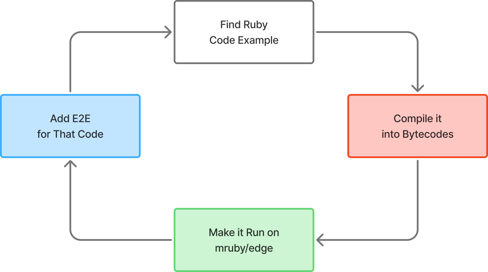
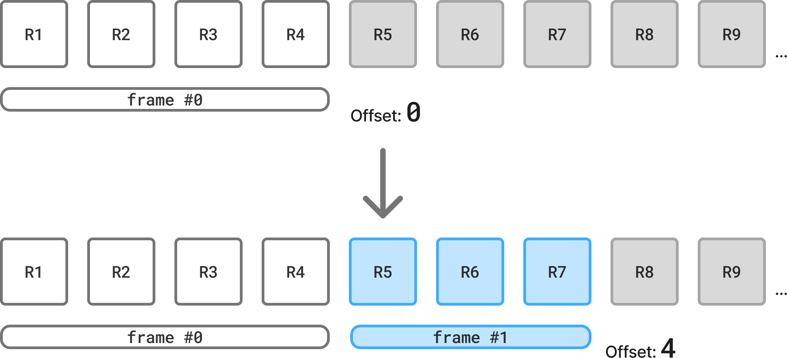
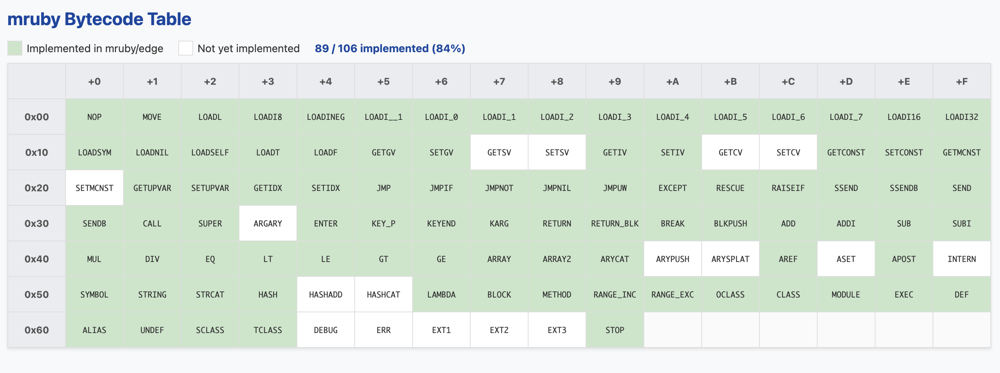
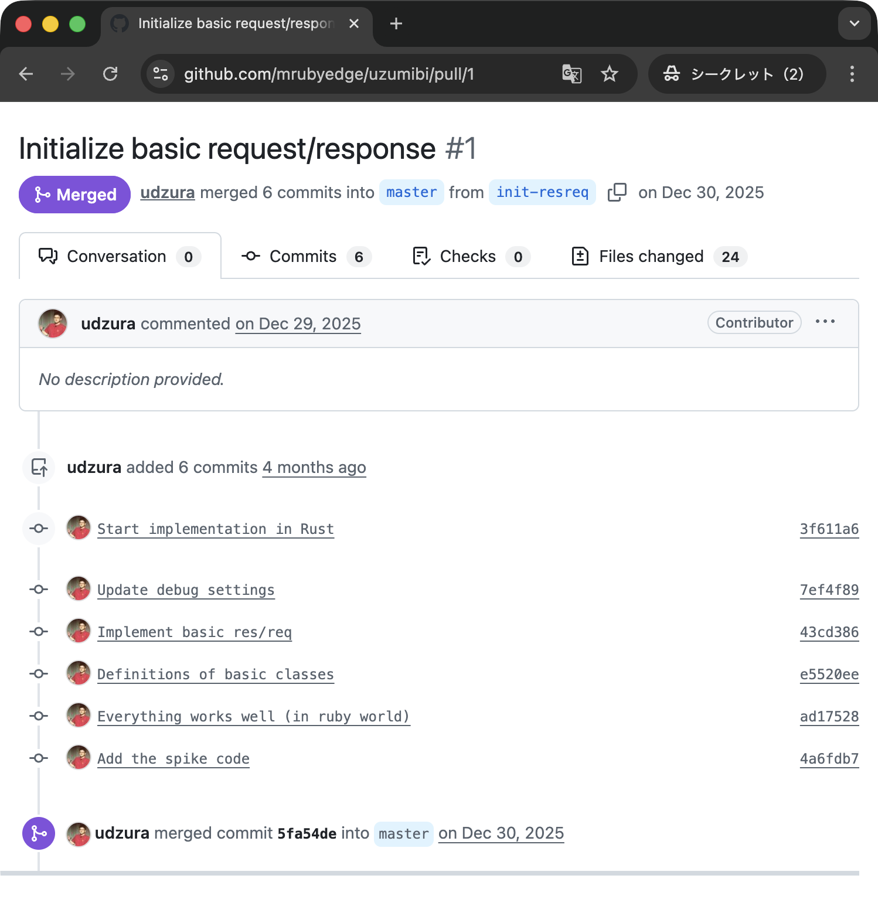
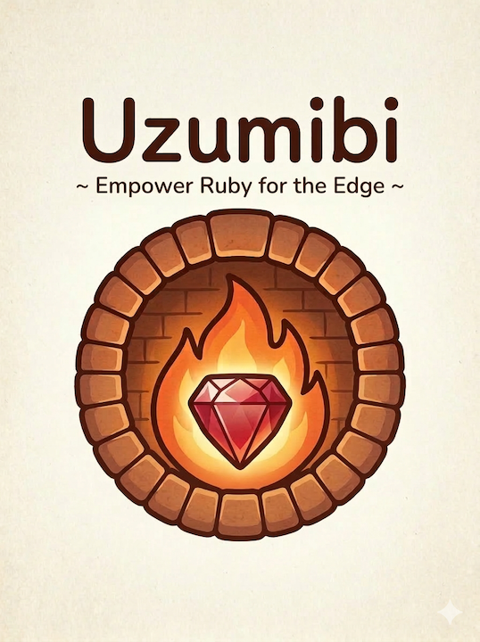

----
marp: true
theme: rubykaigi2026
paginate: false
backgroundImage: url(./bg-2026.002.png)
title: "Uzumibi: Reinventing mruby for the Edges"
description: "On RubyKaigi 2026 Hakodate / Uzumibi: Reinventing mruby for the Edges"
# header: "Uzumibi: Reinventing mruby for the Edges"
image: https://udzura.jp/slides/2026/rubykaigi/ogp.png
size: 16:9
----

<!--
_class: title
_backgroundImage: url(./bg-2026.001.png)
-->

# <big>Uzumibi:</big><br>Reinventing mruby for the Edges

## Presentation by Uchio Kondo

<!--
Today, I'd like to talk about a product called Uzumibi.
-->

----

<!--
_class: hero0
_backgroundImage: url(./bg-2026.003.png)
-->

# Hello, Hakodate!

<!--
I traveled here from Fukuoka, Kyushu—about 1,700 km away, almost the full length of Japan. It's my first time in Hokkaido, and I'm thrilled to speak in this beautiful city.
-->

----
<!--
_class: profile
-->


# self.introduce!

- Uchio Kondo
  - from Fukuoka.rb (Kyushu)
- Member of &nbsp;
  - Product Engineer
- SmartHR is a **Platinum Sponsor** of RubyKaigi 2026

<!--
I'm Kondo, a product engineer at SmartHR—Japan's largest HR SaaS startup and a Platinum Sponsor of RubyKaigi 2026.
-->

----

<!--
_class: hero
-->

# What is Uzumibi?

<!--
Today's theme is an open-source framework called Uzumibi.
-->

----

# Uzumibi

- An open-source framework for developing apps on **edge** and **serverless** platforms using Ruby
- "Uzumibi" = "buried fire" (embers under ashes)
  - Named out of admiration for a certain famous framework

<!--
It's a framework for developing applications on edge and serverless platforms using Ruby. "Uzumibi" means "buried fire" or embers under ashes, named out of admiration for a certain famous framework.
-->

----

# Key Features

- Generator with **multi-platform** support
- Understandable **Sinatra-like DSL**
- Platform integration features
  - Durable Objects, Queues on Cloudflare

<!--
The key features of Uzumibi are: it has a generator and supports multiple platforms; it uses an easy-to-remember, Sinatra-like DSL; it supports platform integration features like Durable Objects and Queues on Cloudflare; 
-->

----

# Special Key Feature

- **Extremely lightweight** artifacts

<!--
and above all, it is extremely lightweight.
-->

----

<!--
_class: pre-top20
-->

# Let's See It in Action

DEMO...

<!--
on DEMO:
Let's see it in action. You can install Uzumibi using the cargo command, 
then generate a Cloudflare template via uzumibi new. This is the file tree generated.
The important file generated is app.rb. If you open it, any Rubyist can guess what it does.
OK, you can check this working via dev server.
I'll modify it slightly to show JSON value. Just like that, this code can be deployed immediately.
Please look at the file size. The artifact generated contains a WebAssembly file that is 1.2MiB before compression, and only about 370KiB after compression. This easily fits well within the free plan limits of Cloudflare Workers.
And after all, you can check the JSON value generated by Ruby, via internet.
-->

----

# This is NOT a mockup!!!

- It actually connects to real Cloudflare functions, e.g. KVS, Queue...

<!--
And this isn't just a mockup; It actually connects to real Cloudflare functions, e.g. KVS, Queue... as you write the logics in Ruby.
-->

----

# Multi-Platform

- Cloudflare Workers or Google Cloud Run
- Write similar code, runs the same way

<!--
Uzumibi proves you can comfortably develop edge applications in Ruby. While this example uses Cloudflare Workers, you can write almost the same code and run it the same way on serverless environments like Google Cloud Run. Isn't this incredible?
-->

----

# Not `ruby.wasm`?

- `ruby.wasm` (CRuby-based) generates **30 ~ 60 MB** binaries
  - Even gzipped: **~8.6MB**

<br />
<br />
<br />
<br />
<br />

> Ruby WASM を含むHibanaのプロジェクトは初期状態ですでに8.6MB程度
> (The project including Ruby WASM is already about 8.6MB in its initial state.)
> [ref on Qiita](https://qiita.com/hiroeorz@github/items/a2aad2f3e9939a9c257b)

<!--
You might find this strange. ruby.wasm allows you to write applications in Ruby, but it usually generates much larger artifacts—around 10MB. So how is this magic possible? 
-->

----

<!--
_class: hero
-->

# The Magic Behind It: mruby/edge

<!--
It's because Uzumibi is based on an entirely different mruby runtime I created, called mruby/edge.
-->

----

# What is mruby/edge?

- A custom mruby runtime, developed since **2024**
- Written entirely in **Rust**
- Designed from the ground up for **WebAssembly**
- Highly portable Wasm

<!--
The mruby/edge's motivation was simple: generating small artifacts was too difficult with the CRuby-based ruby.wasm.

Before you can understand Uzumibi's power, I need to explain mruby/edge. It's a custom mruby runtime I've been developing since 2014, written entirely in Rust and designed from the ground up to be compiled into WebAssembly.
-->

----

# Playground


<br />
<br />
<br />
<br />
<br />
<br />
<br />
<br />
<br />
<br />
<br />

https://mrubyedge.github.io/playground/
Works on mobile browsers

<!--
 Because it generates highly portable Wasm, it runs everywhere, including the edge.
 This is a link to the playground -->

----

# Why Not Original mruby?

- `mruby` uses `setjmp` / `longjmp` for code jumps
  - e.g. exceptions
- Wasm core instructions have no `goto` equivalent

<!--
Lightweight implementations like mruby and mruby/c inherently follow a philosophy of excluding unnecessary code. However, Yukihiro Matsumoto's original mruby relies on C functions like setjmp and longjmp for code jumps.
-->

----

# "Jump" hacks

- Compiling `setjmp` / `longjmp` in wasm requires some hacks
  - PicoRuby has the same Emscripten dependency
    - Emscripten runtime adds large codes
    - Forcefully imports/exports several functions


<!--
 Since WebAssembly's core instructions lack a goto equivalent, compiling these to Wasm requires hacks. Other implementations like PicoRuby rely on Emscripten for this, meaning the Wasm binary must include Emscripten's bulky runtime, which also forcefully imports and exports several functions behind the scenes.
-->

----

# Why Rust?

- Productivity & Safety
- Powerful Wasm ecosystem
- ... and I personally wanted to implement a VM myself in Rust

<!--
Given this, I decided I couldn't simply rely on existing Ruby or mruby implementations, and chose to rewrite it from scratch in Rust. Rust offers distinct advantages: productivity and safety via its advanced type system, especially in memory safety, a powerful Wasm ecosystem. Plus, I personally wanted to implement a VM myself with this language.
-->

----

# Note about dependencies

- mruby/edge uses `mruby-compiler2` for compiler, which relies on `setjmp` / `longjmp`
  - Wasm with mruby compiler **utilizes Emscripten** for now
  - Wasm without compiler doesn't include Emscripten codes

<!--
Note that mruby/edge uses mruby-compiler2 for compiler, which relies on setjmp and longjmp. So, if you include the compiler in your Wasm, it will utilize Emscripten for now. However, if you don't include the compiler, the generated Wasm won't contain any Emscripten codes.
-->

----

<!--
_class: hero
-->

# Implementation Journey and Struggles

----

# History: Prototype (2024)

- Gave a presentation at **RubyKaigi 2024 in Okinawa**
- Strictly a **Proof of Concept**
  - Only capable of running a Fibonacci function for a demo

<!--
By 2024, a prototype of mruby/edge was complete. Two years ago, I gave a presentation on it at RubyKaigi in Okinawa. However, it was strictly a Proof of Concept,
-->

----


<!--
 only capable of running a Fibonacci function for a demo.
 -->

----

# Resumed Development (2025)

- Deeply studied `mruby/c` and redesigned the VM

<!--
At the beginning of 2025, I resumed development. I deeply studied implementations like mruby/c and redesigned the VM. 
-->

----

# Relentless instruction implementation cycle:

<div style="text-align: center;margin-top: 5em;">



</div>

<!--
Once the VM was running, I relentlessly implemented instructions: find a Ruby sample code, confirm it with existing mruby, compile it to bytecode, make it run on mruby/edge, and add it as an E2E test. Through this tedious repetition, mruby/edge gradually matured.
-->

----

<!--
_class: hero
-->

# Struggle 1: Register Machine

<!--
Let me share a few implementation struggles from this period. Here is an mruby instruction to calculate 1 + 2. As you can see, it looks different from CRuby's instructions.
-->

----

<!--
_class: two-samples
-->

# Register Machine vs. Stack Machine

| CRuby (Stack Machine) | mruby (Register Machine) |
|---|---|
| `putobject 1` | `LOADI R1, 1` |
| `putobject 2` | `LOADI R2, 2` |
| `opt_plus` | `ADD R1, R2` |

- CRuby: put operands onto a stack, consume with `opt_plus`
- mruby: operands loaded in registers, `ADD` specifies registers

<!--
CRuby uses a stack machine, pushing operands onto a stack and consuming them with an add instruction. mruby, however, is a register machine. Operands are stored in registers like R1 and R2, and the add instruction specifies those registers and returns the result to one of them.
-->

----

# Register Machine Data Structures

- **Register container** (not a hash map — a **slice**)
- **IREP**: reference to instruction sequence
- **Program counter**
- **Callinfo ref**: call context information

<!--
A register machine requires specific data structures:
-->

----

# VM Struct

<br />

```rust
pub struct VM {
    pub id: usize,
    pub regs: [Option<Rc<RObject>>; MAX_REGS_SIZE],
    pub current_regs_offset: usize,
    pub irep: Rc<IREP>,
    pub pc: Cell<usize>,
    pub current_callinfo: Option<Rc<CALLINFO>>,

    pub globals: RHashMap<String, Rc<RObject>>,
    pub consts: RHashMap<String, Rc<RObject>>,
    //...
}
```

<!--
a container for registers, a reference to the instruction sequence called IREP, a program counter, and a so-called callinfo.
-->

----

## IREP & CALLINFO

```rust
pub struct IREP {
    pub nlocals: usize,
    pub nregs: usize,
    pub code: Vec<Op>,
    pub syms: Vec<RSym>,
    pub pool: Vec<RPool>,
    pub catch_target_pos: Vec<usize>,
    // ...
}

pub struct CALLINFO {
    pub prev: Option<Rc<CALLINFO>>,
    pub pc_irep: Rc<IREP>,
    pub current_regs_offset: usize,
    pub target_class: TargetContext,
    pub n_args: usize,
    // ...
}
```

<!--
IREP contains the members related to the instruction sequence, while CALLINFO holds the call context such as target class.
-->

----

<!--
_class: pre-top20
-->

# Register as Slices

<br />
<br />



<!--
For memory efficiency and access speed, registers are not hash maps; they are internally implemented as slices.
The implementation shifts the start point of the slice every time a function's stack is pushed. 
-->

----

```rust
pub struct VM {
    // Only one array in the VM struct
    regs: [Option<Rc<RObject>>; 256]
    // Points to the "start of the current frame"
    current_regs_offset: usize         
}

// Method call = shift the offset
// Behavior model:

vm.current_regs_offset += a as usize;  // Call → shift forward
// ... method execution ...
vm.current_regs_offset -= a as usize;  // Return → shift back
```

<!--
 Conceptually, when a function is called, the register offset moves forward, and when it returns, it shifts back.
-->

----

<!--
_class: hero
-->

# Struggle 2: Leveraging Rust "Traits"

<!--
We also reused Rust's convenient traits wherever possible.
A "trait" in Rust is a language feature similar to an interface that defines certain behaviors.
For example, a struct implementing the Hash trait can be used as a hash key, and PartialEq allows comparisons.
-->

----

# Ruby `Object#hash` → Rust `Hash` Trait

<br />
<br />

```rust
pub type RHash = HashMap<ValueHasher, (Rc<RObject>, Rc<RObject>)>;
#[derive(Debug, Hash, Eq, /*...snip*/)]
pub enum ValueHasher {
    Bool(bool),
    Integer(i64),
    Float(Vec<u8>),
    Symbol(String),
    String(Vec<u8>),
    Class(String),
}

// Each variant's content, such as bool, i64, String, Vec<u8>,
// etc., all natively implement Hash + Eq in Rust,
// so derive(Hash) automatically generates the implementation.
```

<!--
We map Ruby-level Hashes directly to Rust's standard HashMap. For the key in the Rust HashMap, we insert an enum called ValueHasher, which implements the Hash trait. The actual Ruby objects—key and value—are stored as a tuple on the value side.
-->

----

# `mrb_hash_set_index` — Clean & Simple

<br />
<br />

```rust
pub fn mrb_hash_set_index(
    this: Rc<RObject>,
    key: Rc<RObject>,
    value: Rc<RObject>,
) -> Result<Rc<RObject>, Error> {
    let hash: &RefCell<_> = match &this.value {
        RValue::Hash(a) => a,
        _ => return Err(Error::RuntimeError(
            "Hash#[] must called on a hash".to_string(),
        )),
    };
    let mut hash = hash.borrow_mut();
    let hashed: ValueHasher = key.as_hash_key()?;
    hash.insert(hashed, (key.clone(), value.clone()));
    Ok(value.clone())
}
```

<!--
Because ValueHasher simply wraps booleans or integers that natively implement the Hash trait in Rust, it acts as a perfect hash key. As a result, internal functions like `mrb_hash_set_index` become incredibly clean and simple.
-->

----

<!--
_class: hero
-->

# Struggle 3: Closures and Upvalues

<!--
Next: closures and upvalues. To capture the surrounding environment, we created an Env struct in mruby/edge.
-->

----

<!--
_class: pre-top20
-->

# The `Env` Struct

```rust
pub struct ENV {
     pub upper: Option<Rc<ENV>>,
     pub current_regs_offset: usize,
     pub captured: RefCell<Option<Vec<Option<Rc<RObject>>>>>,
     pub is_expired: Cell<bool>,
 }
```

- Created when a lambda/block is generated
- **Captures nothing at creation time**

<!--
The Env struct has an Option type to hold the parent Env and a vector for captured variables. Interestingly, the array meant to capture the environment doesn't actually copy anything at the moment the lambda is created.
-->

----

# Environment Has Its Own Lifetime

- A closure's lifetime is usually **shorter** than the outer method's
  - No copy needed while the outer env is alive

----

<!--
_class: pre-top20
-->

# Safe Pattern: Block Doesn't Outlive Method

```ruby
def greet(name)
  3.times do |i|
    puts "#{i}: Hello, #{name}!"
    # `name` lives as long as `greet` → no capture needed
  end
end
```

- The block's lifetime ≤ the method's lifetime
- Outer env is alive → **no copy needed**

<!--
Why? Because a closure's lifetime is usually shorter than the outer method's.
 As long as the outer method's environment is alive, the internal lambda is fine, so no capture is needed. 
-->

----

# 　How's this going?: "Orphaned" Lambdas

<br />

```ruby
def make_counter
  count = 0
  -> { count += 1; count }
end

c = make_counter
# method `make_counter` returns a lambda,
# but method's env is destroyed
p c.call  #=> ?
```

<!--
But if you return a lambda as a value and use it elsewhere, the method's environment is destroyed, causing a problem. 
-->

----

# Deferred Capture

- Solution: **copy register contents into capture at the moment the frame ends**
  - Avoids unnecessary copies
  - Secures data when needed

<!--
To solve this, mruby/edge delays the process: it copies the register contents into the capture at the exact moment the frame ends. This avoids unnecessary copies but secures the data when needed. Since each Env holds a reference to its parent, getting an upvalue is just tracing through them.
-->

----

<!--
_class: hero
-->

# Struggle 4: Singleton Classes

<!--
Let's look at the inheritance tree. In Ruby, singleton classes are highly important.
-->

----
<!--
_class: pre-top20
-->

# Inheritance Tree with Singleton Classes

- Class `Bar` inherits from `Foo`
- `Bar` has its own singleton class (eigenclass)

```ruby
class Foo; end
class Bar < Foo; end
```

<!--
In Ruby, given class Bar inherits from Foo, `Bar` has its own singleton class.
-->

----

# Singleton Class of `Bar`

```ruby
Bar.new.singleton_class.ancestors
#=> [
#    #<Class:#<Bar:0x...>>,
#    Bar,
#    Foo,
#    Object, Kernel, BasicObject
#   ]
```

<!--
The inheritance tree of an instance of `Bar` is: Bar's singleton class, then Bar, then Foo, and finally Object, BasicObject.
-->

----

# Class's Singleton Class

- `Bar` itself is a class instance → has a singleton class
- Inheritance tree of `Bar` (as class instance):
  - `Bar`'s singleton class
  - `Foo`'s singleton class
  - `Object/BasicObject`'s singleton class
  - `Class`, ...

<!--
On the other hand, since Bar itself is a class instance, its inheritance tree is slightly unique:
-->

----

# #\<Class:Bar\>'s Ancestors

```ruby
Bar.singleton_class.ancestors
#=> [
#    #<Class:Bar>,
#    #<Class:Foo>,
#    #<Class:Object>,
#    #<Class:BasicObject>,
#    Class, Module, Object, Kernel, BasicObject
#   ]
```

<!--
 Bar's singleton class, then Foo's singleton, Object's singleton, BasicObject's singleton, and finally the Class class.
 -->

----

# Implementing the Chain

- Modified initialization logic **specifically for class instances**
- Recursively calls singleton class generation on the parent class
- Accurately reproduces Ruby's complex inheritance chain in Rust

<!--
To accurately reproduce this complex chain in Rust, we modified the initialization logic specifically for class instances
-->

----

# Impl of Singleton Class for Class Instances

<br />
<br />

```rust
fn initialize_or_get_singleton_class_for_class(
    self, vm
) -> Rc<RClass> {
    let super_class = match &class.super_class {
        Some(parent) => {
            let parent_obj = RObject::class(parent.clone(), vm);
            // Recursively generate parent's singleton class!
            parent_obj
                .initialize_or_get_singleton_class_for_class(vm)
        }
        None => vm.get_class_by_name("Class"),
    };
    RClass::new_singleton(&class_name, Some(super_class), ...)
}
```

<!--
 ...to recursively call the singleton class generation method on the parent class.
 -->

----

<!--
_class: hero
-->

# Struggle 5: Exceptions and Break

<!--
Finally, exceptions.
-->

----

<!--
_class: pre-top10
-->

# Exception: Ruby Code

```ruby
begin
  raise RuntimeError, "foobar"
rescue ArgumentError => e
  p e
ensure
  p "done"
end
```

<!--
This is a simple Ruby code that raises an exception.
-->

----

<!--
_class: pre-top5
-->

# Compiled Bytecode

<br />

```
  SSEND    R2  :raise  n=2
  JMP      043
  EXCEPT   R2                  
  GETCONST R3  ArgumentError
  RESCUE   R2  R3             
  JMPIF    R3  028             
  JMP      041                 
  MOVE     R1  R2              
  SSEND    R2  :p  n=1         
  JMP      043                 
  RAISEIF  R2                  
  EXCEPT   R4                  
  STRING   R6  "done"
  SSEND    R5  :p  n=1         
  RAISEIF  R4                  
  RETURN   R2
```

<!--
When compiled into mruby bytecode, it's going to look like this.
-->

----

<!--
_class: pre-top5
-->

# Compiled Bytecode

<br />

```
  SSEND    R2  :raise  n=2     ← exception raised!
  JMP      043
  EXCEPT   R2                  ← extract exception to R2
  GETCONST R3  ArgumentError
  RESCUE   R2  R3              ← R2.is_a?(R3)?
  JMPIF    R3  028             ← match → goto rescue body
  JMP      041                 ← no match → skip
  MOVE     R1  R2              ← e = exception
  SSEND    R2  :p  n=1         ← p(e)
  JMP      043                 ← goto ensure
  RAISEIF  R2                  ← unhandled → re-raise
  EXCEPT   R4                  ← ensure: extract remaining exc
  STRING   R6  "done"
  SSEND    R5  :p  n=1         ← p("done")
  RAISEIF  R4                  ← if exc remains, re-raise
  RETURN   R2
```

<!--
When execption is raised, then jumps to rescue. The VM extracts the active exception into a register, checks for a match, and either executes the rescue clause or re-raises the error, eventually hitting the ensure block.
-->

----

# Exception State in VM

```rust
// vm.rs — when an instruction raises an error:
match consume_expr(self, op.code, ...) {
    Err(e) => {
        // assigning the exception...
        self.exception = Some(
            Rc::new(RException::from_error(self, &e))
        );
        continue; // jump to loop head
        // → finds nearest catch target after current PC
    }
}
```

<!--
When an exception occurs, the VM's state updates to indicate "an exception is active." by assigning the exception to self. While in this state, the VM skips regular instructions and traverses upwards through the blocks until the exception is handled.
-->

----

# cf. `break` in mruby/edge

- `break` is implemented as **a type of exception**
  - Same behavior: unwinds call stack upward

<!--
By the way, the implementation of break is quite similar. In mruby/edge, break is implemented as a type of exception because it behaves identically, unwinding the call stack and tracing blocks upwards until it finds the invocation point.
-->

----

<!--
_class: pre-top5
-->

# Error Enum Type in Rust

<br />

```rust
pub enum Error {
    General,
    Internal(String),
    InvalidOpCode,
    RuntimeError(String),
    ArgumentError(String),
    RangeError(String),
    TypeMismatch,
    NoMethodError(String),
    NameError(String),
    ZeroDivisionError, //...

    Break(Rc<RObject>),              // ← break as exception!
    BlockReturn(usize, Rc<RObject>), // and more...
}
```

<!--
This is how the break is represented in the Rust code. It's just another variant of the Error enum.
-->

----

<!--
_class: hero
-->

# After the Struggles

<!--
Ok, let's look at the timeline. After overcoming these struggles, I had a working mruby/edge by mid-2025.
-->

----

# November 2025: Milestone Cleared

- **84%** of mruby 3.4's instructions implemented
- Foundational mechanisms to define classes and methods working
- For the finishing touch: **standard library**

<!--
By that time, basic instructions were supported. About 84% of mruby 3.4's instructions were implemented, along with foundational mechanisms to define classes and methods.
-->

----



[https://mrubyedge.github.io/mrubyedge/table.html](https://mrubyedge.github.io/mrubyedge/table.html)

----

# AI-Assisted Standard Library

- Foundation was solid
  - had **AI write all basic standard libraries**

<!--
For the finishing touch, I needed a standard library. Since the foundation was solid, I had AI write all the basic standard libraries with its E2E testcases.
-->

----

# Result

- This experiment was **highly successful**
- Now working:
  - `String`, `Array`, `Hash`, `Enumerable`
  - ... and more

<!--
This experiment was highly successful. Your favorites like String, Array, Hash, and Enumerable were now working.
-->

----

<!--
_class: hero
-->

# Voyage for the True Edge

----

# Running on Cloudflare Workers

- Originally named "mruby/edge" for WasmEdge
  - Didn't actually expect it to run on serverless edge platforms!
- Cloudflare Workers runs JavaScript, executes Wasm


<!--
By early February this year, my custom Ruby was running properly. I originally named the project "mruby/edge" because I intended to run it on WasmEdge. I honestly didn't expect it to run on serverless edge platforms. But since it was running everywhere, I decided to test it on Cloudflare Workers. Since Cloudflare Workers runs JavaScript, it can naturally execute Wasm. 
-->

----

# Ruby on Cloudflare Workers

- After just **a few days of trial and error** (December 2025):
  - mruby running on Cloudflare Workers

<!--
I implemented the necessary functions, built a bridge for the Wasm interface, and aligned the Ruby code. After just a few days of trial and error in December, 
-->

----



<br />
<br />
<br />
<br />
<br />
<br />
<br />
<br />
<br />
<br />
<br />
<br />
<br />

[https://github.com/mrubyedge/uzumibi/pull/1](https://github.com/mrubyedge/uzumibi/pull/1)

<!--
I had mruby/edge running on Cloudflare Workers.
-->

----


# Viability of Small Artifacts

- Effortlessly within free plan limits :+1:

<br />

```
 ⛅️ wrangler 4.54.0 (update available 4.83.0)
─────────────────────────────────────────────
Total Upload: 303.82 KiB / gzip: 97.16 KiB
```

<!--
Furthermore, when compiled, this mruby code fit into just about 300KB, even uncompressed. Even anticipating a size increase after fully implementing the standard library, I knew it would effortlessly stay under 1MB.
-->

----

<!--
_class: hero
-->

# Igniting Uzumibi

<!--
Convinced it was viable, I began developing in earnest. I wrote related libraries and spike codes. 
-->

----

# Platform Support

- Cloudflare Workers
- Fastly Compute
- Spin
- Google Cloud Run (Native!)
- **Web Workers / Service Workers**
  - API completely self-contained within the browser!

<!--
Furthermore, I added support for Fastly Compute, Spin, and Google Cloud Run.
What is interesting is that Uzumibi can also generate a native HTTP server, of course, so the Cloud Run framework uses that instead of a Wasm program.
-->

----

| Platform | Template Name | Status |
|----------|--------------|--------|
| Cloudflare Workers | `cloudflare` | Beta |
| Fastly Compute@Edge | `fastly` | Experimental |
| Spin (Fermyon Cloud) | `spin` | Experimental |
| Google Cloud Run | `cloudrun` | Alpha |
| Service Worker | `serviceworker` | Experimental |
| Web Worker | `webworker` | Experimental |

<!--
Uzumibi can even run on Web Workers or Service Workers—meaning you can implement an API completely self-contained within the browser.
-->

----

# Cloudflare Service Integration

- **Durable Objects** (As Key-Value Store)
- **Queues**
- **Access** (JWT-based identity)

<!--
I also integrated Cloudflare's rich services, like Durable Objects and Queues. 
-->

----

# External Service Abstraction

- Introduced as an **abstraction layer**
  - Cloudflare Workers: native APIs
  - Cloud Run: Firestore, Cloud Pub/Sub
- Contributions for other services are welcome!

<!--
These are introduced as an abstraction layer supporting Cloudflare Workers and Google Cloud Run. For Cloud Run,
-->

----

| Feature | Cloudflare Workers | Cloud Run |
|---|---|---|
| KV | Durable Objects | Firestore |
| Queue | Queues | Cloud Pub/Sub |
| Access | Access (JWT) | IAP (JWT) |
| HTTP | `fetch()` | library (reqwest-based) |

<!--
 similar functions are achieved using Firestore and Cloud Pub/Sub. I'd love to continue adding support for other services, and contributions are highly welcome.
 -->

----

<!--
_class: hero
-->

# Retrospective: The Journey So Far

<!--
Ok, I'm going to conclude this talk.
-->

----

<!--
_class: hero
-->

# What's So Simple?

<!--
You may be surprised by how small the footprints of mruby/edge and Uzumibi are. Why was I able to keep them this simple?
-->

----

<!--
_class: hero
-->

# Because This is Simple.

<!--
Because This is Simple.
-->

----

# The Language Just Worked

- mruby/edge foundation was built so solidly
- Only a carefully selected set of Ruby-like(?) methods has been implemented

<br />
<br />
<br />
<br />
<br />

-> https://github.com/mrubyedge/mrubyedge/blob/v1.1.12/mrubyedge/COVERAGE.md

<!--
The truth is that the mruby/edge foundation was built so solidly.
And I have only implemented a carefully selected set of Ruby methods that are truly essential for most applications.
The selection is on COVERAGE.md file in the mrubyedge repository.
-->

----

<!--
_class: hero
-->

# Ruby, but only the parts I love

<center>


Build your own ultimate Ruby!
(君だけの最強のRubyを作ろう！)

</center>

<!--
In other words, I implemented only the parts of Ruby that I personally wanted to use.

Created my own ultimate Pokémon... Sorry, mruby!
-->

----

# Only what you need at that moment

- Aggressively split functionality into crates/features
  - ... which turned into gem-like units
  - Do not include anything an application does not use
  - Conversely, properly implement and include what it does use

<!--
When I felt something was not core to mruby/edge, I actively split it into separate crates or excluded it with feature flags.
Those units effectively became a gem-like concept.
The policy is simple: do not include what an application does not use, and properly implement and include what it does use.
-->

----

# Integrated in Rust ecosystem

- Use Rust feature flags
  - Enable features via build command flags
  - Exclude them from Rust compile targets when unnecessary
  - Completely remove irrelevant code from build artifacts

<!--
In particular, Rust feature flags are extremely useful because they can fully eliminate unnecessary code from build artifacts. This level of granularity has been very effective for size control.
-->

----

<!--
_class: pre-top30
-->

# cf. mruby build options

- Describe dependencies in a Ruby DSL
- Download dependencies and compile Ruby to bytecode
- Finally, link everything with `ld`

```ruby
MRuby::Build.new do |conf|
  # ...
  conf.gem :core => "mruby-regexp"
end
```

<!--
Matz's mruby describes dependencies with a Ruby DSL. The flow is: download dependencies, compile Ruby to bytecode, and finally link with `ld`.
This approach is not bad at all. In this project, however, I leaned toward a Rustacean style.
-->

----

# mgem system integrated into Rust

```toml
[features]
default = ["..."]
mruby-regexp = ["dep:regex"]
```

<br />

```rust
pub fn prelude(vm: &mut VM) {
    initialize_foo(vm);
    // ...
    #[cfg(feature = "mruby-regexp")]
    regexp::initialize_regexp(vm);
}
```

<!--
In Rust projects that include mruby/edge, you can decide which gems to include using Cargo feature flags. On the implementation side, standard macros are enough to specify which code should be included for a gem and which should not. If you write Rust regularly, this API feels extremely rational.
-->

----

> <big>The goal should be simple.<br />The  philosophy should be simple.</big>
> (目的は単純であるべきである。 思想は単純であるべきである。)
> 
> Hijikata Toshizo, from "Moeyo Ken"

<!--
I will quote a line by Hijikata Toshizo, who is closely associated with Hakodate. Though to be fair, it is a fictional line from a novel.
目的は単純であるべきである。 思想は単純であるべきである。
I kept thinking about how to realize simplicity in the simplest possible way.
-->

----

# The Fruit of Keeping Simplicity

- Uzumibi just worked **without much fuss**
- Built what I wanted
  - ... lead me to create a **framework useful for everyone**

<!--
Based on this simple mruby/edge, Uzumibi just worked without much fuss. I built what I wanted, and eventually created a framework highly useful for everyone.
-->

----

# Key Takeaway

- The original approach was right:
  - **Portable** Wasm binary
  - **Smallest possible footprint**
  - Complete control over Wasm-specific features
  - **Rust way** straightforward implementation

<!--
A key takeaway is that my original approach was right: I wanted a portable Wasm binary with complete control over Wasm-specific features, and I wanted to keep the footprint as small as possible. Also, I wanted to implement it in a straightforward way, following the Rust way.
-->

----

# By achieving compactness and portability:

- These features are **opening up a new horizon on the Edge**
- Uzumibi is still a newborn, but it has the power to **transform your development workflows**

<!--
 By achieving this, I believe we are opening up a new horizon on the Edge. Uzumibi is still a newborn framework, but it has the power to transform your development workflows.
-->

----

<!--
_class: hero
-->

# Future Challenges: The Async Hurdle

<!--
I have a little time left, so let's discuss future challenges: asynchronous programming.
-->

----

# Wasm and Async

- Wasm must work with JavaScript
- In JS, I/O operations are **fundamentally asynchronous**
  - `fetch`, Durable Objects, Queues...
- But: **Wasm cannot accept async functions as imports**

<!--
Wasm must work seamlessly with JavaScript, where I/O operations—like fetch, or Cloudflare Workers' Durable Objects and Queues—are fundamentally asynchronous. However, Wasm cannot accept asynchronous functions as imports.
-->

----

# Asyncify: A Workaround

- `Asyncify` allows pseudo-passing async functions to Wasm
- Uzumibi uses it internally for Cloudflare Workers

<!--
As a workaround, a tool called Asyncify emerged, allowing you to pseudo-pass async functions to a Wasm instance. Uzumibi uses Asyncify internally for Cloudflare Workers support. 
-->

----

# The Dilemma

- Massive downside: **binary bloat (~1.5x)**
- I started this project to fix bloated binaries
  - Relying on Asyncify is **unacceptable**

<!--
But a massive downside is binary bloat—it increases size by about 1.5 times. I started this project to fix bloated binaries, so relying on Asyncify is unacceptable.
-->

----

<!--
_class: hero
-->

# Another Case: Native Servers

<!--
The same issue applies to native servers, used in Cloud Run framework.
-->

----

# Cloud Run Compromise

- Rust server libraries (Hyper, Tokio) require async as first-class
- Current compromise: I/O on a **single thread**
- Mitigated by spinning up many single-threaded containers
  - Design strictly dedicated to **serverless**
  - Not truly general-purpose

<!--
Rust server libraries such as Hyper, Tokio require async implementation for performance. But the current implementation of mruby/edge is totally synchronous.
-->

----

# Blocking I/O on a Thread

```rust
let mut uzumibi_request = uzumibi::build_uzumibi_request(&request);

let result = tokio::task::spawn_blocking(move || {
    uzumibi::uzumibi_handle_request(uzumibi_request)
        .map_err(|e| e.to_string())
})
.await;
```

<!--
For this restriction, I/O operations are performed on a single thread.

You might think single-threaded I/O would be a bottleneck. But on Cloud Run, you can spin up many single-threaded containers instead of using multi-core within a single process. It works, but it's a serverless-specific workaround—not truly general-purpose. So I want to make mruby/edge itself async-compatible.
-->

----

# Current VM: A Simple Loop

<br />
<br />

```rust
loop {
    let op = self.irep.code[self.pc.get()];
    self.pc.set(self.pc.get() + 1);
    match consume_expr(self, op.code, ...) {
        Err(e) => {
            self.exception = Some(
                Rc::new(RException::from_error(self, &e))
            );
            continue;
        }
        Ok(_) => {}
    }
    // ...
}
```

<!--
Looking at the current VM - it runs a straightforward synchronous instruction loop—unchanged since 2024. 
-->

----

- The VM runs a **synchronous instruction loop**
  - Unchanged since 2024
- But the VM is just a **state machine**
  - Naturally suited for async: **pause** and **resume** at any point


<!--
But notice that the VM is essentially a state machine.
-->

----

# Maybe like this?

<br />
<br />

```rust
impl<'a> Future for VmFuture<'a> {
    type Output = Value;

    fn poll(self: Pin<&mut Self>, c: &mut Context<'_>) -> Poll<Value> {
        let op = self.irep.code[self.pc.get()];
        let inst = this.iseq.instructions[this.pc];
        match consume_expr(self, op.code, ...) {
            Pending => {
                // Pause the VM and return Pending
                Poll::Pending
            }
            Ok(value) => Poll::Ready(value.clone()),
            Err(e) => { /*...*/ },
        }
    }
}
```

<!--
If we design it to pause and resume at arbitrary points, it should integrate well with async programming.
-->

----

<!--
_class: hero
-->

# Demo: Async VM in the Browser

<!--
Let me demonstrate an async VM PoC running in the browser. Just like two years ago, I'll execute a Fibonacci function.
-->

----

# Synchronous Execution

- Compute Fibonacci in one shot
- During computation: **browser UI freezes**
  - No control returned to the event loop

<!--
First, let's compute Fibonacci all at once. 
-->

---

# Demo movie 1

<br />
<br />

<video controls muted width="680">
  <source src="./00_future-vm-run-all.mp4" type="video/mp4">
</video>


<!--
In this case, the browser gets no control back during the computation—the UI completely freezes.
-->

----

# Async Execution: Yield per Instruction

- Yield control back to the browser **after each instruction**
- Browser UI remains **responsive** throughout
- The instruction loop lives on the **browser side**
  - Async function calls become feasible via glue code

<!--
Next, let's compute Fibonacci while yielding control back to the browser after each instruction. This time the UI stays responsive. 
-->

---

# Demo movie 2

<br />
<br />

<video controls muted width="680">
  <source src="./01_future-vm-tick.mp4" type="video/mp4">
</video>

<!--
Since the instruction loop runs on the browser side, we can insert async function calls with some glue code.
-->

----

# Caveat: Granularity

- Browser loop throughput: **~250 instructions/sec**
- Yielding every single instruction is too fine-grained
  - Need to find the right **batch size**
- A production-ready async mruby is homework for the future

<!--
Here's one caveat: the browser loop maxes out at around 250 instructions per second, so yielding on every single instruction is too fine-grained. The right batch size needs further investigation. I wish I could show a fully production-ready async mruby here, but that remains homework for the future.
-->

----

<!--
_class: hero
-->

# Conclusion

<!--
Today I introduced mruby/edge and the Uzumibi framework. 
-->

----

# Conclusion

- Introduced **mruby/edge** and the **Uzumibi** framework
- Hurdles remain, but already has **practical quality**
- From an exclusively Ruby-centric world:
  - Hard to step into serverless and edge computing

<!--
While hurdles remain, it already has quality sufficient for practical use. From an exclusively Ruby-centric world, it's often hard to step into serverless and edge computing.
-->

----
<!--
_class: hero
-->

# With mruby/edge:<br />Develop with the Language You Love

<!--
But with mruby/edge, you can develop with high compatibility using the language you love.
-->

----

<!--
_class: hero
-->

# Give it a Try!

<center>

<big>[https://mrubyedge.github.io<br />/beginning-uzumibi/](https://mrubyedge.github.io/beginning-uzumibi/)</big>

</center>



<!--
Please give it a try—I look forward to your feedback.
-->

----

<!--
_class: hero0
_backgroundImage: url(./bg-2026.003.png)
-->

# Thank You!

<!--
Thank you very much!
-->
