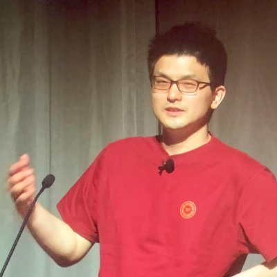

----
marp: true
theme: rubykaigi2026
paginate: false
backgroundImage: url(./bg-2026.002.png)
title: "Uzumibi: Reinventing mruby for the Edges"
description: "On RubyKaigi 2026 Hakodate / Uzumibi: Reinventing mruby for the Edges"
# header: "Uzumibi: Reinventing mruby for the Edges"
image: https://udzura.jp/slides/2026/rubykaigi/ogp.png
size: 16:9
----

<!--
_class: title
_backgroundImage: url(./bg-2026.001.png)
-->

# <big>Uzumibi:</big><br>Reinventing mruby for the Edges

## Presentation by Uchio Kondo

----

<!--
_class: hero0
_backgroundImage: url(./bg-2026.003.png)
-->

# Hello!

<!--
This is a first time for me to visit Matsuyama! I'm really excited to be here.
-->

----
<!--
_class: profile
-->



# self.introduce!

- Uchio Kondo
  - from Fukuoka.rb
- Member of &nbsp;
  - Product Engineer
- Translator of "Learning eBPF"

----

# My Code

```ruby
class Uzumini
  def self.reinventing_mruby_for_the_edges
    # ...
  end
end
```

----

<!--
-->

# Hello!

- This is
    - A
    - Presentation...
- About
    - Uzumibi
        - Reinventing mruby for the Edges