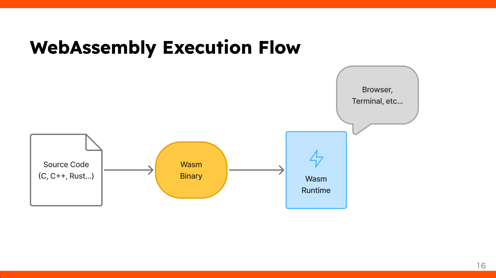
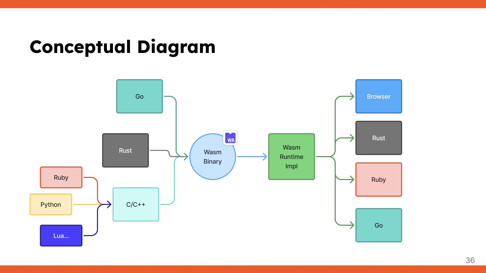
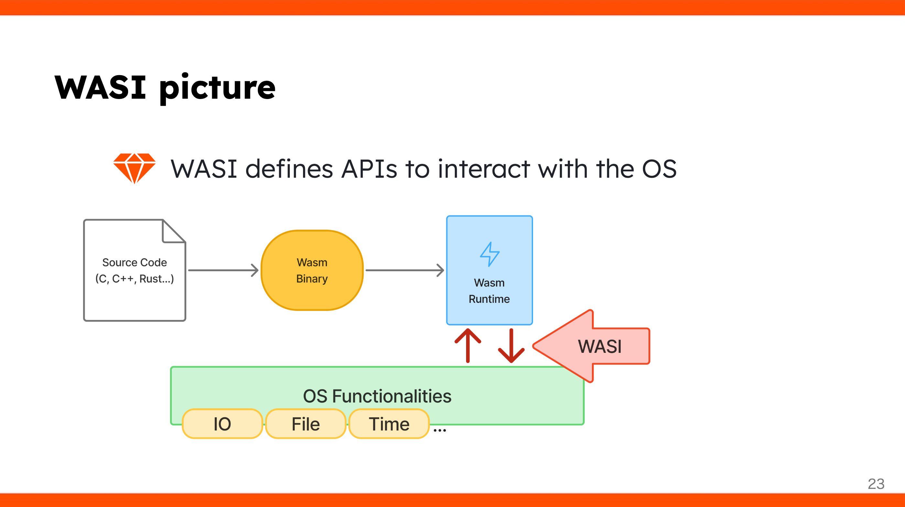
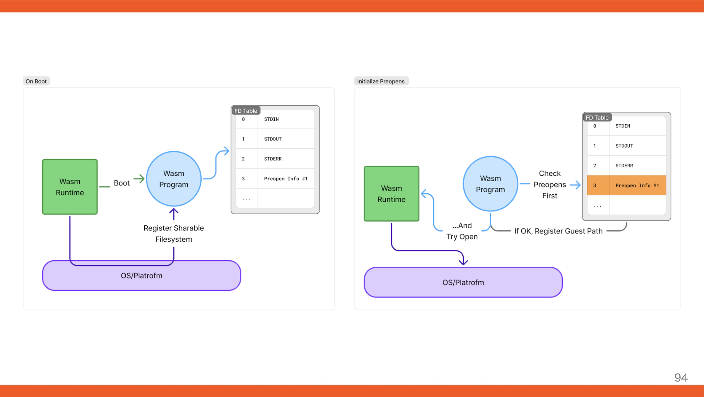

----
marp: true
theme: default
paginate: true
title: WebAssemblyの利用とAI時代に向けた応用例
description: For seckun 2025
image: https://udzura.jp/slides/2025/seckun/ogp.png#TODO
size: 16:9
style: |
  h1 { color: #0f7f85; }
  h2 { color: #00c4cc; }
  section li { color: #4e4c49; }
  section.hero > h1 { font-size: 50pt; }
  section.profile img {
    position: absolute;
    top: 25%;
    left: 65%;
    overflow: hidden !important;
    border-radius: 50% !important;
  }
----
<!--
_class: hero
-->

# WebAssemblyの利用と AI時代に向けた応用例

### Presentation by Uchio Kondo @ seckun 2025

---

<!--
_class: profile
-->

# 自己紹介

- 近藤うちお (@udzura)
- エンジニアカフェ ハッカーサポーター
- 所属: 株式会社SmartHR プロダクトエンジニア
- 『入門eBPF』（オライリージャパン）という
本を共同翻訳しました

---
<!--
_class: hero
-->

# 今日のモチベーションを"対話"する時間

### 相互自己紹介ともいう

---
<!--
_class: hero
-->

# wasmとは何かワークショップ

---
<!--
_class: hero
-->

# wasmの概要

-----

# WebAssembly (wasm) とは？

  - **様々な言語をブラウザ上で動かすための技術**
      - C/C++、Rust、Go、Python、Ruby などをサポート
  - **仕組み:**
    1.  各言語のコードをWasm形式のバイナリーにコンパイル
    2.  そのバイナリーをブラウザ内で実行

-----

 
 
 
 
 
 
 
 
 
 
 
 

> https://udzura.jp/slides/2025/rubykaigi/#16

<!--
  IMAGE_ONLY
-->

-----

# Why WebAssembly?

  - **メリット:**
      - JavaScript以外の言語をブラウザで利用可能
      - コンパイルによる**高速化や最適化**が期待できる

-----

# wasmの実行環境はブラウザだけではない

  - wasmバイナリーの形式にしてしまえば、どこでも動かせる:
      - ブラウザ内
      - ターミナル (CLI)
      - 組み込み環境
      - ミドルウェア内 (例: Envoy)
  - 「どんな言語でも書けるし、どんな場所でも動かせる」

---

---

# wasm を動かしてみよう（ターミナル）

---

# setup

---

# wasm プログラムの作成

---

# addの実装

---

# コンパイルと実行

---

# フィボナッチ数の計算

---

# 文字の表示（ようやくhello world）

---

# wasm を動かしてみよう（ブラウザ）

---

# wasm を動...かせる？

（質問タイム）

- hello worldってブラウザで動くの？
- どう動くの？

---

# WASIについて

- **WASI (WebAssembly System Interface) とは？**
    - Wasm VMで「Hello World」のようなOS機能（標準出力など）を使うための**抽象化されたインターフェース**
- Wasmバイナリー内でWASI仕様を満たす関数を呼び出すことで、システム機能を利用できる
- **例:** 標準出力に書き出す命令

---

---

# ブラウザでWASIをエミュレートする

---

# 動作確認

---

# ここまでのまとめ

---
<!--
_class: hero
-->

# AI時代に向けた実践

### 大学の授業なのでかっこよく言ってみた...

---

# wasmのサンドボックスについて

- Wasmはセキュリティを考慮して設計されている
  - **メモリ分離:** Wasmモジュールは独自の線形メモリ空間内でのみ動作し、ホスト環境のメモリに直接アクセスできない
  - **スタック保護:** 呼び出しスタックはホスト環境から分離され、スタックオーバーフロー攻撃を緩和
  - **WASI (WebAssembly System Interface):** システム呼び出しへのアクセスは capability-based な権限モデルで制御
  - などなど...

---

# 参考になるであろう資料

- [n月刊ラムダノート Vol.4, No.1(2024)](https://www.lambdanote.com/products/nmonthly-vol-4-no-1-2024-ebook)
  - #2 WebAssemblyの制約を越える（齋藤優太）
    - 齋藤さんはruby.wasmやswiftwasm/WasmKitの開発者

---

# WASIを少し深掘りする

---

# preopensの仕組み

- ホスト側でのWasmモジュール起動時に、アクセスを許可するディレクトリを事前にファイルディスクリプタとして開いておく仕組み
    - preopensで指定されたディレクトリ配下のみにアクセスが制限
    - それ以外のファイルシステムは完全に不可視となる
- デフォルトではホストのファイルシステムに一切アクセスできない
    - allow-list 方式

---

---
<!--
_class: hero
-->

# 応用例

---

# AIエージェントの動作と課題

---

# システム操作を制御し切れないかもしれない問題

- 予期しない/誤ったファイル削除操作をする可能性がある
    - 例: `~/` と誤って `/` を指定して削除する
    - 例: プロジェクト外の重要なファイルを削除する
- LLMの性質上、プロンプトなどで完全に防ぐのは困難

---

# FYI: Xでバズった例

- https://x.com/mugisus/status/1940127947962396815

---

# 防御策の例

- よくある方法は、エージェントをコンテナで実行させる
    - 動作、起動、設定が煩雑
    - 特にMacのdockerなどでは、ホスト/ゲストのファイル共有をすると遅い
    - その他オーバーヘッドが無視しづらい
- LinuxではseccompやLSMも活用可能
    - Macでは...？

---

# ここでwasmのサンドボックスを活用できないか？

---

# rm コマンドをwasmで置き換えるアイデア

- rm コマンド自体をWasmで実装し、任意のランタイム（wasmtime）など経由で実行する
    - wasmtimeのオプションで、共有するディレクトリをプロジェクト内部のみに限定する
    - これによりプロジェクト外のファイルを操作できなくする
- wasmtimeをラップするrmコマンドをシェルで実装すれば、エージェントからは隠蔽される
    - エージェントの `$PATH` 設定以外何も変更する必要がない

---

# 実装例

- 今回、Rustにより簡易的に実装してみた
- https://github.com/udzura/seckun_rm
- HACK:
    - WASIはまだ `getcwd()` 相当のサポートが弱い
    - `PWD` という環境変数を現在ディレクトリの代わりにした

---

# ビルドしてみよう

---

# 動作確認

---

# AIエージェントにこのrmを使わせる

- Gemini CLIの例

<!-- TODO: Claude Codeの例 -->

---

# 防御できているか確認しよう

---

# 今日のまとめ