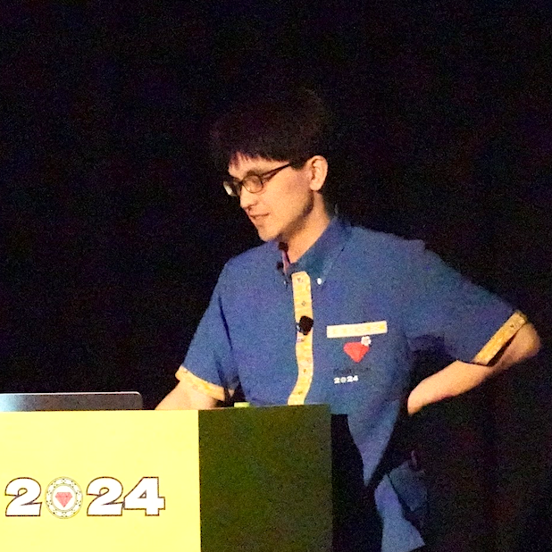
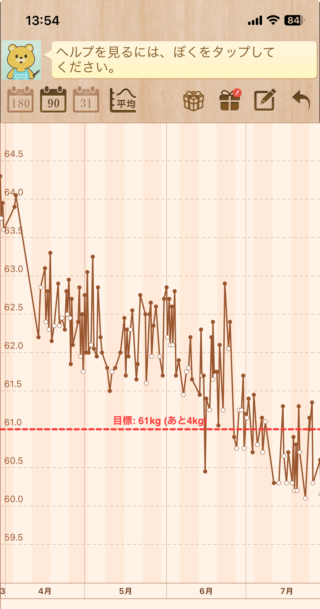
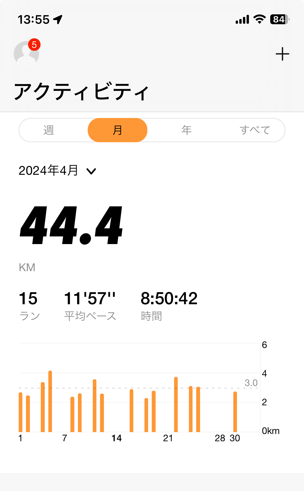

----
marp: true
theme: default
paginate: true
style: |
  h1 { color: #0f7f85; }
  h2 { color: #0f7f85; }
  section li { color: ##4e4c49 }
  section.hero > h1 { font-size: 70pt; }
  section.profile img {
    position: absolute;
    top: 25%;
    left: 65%;
    overflow: hidden !important;
    border-radius: 50% !important;
  }
----

<!--
_class: hero
-->

# リモート勤務、 運動不足になりますよね？

----

# テーマ: リモート勤務

- テックの話をしない...（本当にしないw）
- テックの話は1月に東京で？

----

# 今日は

- リモート勤務の経験から、欠かせない運動不足への対策を語ります
- 前々職からリモート勤務生活
    - 運動失敗の歴史でもある

----

<!--
_class: profile
-->

# 自己紹介

- 近藤うちお (@udzura)
- 株式会社SmartHR プロダクトエンジニア
- Fukuoka.rb 主催者の一人(?)
- エンジニアカフェ関係者
- 『入門eBPF』（オライリージャパン）という
本を共同翻訳しました

----

# リモート勤務での個人的な運動歴

----

# やってきたこと

----

# 2020 ~ switch

- リングフィットアドベンチャー
- フィットボクシング2

----

# めっちゃやったやつ

- Zumba®
- 奥さんと一緒に一時期毎晩やっていた
- ダンスの判定が不可解かつシビアで、協力モードではめちゃくちゃ妻と喧嘩していた

----

# 体重もすごい絞れた

- 今や取り戻したい過去の栄光

----

# しかし...

- コロナワクチンの発熱で運動を中断
- その後再開できなかった...

----

# 教訓

- いい感じの習慣も、少しのきっかけで切れてしまう...
- 再開は結構ハードル高い、なんとか切らないのが大事

----

# 数年後

- 2023年の終わりぐらいから...

----

# ランニング始めた

- どこかで週２〜３回でいいという記事を読んで、そんくらいならと
- 流石に運動不足すぎてストレスもあった
  - 一人でゆっくり走って考えをまとめたりしたかった

----

# 結構いい感じだった

- 大濠公園はなんとか行ける範囲に住んでたし...
- そもそも自宅の周りの街が好きなので、散歩でも楽しかった

----

# 一時期は続いてた

----

# だが...

----

# 2024年5月、RubyKaigiに行った

----

<blockquote class="twitter-tweet">
<a href="https://twitter.com/hashtag/rubykaigi?src=hash&amp;ref_src=twsrc%5Etfw">#rubykaigi</a> <a href="https://twitter.com/hashtag/rubyfriends?src=hash&amp;ref_src=twsrc%5Etfw">#rubyfriends</a> at <a href="https://twitter.com/hashtag/%E3%82%84%E3%82%93%E3%81%A1%E3%82%83%E3%83%8F%E3%82%A6%E3%82%B9?src=hash&amp;ref_src=twsrc%5Etfw">#やんちゃハウス</a> w/ <a href="https://twitter.com/hanachin_?ref_src=twsrc%5Etfw">@hanachin_</a> <a href="https://twitter.com/katsyoshi?ref_src=twsrc%5Etfw">@katsyoshi</a> <a href="https://t.co/Zkexag6GQZ">pic.twitter.com/Zkexag6GQZ</a>
&mdash; sue445 (@sue445) <a href="https://twitter.com/sue445/status/1791502549360816328?ref_src=twsrc%5Etfw">May 17, 2024</a></blockquote> 

# RubyKaigi@沖縄

- 深夜までRubyistと語り合い、飲み...
    - 沖縄楽しすぎるんですけど
- やんちゃハウスというハードコアな
場に宿泊
    - 住民全員深夜まで飲み歩いて
    深夜帰宅するという感じw

----

# 見事に運動の習慣が途切れた

- 帰ってからめっちゃ寝たしw

----

# 教訓

- RubyKaigi は健康に悪い

----

# 一方で

- RubyKaigi 2024、割と観光したり飲み歩いたりしたけど...
- 疲れ果てることはなかった
    - ランニングで体力が取り戻されてたのがでかいと思われる
- 技術カンファレンスのために運動しよう（？

----

# 最近の話

----

# 転職しました！

----

# 転職後の世界

- ここSmartHRに転職しました
    - 九州支社/天神のオフィス、初めまして！
- 前職はインフラエンジニアで、深夜対応もままあった
- そういうポジションでは（少なくともしばらく）ないので、ちょっと余裕ができそう
    - 有休消化あたりから運動不足対応を考える

----

# ちょっと再開するか...

- でもいきなり走るのは怪我しそう
- そもそも今腰痛なんですが...
- ストレッチからとかはどう？

----

- ストレッチといえば...

----

# オガトレ

----

# オガトレとは

- 日本の男性YouTuber、理学療法士
- ストレッチはじめトレーニング動画と、癒し系のボイスに定評
- 登録者150万人
    - ちょんまげ小僧(139万人)より凄い
    - 余談だけど @udzura はけんた食堂(120万人)もめっちゃ見てる。長崎行きたすぎ

----

# 直近基本オガトレのメニューをやってる

- 実はランニングの前のストレッチで始めたんだけど
- 下半身がきついので、腰痛、股関節のストレッチが多い
- よくやる動画紹介

----

## 腰痛に効くやつ

----

## 股関節を柔らかくするやつ

----

## 最近はスクワットも始めた

- これもオガトレのフォームでやってる

----

# よくあるルーチン

- 朝: 勤務開始
- 昼休み
    - ご飯を食べて、オガトレ（腰を1セット＋スクワット30回）
- 勤務再開
- 上がる
- 夕食→ お風呂前後ぐらいでオガトレ（下半身を1セット＋スクワット15回）

----

# 昼夕2回にしてる

- 目的: 最低限、腰痛だけは回避する
- スクワットも軽く入れることにしている
    - 1日に45回程度できてる
    - もう少し増やしたって構わない（けんた食堂口調）
- 腰痛ほぼ治ってきてる、すばらC

----

# 今後の展望

- やはりランニング再開したい
    - 暑くなくなったし...
    - 業務キャッチアップが終わり、勤務時間をコントロールしやすくなったらぜひって感じ
- RubyKaigi 2025 までに体力を取り戻さねば...
    - 結構酷いことになりうるw

----

# One More Thing.......

----

# ついでに告知しちゃいます

- inaoさん、nanchanさん、勝手にすいません！！！！

----

# 福岡でまた集まりませんか？

- @udzura はFukuoka.rbというコミュニティの主催者の一人です
- SmartHRに来ている... ということは、Rubyに若干は興味がありますよね?????????

----

# SmartHR 福岡で Fukuoka.rb すっぞ！

- inaoさん的には「あ〜いいんじゃないですか」という感じだったので多分、できる
- Howについてはわかんないッピ...
    - でもやりたい、綺麗なオフィスだものね
- 12月は個人的にドタバタなので、1月後半くらい？かな？
    - 多分平日夜、水曜日が候補

----

# 待て続報！

- もちろん、他の言語とかコミュニティのイベントもやっていくかもしれない