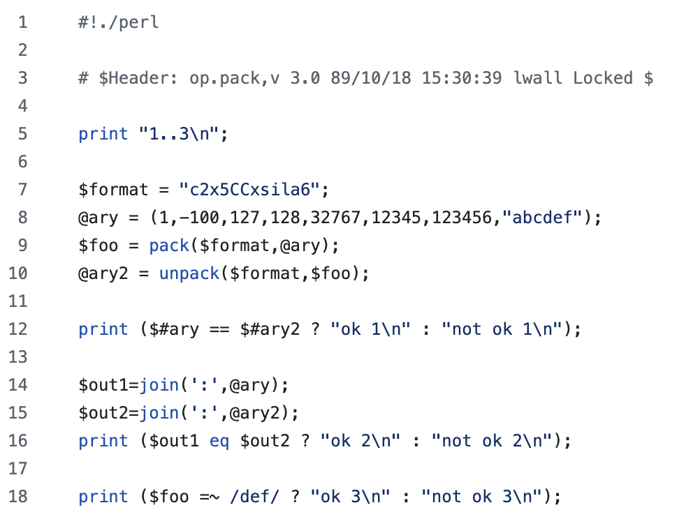
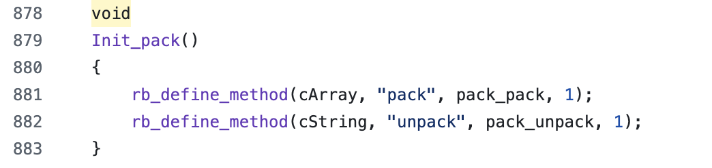
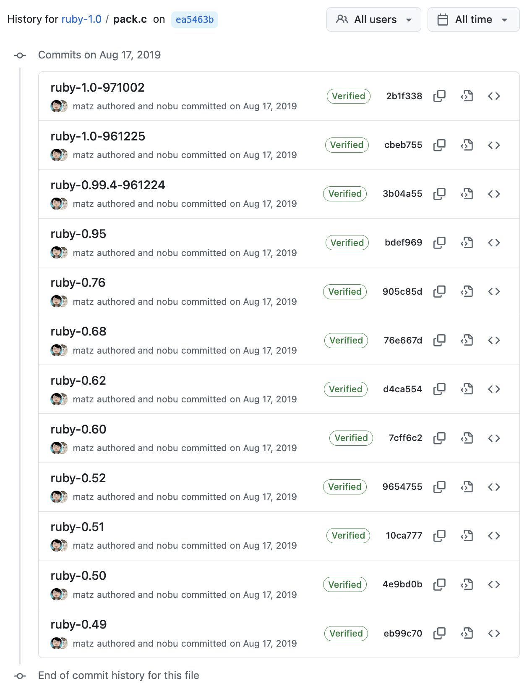
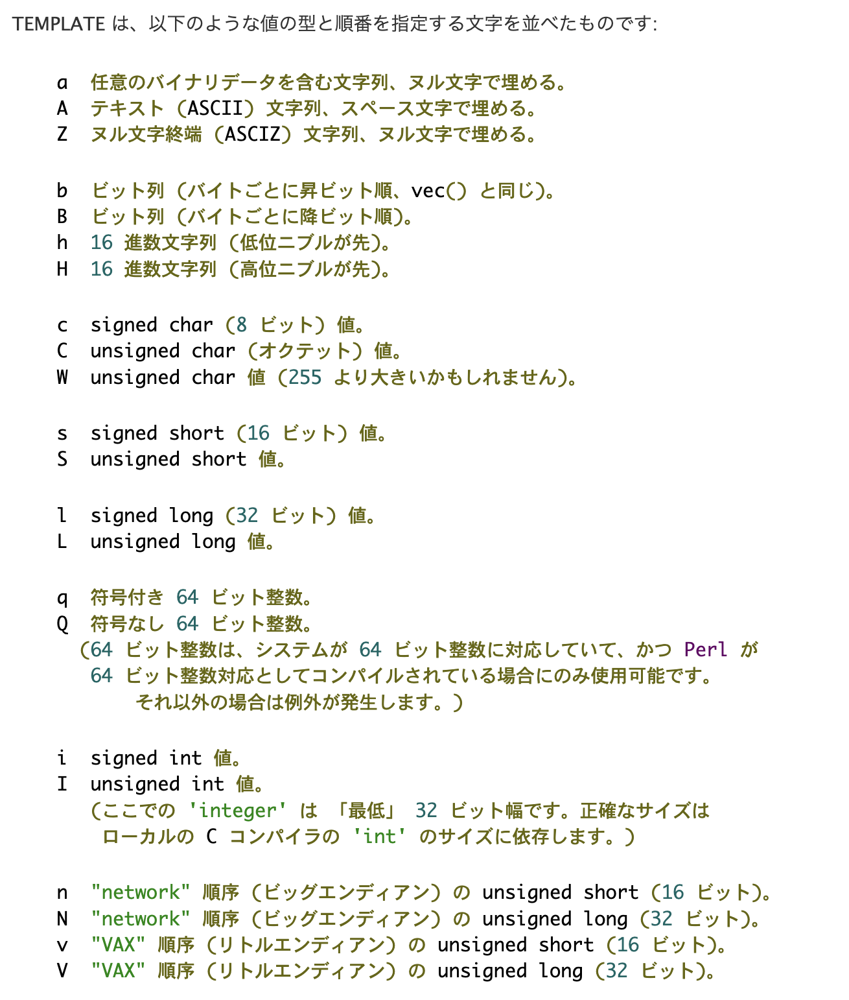
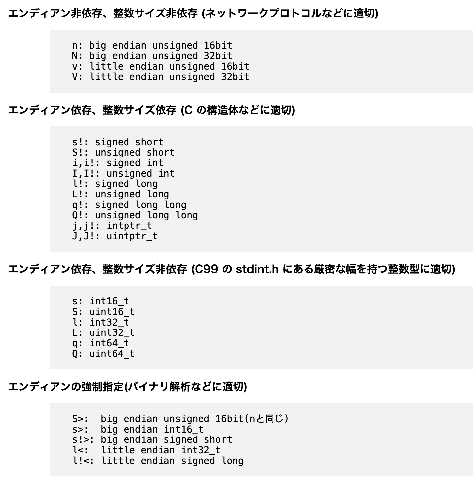

# Binary "pack" Rebooted

## PerlからRubyistへの贈り物

---

# 自己紹介

- Uchio Kondo @ SmartHR
- アクキー配り係として来ました

---

# pack / unpack ?

---

# ここにバイナリがあるじゃろ

```console
0000000 0045 5400 2515 0040 0140 5acd 11ac 0400
0000010 11ac 0300 0008 e360 0900 0100 c69c 690e
0000020 0000 0000 a4b0 0008 0000 0000 2020 4159
0000030 4350 2020 4159 4350 2020 4159 4350 2020
0000040 4159 4350 2020 4159 4350 2020 4159 4350
0000050 2020 4159                              
0000054
```

---

# unpack を使ってみましょう

```perl
sub parse_icmp_packet {
    my ($packet) = @_;
    my $ip_header_len = (unpack('C', $packet) & 0x0f) * 4;
    my ($ver_ihl, $tos, $tot_len, $id, $frag_off, $ttl, $protocol, $checksum, $saddr, $daddr) =
        unpack('C C n n n C C n N N', substr($packet, 0, 20));
    my $src_ip = inet_ntoa(pack('N', $saddr));
    my $dst_ip = inet_ntoa(pack('N', $daddr));
    my $icmp_packet = substr($packet, $ip_header_len);
    my ($type, $code, $icmp_checksum, $identifier, $sequence) =
        unpack('C C n n n', $icmp_packet);
    my $data = substr($icmp_packet, 8);
    # ...
}
```

---

# 僕にも読めた！

```perl
$ perl dump.pl ping.bin
$VAR1 = {
          'ip' => {
                    'tos' => 0,
                    'header_length' => 20,
                    'protocol' => 1,
                    'version' => 4,
                    'id' => 5413,
                    'dst_addr' => '172.17.0.3',
                    'ttl' => 64,
                    'total_length' => 84,
                    'src_addr' => '172.17.0.4'
                  },
          'icmp' => {
                      'checksum' => '0x60e3',
                      'sequence' => 1,
                      'data' => '??i?  YAPC  YAPC  YAPC  YAPC  YAPC  YAPC  YA',
                      'code' => 0,
                      'type' => 8,
                      'identifier' => 9
                    }
        };
```

---

# pack/unpack 使い所

- バイナリのパース
- 一部のFFI/システムコールの直接呼び
  - 構造体を渡す必要があるAPIで利用
  - packで構造体によるメモリ上のデータを作成する

---

# pack/unpackの便利さを完全理解したところで

---

# pack の歴史

- Thanks: [History from Perl 1.0 to Perl 6](https://speakerdeck.com/anatofuz/history-from-perl-1-dot-0-to-perl-6)

---

# Perl 3

- [3.0で pack/unpack が導入された](https://github.com/Perl/perl5/blob/perl-3.000/t/op.pack)のを発見
  - Oct 18, 1989
- それより前は辿れず...



---

# Perl 4 〜

- [4.0 にもある](https://github.com/Perl/perl5/blob/perl-4.0.00/t/op/pack.t)
    - Mar 21, 1991
- テストケース変わらず。
- [5.0 ではちょっとテストケース増えた](https://github.com/Perl/perl5/blob/perl-5.000/t/op/pack.t)
- これ以降は基本関数としてずっとある

---

# 1.0より前のRuby

- [1.0 時点でメソッドが存在](https://github.com/nobu/ruby-1.0/blob/ea5463b0bba8f7129bdf16f77da5f84ffb8c702f/pack.c#L881-L882)
    - Ruby 1.0は Dec 25, 1996 リリース
- しかも、 `Array#pack` と `String#unpack` という同じインタフェース



---



---

# CVSのエントリログを見ると

- [Jun 3, 1994 からあるように見える](https://github.com/nobu/ruby-1.0/blob/eb99c7073e5d79032b9860573a80e427dcd24976/CVS/Entries#L40C1-L40C65)
- 最初の最初からPerlを意識して？実装していた

```txt
/pack.c/0.18/Fri Jun  3 00:15:17 1994 Fri Jun  3 00:15:17 1994//
```

---

# 本当のところは今度Matzに聞きます

...

---

# pack/unpackの覚え方

---

# 覚え方

- サイズ
    - `CSLQ`
- エンディアン
    - 基本的にCPUに合ったエンディアンを指定すればいい
- 符号あるなし
    - 小文字はあり、大文字はなし

---

# こういう感じ

| フォーマット | 符号 | サイズ | エンディアン |
|--------------|--------|---------------|----------------|
| C            | 無し   | 1バイト       | N/A            |
| c            | 有り   | 1バイト       | N/A            |
| S            | 無し   | 2バイト       | CPU依存            |
| s            | 有り   | 2バイト       | CPU依存            |
| l            | 無し   | 4バイト       | CPU依存            |
| L            | 有り   | 4バイト       | CPU依存            |
| q            | 無し   | 8バイト       | CPU依存            |
| Q            | 有り   | 8バイト       | CPU依存            |

---

# エンディアン固定もできる

- パケットを扱う時などは便利

| フォーマット | 符号 | サイズ | エンディアン       |
|--------------|--------|---------------|--------------------|
| n            | 無し   | 2バイト       | ビッグエンディアン |
| v            | 無し   | 2バイト       | リトルエンディアン   |
| N            | 無し   | 4バイト       | ビッグエンディアン |
| V            | 無し   | 4バイト       | リトルエンディアン   |

---

# 実は浮動小数も扱える

| フォーマット | サイズ | エンディアン       |
|--------------|---------------|--------------------|
| f            | 4バイト       | CPU依存                |
| d            | 8バイト       | CPU依存                |

---

# 覚えておくと便利なもの

| フォーマット | 説明       |
|--------------|------------|
| Z            | ヌル終端文字列 |
| b/B        | ビット列     |
| h/H        | 16進文字列   |

---

# 繰り返しもできる

| フォーマット | 説明       |
|--------------|------------|
| L3           | uint32を3つ繰り返し読み込む |
| Z3           | 文字を3つ繰り返し読み込む |
| Z*           | 文字を、ヌル文字か終わりまで読み込む |

---

# 例: Rubyの文字列を表現した構造体(3.4)

```c
typedef uintptr_t VALUE;
struct RString {
    struct RBasic basic;
    long len;
    union {
        struct { ... 省略 } heap;
        struct { char ary[]; } embed;
    } as;
};
struct RBasic {
    VALUE flags;
    const VALUE klass;
    // #if ... 省略
};
```

---

# 短い文字列はこういう構造体と一致するはず（64bit CPU）

```c
struct RString_ {
    uintptr_t flags; // Q
    const uintptr_t klass; // Q
    long len; // Q
    char ary[]; // Z*
};
```

---

# Rubyのメモリ上の文字列を取り出す

- Perlから直接確認してみよう
- ライブデモします！！

----

# コードサンプル

```ruby
# Showing Ruby "Magic" at YAPC
class String
  alias original_inspect inspect
  def inspect; super; end
  alias inspect_with_address inspect
  alias inspect original_inspect
end

str = "Hello, YAPC!" #=> "Hello, YAPC!"
puts str.inspect_with_address
#<String:0x0000fe263bd10528>
p $$
#=> 17855
```

---

# Rubyのメモリを直接確認してみよう

```perl
use Data::Dumper;
open my $fh, '<:raw', "/proc/17855/mem" or die "$!\n";
seek $fh, 0x0000fe263bd10528, 0;
read $fh, my $data, 100;
close $fh;
# ...
```

---

```perl
# ...
my ($f, $c, $len, $payload) = unpack("QQQZ*", $data);
print "len: $len\n";
print "payload: $payload\n";
```

---

# 見えました

```console
$ perl memcheck.pl
len: 12
payload: Hello, YAPC!
```

---

# Rubyから見たPerlのpack/unpack

---

# ...ほとんどのフォーマットは実は同じ





---

# 細かい話

- `m` はRubyにしかない
- 浮動小数周りは実は結構違う(`f`/`d`は一緒だよ)

---

# つまり

- どちらかのフォーマットを覚えれば両方で使えて便利
- Rubyistだけど、Perlのpack完全に理解しました

---

# まとめ

---

# packとunpack、楽しんでみてね！

- け◯た食堂風の締め